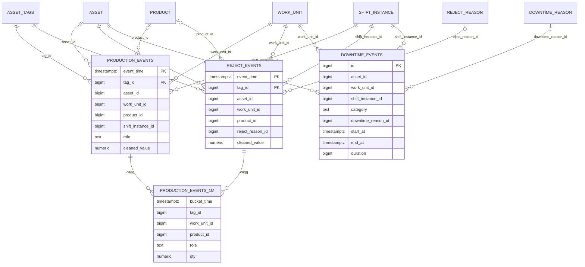

# Silver model — v2 (2026-10-01)

> Context: [[molcadx_app_overview]] · master data [[erd_spec_2026-10-01]] · first notes [[silver tables]] · [[timescale_cont_aggregates]] · consumer [[gold_model]] / [[gold_tables]] · rules [[flink_rules]] · input [[bronze]]
> TimescaleDB. The master data (ERD) lives in the same DB, schema `master`. Equipment = asset.
> v2: cut down to **3 tables + 1 cagg**, using the column names of [[silver tables]].
> **Work center (2026-10-02):** bindings exist only per work unit (`work_unit_kpi_binding`). A work center = **Σ of its work units** (counts and durations summed, rates recomputed), **except finished good**. `good_out` = Σ good of the **final work unit(s)** of `equipment_flow` (the linked list of machines in the work center; final = no outgoing edge on that date; parallel finals summed), from `silver.fn_work_center_final_work_units(business_date)`. A work center with no flow rows treats every work unit as final. There is no work-center binding, no routing step and no infeed/output split.

## 1. ERD



## 2. `silver.production_events` — hypertable · retention 1 month
Counter readings with role `total` or `good`, as deltas.

| No | Column | Type | Calculation |
|--:|---|---|---|
| 1 | event_time | timestamptz | Kafka `timestamp` (UTC) |
| 2 | tag_id | bigint | `asset_tags.node` = Kafka `tags.source_tag` |
| 3 | asset_id | bigint | `asset_tags.asset_id` |
| 4 | asset_code | varchar(30) | `asset.asset_tag` (old `equipment_code`) |
| 5 | work_unit_id | bigint | `asset_tags.work_unit_id`, else the `asset_placement` active at event_time |
| 6 | shift_instance_id | bigint | `shift_instance` with `start_datetime ≤ event_time < end_datetime` |
| 7 | business_date | date | `shift_instance.business_date` |
| 8 | product_id | bigint | Current `product_code` of the asset → `asset_product_codes` valid at event_time (30 s debounce). NULL = unmapped |
| 9 | product_code | varchar(30) | `product.code` |
| 10 | role | varchar(20) | `asset_tags.tag_role`: `total` (old `infeed`) / `good` (old `good_output`) |
| 11 | uom_id | bigint | `asset_tags.uom_id`; the tag's unit, converted to base UOM later in the views |
| 12 | raw_value | numeric(18,3) | Value after `=` in `fields.payload` |
| 13 | cleaned_value | numeric(18,3) | **Delta**: delta_counter = raw; cumulative = raw − prev; reset (raw < prev) = raw |
| 14 | is_reset | bool | Cumulative counter went back toward 0 |
| 15 | source_tag | varchar(255) | As received |
| 16 | raw_payload | varchar(1000) | As received |
| 17 | created_at | timestamptz | `now()` |

PK `(tag_id, event_time)`, upsert (replay-safe).

## 3. `silver.reject_events` — hypertable · retention 1 month
Counter readings with role `reject`. Same columns as `production_events`, minus `role`, plus:

| No | Column | Type | Calculation |
|--:|---|---|---|
| 18 | reject_reason_id | bigint | `asset_tags.reject_reason_id` |
| 19 | reject_reason_code | varchar(20) | `reject_reason.code` |

## 4. `silver.downtime_events` — regular table (kept forever)
Stops from the stalled `total` counter (plus manual rows from the MES app). One row per **stop piece per shift**.

| No | Column | Type | Calculation |
|--:|---|---|---|
| 1 | id | bigserial | |
| 1a | source_event_id | text NOT NULL UNIQUE | Deterministic `wu{work_unit_id}-t{tag_id}-{start_at epoch ms}`; Flink upsert key. The same string goes to Gold `downtime_reports.source_event_id` and `downtime_log_events.event_id` |
| 2 | asset_id | bigint | Asset whose bound `total` tag stalled |
| 3 | work_unit_id | bigint NOT NULL | Work unit whose `availability.downtime_reason` binding watches the tag |
| 5 | shift_instance_id | bigint | Shift of this piece |
| 6 | business_date | date | |
| 7 | category | varchar(20) | `small_stop` (60–300 s) · `unplanned` (> 300 s, or reason category unplanned/none) · `planned` (reason category planned) |
| 8 | downtime_reason_id | bigint | Primary reason = `downtime_reason_ids[1]`. NULL = unlabelled (counts as unplanned) |
| 8a | downtime_reason_ids | bigint[] | **Every** `downtime_reason` signal that turned on in the stop window, ordered by when it turned on (element 1 = primary). Gold `reason` / `reasons` = these ids → **`downtime_reason.name`** (trimmed). A person's relabel applies to that stop piece only, not to its continuation in the next shift |
| 8b | product_id | bigint | SKU running when the stop **started** |
| 9 | source | varchar(10) | `derived` (Flink) / `manual` (MES) |
| 10 | start_at | timestamptz | Last real increment (or shift start) |
| 11 | end_at | timestamptz | Next increment / shift end. NULL = still stopped |
| 12 | duration | bigint | ms, `end_at − start_at` (live = now − start_at) |
| 13 | stop_group_id | bigint | Same value for all pieces of one stop split across shifts |
| 14 | entered_by / entered_at | varchar / timestamptz | A person set the reason; Flink never overwrites it |
| 15 | created_at / updated_at | timestamptz | |

## 5. `silver.production_events_1m` — continuous aggregate (kept forever)

```sql
SELECT time_bucket('1 minute', event_time) AS bucket_time,
       tag_id, asset_id, work_unit_id, shift_instance_id, business_date, product_id, uom_id,
       role, NULL::bigint AS reject_reason_id, sum(cleaned_value) AS qty, count(*) AS event_count
FROM silver.production_events GROUP BY 1,2,3,4,5,6,7,8,9
```

A sibling cagg `silver.reject_events_1m` uses the same shape, with `reject_reason_id`. It refreshes every 1 min (start_offset 2 h).

## 6. Not in silver (moved out)

| Thing | Where now |
|---|---|
| Stop thresholds | **Fixed in Flink code** (decided 2026-10-02): gap < 60 s = nothing (speed loss), 60–300 s = `small_stop`, > 300 s = `unplanned`. Same for every work unit; no config table |
| Work-center binding | **None** (Method B): bindings exist only per work unit, as in the PRD |
| `product_code`, `downtime_reason` signal values | Flink state only. Raw history stays in [[bronze]] |
| Speed / analog values | Not needed for v1 (stop detection = stalled counter) |
| Unknown `source_tag`, late (> 1 min), parse errors | Kafka dead-letter topic |

## 7. Flink rules (short)

1. **Map.** `source_tag` → `asset_tags` (by `node`, valid at event_time). Then resolve the work unit (placement as-of), the shift instance, and the product.
2. **Counter.** Keyed by `tag_id`, event-time ordered, watermark 1 min.

   | Case | `cleaned_value` | `is_reset` |
   |---|---|---|
   | `delta_counter` | raw | false |
   | `cumulative_counter`, first reading | 0 | false |
   | `cumulative_counter`, raw ≥ prev | raw − prev | false |
   | `cumulative_counter`, raw < prev | raw | true |

3. **Stall.** Watch the tag bound to `availability.downtime_reason` (`stall_bucket`).

   | Gap between real increments | Result |
   |---|---|
   | < 60 s | nothing |
   | 60–300 s | `small_stop` |
   | > 300 s | `unplanned` (or `planned` if the reason's category is planned) |

   An open row is written at +60 s and its category is updated at +300 s. A shift boundary closes the piece and opens a new one with the same `stop_group_id`.

## 8. Realtime views = gold queries

The views `silver.v_wu_shift_report`, `v_wc_shift_report`, `v_wu_hourly_perf`, `v_product_count`, `v_loss_by_reason` read the two caggs plus `downtime_events`. They resolve **which tag counts as total, good or reject through `silver.work_unit_kpi_binding`**. A work center is the Σ of its work units' terms, with good_out from the final work units (`fn_work_center_final_work_units`). Airflow writes the same SELECT into gold for closed shifts. See [[gold_model]].

## 9. DDL

Tested DDL: `ddl_silver.sql` in this folder. It contains master data (55 ERD tables, `kpi_result` skipped because gold replaces it), the extensions and the silver facts, all in schema `silver`. Gold: `../04_gold/ddl_gold.sql` ([[gold_model]]).
The master part is generated from [[erd_spec_2026-10-01]] by `gen_master_ddl.py <out.sql>`. Re-run the generator after the ERD changes.

## 10. Product runtime (decided 2026-10-02: option a, no new table)

Runtime per product per hour (Gold `product_perf_wu_hour`) is derived from the counts. There is no `product_runs` table.
- Each **minute** of `production_events_1m` belongs to the product that has counts in it. If a minute has counts for two products (a changeover inside the minute), it is split by their share of `event_count`.
- Minutes without counts (stops, gaps) carry the last product forward. Stop time is then subtracted using `downtime_events`.
- Accuracy is about 1 minute per changeover. Only the hourly chart and the SKU report use it; OEE, A/P/Q and the shift reports do not.

## 11. Views and functions (`ddl_views.sql`, tested 2026-10-02)

Run order: `ddl_silver.sql` → `../04_gold/ddl_gold.sql` → `ddl_views.sql`. The views read gold edit tables (gold edit > silver edit). No view returns jsonb. Editing: [[editing_model]].

| Object | What it gives | Gold table it fills |
|---|---|---|
| `fn_uom_factor`, `fn_cycle_time` (in `ddl_silver.sql`) | Unit conversion as of a date; ideal seconds per item | — |
| `fn_work_center_final_work_units(date)` | Final work units of `equipment_flow` | — |
| `fn_reliability(work_units[], from, to)` | MTTR / MTBF over closed unplanned stops after edits | — |
| `v_shift`, `v_shift_work_unit` | Shift + `shift_no` + label + POT; one row per work unit per shift | — |
| `v_downtime_edit_latest`, `v_downtime_effective` | Machine stops + manual stops with every edit applied | — |
| `v_wu_slot_qty`, `v_quality_entry_effective` | Counts through the binding; live manual quality entries in base unit | — |
| `v_wu_shift_report` | Shift report per work unit (`binding_ids bigint[]`) | `gold.work_unit_shift_report` |
| `v_wc_shift_report` | Σ work units, good from the final work units | `gold.work_center_shift_report` |
| `v_product_count` | Per product, manual reject and rework added | `gold.product_count` |
| `v_reject_count` | Per reason: sensor / override / manual rows | `gold.reject_count` |
| `v_downtime_report` | Per stop: `primary_reason_id/name`, `reason_names text[]`, edit flags | `gold.downtime_report` |
| `v_loss_by_reason` | Schedule / availability / performance loss | `gold.loss_by_reason` |
| `v_product_perf_hourly` | One row per work unit × local hour × product | `gold.product_perf_hourly` |

The load (`../04_gold/test_load_gold.sql`, the SQL Airflow will run) does delete + insert per shift in one transaction and skips approved work units. Day / month / year rollups come next.
