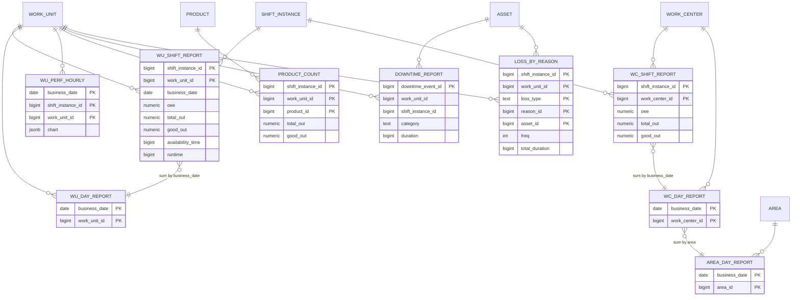

# Gold model — v1 (2026-10-01)

> **Gold = our `gold` schema** (decision 2026-10-02), plain Postgres tables in the same DB as silver. [[gold-write-contract]] is a reference for mechanics only (keys, rollups, NULL rules, tests). Work centers are **Σ of work units**.

> Columns and formulas = [[gold_tables]], which stays the same. **What changed is only where each input comes from:** the KPI binding instead of flow tracing ([[NEW_oee_or_kpi_calculation]]).
> Source: [[silver_model]] §4 views. Formulas: [[oee_or_kpi_calculation]]. Job: [[airflow_rules]]. Equipment = asset.

## 0. Common rules

- **Grain keys** replace the old `date + shift varchar`:
  - `shift_instance_id`
  - `business_date` (= `shift_instance.business_date`)
  - `shift_label` (from `enterprise_shift`)
  - `site_id`
  - `time_zone` (`site.timezone`)

  Day reports = all shift instances with that `business_date`.
- **No hard-coded 07:00 / Asia/Jakarta.** Windows come from `master.shift_instance` (UTC).
- **Time unit:** ms (`bigint`). Quantities are in the product's **base UOM**, through `product_uom_conversion` valid on `business_date`.
- **Write pattern:**
  - Airflow runs at each shift close (+ ~2 min for the 1-min watermark) and upserts the closed shift.
  - The same run re-upserts the last N days to absorb late reasons, manual rejects and back-dated mappings. It is idempotent (PK = grain).
- Every report table gets 3 lineage columns:

  | Column | Type | Meaning |
  |---|---|---|
  | `computed_at` | timestamptz | When the row was computed |
  | `inputs_used` | jsonb | The binding ids and tag ids used |
  | `data_status` | text | `ok` / `no_binding` / `no_cycle_time` / `partial` |

- **Legend from [[gold_tables]]:**

  | Colour | Rule |
  |---|---|
  | 🔵 | Recalculate (a ratio of summed terms) |
  | 🔴 | Sum of work units |
  | 🟣 | Unique retrieve: **good_out from the final work unit(s) of `equipment_flow`** (decision 2026-10-02) |

## 1. ERD

## 2. `gold.work_unit_shift_report` — PK (shift_instance_id, work_unit_id)

Columns are those of [[gold_tables]] "work unit shift reports". This table shows **where each input comes from now**:

| Column | New source |
|---|---|
| business_date, shift_instance_id, shift_label | `master.shift_instance` (+ `site_shift` → `enterprise_shift`) |
| work_unit_id / name / code | `master.work_unit` |
| uom_id / name / code | `product.base_uom_id` of the product(s) run (see open item O-2) |
| **availability_time** | POT = `shift_instance.end_datetime − start_datetime` |
| **pdt_time** | Σ `silver.downtime_events.duration` ∩ shift, `category = planned` |
| **updt_time** | Σ `downtime_events` ∩ shift, `category = unplanned` |
| **ms_time** | Σ `downtime_events` ∩ shift, `category = small_stop` |
| production_time / operating_time / runtime | availability − pdt / production − updt / operating − ms (unchanged) |
| **total_out** | Σ `production_events_1m.qty` of the tag bound to slot **`quality.total`** for this work unit, valid at bucket, converted to base UOM |
| **good_out** | Slot **`quality.good`**: `none` = Σ bound tag; `complement_derive` = total − reject |
| **reject** | Slot **`quality.reject`** (all bound reject tags), else manual `work_order_operation_defect` (scrap) for this work unit and shift |
| **rework** | `work_order_operation_defect` with `disposition = rework` (manual) |
| **cycle_time** | Per product run: `operation_work_unit.cycle_time_value` else `operation.cycle_time_value`, valid on business_date, × `seconds_per_unit` ÷ `batch_size`. Product from `production_events.product_id` |
| **effective_out** | Σ over product runs (runtime_in_run ÷ cycle_time_p) |
| reduce_speed / up_speed / reject_time / rework_time / anomaly / net / value_added / teep / oee / A / P / Q / losses | Formulas unchanged from [[gold_tables]], using the per-product cycle time |
| computed_at, inputs_used, data_status | Lineage (§0) |

No binding for `quality.total` → `data_status = no_binding`, and the ratios are NULL (never 0%).

## 3. `gold.work_center_shift_report` — PK (shift_instance_id, work_center_id)

| Column group | Source |
|---|---|
| 🟣 good_out | Σ good of the **final work unit(s)** of `equipment_flow` (no outgoing edge on that date; parallel finals summed), via `silver.fn_work_center_final_work_units(business_date)`; listed in `final_work_unit_ids` |
| 🔴 total_out, reject | Σ of all work units (as in [[gold_tables]]). Alternative still open: line input = Σ total of the **first** routing step (`is_first_step`), which avoids double-counting a serial line |
| 🔴 availability_time, pdt, updt, ms, production, operating, runtime, reduce_speed, up_speed, net, value_added, reject_time, rework_time, anomaly, losses | Σ of `work_unit_shift_report` of its work units (as in [[gold_tables]]) |
| 🔵 oee, availability, performance, quality, teep | Recomputed from the summed terms |
| effective_out | Σ work units |

## 4. Other tables (columns as in [[gold_tables]])

| Table | PK / grain | Source |
|---|---|---|
| `gold.work_unit_day_report` | (business_date, work_unit_id) | Σ terms of the work unit's shift reports that day; ratios recomputed 🔵 |
| `gold.work_center_day_report` | (business_date, work_center_id) | Σ of its shift reports; ratios recomputed |
| `gold.area_day_report` | (business_date, area_id) | Σ work center day reports in the area (good_out = Σ work-center good_out); ratios recomputed |
| `gold.work_unit_perf_hourly` | (business_date, shift_instance_id, work_unit_id) + `chart` jsonb (windows → products → metrics) | `silver.v_wu_hourly_perf`. 1-h windows from the shift start. `actual_cycle_time = total_out / (runtime / 3600)`, `master_cycle_time` from `v_cycle_time` |
| `gold.product_count` | (shift_instance_id, work_unit_id, product_id) | `production_events_1m` + `reject_events_1m` grouped by product: total / good / reject (slots) + rework (defects) |
| `gold.downtime_report` | downtime_events.id | One row per stop piece: asset, reason (name, code), category, start, end, duration, shift |
| `gold.loss_by_reason` | (shift_instance_id, work_unit_id, loss_type, reason_id, asset_id) | Replaces the 4 loss views. `loss_type` = `schedule` (planned) / `availability` (unplanned) / `performance` (small stop) / `reject`; columns `freq`, `total_duration` ms, and for reject `quantity`, `uom_id`, `weight` |

## 5. Open items

- ~~O-1 work-center binding table~~ **Closed 2026-10-02:** not created (Method B). Stop thresholds are fixed in Flink (60 / 300 s), so nothing in the DDL is outside the ERD.
- **O-2** A work unit running products with different base UOMs in one shift: which `uom_id` goes on the report row? (Proposal: split rows per base UOM, or use the base UOM of the product with the largest runtime.)
- **O-3** `rework` stays empty until rework entry exists (as in [[gold_tables]]).
- **O-4** Silver raw keeps 1 month. Recomputing a gold period older than that reads `production_events_1m` / `reject_events_1m` (kept), or replays [[bronze]].

## 6. Worked example — OEE by direct binding (reference calculation)

### 6.1 Bindings for WU-07 (machine PCK01)

| tag_id | source_tag | tag_role | kind | uom |
|---|---|---|---|---|
| 101 | `PLC/L1/PCK01/total_count` | total | cumulative_counter | pack |
| 102 | `PLC/L1/PCK01/good_count` | good | cumulative_counter | pack |
| 103 | `PLC/L1/PCK01/ng_count` | reject (underweight) | cumulative_counter | pack |
| 104 | `PLC/L1/PCK01/product_code` | product_code | value | — |

| KPI | slot_id | asset_tag_id | transform |
|---|---|---|---|
| A | `availability.downtime_reason` | 101 | `stall_bucket` |
| P | `performance.output` | 101 | `none` |
| P | `performance.product_code` | 104 | `none` |
| Q | `quality.total` | 101 | `none` |
| Q | `quality.good` | 102 | `none` (or `complement_derive` = total − reject) |
| Q | `quality.reject` | 103 | `none` |

Not bound, because they come from master data:
- POT ← `shift_instance`
- planned stops ← manual `downtime_events`
- cycle time ← `operation` / `operation_work_unit` on `business_date`

### 6.2 Shift 1 (07:00–15:00)

| Term | Source | min |
|---|---|---|
| POT = availability_time | shift_instance end − start | 480 |
| planned = pdt_time | `downtime_events` category planned | 30 |
| PBT = production_time | 480 − 30 | 450 |
| unplanned = updt_time | category unplanned (stall > 300 s or unlabelled) | 22 |
| APT = operating_time | 450 − 22 | 428 |
| small stops = ms_time | category small_stop (3 × 90 s) | 4.5 (inside APT → P loss) |
| runtime | 428 − 4.5 | 423.5 |

| Product | Output Σ tag 101 | Ideal cycle time | Ideal time |
|---|---|---|---|
| A | 18,000 pack | 0.9 s | 16,200 s |
| B | 6,000 pack | 1.2 s | 7,200 s |
| | | **net_time (ideal)** | **23,400 s = 390 min** |

Quality: total Σ101 = 24,000 · good Σ102 = 23,520 · reject Σ103 = 480. The reconcile check passes: 23,520 + 480 = 24,000.

| Ratio | Formula | Value |
|---|---|---|
| A | APT / PBT = 428 / 450 | 95.11 % |
| P | ideal / APT = 390 / 428 | 91.12 % |
| Q | good / total = 23,520 / 24,000 | 98.00 % |
| **OEE** | A × P × Q | **84.93 %** |

Waterfall check: value_added = Q × ideal = 382.2 min, and 382.2 / PBT 450 = 84.93 % ✓

Remaining gold columns:
- reduce_speed_time = operating − ms − net = 428 − 4.5 − 390 = 33.5 min
- reject_time = net − value_added = 7.8 min

Rules:
- A missing binding gives NULL plus `data_status = no_binding`, never 0 %.
- A product with no cycle time is excluded from P and the result is marked `partial`.
- Work center: every count and duration is Σ of its work units (binding per work unit), except good_out = Σ good of the final work unit(s) of `equipment_flow`. Then A / P / Q are recomputed. Never an average of work-unit OEEs.

## 7. Units of measure (UOM) — how counts are converted (full note: [[uom_conversion]])

### 7.1 The units involved

| Where | Field | Meaning |
|---|---|---|
| Tag | `asset_tags.uom_id` | Unit the machine counts in (pack, carton, kg, punch). Silver stores counts **in this unit** (`production_events.uom_id`) |
| Tag | `asset_tags.count_basis` | `unit` = counts items; `cycle` = counts machine cycles (no item unit) |
| Standard | `operation.uom_id` | Item unit the cycle time is per (never a time unit) |
| Standard | `operation.time_conversion_id` | Time unit of `cycle_time_value` (s / min / h), → `time_conversions.seconds_per_unit` |
| Standard | `operation.batch_size` | Items per cycle |
| Product | `product.base_uom_id` | The product's base unit = the unit gold reports in |
| Product | `product_uom_conversion` (from, to, value, valid_from/to) | Per-product factor. One row works both ways: forward × value, backward ÷ value. Cross-dimension is allowed (kg ↔ pack) |
| Product | `product_detail.standard_weight` + `weight_uom_id` | Weight of one unit (mass group only) |
| Reference | `unit_of_measurements.measurement_group_id` | Dimension (count, mass, volume). There is no global factor: conversion is only per product |

### 7.2 Conversion path (PRD WMS-003 §9.2.1)

`convert(qty, from → to, product, business_date)`. The first path that works wins, using only rows valid on the date:
1. Same unit → identity.
2. A row `from → to` → × value. A row `to → from` → ÷ value. If both exist, the forward row wins.
3. Two rows joined through `product.base_uom_id` (from → base → to).
4. Nothing found → **cannot compute**: the segment is left out and the result marked `partial`. Never estimate, never use the unconverted count.

### 7.3 Where each conversion is applied

| Use | Conversion |
|---|---|
| **P (ideal time)** | `count_basis = unit`: cycles = convert(count, tag uom → operation.uom_id) ÷ batch_size. `count_basis = cycle`: cycles = count. Then ideal_s = cycles × cycle_time_value × seconds_per_unit |
| **Q (good / total)** | **No conversion.** All `quality.*` bindings of a work unit must use the same tag unit; the PRD refuses the binding otherwise. Q is a ratio, so its unit cancels |
| **Gold quantities** (total_out, good_out, reject, product_count) | convert(count, tag uom → product.base_uom_id) on business_date |
| **Manual reject by weight** | units = weight ÷ weight of one unit at this step (`standard_weight`, adjusted for later-step shrinkage) |
| **Line / area totals** | Different products can't be added unless their base units match. Rejects across work units are added as **reject time**, never as kg |

### 7.4 Example

Product **Biscuit A**, base unit **pack**.
- `product_uom_conversion`: carton → pack = 12 (forward).
- Packing step `operation`: uom = **carton**, cycle_time_value = 216, time unit = s, batch_size = 1.
- Machine tag 101 counts **pack**, `count_basis = unit`.

| Step | Calculation | Result |
|---|---|---|
| Silver | Σ cleaned_value of tag 101 | 1,200 pack |
| P: to the operation unit | 1,200 pack → carton: no pack→carton row, so read carton→pack **backward**: 1,200 ÷ 12 | 100 carton |
| P: cycles | 100 ÷ batch_size 1 | 100 |
| P: ideal time | 100 × 216 × 1 s | 21,600 s |
| Gold total_out | pack is already the base unit (identity) | 1,200 pack |

A checkweigher tag counting **kg** (e.g. `good_weight` from the Kafka sample) needs either a per-product row kg ↔ pack, or `product_detail.standard_weight`. Without one, that product's segment is `partial`.

## 8. DDL

`ddl_gold.sql` in this folder (schema `gold`, first delivery, 16 tables incl. template and `etl_watermarks`; tested 2026-10-02). Run it after `../03_silver/ddl_silver.sql`. `KPI_RESULT` is **skipped**: these wide tables replace it (decided 2026-10-02).
