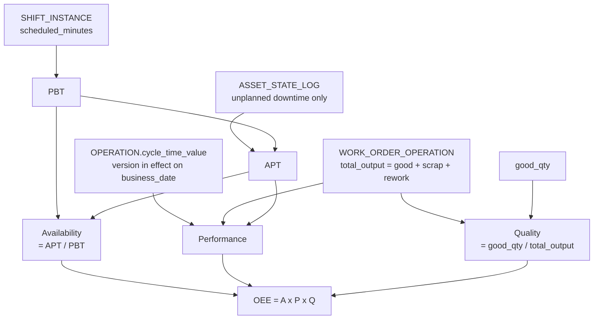
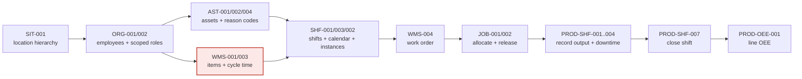

# PRD-001 — MolcaDx Core: Master Data, Low-Code Platform & Production Execution

| | |
|---|---|
| **Version** | v0.2 (draft) — absorbs PRD-002, see [§13.1](#131-the-availability-formula-that-was-corrected) |
| **Date** | 2026-08-24 (v0.2) · 2026-08-07 (v0.1) |
| **Author** | product-owner |
| **Status** | Draft |
| **Domains involved** | `foundation-domain`, `production-domain`, `ops-domain` (does not exist yet), `design-domain` (does not exist yet), `engineering-domain` (does not exist yet), `data-domain` (does not exist yet) |
| **Reviewers** | Not yet assigned — see [§11 Q-08](#11-open-questions) |
| **Scope** | **14 modules, 62 user stories**: 11 FOUNDATION + 3 PRODUCTION. v0.2 absorbed the Reference & Master Data (`REF`), Product (`PRO`), and KPI (`KPI`) modules from PRD-002. `Organization` (`ORG`) is **not** one of the 11 FOUNDATION modules — removed 2026-09-03, synced from [PRD-003 §13.5](PRD-003-foundation/99-history.md#135-organization-removed-2026-09-03) |
| **References** | [Goals Q3](https://github.com/molca-id/docs-molcadx/blob/main/DOCS/goalsQ3.md) · [03-prd-standard](https://github.com/molca-id/docs-molcadx/blob/main/DOCS/03-prd-standard.md) · [04-metrics-framework](https://github.com/molca-id/docs-molcadx/blob/main/DOCS/04-metrics-framework.md) · [AGENTS.md §4](https://github.com/molca-id/docs-molcadx/blob/main/AGENTS.md#4-format-prd--berbasis-user-story) |
| **Formula standard** | ISO 22400-2:2014, quoted through [F-07](https://github.com/molca-id/docs-molcadx/blob/main/DOMAINS/FOUNDATION/DOCS-EN/07-0-kpi-formula.md). This document derives no formula of its own; where it disagrees with F-07, **F-07 wins** |
| **Last FOUNDATION sync** | 2026-09-03 — `US-FND-REF-005` unblocked; `SHF-001/002/004`, `SIT-001`, `PRO-004`, `REF-001/002/004` synced to F-02/F-05/F-06 and UX 01/02/05/06. See [§13.5](#135-foundation-stories-synchronised-2026-09-03). **Same-day second sync** (rule 1b, [decision](https://github.com/molca-id/docs-molcadx/blob/main/LOGS/decisions/2026-09-03-foundation-contest-blockers.md)): `WORK_ORDER`/`WORK_ORDER_OPERATION` moved FOUNDATION → PRODUCTION (`US-FND-WMS-004`), F-02 downgraded to `DRAFT` (`US-FND-SHF-002` generator ownership unassigned), F-07 Availability/APT qualified not-Ready (`US-FND-KPI-001/004/005`), B6 `ASSET_PLACEMENT` fix (`US-FND-AST-002`), `ASSET_STATE_LOG` reopened (`US-FND-SIT-002`), F-13 Data Source flagged against `US-FND-INT-001` |
| **Supersedes** | PRD-002 (absorbed) · the Indonesian PRD-001 and PRD-002 (superseded; files deleted 2026-09-23, kept in git history) |
| **Writing standard** | [ISO 24495-1](https://www.iso.org/standard/78907.html) (Plain Language) — see [§13](#13-changes-in-v02-and-how-this-document-is-written) |

> **This is the single reference document for Design and Engineering.** Build from this file. It is the
> only PRD that covers all 14 modules, and the only one whose Availability formula matches
> [F-07](https://github.com/molca-id/docs-molcadx/blob/main/DOMAINS/FOUNDATION/DOCS-EN/07-0-kpi-formula.md). The Indonesian PRD-001 and both PRD-002 files are
> superseded and kept only for history.
>
> **Where to start.** *Designers:* [§7.1 Screen map](#71-screen-map-for-design), then the Expectation row
> of each story in §6 — every screen state you must draw is listed there. *Developers:*
> [§7.2 Entity summary](#72-entity-summary-for-engineering), then the Calculation, Data & entities, Rules
> & constraints, and Acceptance criteria rows — every formula names its variable sources down to the field
> and carries a worked example.
>
> **Identifiers are deliberately left untranslated:** entity names (`SHIFT_INSTANCE`), field names
> (`business_date`), event names (`output_recorded`), user story IDs (`US-FND-SIT-001`), and metric
> names (`waktu_catat_output`). Translating them would fork the identifiers and break cross-references
> with the domain documents developers implement against. Links point to the domain source documents.

---

## In short

**What this asks for:** build the MolcaDx core — master data, a low-code platform, and production
execution — as **62 user stories across 14 modules**, so that at least one pilot line records its
production daily through MolcaDx instead of on paper.

**The one number that decides success:** `lini_pilot_aktif_harian` — how many work centers record
production on ≥90% of their production shifts for 14 consecutive days. Baseline today is **0**.

**What is ready and what is not:**

| | Modules | What it means |
|---|---|---|
| 🟢 **Ready to build** | 9 of 13 | Entities are modelled; 22 stories cover everything the first pilot line needs |
| 🟠 **Blocked** | 4 of 13 — Workflow Engine, Notification, Integration, Configuration Service | Their entities **do not exist yet**. 13 stories name entities this PRD merely proposes |

**The three things most likely to stop this:**

1. **Standard cycle time may not exist on the floor.** Without it, Performance and all scheduling are impossible to compute ([R-01](#10-risks)).
2. **Four platform modules have no data model**, and one of them — Configuration Service — supplies nearly every threshold the other stories read ([R-07](#10-risks)).
3. **Nobody owns 5 of the 7 quarterly KRs**, because `design-domain` and `engineering-domain` don't exist ([R-12](#10-risks)).

**This PRD is not ready to build from yet.** 15 open questions block it, and 13 numbers are still
proposals rather than decisions. → [What to do next](#14-what-to-do-next)

## Contents

| § | Section | For whom |
|---|---|---|
| [0](#0-how-to-read-this-document--compliance-notes) | How to read this document & compliance notes | Everyone — read first |
| [1](#1-problem) | Problem | Everyone |
| [2](#2-target-users) | Target users | Design, Product |
| [3](#3-goals--metrics-max-3) | Goals & metrics | Product, Data |
| [4](#4-scope) | Scope, out of scope, assumptions | Everyone |
| [5](#5-user-stories) | User story tables, grouped Domain → Module | Everyone |
| [6](#6-user-story-detail-blocks) | **The 49 detail blocks** — eight parts each | Design, Engineering, QA |
| [7.1](#71-screen-map-for-design) | Screen map, device context, information priority | **Design** |
| [7.2](#72-entity-summary-for-engineering) | Entity summary + new fields needed | **Engineering** |
| [7.3](#73-access-control) | Access control per role | Engineering, QA |
| [7.4](#74-offline-behaviour) | Offline behaviour | Engineering, QA |
| [7.5](#75-non-functional-requirements-numbers-mandatory) | Non-functional requirements | Engineering, QA |
| [7.6](#76-migration--backfill) | Migration / backfill | Engineering |
| [8](#8-instrumentation-for-data-domain) | Instrumentation — every event and its properties | **Data** |
| [9](#9-release) | Release stages, critical path, rollback | Everyone |
| [10](#10-risks) | Risks | Product |
| [11](#11-open-questions) | **Open questions that block `v1.0`** | Product |
| [12](#12-decision-log) | Decision log | Everyone |
| [13](#13-changes-in-v02-and-how-this-document-is-written) | How this document is written, and how it gets evaluated | Product |
| [14](#14-what-to-do-next) | What to do next | Product |

Working on one module only? Read §0 for its readiness, its rows in §5, its blocks in §6, then §7 and §8.

---

## 0. How to read this document & compliance notes

This PRD was consolidated across **all** MolcaDx modules at the Product Owner's explicit request. Two
consequences must be stated openly, because both deviate from [03-prd-standard](https://github.com/molca-id/docs-molcadx/blob/main/DOCS/03-prd-standard.md):

| Standard rule | Condition in this document | Consequence |
|---------------|----------------------------|-------------|
| **Max. 3 goals per PRD**; more than that means the PRD must be split ([§2 rule 1](https://github.com/molca-id/docs-molcadx/blob/main/DOCS/03-prd-standard.md#2-aturan-menulis-tujuan--metrik)) | 3 program goals are retained (§3), but the scope spans 13 modules — far beyond a single feature | This document functions as a **program PRD**. When a module enters a sprint, carve its section out into a derived PRD (`PRD-002…`) with its own goals. Story IDs **do not change** when carved out. |
| **No `TBD` in scope, AC, or NFR** ([§7 checklist](https://github.com/molca-id/docs-molcadx/blob/main/DOCS/03-prd-standard.md#7-checklist-rilis-prd)) | Every AC and NFR here carries a number, but **13 of those numbers come from domain-document proposals, not PO decisions** | Proposed numbers are marked **`[proposed]`**. While any `[proposed]` remains, this PRD cannot be promoted to `v1.0` and the affected modules do not pass [Definition of Ready](https://github.com/molca-id/docs-molcadx/blob/main/DOCS/05-ways-of-working.md#4-definition-of-ready-sebelum-developerdesigner-mulai). Full list: [§11](#11-open-questions). |

**Readiness status per module** — what can actually be built today:

| Module | Code | Document basis | Readiness |
|--------|------|----------------|-----------|
| Site Hierarchy | `FND-SIT` | [F-04](https://github.com/molca-id/docs-molcadx/blob/main/DOMAINS/FOUNDATION/DOCS-EN/01-site-hierarchy.md) §9 complete | 🟢 ready to build |
| Asset Ontology | `FND-AST` | [F-01](https://github.com/molca-id/docs-molcadx/blob/main/DOMAINS/FOUNDATION/DOCS-EN/04-asset-ontology.md) §9 complete | 🟢 ready; `DOWNTIME_REASON`/`REJECT_REASON` taxonomy contents (formerly a single `DOWNTIME_REASON`) to follow (A-2) |
| Work Master | `FND-WMS` | [F-08](https://github.com/molca-id/docs-molcadx/blob/main/DOMAINS/FOUNDATION/DOCS-EN/08-work-master.md) §9 complete (`WORK_ORDER`/`WORK_ORDER_OPERATION` moved to PRODUCTION `Job Schedule`, 2026-09-03) | 🟢 ready; work order source still unsettled (see `Job Schedule` row, JS-1) |
| Calendar & Shift | `FND-SHF` | [F-05](https://github.com/molca-id/docs-molcadx/blob/main/DOMAINS/FOUNDATION/DOCS-EN/03-yearly-quarterly-declaration.md) + [F-06](https://github.com/molca-id/docs-molcadx/blob/main/DOMAINS/FOUNDATION/DOCS-EN/02-shift.md) §9 complete | 🟢 ready; real shift hours & patterns to follow (H-1, H-2) |
| Workflow Engine | `FND-WFE` | [F-07](https://github.com/molca-id/docs-molcadx/blob/main/DOMAINS/FOUNDATION/DOCS-EN/09-workflow-engine.md) concept only, **entities not yet modelled** | 🟠 needs entity modelling + an answer to Q3-3 first |
| Notification | `FND-NTF` | [F-08](https://github.com/molca-id/docs-molcadx/blob/main/DOMAINS/FOUNDATION/DOCS-EN/10-notification.md) concept only | 🟠 needs entity modelling |
| Integration | `FND-INT` | [F-09](https://github.com/molca-id/docs-molcadx/blob/main/DOMAINS/FOUNDATION/DOCS-EN/11-integration.md) concept only | 🟠 needs entity modelling + certainty on whether any PLC exists |
| Configuration Service | `FND-CFG` | [F-10](https://github.com/molca-id/docs-molcadx/blob/main/DOMAINS/FOUNDATION/DOCS-EN/12-configuration-service.md) concept only | 🟠 needs the list of what is configurable |
| Shopfloor | `PROD-SHF` | [P-01](https://github.com/molca-id/docs-molcadx/blob/main/DOMAINS/PRODUCTION/DOCS/02-monitoring.md) flows complete | 🟢 ready; recording mode & device still unsettled (SF-1, SF-4) |
| OEE Monitoring | `PROD-OEE` | [P-02](https://github.com/molca-id/docs-molcadx/blob/main/DOMAINS/PRODUCTION/DOCS/03-performance.md) calculation chain complete | 🟢 ready; changeover treatment undecided (OEE-6) |
| Job Schedule | `PROD-JOB` | [P-03](https://github.com/molca-id/docs-molcadx/blob/main/DOMAINS/PRODUCTION/DOCS/01-planning.md) flows complete | 🟢 ready; WO source & horizon unsettled (JS-1, JS-3) |

The four 🟠 modules (`WFE`, `NTF`, `INT`, `CFG`) do have user stories in this document, but their
**Data & entities** sections name entities that **do not exist in FOUNDATION yet**. Those stories are
marked `⚠ entities not yet modelled` and must not enter a sprint until `foundation-domain` has modelled them.

---

## 1. Problem

| Problem | Affected | Frequency | Evidence |
|---------|----------|-----------|----------|
| **P1** Plant operational data is scattered across spreadsheets and paper, not real time | Operators, supervisors, plant managers | Every shift | ⚠️ *not yet validated* — [00-product-overview §2](https://github.com/molca-id/docs-molcadx/blob/main/DOCS/00-product-overview.md#2-masalah-yang-dituju) records the source as `TBD`. Measure at the pilot line before locking the G1 target. |
| **P2** Production decisions are made from reports that arrive a day or a week late | Production supervisors, plant managers | Daily | ⚠️ *not yet validated* — same, [00 §2](https://github.com/molca-id/docs-molcadx/blob/main/DOCS/00-product-overview.md#2-masalah-yang-dituju) |
| **P3** No single source of truth for line/machine performance; "OEE" means something different in every report | Plant managers, engineers | Every reporting cycle | Structurally confirmed: [04-metrics-framework §5](https://github.com/molca-id/docs-molcadx/blob/main/DOCS/04-metrics-framework.md#5-metrik-operasional-standar-rumus-baku) fixes one canonical formula precisely because many OEE variants exist in industry; [P-02 OEE-6](https://github.com/molca-id/docs-molcadx/blob/main/DOMAINS/PRODUCTION/DOCS/03-performance.md#boundaries) records two changeover treatments that are both legitimate and produce very different numbers |
| **P4** Every plant has different SOPs and thresholds, so each implementation demands code changes | Internal implementors, engineering | Every new plant implementation | [F-07 §2](https://github.com/molca-id/docs-molcadx/blob/main/DOMAINS/FOUNDATION/DOCS-EN/09-workflow-engine.md#why-it-matters--what-goes-wrong-without-it) & [F-10 §2](https://github.com/molca-id/docs-molcadx/blob/main/DOMAINS/FOUNDATION/DOCS-EN/12-configuration-service.md#why-it-matters--what-goes-wrong-without-it) — this is what forces plants 2 and 3 to queue behind developers |
| **P5** The plant network is unstable, yet operator entries must never be lost | Line operators | Every connectivity disruption | [P-01 §5](https://github.com/molca-id/docs-molcadx/blob/main/DOMAINS/PRODUCTION/DOCS/02-monitoring.md#log-monitoring) sets the rule "never discard an operator entry"; [KR 1B.2](https://github.com/molca-id/docs-molcadx/blob/main/DOCS/goalsQ3.md#track-1b--platform-and-edge-engineering-backend-data-engine) targets 0 data loss |

> **Note on evidence.** P1 and P2 have no measured evidence yet. Per [04-metrics-framework §6](https://github.com/molca-id/docs-molcadx/blob/main/DOCS/04-metrics-framework.md#6-aturan-baseline),
> this PRD may ship with an empty baseline, **but the G1/G2 targets must not be locked** before the
> baseline is measured at the pilot line. The measurement method is in §3.

## 2. Target users

Personas are taken from [00-product-overview §3](https://github.com/molca-id/docs-molcadx/blob/main/DOCS/00-product-overview.md#3-target-user). This quarter,
[Goals Q3 §1](https://github.com/molca-id/docs-molcadx/blob/main/DOCS/goalsQ3.md#1-focus) sets the target user as the **internal implementor**, which is
**not a registered persona**. Until the PO registers it ([§11 Q-01](#11-open-questions)), this document
treats it as an *extension* of the Plant Admin/IT persona and marks it explicitly.

| Persona | Need in the context of this PRD | Usage context |
|---------|----------------------------------|---------------|
| **Line operator** | Record output, downtime, defects and andon faster than a paper form, with no double work | Standing on the shop floor, working at the same time, small screen, gloved/dirty hands, unstable network. Device is `TBD` ([SF-4](https://github.com/molca-id/docs-molcadx/blob/main/DOMAINS/PRODUCTION/DOCS/02-monitoring.md#boundaries)) — the design must withstand all three possibilities (shared tablet, personal phone, fixed terminal) |
| **Production supervisor** | See line condition during the running shift, close the shift, correct entries, respond to andon, reschedule jobs | Moves between shop floor and desk; small screen through to desktop; needs numbers that are actionable within 3 seconds |
| **Plant manager** | Compare lines and periods, see trends | Desktop/laptop in the plant office, daily–weekly, stable network |
| **Plant Admin/IT** — *this quarter played by the **internal implementor*** | Set up all master data for one site, build workflows without a developer, set thresholds and feature flags per plant, map machine tags | Desktop, long sessions (hours, not minutes), stable network, tolerant of information-dense screens **provided the origin of each value and its impact are clear** ([F-10 §8](https://github.com/molca-id/docs-molcadx/blob/main/DOMAINS/FOUNDATION/DOCS-EN/12-configuration-service.md#implications-for-molcadx)) |
| **Technician** ⚠️ | Close downtime with a technical cause | The `technician` role is used by [P-01 §2](https://github.com/molca-id/docs-molcadx/blob/main/DOMAINS/PRODUCTION/DOCS/02-monitoring.md#capabilities-figma) but **does not exist in the `ROLE` list** ([O-2](https://github.com/molca-id/docs-molcadx/blob/main/DOMAINS/FOUNDATION/DOCS-EN/00-foundation.md#open-questions-at-a-glance)) — see [§11 Q-02](#11-open-questions) |
| **Planner** ⚠️ | Build the job schedule across lines and shifts | Used by [P-03 §3](https://github.com/molca-id/docs-molcadx/blob/main/DOMAINS/PRODUCTION/DOCS/01-planning.md#job-order); neither a persona nor a `ROLE` yet. Played by the production supervisor for now — see [§11 Q-02](#11-open-questions) |

## 3. Goals & metrics (max. 3)

All three derive directly from the three things that must be proven in [Goals Q3 §1](https://github.com/molca-id/docs-molcadx/blob/main/DOCS/goalsQ3.md#1-focus).

| # | Metric | Baseline | Target | Measurement date | Data source |
|---|--------|----------|--------|------------------|-------------|
| **G1** (primary) | `lini_pilot_aktif_harian` — *pilot lines active daily*: number of work centers recording production through MolcaDx on ≥90% of their production shifts for 14 consecutive days | **0** (no line uses MolcaDx yet, 2026-08-07) | **`[proposed]` ≥2 work centers** — number and location pending PO ([Q3-2, Q3-4](https://github.com/molca-id/docs-molcadx/blob/main/DOCS/goalsQ3.md#65-pertanyaan-terbuka)) | End of quarter — exact date pending [Q3-1](https://github.com/molca-id/docs-molcadx/blob/main/DOCS/goalsQ3.md#65-pertanyaan-terbuka) | Count `SHIFT_INSTANCE` with `status = closed` having ≥1 `output_recorded`, divided by the count of `SHIFT_INSTANCE` with `is_production_shift = true`, per `work_center_id` |
| **G2** | `waktu_setup_site_oleh_implementor` — *time for an implementor to set up one site*: duration for one implementor to prepare a complete site's master data (site→work unit, assets, items, routings, shifts, roles) until the first line can record production, **without developer help** | **not yet measured** — measure at the first pilot site with timed observation, n≥1, before 2026-09-15 | Not locked before a baseline exists ([04 §6 rule 1](https://github.com/molca-id/docs-molcadx/blob/main/DOCS/04-metrics-framework.md#6-aturan-baseline)). Qualitative pass criteria: **0 developer help requests** and **0 code changes** | Second pilot site | Events `master_data_setup_started` → `first_output_recorded` per `site_id`; number of developer help tickets per setup |
| **Counter-metric** | `tingkat_koreksi_setelah_shift_closed` — *correction rate after shift close*: % of production entries corrected after `SHIFT_INSTANCE.status = closed` | **not yet measured** (no comparison system exists) | **Must not get worse** than the first-14-days-of-stable-use baseline + 2pp | Measured weekly from the moment the first pilot line goes active | `entry_corrected` divided by total production entries, per `business_date` |
| **Counter-metric 2** | `waktu_catat_output` — *time to record output*: median duration from opening the input screen to `output_recorded` | **not yet measured** — measure today's paper recording time as the comparison, observation n≥10 shifts, before 2026-09-15 | Must not be slower than today's paper recording | 30 days after the first pilot line goes active | `median(output_recorded.client_ts − output_screen_opened.client_ts)` |

**Failure criteria:** if at end of quarter G1 = 0 (not a single line records production daily through
MolcaDx), then **stop adding modules** and redirect all capacity to one single line until the end-to-end
flow is proven. If G1 is met but `tingkat_koreksi_setelah_shift_closed` rises >2pp above baseline,
**iterate the recording flow** (not by adding validation that slows the operator down) before adding the
next line.

**Outcomes supported** ([04 §2](https://github.com/molca-id/docs-molcadx/blob/main/DOCS/04-metrics-framework.md#2-tiga-lapis-metrik)): unrecorded downtime goes
down, and line performance has one identical definition across all reports. Neither outcome is a quarterly
target, because neither has a baseline yet.

## 4. Scope

**Included**

- **9 FOUNDATION modules** in this list, plus `REF`/`PRO`/`KPI` absorbed from PRD-002: Site Hierarchy, Asset Ontology, Work Master, Calendar & Shift, Workflow Engine, Notification, Integration, Configuration Service — see the readiness table in §0. `Organization` is **not** one of them — removed 2026-09-03 ([PRD-003 §13.5](PRD-003-foundation/99-history.md#135-organization-removed-2026-09-03)); roles/access moved to the IDP.
- **3 PRODUCTION modules:** Shopfloor Execution, OEE Monitoring, Job Schedule.
- **Master data CRUD screens** for every already-modelled FOUNDATION entity (KR 2.1).
- **Offline behaviour** for all shopfloor recording (KR 1B.2).
- **Data acquisition health monitoring** (KR 1A.1) — modelled as part of the Integration module, under the deliberately unambiguous name **"Service Monitoring"** to distinguish it from OEE Monitoring ([Goals Q3 §6.3](https://github.com/molca-id/docs-molcadx/blob/main/DOCS/goalsQ3.md#63-celah-cakupan)).

**Not included (out of scope)**

- **Work Improvement** and **License Manager** — their domain has not been decided ([Q3-7](https://github.com/molca-id/docs-molcadx/blob/main/DOCS/goalsQ3.md#65-pertanyaan-terbuka)).
- Financial/accounting modules (ERP), HRIS/payroll, VR/AR modules ([00 §7](https://github.com/molca-id/docs-molcadx/blob/main/DOCS/00-product-overview.md#7-di-luar-cakupan-untuk-saat-ini)).
- **Write access to PLCs.** Level 2/1 integration is read-only ([F-09 §3.7](https://github.com/molca-id/docs-molcadx/blob/main/DOMAINS/FOUNDATION/DOCS-EN/11-integration.md#core-concepts)).
- **Full maintenance management** (maintenance work orders, spare parts, preventive schedules). `ASSET` and `DOWNTIME_REASON` (formerly a single `DOWNTIME_REASON`) are prepared so this module can follow later, but its flows are not built this quarter.
- **Migrating running workflow instances to a new definition version.** Instances finish on their own version ([F-07 §3.7](https://github.com/molca-id/docs-molcadx/blob/main/DOMAINS/FOUNDATION/DOCS-EN/09-workflow-engine.md#core-concepts)).
- **Exactly-once delivery** in integration. What is built: at-least-once + idempotency ([F-09 §3.4](https://github.com/molca-id/docs-molcadx/blob/main/DOMAINS/FOUNDATION/DOCS-EN/11-integration.md#core-concepts)).
- **Free-form scripting / arbitrary expressions** in the workflow engine. What is built: a closed action list + limited condition expressions ([F-07 §3.4](https://github.com/molca-id/docs-molcadx/blob/main/DOMAINS/FOUNDATION/DOCS-EN/09-workflow-engine.md#core-concepts)).
- Any UI language other than Indonesian ([00 §6](https://github.com/molca-id/docs-molcadx/blob/main/DOCS/00-product-overview.md#6-batasan-awal)).
- SMS notification channel and physical andon boards. This quarter: in-app + push only ([§11 Q-06](#11-open-questions)).

**Assumptions**

1. **A1** Responsive web first, not mobile native ([00 §6](https://github.com/molca-id/docs-molcadx/blob/main/DOCS/00-product-overview.md#6-batasan-awal) marks this `TBD` — this assumption needs PO confirmation, [§11 Q-03](#11-open-questions)).
2. **A2** A single timezone (`Asia/Jakarta`) for the pilot site; the model still stores `SITE.timezone` so multi-zone needs no schema change ([S-2](https://github.com/molca-id/docs-molcadx/blob/main/DOMAINS/FOUNDATION/DOCS-EN/01-site-hierarchy.md#911-open-questions)).
3. **A3** `business_date` = the date the shift **starts** ([F-06 §9.4](https://github.com/molca-id/docs-molcadx/blob/main/DOMAINS/FOUNDATION/DOCS-EN/02-shift.md#9-entity-specification)). If Molca's reporting practice uses the end date, every daily aggregation changes — this is the most expensive assumption in this document ([H-4](https://github.com/molca-id/docs-molcadx/blob/main/DOMAINS/FOUNDATION/DOCS-EN/02-shift.md#94-open-questions)).
4. **A4** Downtime is recorded at **work unit** level, with `asset_id` filled in when known. This determines the lowest OEE level ([A-5](https://github.com/molca-id/docs-molcadx/blob/main/DOMAINS/FOUNDATION/DOCS-EN/04-asset-ontology.md#98-open-questions), [OEE-1](https://github.com/molca-id/docs-molcadx/blob/main/DOMAINS/PRODUCTION/DOCS/03-performance.md#boundaries)).
5. **A5** The first release may run **without machine integration**; automatic recording mode follows if PLCs turn out to be available ([F-09 §8](https://github.com/molca-id/docs-molcadx/blob/main/DOMAINS/FOUNDATION/DOCS-EN/11-integration.md#implications-for-molcadx)).
6. **A6** Operators use a **shared account per station** ([O-4](https://github.com/molca-id/docs-molcadx/blob/main/DOMAINS/FOUNDATION/DOCS-EN/00-foundation.md#open-questions-at-a-glance)) — consequently the recording `EMPLOYEE` is picked from the shift crew list, not derived from the login session. This assumption fundamentally changes screen design if it is wrong.

---

## 5. User stories

Grouped **Domain → Module**. IDs are permanent, per [AGENTS.md §4](https://github.com/molca-id/docs-molcadx/blob/main/AGENTS.md#kode-domain--modul).
The 8-part detail blocks are in [§6](#6-user-story-detail-blocks).

### 5.1 FOUNDATION

#### Site Hierarchy (`SIT`)

| ID | User story title | Description | Dependencies |
|----|------------------|-------------|--------------|
| [`US-FND-SIT-001`](#us-fnd-sit-001--build-the-location-hierarchy-for-one-site) | Build the location hierarchy for one site | As an **implementor**, I want to create the Enterprise→Site→Area→Work Center→Work Unit tiers, so that every number has a home and every role has a scope. → [detail](#us-fnd-sit-001--build-the-location-hierarchy-for-one-site) | `—` |
| [`US-FND-SIT-002`](#us-fnd-sit-002--deactivate-a-hierarchy-node-without-breaking-history) | Deactivate a node without breaking history | As an **implementor**, I want to deactivate lines/stations no longer in use, so they disappear from new input choices while their old data stays readable. → [detail](#us-fnd-sit-002--deactivate-a-hierarchy-node-without-breaking-history) | `US-FND-SIT-001` |
| [`US-FND-SIT-003`](#us-fnd-sit-003--pick-the-location-context-once-for-the-whole-app) | Pick the location context once for the whole app | As a **production supervisor**, I want to pick site→area→line once and have that context carry across every screen, so I don't re-pick it on every view. → [detail](#us-fnd-sit-003--pick-the-location-context-once-for-the-whole-app) | `US-FND-SIT-001` |

#### Asset Ontology (`AST`)

| ID | User story title | Description | Dependencies |
|----|------------------|-------------|--------------|
| [`US-FND-AST-001`](#us-fnd-ast-001--manage-the-asset-class--asset-type-taxonomy) | Manage the class & type taxonomy | As an **implementor**, I want to build the asset class and type/model tree, so analysis can span similar assets rather than only individual units. → [detail](#us-fnd-ast-001--manage-the-asset-class--asset-type-taxonomy) | `—` |
| [`US-FND-AST-002`](#us-fnd-ast-002--register-physical-assets-with-the-tag-operators-actually-read) | Register physical assets with their tag | As an **implementor**, I want to register machines together with the tag stuck on their body, so operators refer to assets by the same code as on the floor. → [detail](#us-fnd-ast-002--register-physical-assets-with-the-tag-operators-actually-read) | `US-FND-AST-001`, `US-FND-SIT-001` |
| [`US-FND-AST-003`](#us-fnd-ast-003--record-asset-moves-as-placement-history) | Record asset moves as placement history | As an **implementor**, I want to move assets between stations without overwriting the old placement, so last month's line performance doesn't change when a machine is swapped. → [detail](#us-fnd-ast-003--record-asset-moves-as-placement-history) | `US-FND-AST-002` |
| [`US-FND-AST-004`](#us-fnd-ast-004--manage-the-downtime-reason-code-taxonomy--closed-replaced) | ~~Manage the reason code taxonomy~~ **CLOSED** | **This story is closed and must not be built.** Replaced by [`US-FND-REF-001`](#us-fnd-ref-001-manage-the-downtime-reason-taxonomy), [`US-FND-REF-002`](#us-fnd-ref-002-manage-the-reject-reason-taxonomy), [`US-FND-REF-003`](#us-fnd-ref-003-scope-the-reason-list-per-asset). → [why](#132-stories-closed-and-replaced) | `—` |

#### Work Master (`WMS`)

| ID | User story title | Description | Dependencies |
|----|------------------|-------------|--------------|
| [`US-FND-WMS-001`](#us-fnd-wms-001--manage-items--units-of-measure--closed-split) | ~~Manage items & units of measure~~ **CLOSED** | **This story is closed and must not be built.** Replaced by [`US-FND-PRO-001`](#us-fnd-pro-001-register-a-product-with-its-base-unit), [`US-FND-REF-004`](#us-fnd-ref-004-manage-the-unit-of-measure-list), [`US-FND-PRO-003`](#us-fnd-pro-003-manage-per-product-unit-conversions). → [why](#132-stories-closed-and-replaced) | `—` |
| [`US-FND-WMS-002`](#us-fnd-wms-002--build-versioned-boms) | Build versioned BOMs | As an **implementor**, I want versioned component structures with scrap factors, so material consumption can be compared against plan. → [detail](#us-fnd-wms-002--build-versioned-boms) | `US-FND-PRO-001` |
| [`US-FND-WMS-003`](#us-fnd-wms-003--manage-routings--time-versioned-standard-cycle-time) | Manage routings & time-versioned cycle time | As an **implementor**, I want to maintain operation sequences with time-versioned standard cycle times, so last month's OEE doesn't change every time a standard is updated. → [detail](#us-fnd-wms-003--manage-routings--time-versioned-standard-cycle-time) | `US-FND-PRO-001`, `US-FND-SIT-001` |
| ~~`US-FND-WMS-004`~~ | ~~Create & release a work order~~ **RENAMED, 2026-09-03** | ID retired, never reused (`AGENTS.md` §4 dependency rule 3). Renamed to [`US-PROD-JOB-005`](#us-prod-job-005--create--release-a-work-order-with-locked-versions), moved into §6.14 PRODUCTION Job Schedule, because `WORK_ORDER`/`WORK_ORDER_OPERATION` are PRODUCTION entities. → [decision](https://github.com/molca-id/docs-molcadx/blob/main/LOGS/decisions/2026-09-03-foundation-contest-blockers.md) | `—` |
| [`US-FND-WMS-005`](#us-fnd-wms-005--manage-the-quality-defect-code-taxonomy) | Manage the defect code taxonomy | As an **implementor**, I want to define defect types with their dispositions, so the Quality metric can be analysed by cause instead of being a single number. → [detail](#us-fnd-wms-005--manage-the-quality-defect-code-taxonomy) | `US-FND-PRO-001` |

#### Calendar & Shift (`SHF`)

> `Organization` (`ORG`) was removed as a FOUNDATION module on 2026-09-03 — roles and access moved entirely
> to the identity provider; `US-FND-ORG-001/002/003` (org units & employees, scoped role grants, crews) are
> removed outright, not closed. Synced from [PRD-003 §13.5](PRD-003-foundation/99-history.md#135-organization-removed-2026-09-03).

| ID | User story title | Description | Dependencies |
|----|------------------|-------------|--------------|
| [`US-FND-SHF-001`](#us-fnd-shf-001--define-enterprise-shifts--each-sites-shift-hours) | Define enterprise shifts & each site's shift hours | As an **implementor**, I want to declare the enterprise's shift labels once and give each site real start/end times for every one of them, so that every site has a complete, non-overlapping shift clock. → [detail](#us-fnd-shf-001--define-enterprise-shifts--each-sites-shift-hours) | `US-FND-SIT-001` |
| [`US-FND-SHF-002`](#us-fnd-shf-002--generate-shift-instances-in-advance) | Generate shift instances in advance | As an **implementor**, I want real shifts generated per date per site in advance, so every production transaction always has a valid parent. → [detail](#us-fnd-shf-002--generate-shift-instances-in-advance) | `US-FND-SHF-001`, `US-FND-SIT-001` |
| [`US-FND-SHF-003`](#us-fnd-shf-003--manage-the-working-calendar--exception-days--closed-concept-retired) | ~~Manage the working calendar & exception days~~ **CLOSED** | **This story is closed and must not be built.** Modelled `SHIFT_CALENDAR`/`NON_WORKING_DAY`, a concept the PO retired entirely. → [why](#us-fnd-shf-003--manage-the-working-calendar--exception-days--closed-concept-retired) | `—` |
| [`US-FND-SHF-004`](#us-fnd-shf-004--assign-crews-to-shift-instances) | Assign crews to shift instances — **BLOCKED** | As a **production supervisor**, I want to assign crews to shifts, so production numbers can be attributed to a crew. **`CREW` has no FOUNDATION entity since Organization was removed.** → [detail](#us-fnd-shf-004--assign-crews-to-shift-instances) | `US-FND-SHF-002` |

#### Workflow Engine (`WFE`) — ⚠ entities not yet modelled

| ID | User story title | Description | Dependencies |
|----|------------------|-------------|--------------|
| [`US-FND-WFE-001`](#us-fnd-wfe-001--design-a-workflow-without-coding) | Design a workflow without coding | As an **implementor**, I want to assemble triggers, conditions, tasks and actions from a closed list, so plant SOPs can be executed by the system without code changes. → [detail](#us-fnd-wfe-001--design-a-workflow-without-coding) | `US-FND-ORG-002` |
| [`US-FND-WFE-002`](#us-fnd-wfe-002--dry-run-a-workflow-before-activating-it) | Dry-run a workflow before activating it | As an **implementor**, I want to simulate a flow with sample data, so configuration mistakes aren't discovered in production. → [detail](#us-fnd-wfe-002--dry-run-a-workflow-before-activating-it) | `US-FND-WFE-001` |
| [`US-FND-WFE-003`](#us-fnd-wfe-003--activate-a-version-and-pin-it-on-running-instances) | Activate a version & pin running instances | As an **implementor**, I want to activate a new version without changing running instances, so an approval doesn't switch owners mid-flight. → [detail](#us-fnd-wfe-003--activate-a-version-and-pin-it-on-running-instances) | `US-FND-WFE-002` |
| [`US-FND-WFE-004`](#us-fnd-wfe-004--work-a-task-and-trace-the-instance-history) | Work a task & trace instance history | As a **production supervisor**, I want to see my tasks plus the full instance trail, so a stuck flow can be diagnosed without asking a developer. → [detail](#us-fnd-wfe-004--work-a-task-and-trace-the-instance-history) | `US-FND-WFE-003`, `US-FND-NTF-001` |

#### Notification (`NTF`) — ⚠ entities not yet modelled

| ID | User story title | Description | Dependencies |
|----|------------------|-------------|--------------|
| [`US-FND-NTF-001`](#us-fnd-ntf-001--configure-notification-rules-per-role--scope) | Configure notification rules per role | As an **implementor**, I want to define which event triggers which notification to which role, so information reaches someone who can act. → [detail](#us-fnd-ntf-001--configure-notification-rules-per-role--scope) | `US-FND-ORG-002`, `US-FND-CFG-001` |
| [`US-FND-NTF-002`](#us-fnd-ntf-002--acknowledge-notifications-and-auto-escalate-when-missed) | Acknowledge notifications & auto-escalate | As a **production supervisor**, I want to acknowledge important notifications and have the system escalate if I miss one, so no warning dies quietly. → [detail](#us-fnd-ntf-002--acknowledge-notifications-and-auto-escalate-when-missed) | `US-FND-NTF-001` |
| [`US-FND-NTF-003`](#us-fnd-ntf-003--suppress-repeating-notifications) | Suppress repeating notifications | As a **production supervisor**, I want repeated similar events grouped, so one faulty sensor doesn't flood everyone. → [detail](#us-fnd-ntf-003--suppress-repeating-notifications) | `US-FND-NTF-001` |

#### Integration & Service Monitoring (`INT`) — ⚠ entities not yet modelled

| ID | User story title | Description | Dependencies |
|----|------------------|-------------|--------------|
| [`US-FND-INT-001`](#us-fnd-int-001--declare-connectors--tag-mappings-as-configuration) | Declare connectors & tag mappings | As an **implementor**, I want to map machine tags to assets & signal types through configuration, so a new machine isn't a developer task. → [detail](#us-fnd-int-001--declare-connectors--tag-mappings-as-configuration) | `US-FND-AST-002`, `US-FND-CFG-001` |
| [`US-FND-INT-002`](#us-fnd-int-002--guarantee-zero-lost-entries-when-the-connection-drops) | Guarantee zero lost entries when offline | As a **line operator**, I want my entries to persist and sync once the connection returns, so I never record anything twice. → [detail](#us-fnd-int-002--guarantee-zero-lost-entries-when-the-connection-drops) | `US-FND-INT-001` |
| [`US-FND-INT-003`](#us-fnd-int-003--monitor-data-acquisition-health-service-monitoring) | Monitor data acquisition health | As a **Plant Admin/IT**, I want to know within minutes when a source stops sending data, so gaps aren't discovered in the monthly report. → [detail](#us-fnd-int-003--monitor-data-acquisition-health-service-monitoring) | `US-FND-INT-001`, `US-FND-NTF-001` |

#### Configuration Service (`CFG`) — ⚠ entities not yet modelled

| ID | User story title | Description | Dependencies |
|----|------------------|-------------|--------------|
| [`US-FND-CFG-001`](#us-fnd-cfg-001--set-tiered-values-and-see-where-each-comes-from) | Set tiered values and see where each comes from | As an **implementor**, I want to set thresholds per level and see which level the effective value came from, so tiered configuration is diagnosable. → [detail](#us-fnd-cfg-001--set-tiered-values-and-see-where-each-comes-from) | `US-FND-SIT-001`, `US-FND-ORG-002` |
| [`US-FND-CFG-002`](#us-fnd-cfg-002--view-history--roll-back-configuration) | View history & roll back configuration | As an **implementor**, I want to see who changed what and roll back to a previous value, so "why did behaviour change since Tuesday" can be answered. → [detail](#us-fnd-cfg-002--view-history--roll-back-configuration) | `US-FND-CFG-001` |
| [`US-FND-CFG-003`](#us-fnd-cfg-003--turn-modules-on--off-per-plant) | Turn modules on/off per plant | As an **implementor**, I want to switch off modules a plant doesn't use, so the operator's screen isn't filled with irrelevant things. → [detail](#us-fnd-cfg-003--turn-modules-on--off-per-plant) | `US-FND-CFG-001` |

#### Reference & Master Data (`REF`)

| ID | User story title | Description | Dependencies |
|----|------------------|-------------|--------------|
| [`US-FND-REF-001`](#us-fnd-ref-001-manage-the-downtime-reason-taxonomy) | Manage the downtime reason taxonomy | As a **plant admin**, I want to build the list of downtime reasons with each one classed planned, unplanned, or small stop, so that Availability can separate time that was meant to stop from time that was lost. → [detail](#us-fnd-ref-001-manage-the-downtime-reason-taxonomy) | `—` |
| [`US-FND-REF-002`](#us-fnd-ref-002-manage-the-reject-reason-taxonomy) | Manage the reject reason taxonomy | As a **plant admin**, I want to build the reject reason list as a list separate from downtime reasons, so that quality analysis does not get mixed into machine-stop analysis. → [detail](#us-fnd-ref-002-manage-the-reject-reason-taxonomy) | `—` |
| [`US-FND-REF-003`](#us-fnd-ref-003-scope-the-reason-list-per-asset) | Scope the reason list per asset | As a **line operator**, I want to see only the reasons that can actually happen on my machine, so that I am not scrolling past other machines' reasons while the line is stopped. → [detail](#us-fnd-ref-003-scope-the-reason-list-per-asset) | `US-FND-REF-001`, `US-FND-REF-002`, `US-FND-AST-002` |
| [`US-FND-REF-004`](#us-fnd-ref-004-manage-the-unit-of-measure-list) | Manage the unit of measure list | As a **plant admin**, I want to register the units this plant uses along with their symbols, so that every quantity carries a unit that is named the same way across the system. → [detail](#us-fnd-ref-004-manage-the-unit-of-measure-list) | `—` |
| [`US-FND-REF-005`](#us-fnd-ref-005-manage-time-conversions) | Manage time conversions | As a **plant admin**, I want to register named durations whose seconds factor the system computes, so that every operation standard and product cycle time resolves to seconds. → [detail](#us-fnd-ref-005-manage-time-conversions) | `—` |
| [`US-FND-REF-006`](#us-fnd-ref-006-deactivate-a-reference-row-without-breaking-history) | Deactivate a reference row without breaking history | As a **plant admin**, I want to stop a reason or unit being offered without deleting it, so that older records referencing that row stay readable. → [detail](#us-fnd-ref-006-deactivate-a-reference-row-without-breaking-history) | `US-FND-REF-001`, `US-FND-REF-002`, `US-FND-REF-004` |

#### Product (`PRO`)

| ID | User story title | Description | Dependencies |
|----|------------------|-------------|--------------|
| [`US-FND-PRO-001`](#us-fnd-pro-001-register-a-product-with-its-base-unit) | Register a product with its base unit | As a **plant admin**, I want to register raw materials, semi-finished goods, and finished goods in one product list with their base units, so that routing, BOM, machine tags, and KPIs all have one product identity to reference. → [detail](#us-fnd-pro-001-register-a-product-with-its-base-unit) | `US-FND-REF-004` |
| [`US-FND-PRO-002`](#us-fnd-pro-002-record-physical-and-tracking-attributes) | Record physical and tracking attributes | As a **plant admin**, I want to record a product's weight envelope, dimensions, barcode, and batch tracking rule, so that a checkweigher reading can be judged pass or fail. → [detail](#us-fnd-pro-002-record-physical-and-tracking-attributes) | `US-FND-PRO-001` |
| [`US-FND-PRO-003`](#us-fnd-pro-003-manage-per-product-unit-conversions) | Manage per-product unit conversions | As a **plant admin**, I want to state that one case of this product holds a specific number of pieces, so that output counted in cases can be compared with output counted in pieces. → [detail](#us-fnd-pro-003-manage-per-product-unit-conversions) | `US-FND-PRO-001`, `US-FND-REF-004` |
| [`US-FND-PRO-004`](#us-fnd-pro-004-manage-per-unit-reference-cycle-times) | Manage per-unit reference cycle times | As a **plant admin**, I want to state one product's cycle time in several units at once, so that reference figures exist for planning without changing where Performance gets its standard. → [detail](#us-fnd-pro-004-manage-per-unit-reference-cycle-times) | `US-FND-PRO-001`, `US-FND-REF-004`, `US-FND-REF-005` |

#### KPI (`KPI`)

| ID | User story title | Description | Dependencies |
|----|------------------|-------------|--------------|
| [`US-FND-KPI-001`](#us-fnd-kpi-001-compute-availability-from-pot-to-pbt-to-apt) | Compute Availability from POT to PBT to APT | As a **production supervisor**, I want my line's Availability computed with PBT as the denominator, so that the line is not penalised for downtime that was planned. → [detail](#us-fnd-kpi-001-compute-availability-from-pot-to-pbt-to-apt) | `US-FND-SHF-002`, `US-FND-AST-003`, `US-FND-REF-001`, `US-PROD-SHF-003` |
| [`US-FND-KPI-002`](#us-fnd-kpi-002-compute-performance-with-per-sku-segmentation) | Compute Performance with per-SKU segmentation **(PARTLY BLOCKED)** | As a **production supervisor**, I want Performance computed per SKU run and then summed, so that a shift running two products is not judged against one averaged standard. → [detail](#us-fnd-kpi-002-compute-performance-with-per-sku-segmentation) | `US-FND-KPI-001`, `US-FND-PRO-001`, `US-FND-WMS-003`, `US-PROD-SHF-001` |
| [`US-FND-KPI-003`](#us-fnd-kpi-003-compute-quality-from-whichever-input-pair-exists) | Compute Quality from whichever input pair exists | As a **production supervisor**, I want Quality computed from the pair of figures my line actually has, so that a line without a good counter still gets a Quality number without inventing the missing side. → [detail](#us-fnd-kpi-003-compute-quality-from-whichever-input-pair-exists) | `US-PROD-SHF-001`, `US-FND-REF-002` |
| [`US-FND-KPI-004`](#us-fnd-kpi-004-compute-oee-and-the-loss-waterfall-from-pbt) | Compute OEE and the loss waterfall from PBT | As a **production supervisor**, I want OEE to appear only when all three of its components are computed, together with the minutes lost at each step, so that one composite number does not hide where the time went. → [detail](#us-fnd-kpi-004-compute-oee-and-the-loss-waterfall-from-pbt) | `US-FND-KPI-001`, `US-FND-KPI-002`, `US-FND-KPI-003` |
| [`US-FND-KPI-005`](#us-fnd-kpi-005-compute-mttr-and-mtbf-from-unplanned-stops) | Compute MTTR and MTBF from unplanned stops | As a **plant manager**, I want mean repair duration and mean gap between failures per line, so that I can compare line reliability without waiting for a Maintenance module. → [detail](#us-fnd-kpi-005-compute-mttr-and-mtbf-from-unplanned-stops) | `US-FND-KPI-001`, `US-FND-REF-001` |
| [`US-FND-KPI-006`](#us-fnd-kpi-006-open-downtime-from-a-stalled-counter) | Open downtime from a stalled counter **(BLOCKED)** | As a **production supervisor**, I want a stopped line recorded automatically from a counter that stops incrementing, so that stops are captured even when no operator presses anything. → [detail](#us-fnd-kpi-006-open-downtime-from-a-stalled-counter) | `US-FND-KPI-001`, `US-FND-AST-002` |

### 5.2 PRODUCTION

#### Shopfloor Execution (`SHF`)

| ID | User story title | Description | Dependencies |
|----|------------------|-------------|--------------|
| [`US-PROD-SHF-001`](#us-prod-shf-001--start-the-shift-and-see-scheduled-jobs) | Start the shift & see scheduled jobs | As a **line operator**, I want to open a work session and immediately see this shift's jobs, so I don't have to hunt for a paper work order. → [detail](#us-prod-shf-001--start-the-shift-and-see-scheduled-jobs) | `US-FND-SHF-002`, `US-FND-SHF-004`, `US-PROD-JOB-002` |
| [`US-PROD-SHF-002`](#us-prod-shf-002--record-production-output) | Record production output | As a **line operator**, I want to record output on the running job in a few taps, so the shift's results are captured without paper. → [detail](#us-prod-shf-002--record-production-output) | `US-PROD-SHF-001` |
| [`US-PROD-SHF-003`](#us-prod-shf-003--open-downtime-in-one-tap) | Open downtime in one tap | As a **line operator**, I want to flag the line as stopped without picking a cause first, so response isn't delayed by paperwork. → [detail](#us-prod-shf-003--open-downtime-in-one-tap) | `US-PROD-SHF-001` |
| [`US-PROD-SHF-004`](#us-prod-shf-004--close-downtime-with-a-reason-code) | Close downtime with a reason code | As a **technician**, I want to close downtime with the right cause, so the loss tree has content worth analysing. → [detail](#us-prod-shf-004--close-downtime-with-a-reason-code) | `US-PROD-SHF-003`, `US-FND-AST-004` |
| [`US-PROD-SHF-005`](#us-prod-shf-005--record-defects-with-their-disposition) | Record defects with their disposition | As a **line operator**, I want to record defective units with their type and treatment, so Quality is computed correctly and defect causes are visible. → [detail](#us-prod-shf-005--record-defects-with-their-disposition) | `US-PROD-SHF-002`, `US-FND-WMS-005` |
| [`US-PROD-SHF-006`](#us-prod-shf-006--raise-an-andon) | Raise an andon | As a **line operator**, I want to call for help with a single category choice, so the problem is handled before the line stops. → [detail](#us-prod-shf-006--raise-an-andon) | `US-PROD-SHF-001`, `US-FND-NTF-001` |
| [`US-PROD-SHF-007`](#us-prod-shf-007--close-the-shift-and-lock-its-numbers) | Close the shift & lock its numbers | As a **production supervisor**, I want to close the shift after reviewing its summary, so the shift's numbers become final and trustworthy. → [detail](#us-prod-shf-007--close-the-shift-and-lock-its-numbers) | `US-PROD-SHF-002`, `US-PROD-SHF-004`, `US-PROD-SHF-005` |
| [`US-PROD-SHF-008`](#us-prod-shf-008--correct-entries-as-flagged-adjustments) | Correct entries as flagged adjustments | As a **production supervisor**, I want to fix entries through flagged corrections, so no data is lost and every change has a reason. → [detail](#us-prod-shf-008--correct-entries-as-flagged-adjustments) | `US-PROD-SHF-007` |

#### OEE Monitoring (`OEE`)

| ID | User story title | Description | Dependencies |
|----|------------------|-------------|--------------|
| [`US-PROD-OEE-001`](#us-prod-oee-001--see-line-oee-for-the-running-shift) | See line OEE for the running shift | As a **production supervisor**, I want to see my line's OEE and its three components during the running shift, so I can act before the shift ends. → [detail](#us-prod-oee-001--see-line-oee-for-the-running-shift) | `US-PROD-SHF-002`, `US-PROD-SHF-004`, `US-FND-SHF-002`, `US-FND-WMS-003` |
| [`US-PROD-OEE-002`](#us-prod-oee-002--compare-every-line-in-one-view) | Compare every line in one view | As a **plant manager**, I want all lines side by side worst-first, so I know where to look first. → [detail](#us-prod-oee-002--compare-every-line-in-one-view) | `US-PROD-OEE-001` |
| [`US-PROD-OEE-003`](#us-prod-oee-003--trace-loss-causes-down-to-the-source-entry) | Trace loss causes to the source entry | As a **production supervisor**, I want to drill from OEE into a Pareto of reason codes down to the original entry, so findings are actionable rather than merely readable. → [detail](#us-prod-oee-003--trace-loss-causes-down-to-the-source-entry) | `US-PROD-OEE-001`, `US-FND-AST-004` |
| [`US-PROD-OEE-004`](#us-prod-oee-004--see-the-oee-trend-across-periods) | See the OEE trend across periods | As a **plant manager**, I want OEE and its components per day/week against the previous period, so I know whether the direction is improving. → [detail](#us-prod-oee-004--see-the-oee-trend-across-periods) | `US-PROD-OEE-001` |
| [`US-PROD-OEE-005`](#us-prod-oee-005--flag-anomalies--data-completeness) | Flag anomalies & data completeness | As a **plant manager**, I want numbers built on half the data clearly flagged, so I don't decide from numbers that don't deserve trust. → [detail](#us-prod-oee-005--flag-anomalies--data-completeness) | `US-PROD-OEE-001` |

#### Job Schedule (`JOB`)

| ID | User story title | Description | Dependencies |
|----|------------------|-------------|--------------|
| [`US-PROD-JOB-001`](#us-prod-job-001--allocate-jobs-to-lines--shifts-with-a-capacity-check) | Allocate jobs to lines & shifts | As a **planner**, I want to place jobs onto lines and shifts while seeing load vs capacity, so the schedule I build is still possible to execute. → [detail](#us-prod-job-001--allocate-jobs-to-lines--shifts-with-a-capacity-check) | `US-PROD-JOB-005`, `US-FND-SHF-002` |
| [`US-PROD-JOB-002`](#us-prod-job-002--release-jobs-so-operators-can-see-them) | Release jobs so operators can see them | As a **planner**, I want to release only complete jobs, so operators only see work that is genuinely ready. → [detail](#us-prod-job-002--release-jobs-so-operators-can-see-them) | `US-PROD-JOB-001` |
| [`US-PROD-JOB-003`](#us-prod-job-003--surface-carry-over-in-the-next-shift) | Surface carry-over in the next shift | As a **production supervisor**, I want last shift's remainder at the very top of the next shift, so unfinished work doesn't disappear quietly. → [detail](#us-prod-job-003--surface-carry-over-in-the-next-shift) | `US-PROD-JOB-002`, `US-PROD-SHF-007` |
| [`US-PROD-JOB-004`](#us-prod-job-004--reschedule-with-a-recorded-reason) | Reschedule with a recorded reason | As a **planner**, I want to move jobs while recording why, so a schedule that always slips can be learned from. → [detail](#us-prod-job-004--reschedule-with-a-recorded-reason) | `US-PROD-JOB-002` |
| [`US-PROD-JOB-005`](#us-prod-job-005--create--release-a-work-order-with-locked-versions) | Create & release a work order | As a **planner**, I want work orders that lock the routing & BOM version on release, so later master data changes don't alter work already in progress. → [detail](#us-prod-job-005--create--release-a-work-order-with-locked-versions) | `US-FND-WMS-002`, `US-FND-WMS-003` |

**Total: 49 user stories** — 31 FOUNDATION, 18 PRODUCTION. `US-FND-WMS-004` renamed to `US-PROD-JOB-005`
2026-09-03 (contest review structural decision) — total story count unchanged, only the domain column shifts.
No circular dependencies; the build order
derived from the Dependencies column is in [§9](#9-release).

---

## 6. User story detail blocks

> Eight mandatory parts per story ([03-prd-standard §3.1](https://github.com/molca-id/docs-molcadx/blob/main/DOCS/03-prd-standard.md#31-delapan-bagian-wajib-per-story)).
> Parts that do not apply are written `not applicable`. Numbers marked **`[proposed]`** come from domain
> documents and **have not been decided by the PO** — see [§11](#11-open-questions).

### 6.1 FOUNDATION — Site Hierarchy

#### `US-FND-SIT-001` — Build the location hierarchy for one site

| Part | Content |
|------|---------|
| **Story** | As a **Plant Admin/IT (internal implementor)**, I want to create the Enterprise → Site → Area → Work Center → Work Unit tiers, so that every number has a home to roll up into and every role has a scope. |
| **Context** | Without a firm hierarchy, "plant OEE" has no definite meaning because it is unclear which lines it consists of ([F-01 §2](https://github.com/molca-id/docs-molcadx/blob/main/DOMAINS/FOUNDATION/DOCS-EN/01-site-hierarchy.md#why-it-matters--what-goes-wrong-without-it)). Screen behaviour follows [UX 01](https://github.com/molca-id/docs-molcadx/blob/main/DOMAINS/FOUNDATION/UX/01-site-hierarchy.md) (`SCR-FND-SIT-001`/`002`, synced 2026-09-02). Done by the implementor on desktop, long sessions (hours), stable network, during onboarding of a new plant. This is the **first** task in every implementation — every other module waits on its output. |
| **Expectation** | **Default:** the hierarchy panel on the left — always full-size, it never collapses to a rail — with three user-switchable view modes: **Tree** (indented collapsible list with chevrons), **Diagram** (boxes and connectors, expand/collapse per level), and **Table** (flat list with type-filter chips All / Site / Area / Work Center / Work Unit). All three share one node selection and a **read-only** detail pane on the right (title, code, type badge). Every node's row or box, in all three modes, carries a "more actions" (⋮) menu with **Edit** (a dialog with that node kind's own fields — Code/Name/Timezone for Site, Code/Name for Area, Code/Name/Type for Work Center and Work Unit; not shown for Enterprise) and **Add {child kind}** (a dialog with the create form; not shown for Work Unit, which has no child kind). Editing is dialog-based only — no floating or inline forms, and no primary "Add" button that follows the selection. Codes are free text with the suggested pattern `JKT1-AS-L01-S03` shown as a hint. When the selected node is a `SITE`, the pane grows the Shift and Fiscal Year panels ([`US-FND-SHF-001`](#us-fnd-shf-001--define-enterprise-shifts--each-sites-shift-hours), `US-FND-FYR-001` — Yearly & Quarterly Declaration, not yet back-ported into this document, see [PRD-003 §6.13](PRD-003-foundation/03-yearly-quarterly-declaration.md)); when it is a `WORK_UNIT`, an Asset Placement summary. Collapsed below Area by default. Readable within 3 seconds: site name, count of areas/lines/stations, and — on a `SITE` row or box, in all three modes — a **solid alert count badge** giving the number of `ENTERPRISE_SHIFT` labels that site has not yet given hours to ([`US-FND-SHF-001`](#us-fnd-shf-001--define-enterprise-shifts--each-sites-shift-hours)). The badge is absent for a fully declared site, never "0", and never appears on Area, Work Center, or Work Unit. **Empty:** no hierarchy yet → a single "start with Enterprise" seed node whose ⋮ menu offers Add Site, plus a note that other modules are waiting on this. **Loading:** tree skeleton; ⋮ menus on already-loaded nodes stay usable. **Save error:** the dialog stays open with its input intact + message "Could not save — your input has not been lost. Try saving again." A rejection caused by another entity renders that entity as a link inside the pane. **Offline:** master data is **not** available offline; show "A connection is required to change master data" and permit read-only access to already-loaded data. **Success:** the dialog closes, the new node appears selected in the current view mode, confirmation within 2 seconds; the next Add is one ⋮ away (implementors create many nodes in a row). **No permission:** the ⋮ menu is absent and the pane states "Only subjects whose IDP-asserted scope claim covers this site (or a broader `enterprise`/`tenant` claim) may change the location structure. Contact your Plant Admin/IT." Text limits: name ≤80 chars, code ≤20 chars. |
| **Calculation** | Node depth: `depth = 1 + depth(parent)`, `ENTERPRISE = 1`. Validation `depth ≤ 5`. Example: `JKT1-AS-L01-S03` → `WORK_UNIT`, `depth = 5` → valid; adding a child below it → `depth = 6` → rejected. Missing-shift badge on a `SITE` node: `missing_shifts(site) = COUNT(ENTERPRISE_SHIFT active) − COUNT(SITE_SHIFT active WHERE site_id = site)` — 3 enterprise shifts and 2 declared → badge "1"; 3 and 3 → no badge (not "0"). Same figure as the Shift panel's own "N missing" count. Edge cases: nodes whose `valid_to` has passed are excluded from counts; a node with no children is still valid (a line without stations is allowed if `WORK_UNIT` isn't used — see [S-3](https://github.com/molca-id/docs-molcadx/blob/main/DOMAINS/FOUNDATION/DOCS-EN/01-site-hierarchy.md#911-open-questions)). **Corrected 2026-09-03:** an earlier draft of this story counted a "tracked lines" summary figure as `COUNT(WORK_CENTER WHERE is_oee_tracked = true AND valid_to IS NULL)`. `WORK_CENTER` has no `is_oee_tracked` field in [F-01 §9.5](https://github.com/molca-id/docs-molcadx/blob/main/DOMAINS/FOUNDATION/DOCS-EN/01-site-hierarchy.md#95-work_center--production-line--process-cell--production-unit--storage-zone) — it was invented. `TBD — perlu konfirmasi foundation-domain`: should F-01 gain an `is_oee_tracked` field (or should "in the OEE family" be derived from `WORK_CENTER_CLASS` instead)? Until answered, this screen shows no "tracked lines" summary count, and neither does [`US-FND-KPI-001`](#us-fnd-kpi-001-compute-availability-from-pot-to-pbt-to-apt)/[`US-FND-KPI-004`](#us-fnd-kpi-004-compute-oee-and-the-loss-waterfall-from-pbt), which had the same assumption. |
| **Data & entities** | Read: `ENTERPRISE`, `SITE`, `AREA`, `WORK_CENTER`, `WORK_UNIT`; `ENTERPRISE_SHIFT` and `SITE_SHIFT` read only, to compute the missing-shift badge. Write: `SITE` (`site_code`, `site_name`, `timezone` — `default_shift_calendar_id` removed: the calendar concept is retired and the field is not in F-01 §9.3), `AREA` (`area_code`, `area_name`), `WORK_CENTER` (`work_center_code`, `work_center_name`, `type`), `WORK_UNIT` (`work_unit_code`, `work_unit_name`). **Not written, and not real fields per [F-01 §9](https://github.com/molca-id/docs-molcadx/blob/main/DOMAINS/FOUNDATION/DOCS-EN/01-site-hierarchy.md#9-entity-specification):** `WORK_CENTER.is_oee_tracked`, `.design_capacity_uom`, `.sequence_no`, `WORK_UNIT.position_no`, `.is_bottleneck` — an earlier draft of this story invented all five. No new fields. |
| **Rules & constraints** | ① Every node has exactly one parent — no dangling nodes ([F-01 §9](https://github.com/molca-id/docs-molcadx/blob/main/DOMAINS/FOUNDATION/DOCS-EN/01-site-hierarchy.md#9-entity-specification)). ② `site_code` unique within the enterprise, `work_center_code` unique within the site, `work_unit_code` unique within the work center → message: "Code `<code>` is already used by `<node name>`. Use another code." ③ `SITE.timezone` is mandatory, picked from the IANA list — never a fixed offset. ④ `WORK_CENTER.type` is mandatory, one of **four** values: `production_line` (discrete) / `process_cell` (batch) / `production_unit` (continuous) / `storage_zone` (warehousing) — per [F-01 §9.5](https://github.com/molca-id/docs-molcadx/blob/main/DOMAINS/FOUNDATION/DOCS-EN/01-site-hierarchy.md#95-work_center--production-line--process-cell--production-unit--storage-zone). ⑤ Depth **must not** be extended without a FOUNDATION + PO decision. ⑥ Access: `create`/`update`/`deactivate` on a resource scoped at `site` or `enterprise` — any subject whose IDP-asserted scope claim covers that scope (or a broader `tenant` claim). ⑦ Field codes already in use for years **are followed**, not replaced with a new pattern ([F-00 §4.2](https://github.com/molca-id/docs-molcadx/blob/main/DOMAINS/FOUNDATION/DOCS-EN/00-foundation.md)). |
| **Acceptance criteria** | **AC-1** Given an implementor on an empty site, When they create Site → Area → Work Center → Work Unit in sequence, Then all four nodes are saved with the correct parent and appear in the tree at their tier. **AC-2 (validation)** Given a work center coded `L01` already exists on that site, When the implementor saves a new work center coded `L01`, Then the save is rejected and an inline message under the code field names the node using that code. **AC-3 (validation)** Given the Site form is open with no timezone selected, When "Save" is pressed, Then the form is not submitted and "Timezone is required" appears under the timezone field. **AC-4 (limit)** Given a `WORK_UNIT` row or box, When the implementor opens its ⋮ menu, Then no "Add" entry is offered, because Work Unit has no child kind (the 5-level maximum). **AC-5 (error)** Given the connection fails during save, When the save is attempted, Then the dialog stays open with its input intact and the message states the data is not yet saved — not lost. **AC-6 (permission)** Given a subject whose IDP-asserted scope claim does not cover that site (nor a broader `enterprise`/`tenant` claim), When they open the location structure screen, Then they can only read, no ⋮ menu is present on any node, and the pane explains who to contact. **AC-7 (missing-shift badge)** Given the enterprise has 3 `ENTERPRISE_SHIFT` labels and site JKT1 has `SITE_SHIFT` rows for 2 of them, When the hierarchy is viewed in Tree, then Diagram, then Table, Then JKT1's row or box shows a solid alert badge reading "1" in each mode, no Area/Work Center/Work Unit shows one, and once the third `SITE_SHIFT` is declared the badge disappears rather than reading "0". **AC-8 (dialog editing)** Given any of the three view modes, When the implementor opens ⋮ on an Area, Then Edit and Add Work Center are offered and each opens a dialog; on an Enterprise node no Edit is offered; nowhere is an inline or floating form shown. |
| **Metrics & events** | Metric: `waktu_setup_hierarki_site` (*site hierarchy setup time*) — baseline `not yet measured` (measure at the first pilot site by timed observation) → target set after the baseline exists, source: first → last `hierarchy_node_created` per `site_id`. Counter-metric: number of nodes deactivated within 7 days of creation (a signal that the structure was guessed, not known). Events: `hierarchy_node_created` (`level`, `parent_level`, `site_id`, `view_mode`), `hierarchy_node_updated` (`level`, `field_changed`, `view_mode`). |
| **Dependencies** | `—` |

#### `US-FND-SIT-002` — Deactivate a hierarchy node without breaking history

| Part | Content |
|------|---------|
| **Story** | As a **Plant Admin/IT (internal implementor)**, I want to deactivate a line or station that is no longer in use, so it disappears from new input choices while all of its historical data stays readable. |
| **Context** | Deleting old nodes leaves historical data without a home ([F-04 §7.4](https://github.com/molca-id/docs-molcadx/blob/main/DOMAINS/FOUNDATION/DOCS-EN/01-site-hierarchy.md#common-pitfalls)). Happens when a line is relocated or retired — rare, but each occurrence risks corrupting the previous year's reports. Desktop, implementor. |
| **Expectation** | **Default:** the selected node shows a "Deactivate" button with an effective date; before confirmation the system shows an **impact list**: number of descendants that will also be deactivated, number of in-flight transactions blocking it, and which modules reference this node. **Empty:** not applicable. **Loading:** the impact list loads with a skeleton; the confirm button stays locked until the impact has been computed — never allow confirmation without visible impact. **Error:** "Could not compute impact — deactivation was not performed." **Offline:** unavailable (master data requires a connection). **Success:** the node shows "inactive since `<date>`", remains in the tree in a dimmed style, and disappears from every new-input picker. **No permission:** same as `US-FND-SIT-001`. |
| **Calculation** | Blockers: `blocker_count = COUNT(WORK_ORDER_OPERATION WHERE work_unit_id ∈ subtree(node) AND status ∈ {pending, scheduled, in_progress, on_hold}) + COUNT(ASSET_STATE_LOG WHERE work_unit_id ∈ subtree(node) AND ended_at IS NULL) + COUNT(SHIFT_INSTANCE WHERE work_center_id ∈ subtree(node) AND status = 'open')`. Example: line L01 has 2 `in_progress` jobs and 1 open downtime → `blocker_count = 3` → deactivation rejected, all three named. If `blocker_count = 0` → set `valid_to = effective_date` on the node and all its descendants. Edge cases: an `effective_date` in the past is rejected (that would change history); `effective_date` = today means effective from the end of that day. **Two of the three blocker sources are risk notes, not blockers on this story:** `WORK_ORDER_OPERATION` is now PRODUCTION-owned ([01-planning.md § WORK_ORDER_OPERATION](https://github.com/molca-id/docs-molcadx/blob/main/DOMAINS/PRODUCTION/DOCS/01-planning.md#work_order_operation--execution-and-output-per-shift), moved 2026-09-03) — this read crosses the domain boundary via FK, it does not redefine the entity. `ASSET_STATE_LOG` has **no §9 entity specification anywhere in FOUNDATION and disputed ownership** (A-5, reopened 2026-09-03, B5) — this blocker check cannot actually be built against a real schema until A-5 resolves; treat as a dependency risk on that count specifically, not a reason to block this story's other two counts. |
| **Data & entities** | Read: `WORK_ORDER_OPERATION` (PRODUCTION-owned, [01-planning.md § WORK_ORDER_OPERATION](https://github.com/molca-id/docs-molcadx/blob/main/DOMAINS/PRODUCTION/DOCS/01-planning.md#work_order_operation--execution-and-output-per-shift)), `ASSET_STATE_LOG` (**unspecified, ownership disputed — A-5**, see the Calculation note above), `SHIFT_INSTANCE`, `ASSET_PLACEMENT`. Write: `valid_to` on the selected `AREA` / `WORK_CENTER` / `WORK_UNIT` and its descendants. No physical deletion ([F-00 §4.4](https://github.com/molca-id/docs-molcadx/blob/main/DOMAINS/FOUNDATION/DOCS-EN/00-foundation.md)). |
| **Rules & constraints** | ① No physical deletion of master data. ② Deactivation with in-flight transactions is **rejected**, with a message naming each blocking transaction. ③ Deactivating a parent logically deactivates its descendants. ④ Inactive nodes do not appear in new-input choices but remain visible in historical data. ⑤ An asset occupying a work unit being deactivated must be unplaced first (`US-FND-AST-003`) — if not, show it as a blocker. ⑥ Access: `deactivate` on a resource scoped at `site` — any subject whose IDP-asserted scope claim covers that scope (or a broader `enterprise`/`tenant` claim). |
| **Acceptance criteria** | **AC-1** Given a line with no in-flight transactions, When the implementor deactivates it effective today, Then the line and all its stations are marked inactive and disappear from the line picker on shopfloor screens. **AC-2 (validation)** Given the line has 1 `in_progress` job, When deactivation is confirmed, Then it is rejected and the message names the blocking work order number. **AC-3 (validation)** Given the effective date is a past date, When saved, Then it is rejected with "The effective date cannot be in the past — corrections to the past are handled as flagged adjustments." **AC-4 (history)** Given the line is already inactive, When a manager opens an OEE report for a period before the deactivation date, Then that line's numbers still appear in full with its name. **AC-5 (loading)** Given the impact list is still loading, When the implementor presses confirm, Then the button is not yet active and the system states the impact is being computed. **AC-6 (permission)** Given a subject whose IDP-asserted scope claim does not cover that site (nor a broader `enterprise`/`tenant` claim), When they open the node, Then the "Deactivate" button is unavailable with an explanation of the scope required. |
| **Metrics & events** | Metric: `penonaktifan_ditolak_karena_penghalang` (*deactivations rejected due to blockers*) — % of deactivation attempts rejected; a high value means the impact list isn't visible early enough in the flow. Baseline `not yet measured`, source `hierarchy_node_deactivate_blocked`. Counter-metric: 0 historical reports whose numbers change after a deactivation. Events: `hierarchy_node_deactivated` (`level`, `descendant_count`, `effective_date`), `hierarchy_node_deactivate_blocked` (`blocker_type`, `blocker_count`). |
| **Dependencies** | `US-FND-SIT-001` |

#### `US-FND-SIT-003` — Pick the location context once for the whole app

| Part | Content |
|------|---------|
| **Story** | As a **production supervisor**, I want to pick site → area → line once and have that context carry across every screen, so I don't re-pick it on every view. |
| **Context** | The location hierarchy is the picker framework across the whole application ([F-04 §4](https://github.com/molca-id/docs-molcadx/blob/main/DOMAINS/FOUNDATION/DOCS-EN/01-site-hierarchy.md#what-this-module-is-for)). A supervisor switches screens many times per shift while walking the floor; re-picking the line on every screen is a cost paid over and over, every day. Small screen, one hand, unstable network. |
| **Expectation** | **Default:** the context picker at the top shows the active line; if the user has only one line in scope, the picker is **not** presented as a choice — it is simply selected. Readable within 3 seconds: the active line name. **Empty:** the user has no scope at all → "You have not been granted a role on any line. Contact your Plant Admin/IT." **Loading:** the last line name stays visible from local cache, with a refreshing indicator. **Error:** use the last context stored locally + a "line list may not be current" marker. **Offline:** the picker only lists lines already stored locally; the offline marker is active. **Success:** every screen switches context without a page reload; the choice persists until changed. **No permission:** lines outside scope never appear in the list at all (rather than appearing and then being denied). |
| **Calculation** | Selectable lines: `SELECT WORK_CENTER WHERE valid_to IS NULL AND work_center_id ∈ effective_scope(subject)`, where `effective_scope(subject) = ⋃ subtree(claim.scope_id)` over every scope claim the IDP asserts for that subject ([ABAC contract](https://github.com/molca-id/docs-molcadx/blob/main/DOMAINS/FOUNDATION/DOCS-EN/00-foundation.md#authorization-attribute-contract-abac--what-foundation-exposes-what-stays-in-the-idp)) — FOUNDATION contributes only the resource side of that intersection (which `WORK_CENTER` resolves to which `site_id`/`area_id`), never the claim itself. Example: a subject's IDP claim covers `AREA` Assembly (containing L01, L02) and `WORK_CENTER` L05 → list = {L01, L02, L05}. Edge cases: an expired claim does not count (IDP-side, not read here); if the result is 0 lines, show the empty state — do not show an empty picker. |
| **Data & entities** | Read: `SITE`, `AREA`, `WORK_CENTER` (resource scope chain only). `ROLE`/`ROLE_ASSIGNMENT` are **not** FOUNDATION entities — the subject's scope claim is asserted by the IDP and never stored here. Write: none (the selected context is stored as a user preference in [Configuration Service](#us-fnd-cfg-001--set-tiered-values-and-see-where-each-comes-from) at `user` level). |
| **Rules & constraints** | ① The list contains only nodes in the user's effective scope — nodes outside scope are never displayed. ② Inactive nodes do not appear. ③ The selected context is carried into every query and every event as `site_id` / `line_id` ([04 §4](https://github.com/molca-id/docs-molcadx/blob/main/DOCS/04-metrics-framework.md#4-konvensi-event)). ④ One line in scope → no picker. ⑤ Picker touch target ≥44×44 px (used with gloves). |
| **Acceptance criteria** | **AC-1** Given a supervisor with 3 lines in scope, When they select L02 on the OEE screen and then open the schedule screen, Then the schedule screen already shows L02 without re-picking. **AC-2 (empty)** Given a subject with no IDP-asserted scope claim, When they enter the app, Then an explanation appears that they have no scope yet plus who to contact, and no empty picker is shown. **AC-3 (permission)** Given L09 is outside the user's scope, When they open the line picker, Then L09 does not appear in the list. **AC-4 (offline)** Given the device is offline, When the user opens the picker, Then only locally stored lines appear and the offline marker is visible. **AC-5 (single line)** Given the user has only 1 line, When they open any screen, Then no picker is shown and that line is active immediately. |
| **Metrics & events** | Metric: `pergantian_konteks_per_sesi` (*context switches per session*) — median number of line switches per session; a rise without cause means the context is not persisting. Baseline `not yet measured`, source `context_changed`. Counter-metric: `waktu_muat_layar` (*screen load time*) p95 must not increase because of the picker. Events: `context_changed` (`from_level`, `to_level`, `scope_size`). |
| **Dependencies** | `US-FND-SIT-001` |

### 6.2 FOUNDATION — Asset Ontology

#### `US-FND-AST-001` — Manage the asset class & asset type taxonomy

| Part | Content |
|------|---------|
| **Story** | As a **Plant Admin/IT (internal implementor)**, I want to build the asset class and type/model tree, so analysis can span similar assets rather than only individual units. |
| **Context** | Without a taxonomy, downtime is recorded against free-text names and cannot be summed per machine type — Pareto analysis becomes impossible ([F-01 §2](https://github.com/molca-id/docs-molcadx/blob/main/DOMAINS/FOUNDATION/DOCS-EN/04-asset-ontology.md#why-it-matters--what-goes-wrong-without-it)). The trap to avoid: a 6-level tree that is never filled in completely is worse than 3 levels filled consistently ([F-01 §7.1](https://github.com/molca-id/docs-molcadx/blob/main/DOMAINS/FOUNDATION/DOCS-EN/04-asset-ontology.md)). Desktop, implementor, during onboarding. |
| **Expectation** | **Default:** two panels — the `ASSET_CLASS` tree (with `parent_class_id`) on the left, the `ASSET_TYPE` list for the selected class on the right; each row shows how many assets use it. Readable within 3 seconds: how many classes and how many types are defined. **Empty:** "No asset classes yet" + a brief note that 3 levels is enough for most plants, so the implementor doesn't build too deep. **Loading:** tree skeleton. **Error:** input intact + save failure message. **Offline:** unavailable. **Success:** the new node is selected, form ready for the next entry. **No permission:** "Only subjects whose IDP-asserted scope claim covers the tenant may change the asset taxonomy." |
| **Calculation** | `class_depth = 1 + depth(parent_class)`. A warning (not a rejection) when `class_depth > 3`: "Trees deeper than 3 levels are rarely filled in completely — consider simplifying." `assets_per_type = COUNT(ASSET WHERE asset_type_id = X AND valid_to IS NULL)`. Example: class `Production Machine` → sub-class `Injection Molding` → type `IM 250T brand X` → 4 assets. Edge cases: a type with no assets is still valid (prepared ahead of time); a class with descendants cannot be deactivated before its descendants are. |
| **Data & entities** | Read/Write: `ASSET_CLASS` (`asset_class_code`, name, `parent_class_id`, per-class attribute definitions), `ASSET_TYPE` (code, name, `asset_class_id`, `manufacturer`, `model`, shared technical attributes). Read: `ASSET` (usage counts), `DOWNTIME_REASON_EQUIPMENT`/`REJECT_REASON_EQUIPMENT` (replaces the old `DOWNTIME_REASON.DOWNTIME_REASON_ASSET.asset_id` — note: scoping is now per **equipment instance**, not per `ASSET_CLASS`, see [`asset-ontology.md` §9.4](https://github.com/molca-id/docs-molcadx/blob/main/DOMAINS/FOUNDATION/DOCS-EN/05-reference-master-data.md#91-downtime_reason-and-reject_reason)). |
| **Rules & constraints** | ① Class and type codes are unique within the enterprise. ② `ASSET_CLASS` may be tiered; depth >3 triggers a warning, not a rejection. ③ Classes/types are never deleted, only deactivated; deactivating a class that still has active types is rejected, naming the blocking types. ④ Per-class specific attributes are stored as key-value on `ASSET.attributes` — adding a new attribute type **must not** require a code change ([KR 1B.1](https://github.com/molca-id/docs-molcadx/blob/main/DOCS/goalsQ3.md#track-1b--platform-and-edge-engineering-backend-data-engine)). ⑤ Access: `create`/`update`/`deactivate` on a resource scoped at `tenant` — `ASSET_CLASS`/`ASSET_TYPE` carry no Site Hierarchy FK ([authorization catalog](https://github.com/molca-id/docs-molcadx/blob/main/DOMAINS/FOUNDATION/DOCS-EN/00-1-authorization-permissions.md#equipment-taxonomy-ast--04-asset-ontologymd-9)), so only a tenant-level (or broader) IDP-asserted scope claim qualifies; a site- or enterprise-only claim does not. |
| **Acceptance criteria** | **AC-1** Given an empty taxonomy, When the implementor creates class → sub-class → type, Then all three are saved with correct parent relations and the type appears under its class. **AC-2 (validation)** Given type code `IM250X` already exists, When the same code is saved again, Then it is rejected with an inline message naming the existing holder. **AC-3 (warning)** Given the implementor creates a class at level 4, When saved, Then it **is** saved **and** a warning appears suggesting the tree be simplified. **AC-4 (validation)** Given a class still has 2 active types, When the class is deactivated, Then it is rejected naming both types. **AC-5 (flexible attributes)** Given the implementor adds a new attribute "tonnage" to the Injection Molding class, When they fill its value on an asset, Then the value is stored without a schema change and appears in the asset detail. **AC-6 (permission)** Given a subject whose IDP-asserted scope claim does not cover the tenant, When they open the taxonomy screen, Then they can only read. |
| **Metrics & events** | Metric: `kedalaman_taksonomi_terpakai` (*taxonomy depth actually used*) — average depth of classes that actually have assets; far shallower than what was created means the taxonomy is over-complex. Baseline `not yet measured`, source: `ASSET_CLASS` + `ASSET` tables. Counter-metric: % of `ASSET_TYPE` rows with no assets after 30 days (speculative taxonomy). Events: `asset_class_created` (`depth`), `asset_type_created` (`asset_class_id`), `asset_attribute_defined` (`class_id`, `attribute_key`). |
| **Dependencies** | `—` |

#### `US-FND-AST-002` — Register physical assets with the tag operators actually read

| Part | Content |
|------|---------|
| **Story** | As a **Plant Admin/IT (internal implementor)**, I want to register machines together with the tag stuck on their body, so operators refer to assets by the same code as on the floor. |
| **Context** | "Machine 3", "IM-03" and "Injection 3" are treated as three different assets during analysis ([F-01 §2](https://github.com/molca-id/docs-molcadx/blob/main/DOMAINS/FOUNDATION/DOCS-EN/04-asset-ontology.md#why-it-matters--what-goes-wrong-without-it)). The physical tag is **not** the primary key — plants do renumber ([F-01 §7.2](https://github.com/molca-id/docs-molcadx/blob/main/DOMAINS/FOUNDATION/DOCS-EN/04-asset-ontology.md)). Desktop, implementor; the result is read by operators on the shop floor. |
| **Expectation** | **Default:** asset list with columns tag, type, line/station placement, criticality, and lifecycle status; search by tag is the first field to receive focus. Readable within 3 seconds: how many assets are registered and how many are not yet installed at a station. **Empty:** "No assets registered yet" + add button. **Loading:** table skeleton. **Error:** input intact + save failure message. **Offline:** unavailable. **Success:** the new asset appears at the top row marked "new", form ready for the next entry. **No permission:** read-only. Text limits: `asset_tag` ≤30 chars, name ≤80. |
| **Calculation** | `asset_age_months = month_diff(commissioning_date, today)`, shown blank when `commissioning_date` is null — **not** 0 months. Example: `commissioning_date = 2021-03-15`, today `2026-08-07` → 64 months. **Corrected 2026-09-03 (B6):** `ASSET.work_unit_id` no longer exists — `uninstalled_assets = COUNT(ASSET WHERE NOT EXISTS(ASSET_PLACEMENT WHERE asset_id = ASSET.asset_id AND valid_to IS NULL) AND lifecycle_status ≠ 'decommissioned')`, i.e. assets with no active `ASSET_PLACEMENT` row. Edge case: components (those with `parent_asset_id`) are not counted as "not installed", because a component is not meant to occupy a work unit of its own ([F-01 §9.3](https://github.com/molca-id/docs-molcadx/blob/main/DOMAINS/FOUNDATION/DOCS-EN/04-asset-ontology.md#95-component-structure)). |
| **Data & entities** | Read: `ASSET_TYPE`, `ASSET_CLASS`, `WORK_UNIT`. Write: `ASSET` — `asset_tag`, `asset_type_id`, `serial_number`, `manufacturer`, `model`, `parent_asset_id`, `criticality`, `lifecycle_status`, `commissioning_date`, `owner_org_unit_id`, `attributes`, `valid_from`, `valid_to`. **Corrected 2026-09-03 (B6):** `ASSET.site_id` is **not** written here — it is removed as an independent field and is now derived read-only from the asset's current `ASSET_PLACEMENT` row ([F-04 §9.4](https://github.com/molca-id/docs-molcadx/blob/main/DOMAINS/FOUNDATION/DOCS-EN/04-asset-ontology.md#94-asset--core-attributes)); an asset with no `ASSET_PLACEMENT` yet reads as "unplaced," not a stale site. Placement to a work unit is handled by `US-FND-AST-003`, which writes `ASSET_PLACEMENT` directly. `owner_org_unit_id` is a real field per [F-04 §9.4](https://github.com/molca-id/docs-molcadx/blob/main/DOMAINS/FOUNDATION/DOCS-EN/04-asset-ontology.md#94-asset--core-attributes), but its FK target `ORG_UNIT` no longer exists in FOUNDATION since Organization was removed — this screen must leave the field blank/unused until `foundation-domain` decides what `owner_org_unit_id` points to now. `TBD — perlu konfirmasi PO`/`foundation-domain`. |
| **Rules & constraints** | ① `asset_tag` unique within the site; it may change without changing `asset_id`. ② `criticality` is mandatory (`A`/`B`/`C`) — the basis of repair priority. ③ `lifecycle_status` is mandatory; only `operational` assets may occupy an active work unit. ④ Component depth is at most 3 levels; components inherit their site from the parent's current `ASSET_PLACEMENT`, not from any `site_id`/`work_unit_id` field of their own — a component is never placed directly (B6, [F-04 §9.6](https://github.com/molca-id/docs-molcadx/blob/main/DOMAINS/FOUNDATION/DOCS-EN/04-asset-ontology.md#96-asset-to-work-unit-placement-rules)). ⑤ Assets are never deleted — `decommissioned` + `valid_to`. ⑥ Access: `create`/`update` on a resource scoped at `site` — any subject whose IDP-asserted scope claim covers that site (or a broader `enterprise`/`tenant` claim). `view` requires only that the claim cover the resource, at any tier. |
| **Acceptance criteria** | **AC-1** Given the type already exists, When the implementor saves an asset with tag, type, site and criticality, Then the asset is saved and appears in the list with a searchable tag. **AC-2 (validation)** Given tag `IM-003` is already used on that site, When the same tag is saved, Then it is rejected with "Tag `IM-003` is already used by asset `<name>` on this site." **AC-3 (validation)** Given criticality has not been selected, When "Save" is pressed, Then it is rejected with "Criticality is required (A/B/C)" under its field. **AC-4 (component)** Given an asset is created with a `parent_asset_id` already at level 3, When saved, Then it is rejected with an explanation of the 3-level component depth limit. **AC-5 (tag change)** Given an asset has 200 historical downtime entries, When the implementor changes its `asset_tag`, Then every historical entry still refers to the same asset and no data is detached. **AC-6 (permission)** Given a user with the `operator` role, When they open the asset list, Then they can only read assets within their scope. |
| **Metrics & events** | Metric: `aset_terdaftar_per_lini_pilot` (*registered assets per pilot line*) — number of assets with criticality and type filled on the pilot line; a precondition for OEE being computable at all. Baseline 0 (2026-08-07), target: 100% of pilot-line assets registered before that line starts recording production. Source: `ASSET` table. Counter-metric: % of assets with empty `attributes` despite their class defining mandatory attributes. Events: `asset_created` (`asset_class_id`, `criticality`, `has_serial`), `asset_tag_changed` (`asset_id`). |
| **Dependencies** | `US-FND-AST-001`, `US-FND-SIT-001` |

#### `US-FND-AST-003` — Record asset moves as placement history

| Part | Content |
|------|---------|
| **Story** | As a **Plant Admin/IT (internal implementor)**, I want to move assets between stations without overwriting the old placement, so last month's line performance doesn't change when a machine is swapped. |
| **Context** | Moving machines between lines without a trail puts historical data in the wrong place — last month's line performance changes with it ([F-01 §2](https://github.com/molca-id/docs-molcadx/blob/main/DOMAINS/FOUNDATION/DOCS-EN/04-asset-ontology.md#why-it-matters--what-goes-wrong-without-it)). Historical analysis must use the placement in effect **at the time of the event** ([F-01 §9.5](https://github.com/molca-id/docs-molcadx/blob/main/DOMAINS/FOUNDATION/DOCS-EN/04-asset-ontology.md#96-asset-to-work-unit-placement-rules)). Rare, but every occurrence touches all historical reporting. |
| **Expectation** | **Default:** the asset detail shows the current placement + a placement history table (station, from–to) newest first; a "Move" button. The move form asks for the destination station and an effective date. **Empty:** the asset has never been placed → "Never installed" + an install button. **Loading:** history table skeleton. **Error:** input intact + failure message. **Offline:** unavailable. **Success:** the old history row is date-closed, a new row appears on top, and the current placement changes. **No permission:** read-only. |
| **Calculation** | Placement in effect at a point in time: `placement(asset, t) = ASSET_PLACEMENT WHERE asset_id = asset AND valid_from ≤ t AND (valid_to IS NULL OR valid_to > t)`. Example: IM-003 in `S03` from 2026-01-01 to 2026-06-30, then `S07` from 2026-07-01. Downtime on 2026-05-12 is attributed to the line that owns `S03`, **not** `S07`, even though the asset sits in `S07` today. Edge cases: one `WORK_UNIT` may be occupied by only **one** asset at a time → overlap is rejected naming the occupying asset; a past effective date colliding with another placement is rejected; a move with no destination (unplacement) is valid — `valid_to` is closed with no new row. |
| **Data & entities** | Read: `ASSET`, `WORK_UNIT`, `ASSET_PLACEMENT`. Write: `ASSET_PLACEMENT` (`asset_id`, `work_unit_id`, `valid_from`, `valid_to`), plus syncing `WORK_UNIT.current_asset_id` and `ASSET.work_unit_id` as values derived from today's effective placement. Never `UPDATE` an old placement in place ([F-00 §4.3](https://github.com/molca-id/docs-molcadx/blob/main/DOMAINS/FOUNDATION/DOCS-EN/00-foundation.md#43-effective-dating)). |
| **Rules & constraints** | ① One work unit holds at most one asset at a time. ② A move = close the old row + create a new row. ③ Historical analysis must use the placement at the time of the event. ④ Assets with `lifecycle_status = decommissioned` cannot be placed. ⑤ Components (those with `parent_asset_id`) cannot be placed directly onto a work unit. ⑥ Access: `create`/`update` on a resource scoped at `work_unit` ([authorization catalog](https://github.com/molca-id/docs-molcadx/blob/main/DOMAINS/FOUNDATION/DOCS-EN/00-1-authorization-permissions.md#equipment-taxonomy-ast--04-asset-ontologymd-9) — `ASSET_PLACEMENT` resolves to `work_unit_id`, its own level) — any subject whose IDP-asserted scope claim covers that work unit (or a broader `site`/`area`/`enterprise`/`tenant` claim). |
| **Acceptance criteria** | **AC-1** Given IM-003 is installed at `S03`, When the implementor moves it to `S07` effective 2026-07-01, Then the `S03` row closes on 2026-06-30 and the `S07` row opens from 2026-07-01. **AC-2 (history)** Given IM-003 had downtime on 2026-05-12, When the May loss report is opened, Then that downtime is still counted against the line owning `S03`. **AC-3 (validation)** Given `S07` is already occupied by another asset on that date, When the move is saved, Then it is rejected with a message naming the tag of the asset occupying `S07`. **AC-4 (validation)** Given the effective date collides with another placement of the same asset, When saved, Then it is rejected naming the colliding range. **AC-5 (unplacement)** Given the asset is unplaced with no destination, When saved, Then the placement is closed and the asset shows as "not installed" without losing history. **AC-6 (permission)** Given a subject whose IDP-asserted scope claim does not cover that work unit (nor a broader `site`/`area`/`enterprise`/`tenant` claim), When they open the asset detail, Then the history is readable but the "Move" button is unavailable. |
| **Metrics & events** | Metric: `perpindahan_tercatat_lengkap` (*moves recorded completely*) — % of asset moves that have an `ASSET_PLACEMENT` row (vs being discovered through a direct change); target 100%. Baseline `not yet measured`, source `asset_relocated`. Counter-metric: 0 historical reports whose numbers change after a move. Events: `asset_relocated` (`asset_id`, `from_work_unit_id`, `to_work_unit_id`, `effective_date`). |
| **Dependencies** | `US-FND-AST-002` |

#### `US-FND-AST-004` — Manage the downtime reason code taxonomy — CLOSED, REPLACED

> **This story is closed. Do not build it.** It was written against a single `DOWNTIME_REASON` table with a
> seven-value branching `category`, an `downtime_category` boolean, and per-`ASSET_CLASS` scoping. None of those
> exist any more. F-05 now has two separate taxonomies with a three-value `downtime_category` and scoping
> per asset instance, and the entities moved from F-04 to F-05, so the `AST` module code is no longer
> their home.
>
> **Replaced by** [`US-FND-REF-001`](#us-fnd-ref-001-manage-the-downtime-reason-taxonomy) (downtime
> taxonomy), [`US-FND-REF-002`](#us-fnd-ref-002-manage-the-reject-reason-taxonomy) (reject taxonomy), and
> [`US-FND-REF-003`](#us-fnd-ref-003-scope-the-reason-list-per-asset) (per-asset scoping). The ID
> `US-FND-AST-004` is retired and never reused. See [§13.2](#132-stories-closed-and-replaced).

### 6.3 FOUNDATION — Work Master

#### `US-FND-WMS-001` — Manage items & units of measure — CLOSED, SPLIT

> **This story is closed. Do not build it.** It used the `PRODUCT` entity, since renamed `PRODUCT` and moved
> to F-06, and its calculation was `qty_in_base_uom = qty × UOM.conversion_value`. **`conversion_value`
> exists in no FOUNDATION file.** `UNIT_OF_MEASUREMENTS` carries only `uom_id`, `code`, `name`, `unit`;
> conversion exists solely per product through `PRODUCT_UOM_CONVERSION`.
>
> **Split into** [`US-FND-PRO-001`](#us-fnd-pro-001-register-a-product-with-its-base-unit) (product
> identity), [`US-FND-REF-004`](#us-fnd-ref-004-manage-the-unit-of-measure-list) (units), and
> [`US-FND-PRO-003`](#us-fnd-pro-003-manage-per-product-unit-conversions) (conversion). The ID
> `US-FND-WMS-001` is retired and never reused. Stories `US-FND-WMS-002` through `US-FND-WMS-005` that
> depended on it now depend on `US-FND-PRO-001`. See [§13.2](#132-stories-closed-and-replaced).

#### `US-FND-WMS-002` — Build versioned BOMs

| Part | Content |
|------|---------|
| **Story** | As a **Plant Admin/IT (internal implementor)**, I want versioned component structures with scrap factors, so material consumption can be compared against plan. |
| **Context** | BOMs are hierarchical — a component can have its own BOM ([F-08 §3.2](https://github.com/molca-id/docs-molcadx/blob/main/DOMAINS/FOUNDATION/DOCS-EN/08-work-master.md#core-concepts)) — and their version is locked when a work order is released ([F-08 §3.5](https://github.com/molca-id/docs-molcadx/blob/main/DOMAINS/FOUNDATION/DOCS-EN/08-work-master.md#core-concepts)). Desktop, implementor. |
| **Expectation** | **Default:** BOM header (parent item, version, validity period) + a component line table (item, qty per unit, UOM, scrap factor); total components and a "used by active WO" marker visible in the header. Readable within 3 seconds: parent item, active version, and line count. **Empty:** the item has no BOM → "No BOM for this item yet" + a button to create the first version. **Loading:** table skeleton. **Error:** input intact + failure message. **Offline:** unavailable. **Success:** the new version is saved as a draft; it only takes effect once its validity period starts. **No permission:** read-only. |
| **Calculation** | Material requirement per unit: `required_qty = qty_per_unit × (1 + scrap_factor)`. Example: `qty_per_unit = 2 pcs`, `scrap_factor = 0.05` → 2.1 pcs per parent unit; for `planned_qty = 1,000` → 2,100 pcs. Edge cases: a negative `scrap_factor` is rejected; `scrap_factor ≥ 1` (100%) triggers a confirmation because it is almost always a typo; a circular BOM (item A needs B, B needs A) is rejected with the chain displayed; BOM depth beyond 5 levels triggers a warning. |
| **Data & entities** | Read: `PRODUCT`, `UNIT_OF_MEASUREMENTS`. Write: `BOM` (`product_id`, `version`, `valid_from`, `valid_to`), `BOM_LINE` (`bom_id`, `component_product_id`, `qty_per_unit`, `uom_id`, `scrap_factor`). |
| **Rules & constraints** | ① BOMs are versioned and time-variant — a change means a new version, not an in-place `UPDATE` ([F-00 §4.3](https://github.com/molca-id/docs-molcadx/blob/main/DOMAINS/FOUNDATION/DOCS-EN/00-foundation.md#43-effective-dating)). ② An item may have only one BOM in effect on a given date; validity ranges must not overlap. ③ Circular BOMs are rejected. ④ A BOM whose version is already locked onto a `WORK_ORDER` **must not** be edited — create a new version. ⑤ `qty_per_unit > 0` is mandatory. ⑥ Access: `create`/`update` on `BOM`/`BOM_LINE` — `TBD — foundation-domain: scope level undetermined (P-1)`: neither entity carries a direct Site Hierarchy FK, and both inherit `PRODUCT`'s own unresolved tenant-vs-enterprise scope question ([authorization catalog](https://github.com/molca-id/docs-molcadx/blob/main/DOMAINS/FOUNDATION/DOCS-EN/00-1-authorization-permissions.md#work-master-wms--08-work-mastermd-9)). Until P-1 resolves, treat as `tenant`-scoped per the ABAC "no FK → resolves upward" default — any subject whose IDP-asserted scope claim covers the tenant. |
| **Acceptance criteria** | **AC-1** Given a finished-goods item with no BOM, When the implementor creates BOM version 1 with 3 components and validity starting tomorrow, Then the BOM is saved and shown as the version about to take effect. **AC-2 (validation)** Given `qty_per_unit` is entered as 0, When saved, Then it is rejected with "Quantity per unit must be greater than 0". **AC-3 (validation)** Given the chosen components form a circular chain, When saved, Then it is rejected and the circular chain is displayed. **AC-4 (versioning)** Given BOM version 1 is locked onto a `released` work order, When the implementor edits its lines, Then the direct change is rejected and the system offers to create version 2. **AC-5 (overlap)** Given BOM version 1 is valid 2026-01-01–open-ended, When version 2 is created valid from 2025-12-01, Then it is rejected for range overlap, naming the conflicting range. **AC-6 (permission)** Given a subject whose IDP-asserted scope claim does not cover the tenant (BOM's scope pending P-1), When they open the BOM, Then they can only read. |
| **Metrics & events** | Metric: `bom_aktif_per_item_produksi` (*active BOMs per produced item*) — % of items produced on the pilot line that have a BOM in effect; target 100% before the first WO is released. Baseline 0, source: `BOM` table. Counter-metric: number of BOM versions created per item per month (>2 means the initial data was guessed, not known). Events: `bom_version_created` (`product_id`, `line_count`, `version`). |
| **Dependencies** | `US-FND-WMS-001` |

#### `US-FND-WMS-003` — Manage routings & time-versioned standard cycle time

| Part | Content |
|------|---------|
| **Story** | As a **Plant Admin/IT (internal implementor)**, I want to maintain operation sequences with time-versioned standard cycle times, so last month's OEE doesn't change every time a standard is updated. |
| **Context** | `cycle_time_value` is the single most consequential number in the entire system — the numerator of Performance **and** the basis of capacity calculation ([F-08 §3.4](https://github.com/molca-id/docs-molcadx/blob/main/DOMAINS/FOUNDATION/DOCS-EN/08-work-master.md#core-concepts)). If historical calculation uses the latest version, last month's OEE changes every time a standard is updated, and nobody can trust a report that changes on its own. Cycle times taken from ideal laboratory conditions make Performance always look bad and operators stop trusting the numbers ([F-08 §7.3](https://github.com/molca-id/docs-molcadx/blob/main/DOMAINS/FOUNDATION/DOCS-EN/08-work-master.md#common-pitfalls)). |
| **Expectation** | **Default:** routing header (item, version, validity) + an operation table ordered by `sequence_no`, with columns work center, `cycle_time_value` (sec/unit), `standard_setup_time` (min), `standard_crew_size`, validity. Every cycle time value shows the **version in effect today** plus a "view history" link. Readable within 3 seconds: number of operations and which work centers are used. **Empty:** "No routing for this item yet" + a warning: "Without a standard cycle time, Performance and capacity cannot be computed." **Loading:** table skeleton. **Error:** input intact + failure message. **Offline:** not editable; the value in effect must be available on the operator's device for local calculation. **Success:** the new version is saved with its validity; the old version remains readable in history. **No permission:** read-only. |
| **Calculation** | Version selection: `cycle_time_ideal(operation, business_date) = OPERATION.cycle_time_value WHERE valid_from ≤ business_date AND (valid_to IS NULL OR valid_to > business_date)`. Effect on Performance: `Performance = (cycle_time_ideal × total_output) / APT` ([04 §5](https://github.com/molca-id/docs-molcadx/blob/main/DOCS/04-metrics-framework.md#5-metrik-operasional-standar-rumus-baku)). Example: a cycle time of 20 s in effect Jan–Jun, improved to 18 s from July. A shift on `business_date = 2026-05-12` with 1,000 units of output and `APT` of 378 minutes → `Performance = (20 × 1,000) / 60 / 378 = 88.2%`. Using the July version (18 s) yields 79.4% — **the historical number would change**, which is exactly what this rule prevents. Edge cases: no version in effect on that `business_date` → Performance is "cannot be computed" with the reason "no time standard available for that date", not 0%; `cycle_time_value ≤ 0` is rejected. |
| **Data & entities** | Read: `PRODUCT`, `WORK_CENTER`. Write: `ROUTING` (`product_id`, `version`, `valid_from`, `valid_to`), `OPERATION` (`routing_id`, `sequence_no`, `work_center_id`, `cycle_time_value`, `standard_setup_time`, `standard_crew_size`, `valid_from`, `valid_to`). |
| **Rules & constraints** | ① `cycle_time_value` is **mandatory** and **time-variant** — a change closes the old row and creates a new one. ② Historical calculation must use the version in effect on the `business_date`, not the latest version. ③ `sequence_no` unique within a routing. ④ `work_center_id` is mandatory and must be active. ⑤ A routing locked onto a `released` WO must not be edited. ⑥ Validity ranges between versions must neither overlap nor leave gaps — a gap means dates with no standard. ⑦ Access: `create`/`update` on `ROUTING` scoped at `work_center` and on `OPERATION` scoped at `work_unit` ([authorization catalog](https://github.com/molca-id/docs-molcadx/blob/main/DOMAINS/FOUNDATION/DOCS-EN/00-1-authorization-permissions.md#work-master-wms--08-work-mastermd-9)) — any subject whose IDP-asserted scope claim covers that level (or a broader `area`/`site`/`enterprise`/`tenant` claim). |
| **Acceptance criteria** | **AC-1** Given an item has routing version 1 with 2 operations, When the implementor changes operation 1's cycle time from 20 to 18 seconds effective 2026-07-01, Then the old row closes on 2026-06-30 and the new row takes effect from 2026-07-01, both visible in history. **AC-2 (history)** Given the change in AC-1 is saved, When OEE for `business_date = 2026-05-12` is recomputed, Then Performance still uses 20 seconds and the result is identical to before the change. **AC-3 (validation)** Given `cycle_time_value` is entered as 0, When saved, Then it is rejected with "Standard cycle time must be greater than 0 sec/unit". **AC-4 (version gap)** Given the old version ends 2026-06-30 and the new one starts 2026-07-05, When saved, Then it is rejected naming the range with no standard (2026-07-01–2026-07-04). **AC-5 (cannot compute)** Given a job on a date with no standard version in effect, When OEE is opened, Then Performance shows "cannot be computed" with the reason that no time standard is available — not 0%. **AC-6 (permission)** Given a subject whose IDP-asserted scope claim does not cover the routing's work center (nor a broader `area`/`site`/`enterprise`/`tenant` claim), When they open the routing, Then they can only read. |
| **Metrics & events** | Metric: `akurasi_standar_waktu` (*time standard accuracy*) — median difference between planned `beban_job` and actual time ([P-03 §9](https://github.com/molca-id/docs-molcadx/blob/main/DOMAINS/PRODUCTION/DOCS/01-planning.md#job-order)); a wide gap means the standard is stale. Baseline `not yet measured`, target set after 30 days of pilot-line data, source `WORK_ORDER_OPERATION.actual_start/actual_end` vs `beban_job`. Counter-metric: % of shifts with `Performance > 100%` (an indicator of stale standards) — must not increase. Events: `cycle_time_version_created` (`operation_id`, `old_value`, `new_value`, `valid_from`). |
| **Dependencies** | `US-FND-WMS-001`, `US-FND-SIT-001` |

> **`US-FND-WMS-004` renamed to `US-PROD-JOB-005`, 2026-09-03 (PO decision).** `WORK_ORDER` and
> `WORK_ORDER_OPERATION` are PRODUCTION entities, not FOUNDATION ([01-planning.md § Entities](https://github.com/molca-id/docs-molcadx/blob/main/DOMAINS/PRODUCTION/DOCS/01-planning.md#work_order--plan-becomes-a-transaction)).
> The ID `US-FND-WMS-004` is retired and never reused (`AGENTS.md` §4 dependency rule 3). The full
> story now lives in [§6.14 PRODUCTION Job Schedule, `US-PROD-JOB-005`](#us-prod-job-005--create--release-a-work-order-with-locked-versions).
> See [`LOGS/decisions/2026-09-03-foundation-contest-blockers.md`](https://github.com/molca-id/docs-molcadx/blob/main/LOGS/decisions/2026-09-03-foundation-contest-blockers.md).

#### `US-FND-WMS-005` — Manage the quality defect code taxonomy

| Part | Content |
|------|---------|
| **Story** | As a **Plant Admin/IT (internal implementor)**, I want to define defect codes, so the Quality metric can be analysed by cause instead of being a single number. |
| **Context** | Free-text defect codes strip the Quality metric of any Pareto analysis capability ([F-02 §7.5](https://github.com/molca-id/docs-molcadx/blob/main/DOMAINS/FOUNDATION/DOCS-EN/08-work-master.md#common-pitfalls)). The real list must come from `ops-domain` ([W-4](https://github.com/molca-id/docs-molcadx/blob/main/DOMAINS/FOUNDATION/DOCS-EN/08-work-master.md#whats-still-unknown)) — this screen provides the container. The result is picked one-handed by operators on the shop floor, so the number of choices per tier must be held down. **Corrected 2026-09-03:** an earlier draft of this story assumed `QUALITY_DEFECT_CODE` carries a disposition (`scrap`/`rework`), a parent code for hierarchy, and a product restriction. [F-08 §9.7](https://github.com/molca-id/docs-molcadx/blob/main/DOMAINS/FOUNDATION/DOCS-EN/08-work-master.md#97-quality_defect_code--retired-2026-09-23-merged-into-reject_reason) defines only 5 fields — `defect_code_id`, `code`, `name`, `valid_from`, `valid_to` — none of the three. This block now describes what the story can be built as today, with the disposition/hierarchy/scoping behaviour marked `TBD` rather than assumed. |
| **Expectation** | **Default:** defect code list with columns code and name. Readable within 3 seconds: number of active codes. **Empty:** "No defect codes yet" + a warning: "Without defect codes, defects cannot be recorded and the Quality metric cannot be broken down by cause." **Loading:** table skeleton. **Error:** input intact + failure message. **Offline:** not editable; the active list must be stored on the operator's device so defects can be recorded offline. **Success:** the new code appears in the list. **No permission:** read-only. `TBD — perlu konfirmasi foundation-domain`: no disposition field exists on `QUALITY_DEFECT_CODE` — every code appears in every operator's list with no default `scrap`/`rework` value pre-filled, and there is no per-item/per-class restriction, so an operator sees the full active code list regardless of what they're recording against. Is a disposition field, a parent-code hierarchy, and a product-scoping join table needed, and should they be added to F-08 §9.7 first? |
| **Calculation** | Effect on Quality: `Quality = good_qty / total_output` with `total_output = good_qty + scrap_qty + rework_qty` ([04 §5](https://github.com/molca-id/docs-molcadx/blob/main/DOCS/04-metrics-framework.md#5-metrik-operasional-standar-rumus-baku)). Example: 1,000 output — 950 good, 30 scrap (code `SC-01`), 20 rework (code `RW-03`) → `Quality = 950 / 1,000 = 95%`. Edge cases: `total_output = 0` → Quality is "cannot be computed", not 0%. **The treatment of successfully reworked units is undecided** ([SF-3](https://github.com/molca-id/docs-molcadx/blob/main/DOMAINS/PRODUCTION/DOCS/02-monitoring.md#boundaries), [W-5](https://github.com/molca-id/docs-molcadx/blob/main/DOMAINS/FOUNDATION/DOCS-EN/08-work-master.md#whats-still-unknown)); until decided, `rework_qty` is **not** moved into `good_qty` — if it later is, a double-counting rule is mandatory ([§11 Q-04](#11-open-questions)). Which disposition (`scrap` vs `rework`) a recorded defect counts as is, until the `TBD` above resolves, entered free-hand by the operator at record time — this screen supplies the code, not the disposition. |
| **Data & entities** | Read/Write: `QUALITY_DEFECT_CODE` (`defect_code_id`, `code`, `name`, `valid_from`, `valid_to`) per [F-08 §9.7](https://github.com/molca-id/docs-molcadx/blob/main/DOMAINS/FOUNDATION/DOCS-EN/08-work-master.md#97-quality_defect_code--retired-2026-09-23-merged-into-reject_reason). **Not on this entity, and not written by this screen:** `parent_defect_code_id`, `default_disposition`, `applies_to_product_id` — none exist in F-08 today. Read: `WORK_ORDER_OPERATION` for usage counts. Boundary note: whether `QUALITY_DEFECT_CODE` and `REJECT_REASON` (F-05 §9.1) are the same entity under two names is [Q-18](#11-open-questions), still open. |
| **Rules & constraints** | ① `code` unique within the enterprise. ② Codes are never deleted, only deactivated; inactive codes still appear in historical data. ③ Access: `create`/`update`/`deactivate` on a resource scoped at `site` or `enterprise` — any subject whose IDP-asserted scope claim covers that scope (or a broader `tenant` claim). `view` requires only that the claim cover the resource, at any tier. |
| **Acceptance criteria** | **AC-1** Given an empty list, When the implementor creates code `SC-01` with name "Weight out of range", Then the code is saved and appears among the choices when an operator records a defect. **AC-2 (validation)** Given code `SC-01` already exists, When the same code is saved, Then it is rejected naming the existing holder. **AC-3 (offline)** Given the operator's device is offline, When they record a defect, Then the active code list is still available from local storage. **AC-4 (permission)** Given a subject whose scope claim does not cover this site or enterprise, When they open the defect taxonomy screen, Then they can only read. **AC-5 (disposition, not yet testable)** Whether a code can carry a default disposition, and whether the operator can override it per entry, cannot be given pass/fail criteria until the `TBD` in Expectation is resolved. **Waiting on `foundation-domain`.** |
| **Metrics & events** | Metric: `defect_ber_kode` (*defects with a code*) — % of `scrap_qty` + `rework_qty` carrying a `defect_code_id`; target **`[proposed]` ≥95%** within 30 days of the pilot line going active, baseline `not yet measured`, source `defect_recorded`. Counter-metric: % of defects recorded under a generic "other" code — high means the taxonomy doesn't reflect floor reality. Events: `defect_code_created` (`code`), `defect_code_deactivated` (`usage_count`). |
| **Dependencies** | `US-FND-WMS-001` |

### 6.4 FOUNDATION — Calendar & Shift

#### `US-FND-SHF-001` — Define enterprise shifts & each site's shift hours

| Part | Content |
|------|---------|
| **Story** | As a **Plant Admin/IT (internal implementor)**, I want to declare the enterprise's shift labels once and then give each site its real start and end time for every one of them, so that every site has a complete, non-overlapping shift clock from which instances can be generated. |
| **Context** | A shift is the smallest legitimate unit of analysis in manufacturing; nearly every production figure is reported per shift ([F-02](https://github.com/molca-id/docs-molcadx/blob/main/DOMAINS/FOUNDATION/DOCS-EN/02-shift.md#what-this-module-is-for)). F-02 models this in **two levels** ([core concept 1](https://github.com/molca-id/docs-molcadx/blob/main/DOMAINS/FOUNDATION/DOCS-EN/02-shift.md#core-concepts)): `ENTERPRISE_SHIFT` — the label, declared once enterprise-wide — and `SITE_SHIFT` — that label's real start and end time at one site; **adoption is mandatory**, every site must have a row for every enterprise shift. **There is no rotation or pattern** (core concept 2): every declared shift happens on every working day, so `SHIFT_PATTERN` does not exist. **There is no break field** (H-2, resolved): the clock is start/end only, and a real planned stop is an `ASSET_STATE_LOG` row. **No `scheduled_minutes`** (core concept 5): the shift fills ISO POT only; PBT is computed in the KPI layer. Real hours are resolved (H-1): 3 enterprise shifts — Shift 1 07:00–14:59, Shift 2 15:00–22:59, Shift 3 23:00–06:59 — with the same local hours at both sites, which differ only in timezone. Two places on screen ([UX 02](https://github.com/molca-id/docs-molcadx/blob/main/DOMAINS/FOUNDATION/UX/02-shift.md)): `SCR-FND-SHF-001` for the enterprise labels, and the **Shift panel** inside `SCR-FND-SIT-002` on a `SITE` node for the hours (the former standalone `SCR-FND-SHF-002`, retired). Desktop, implementor, once during onboarding then rarely. |
| **Expectation** | **Enterprise labels (`SCR-FND-SHF-001`) — Default:** a list of `ENTERPRISE_SHIFT` rows: label, production-shift flag, and how many of the enterprise's sites have declared hours for it. A pencil icon per row opens an **edit dialog** for `shift_label` and `is_production_shift` — these are ordinary declared fields, editable in place. Primary button "Add enterprise shift". **Delete** is refused when any site has adopted the label, naming the sites. **Empty:** "No enterprise shifts yet" + a warning: "Without shifts, no site can declare hours and no production transaction can be recorded." **Site hours (Shift panel in `SCR-FND-SIT-002`, `SITE` node selected) — Default:** a completion checklist with one line per `ENTERPRISE_SHIFT`: label, `start_time`, `end_time` in site-local time, and an "N missing" badge for lines not yet declared (the same count as the badge on the site's node in the hierarchy views, [`US-FND-SIT-001`](#us-fnd-sit-001--build-the-location-hierarchy-for-one-site)). Once both times are set, a **derived hint** "crosses midnight" appears when `end_time < start_time` — **no checkbox**, no break field, no duration field. The panel can only offer hours for labels that already exist; it never creates a label. **Empty (no `ENTERPRISE_SHIFT` yet):** "declare enterprise shifts first" with a link out — not a blank form. Readable within 3 seconds: how many enterprise shifts exist; for a site, how many are still missing. **Loading:** skeleton. **Error:** an overlapping window is rejected naming the conflicting shift; a blocked delete names the adopting sites; input stays intact. **Offline:** unavailable. **Success:** the checklist line turns complete, the missing count decrements, and the site's hierarchy badge updates. **No permission:** read-only; no pencil, no Add, no editable times. |
| **Calculation** | `crosses_midnight = end_time < start_time` — **derived** every time from the two stored times, never stored as a field ([F-02 §9.2](https://github.com/molca-id/docs-molcadx/blob/main/DOMAINS/FOUNDATION/DOCS-EN/02-shift.md#92-site_shift--a-sites-real-startend-time-for-one-enterprise-shift)). **Minutes a shift occupies on the site's day:** `occupied = [start_time, end_time]` when it does not cross midnight; otherwise `[start_time, 24:00) ∪ [00:00, end_time]` of the next calendar day. **No overlap within one site (resolved 2026-09-02, PO):** for any two active `SITE_SHIFT` rows with the same `site_id`, their `occupied` sets must be disjoint, including the part that spills past midnight. **Worked example (H-1 hours):** Shift 1 07:00–14:59, Shift 2 15:00–22:59, Shift 3 23:00–06:59. Shift 3 crosses midnight and occupies 23:00–24:00 plus 00:00–06:59 of the next day; nothing collides because Shift 1 starts at 07:00. Change Shift 1 to 06:30–14:59 → 06:30–06:59 collides with Shift 3's tail → rejected naming "Shift 3". **Missing count per site:** `missing(site) = COUNT(ENTERPRISE_SHIFT active) − COUNT(SITE_SHIFT active WHERE site_id = site)`; 3 − 2 = 1. **Adoption count per label:** `adopted(label) = COUNT(SITE_SHIFT active WHERE enterprise_shift_id = label)`; delete is allowed only when this is 0. **Non-production shifts:** a `SHIFT_INSTANCE` whose `SITE_SHIFT` → `ENTERPRISE_SHIFT.is_production_shift = false` is excluded from the OEE denominator (core concept 6); Availability's POT is taken from production instances only. **Not computed here:** duration, `scheduled_minutes`, PBT. POT is `end_datetime − start_datetime` of the generated instance, computed where it is consumed ([`US-FND-SHF-002`](#us-fnd-shf-002--generate-shift-instances-in-advance), KPI layer). **Edge cases:** `start_time = end_time` (a zero-length or 24-hour window) is not addressed by F-02 — `TBD — perlu konfirmasi PO` (question for `foundation-domain`). F-02 writes the windows as 07:00–14:59 / 15:00–22:59, so whether `end_time` is the last occupied minute (inclusive) or the boundary instant is also not stated — `TBD — perlu konfirmasi PO` (`foundation-domain`); it decides whether 14:59 and 15:00 touch or leave a one-minute gap, and the overlap check must use the same convention. |
| **Data & entities** | Read: `ENTERPRISE`, `SITE.timezone`. Write: `ENTERPRISE_SHIFT` (`enterprise_shift_id`, `enterprise_id`, `shift_label`, `is_production_shift`, `valid_from`, `valid_to`) per [F-02 §9.1](https://github.com/molca-id/docs-molcadx/blob/main/DOMAINS/FOUNDATION/DOCS-EN/02-shift.md#91-enterprise_shift--the-shift-label-declared-once-at-enterprise-level); `SITE_SHIFT` (`site_shift_id`, `site_id`, `enterprise_shift_id`, `start_time`, `end_time`, `valid_from`, `valid_to`) per [F-02 §9.2](https://github.com/molca-id/docs-molcadx/blob/main/DOMAINS/FOUNDATION/DOCS-EN/02-shift.md#92-site_shift--a-sites-real-startend-time-for-one-enterprise-shift). **Not stored, not offered:** `crosses_midnight`, `break_minutes`, `duration_minutes`, `scheduled_minutes`. **Do not exist:** `SHIFT_DEFINITION`, `SHIFT_PATTERN`, any crew rotation. No new fields. |
| **Rules & constraints** | ① Exactly one active `SITE_SHIFT` per (`site_id`, `enterprise_shift_id`); adoption is mandatory — a site cannot skip an enterprise shift. ② Two `SITE_SHIFT` rows at the same site must never occupy overlapping minutes, including across midnight. Validated at declare and edit time; rejected naming the conflicting shift. ③ `start_time`/`end_time` are **site-local** (`SITE.timezone`); instance datetimes derived from them are stored UTC ([`US-FND-SHF-002`](#us-fnd-shf-002--generate-shift-instances-in-advance)). ④ `shift_label` and `is_production_shift` are editable in place. Deleting an `ENTERPRISE_SHIFT` is refused while any `SITE_SHIFT` references it; the refusal names the sites. ⑤ A change to a site's hours closes the old `SITE_SHIFT` row (`valid_to`) and opens a new one — never edited in place; `closed` `SHIFT_INSTANCE` rows are never affected (core concept 7). ⑥ `is_production_shift` is mandatory; `false` excludes the shift from the OEE denominator. Whether it may need a per-site override is flagged `TBD — needs confirmation` in F-02 §9.1 and stays open here. ⑦ No break and no rotation. A real planned stop, including istirahat, is an `ASSET_STATE_LOG` row with `downtime_category = 'planned'`, subtracted from POT to give PBT in the KPI layer — never here. ⑧ The Shift panel never creates an `ENTERPRISE_SHIFT`; enterprise declaration is a separate prerequisite step. ⑨ Access: `create`/`update`/`deactivate` on `ENTERPRISE_SHIFT` scoped at `enterprise` — any subject whose IDP-asserted scope claim covers that enterprise (or a broader `tenant` claim). `create`/`update` on a `SITE_SHIFT` scoped at `site` — any subject whose claim covers that site (or broader). `view` of either requires only that the claim cover the resource, at any tier. |
| **Acceptance criteria** | **AC-1** Given no shifts exist, When the implementor declares "Shift 1", "Shift 2", "Shift 3" with `is_production_shift = true`, Then three `ENTERPRISE_SHIFT` rows exist and every site's Shift panel and hierarchy badge show 3 missing. **AC-2 (site hours)** Given site JKT1 (`Asia/Jakarta`), When the implementor enters 07:00–14:59, 15:00–22:59, and 23:00–06:59, Then three `SITE_SHIFT` rows are saved, the checklist is complete, the badge disappears, and the Shift 3 line shows the derived hint "crosses midnight" with no checkbox anywhere. **AC-3 (overlap)** Given Shift 3 is saved as 23:00–06:59 at JKT1, When Shift 1 is entered as 06:30–14:59, Then it is rejected with a message naming "Shift 3" and the input stays intact. **AC-4 (no break, no duration)** Given the Shift panel is open, When the implementor looks for a break, duration, or scheduled-minutes field, Then none exists. **AC-5 (edit label)** Given "Shift 1" is adopted by two sites, When the implementor renames it "Morning" through the pencil dialog, Then the label saves in place and both sites' `SITE_SHIFT` rows are unchanged. **AC-6 (delete blocked)** Given "Shift 2" is adopted by JKT1 and TKY1, When the implementor tries to delete it, Then the delete is refused and the message names both sites. **AC-7 (non-production)** Given a "Cleaning shift" is declared with `is_production_shift = false` and adopted with hours, When OEE for that day is computed, Then its instances do not enter the Availability denominator. **AC-8 (prerequisite)** Given no `ENTERPRISE_SHIFT` exists, When a `SITE` node's Shift panel is opened, Then it shows "declare enterprise shifts first" with a link out and offers no time inputs. **AC-9 (permission)** Given a subject whose IDP-asserted scope claim does not cover the relevant enterprise or site (nor a broader `tenant` claim), When they open either the labels screen or a site's Shift panel, Then they can only read. |
| **Metrics & events** | Metric: `site_shift_adoption_complete` — share of active sites with `missing(site) = 0`. Baseline **0** (no `ENTERPRISE_SHIFT` or `SITE_SHIFT` row exists on 2026-09-03); target **100%** before the pilot line records its first shift; source: `ENTERPRISE_SHIFT` × `SITE_SHIFT`. Counter-metric: number of `SITE_SHIFT` hour revisions in the first 30 days; high means the hours were guessed rather than confirmed with Operations. Events: `enterprise_shift_created` / `enterprise_shift_updated` (`is_production_shift`), `enterprise_shift_delete_blocked` (`adopting_site_count`), `site_shift_declared` (`site_id`, `crosses_midnight`), `site_shift_overlap_rejected` (`site_id`, `conflicting_enterprise_shift_id`). |
| **Dependencies** | `US-FND-SIT-001` |

#### `US-FND-SHF-002` — Generate shift instances in advance

> **Not `ACTIVE` — F-02 downgraded to `DRAFT` 2026-09-03 (B1, contest review).** This story **is**
> the `SHIFT_INSTANCE` generator whose ownership B1 leaves unassigned: "the mechanism and the list
> of production dates stay with `production-domain`" below is this story's own working
> assumption, **not a PO decision** — [F-02 §H-6](https://github.com/molca-id/docs-molcadx/blob/main/DOMAINS/FOUNDATION/DOCS-EN/02-shift.md#9-entity-specification)
> is explicit that `production-domain` is only "the most likely candidate," named because it
> owns shift-instance-adjacent flows, and that "PO has not assigned this work to any domain."
> Do not start implementation against this story until PO confirms who builds the generator —
> everything else in it (the calculation, the entity writes, the ACs) can still be designed
> against, it is the **ownership**, not the mechanism, that is unresolved.

| Part | Content |
|------|---------|
| **Story** | As a **Plant Admin/IT (internal implementor)**, I want real shifts generated per date per site in advance, so every production transaction always has a valid parent. |
| **Context** | A calendar computed on the fly causes transactions arriving on an ungenerated day to lose their context. `SHIFT_INSTANCE` is the most-referenced entity in the entire product ([F-02 core concept 3](https://github.com/molca-id/docs-molcadx/blob/main/DOMAINS/FOUNDATION/DOCS-EN/02-shift.md#core-concepts)). It is generated from `SITE_SHIFT` — each site's declared start/end time for every `ENTERPRISE_SHIFT` ([`US-FND-SHF-001`](#us-fnd-shf-001--define-enterprise-shifts--each-sites-shift-hours)) — one row per site, per shift, per date ([F-02 §9.3](https://github.com/molca-id/docs-molcadx/blob/main/DOMAINS/FOUNDATION/DOCS-EN/02-shift.md#93-shift_instance--one-real-shift-on-one-date-at-one-site)). Generation timing is resolved: daily, before each business day begins (H-6); the mechanism and the list of production dates stay with `production-domain` **as a working assumption, not yet a PO-assigned owner — see the note above**. Desktop, implementor; runs automatically once set up. |
| **Expectation** | **Default:** a per-site calendar (`SCR-FND-SHF-003`, [UX 02](https://github.com/molca-id/docs-molcadx/blob/main/DOMAINS/FOUNDATION/UX/02-shift.md)) showing generated instances per date with each one's start/end and status (`open`/`closed`); a **horizon** marker shows through which date instances exist. Readable within 3 seconds: whether the horizon is still sufficient, and whether any date has a gap or a duplicate — a production date with no instance is an **alert condition**, not a blank page (H-6: no gaps allowed). **Empty:** no instances yet → "No shifts generated yet" + a generate button with a range selector. **Loading:** calendar skeleton. **Error:** "Generation failed on date `<x>` — earlier dates remain saved"; never cancel the whole generation because of one date. A duplicate for the same site/shift/date is rejected with its own message. **Offline:** unavailable. **Success:** a summary "`<n>` shift instances created for `<range>`" + the new horizon visible. **No permission:** read-only. |
| **Calculation** | For every production date `d` that `production-domain` declares for a site, and every active `SITE_SHIFT` of that site: `start_datetime = d + SITE_SHIFT.start_time` in `SITE.timezone`; `end_datetime = d + SITE_SHIFT.end_time`, **plus one calendar day when `end_time < start_time`** (the shift crosses midnight — derived, never stored). `business_date = d`, the date the shift **starts** ([F-02 core concept 4](https://github.com/molca-id/docs-molcadx/blob/main/DOMAINS/FOUNDATION/DOCS-EN/02-shift.md#core-concepts), confirmed by PO 2026-08-12). **No `scheduled_minutes` is computed or stored** (F-02 core concept 5). The instance is the clock only: it fills ISO **POT** as `end_datetime − start_datetime`, and `PBT = POT − planned downtime` is computed in the KPI layer from `ASSET_STATE_LOG` rows with `downtime_category = 'planned'` ([`US-PROD-OEE-001`](#us-prod-oee-001--see-line-oee-for-the-running-shift)) — subtracting it here would store PBT in the shift clock and then subtract it a second time. There is no break deduction either (H-2). FOUNDATION does **not** decide which dates are worked; the retired `NON_WORKING_DAY`/`SHIFT_CALENDAR` concept is not read. **Example (H-1 hours):** Shift 1 07:00–14:59 on 2026-08-07 at JKT1 (`Asia/Jakarta`) → `start_datetime = 2026-08-07 07:00+07:00`, `end_datetime = 2026-08-07 14:59+07:00`, `business_date = 2026-08-07`. Shift 3 23:00–06:59 on the same date → `end_datetime = 2026-08-08 06:59+07:00`, and output recorded at 03:00 on the 8th belongs to `business_date = 2026-08-07`. Three `SITE_SHIFT` rows × 1 date → 3 instances; 20 sites × 3 shifts × 365 days ≈ 22,000 rows a year — volume is not the risk, generation correctness is. **Edge cases:** a date not in the production-date list gets no instance; instances already `closed` are **not** regenerated or altered; regenerating an existing range is idempotent — the uniqueness constraint on (`site_shift_id`, `business_date`) refuses a duplicate; a site whose `SITE_SHIFT` adoption is incomplete ([`US-FND-SHF-001`](#us-fnd-shf-001--define-enterprise-shifts--each-sites-shift-hours) missing badge) generates instances only for the shifts it has declared, and the gap is surfaced as an alert. |
| **Data & entities** | Read: `SITE_SHIFT` (`start_time`, `end_time`, `valid_from`, `valid_to`), `ENTERPRISE_SHIFT.is_production_shift` (through `SITE_SHIFT.enterprise_shift_id`, so the KPI layer can exclude non-production instances), `SITE.timezone`, and the production-date list owned by `production-domain`. **Not read:** `SHIFT_DEFINITION`, `SHIFT_PATTERN`, `SHIFT_CALENDAR`, `NON_WORKING_DAY` — none exist in F-02. Write: `SHIFT_INSTANCE` (`shift_instance_id`, `site_shift_id`, `business_date`, `start_datetime`, `end_datetime`, `status`) per [F-02 §9.3](https://github.com/molca-id/docs-molcadx/blob/main/DOMAINS/FOUNDATION/DOCS-EN/02-shift.md#93-shift_instance--one-real-shift-on-one-date-at-one-site). No `scheduled_minutes`, no `work_center_id`, no `is_overtime` (H-5). |
| **Rules & constraints** | ① Instances are generated in advance — daily, before each business day begins (H-6 timing); the horizon length beyond that is **`[proposed]` 90 days**. ② All timestamps UTC in storage, displayed in the site's timezone. ③ `business_date` = the shift's start date (F-02 core concept 4, confirmed). ④ A change to `SITE_SHIFT` hours closes the old row and opens a new one; it is **not retroactive** and `closed` instances do not change. ⑤ Every operational transaction must carry a `shift_instance_id` — never an `ENTERPRISE_SHIFT` or `SITE_SHIFT` id. ⑥ Generation is idempotent; uniqueness on (`site_shift_id`, `business_date`). ⑦ `SHIFT_INSTANCE.status` values beyond `open`/`closed` are `TBD` in F-02 §9.3; screens show those two only. ⑧ Access: `create` (run generation) on a resource scoped at `site` — any subject whose IDP-asserted scope claim covers that site (or a broader `enterprise`/`tenant` claim). `view` requires only that the claim cover the resource. |
| **Acceptance criteria** | **AC-1** Given JKT1 has three `SITE_SHIFT` rows and `production-domain` lists 90 production dates, When generation runs, Then 270 instances exist, each with `start_datetime`/`end_datetime` derived from its `SITE_SHIFT` on its `business_date` and `status = open`, and no `scheduled_minutes` field is written. **AC-2 (non-production date)** Given 2026-08-17 is not in the production-date list, When generation runs, Then no instance exists for that date and the calendar marks it as not scheduled rather than as a gap. **AC-3 (crosses midnight)** Given Shift 3 is 23:00–06:59, When output is recorded at 03:00 on 2026-08-08, Then that entry counts toward `business_date = 2026-08-07` and the instance's `end_datetime` falls on 2026-08-08. **AC-4 (idempotent)** Given the range has been generated before, When generation is re-run for the same range, Then no duplicate instances exist and the summary reports 0 new instances. **AC-5 (closed is final)** Given the 2026-08-01 instance is already `closed`, When JKT1's Shift 1 hours are changed and regeneration runs, Then that instance's `start_datetime`/`end_datetime` do not change. **AC-6 (partial error)** Given generation fails on the 40th date, When the process stops, Then the first 39 dates remain saved and the message names the failing date. **AC-7 (gap alert)** Given a production date with no instance for one of the site's shifts, When the monitor is opened, Then that date is shown as an alert, not as an empty cell. |
| **Metrics & events** | Metric: `hari_horizon_tersisa` (*horizon days remaining*) — days between today and the furthest instance; **must not fall below 14 days** ([proposed] warning threshold), source: `SHIFT_INSTANCE` table. Counter-metric: number of transactions rejected because no `shift_instance` existed — must be 0. Events: `shift_instances_generated` (`site_id`, `date_from`, `date_to`, `instance_count`), `shift_instance_missing` (`site_id`, `attempted_date`). |
| **Dependencies** | `US-FND-SHF-001`, `US-FND-SIT-001` |

#### `US-FND-SHF-003` — Manage the working calendar & exception days — CLOSED, CONCEPT RETIRED

> **This story is closed. Do not build it.** It models `SHIFT_CALENDAR` and `NON_WORKING_DAY`, a fixed
> holiday/exception list. [F-03](https://github.com/molca-id/docs-molcadx/blob/main/DOMAINS/FOUNDATION/DOCS-EN/03-yearly-quarterly-declaration.md#what-this-module-does-not-cover)
> records that the PO **retired that concept entirely**, because a fixed exception list does not fit when
> holidays and working patterns vary per enterprise, tenant, and site with no settled way to declare them.
>
> **Not replaced inside FOUNDATION.** "Which dates production is actually planned on" is owned entirely by
> `production-domain` ([Work Schedule](https://github.com/molca-id/docs-molcadx/blob/main/DOMAINS/PRODUCTION/DOCS/01-planning.md)). FOUNDATION does not
> model, and does not need to understand, how those dates get scheduled.
>
> What *did* stay in FOUNDATION from the old Calendar module is the fiscal-year declaration, now its own
> module, `FYR` — not yet back-ported into this document, see
> [PRD-003 §6.13](PRD-003-foundation/03-yearly-quarterly-declaration.md). The ID
> `US-FND-SHF-003` is retired and never reused. Synced from
> [PRD-003 §13.2](PRD-003-foundation/99-history.md#132-stories-closed-and-retired).

#### `US-FND-SHF-004` — Assign crews to shift instances

> **BLOCKED 2026-09-03.** This story reads and writes `CREW` and `SHIFT_ASSIGNMENT` (`crew_id` /
> `employee_id`). `CREW` was one of the three entities the (now-removed) `US-FND-ORG-003` would have built —
> see the Organization removal note synced from [PRD-003 §13.5](PRD-003-foundation/99-history.md#135-organization-removed-2026-09-03).
> With Organization out of FOUNDATION scope, [01-glossary.md](https://github.com/molca-id/docs-molcadx/blob/main/DOCS/01-glossary.md) records that `CREW` **has no
> FOUNDATION entity**, and this document does not invent a replacement one. Do not build this story against a
> `CREW` table that does not exist.
>
> The rest of this story is written out in full below, exactly as it stood before this block, so work can
> start immediately once `foundation-domain`/PO decide where crew grouping lives —
> `TBD — perlu konfirmasi PO`: does crew grouping belong back in FOUNDATION as a narrower entity that does
> **not** reintroduce Organization/roles, does it move entirely to `production-domain` (e.g. a per-shift
> free-text or ad-hoc employee list, no persistent `CREW` master), or does "crew" become a `production-domain`
> concept scoped to a single site's roster? Until answered, `US-FND-SHF-004` stays BLOCKED.

| Part | Content |
|------|---------|
| **Story** | As a **production supervisor**, I want to assign crews to shifts, so production numbers can be attributed to a crew. |
| **Context** | Without crew assignment it is unclear which crew produced which numbers — one of the three things that break immediately without a firm shift concept ([F-06 §2](https://github.com/molca-id/docs-molcadx/blob/main/DOMAINS/FOUNDATION/DOCS-EN/02-shift.md)). Comparing Shift 1 vs Shift 3 performance is one of the most useful analyses in a plant. Supervisors do this at the start of a shift, often while walking — small screen, fast. |
| **Expectation** | **Default:** a list of shifts a few days ahead per line; each row shows the assigned crew (empty until the supervisor picks one), the number of members present, and an edit button. There is no pattern-proposed crew — `SHIFT_PATTERN` was retired with the rotation concept (F-02 core concept 2). Readable within 3 seconds: this shift's crew and whether its headcount is sufficient. **Empty:** no instances yet → direct them to shift generation. **Loading:** list skeleton. **Error:** "Could not save the assignment — try again"; input retained. **Offline:** assignment **may** require a connection, but an already-saved crew must be readable offline so the work session can start. **Success:** brief confirmation, without blocking the next row. **No permission:** explained under Rules & constraints below. |
| **Calculation** | **Pattern-proposed crew: retired.** `SHIFT_PATTERN` no longer exists ([F-02 core concept 2](https://github.com/molca-id/docs-molcadx/blob/main/DOMAINS/FOUNDATION/DOCS-EN/02-shift.md#core-concepts) — no rotation, every declared shift happens every working day), so nothing in FOUNDATION proposes a crew per date. Whether a default crew should be proposed at all, and from what, is `TBD — perlu konfirmasi PO`; until decided the supervisor picks from the active crew list with no pre-fill. Crew sufficiency: `crew_gap = members_present − OPERATION.standard_crew_size` → negative appears as a warning, not a rejection. Edge cases: an employee assigned to two shifts with overlapping hours is rejected naming the other shift; assignment on a `closed` instance is rejected; inactive crews do not appear among the choices. |
| **Data & entities** | Read: `SHIFT_INSTANCE`, `OPERATION.standard_crew_size` (`SHIFT_PATTERN` removed — does not exist). **`CREW` and `EMPLOYEE` do not exist in FOUNDATION** — see the BLOCKED notice above. Write: `SHIFT_ASSIGNMENT` (`shift_instance_id`, `crew_id` / `employee_id`, attendance flag) — this entity itself is also unconfirmed until the `CREW` question above resolves, since its FK target does not exist. |
| **Rules & constraints** | ① No crew is pre-filled by a pattern; the supervisor picks one per instance (see the `TBD` in Calculation). ② An employee must not be assigned to two overlapping shifts. ③ Assignment on a `closed` `SHIFT_INSTANCE` is rejected. ④ A shortfall against `standard_crew_size` is a warning, not a rejection — the system must not block a production decision. ⑤ Access: `update` on a `SHIFT_ASSIGNMENT` scoped at `work_center` — any subject whose IDP-asserted scope claim covers that work center (or broader). `view` requires only that the claim cover the resource. |
| **Acceptance criteria** | **AC-1** Given tomorrow's `SHIFT_INSTANCE` rows exist, When the supervisor opens the shift list, Then each row shows an empty crew slot and a crew can be picked and confirmed in one tap. **AC-2 (warning)** Given the crew has 6 members present while `standard_crew_size` is 8, When the assignment is saved, Then it is saved with a shortfall-of-2 warning visible on that row. **AC-3 (validation)** Given an employee is already assigned to S1 that day, When they are assigned to an overlapping S2, Then it is rejected naming the other shift they are already assigned to. **AC-4 (closed)** Given the shift is already `closed`, When the supervisor changes its assignment, Then it is rejected with an explanation that a final shift can only be changed through a flagged correction. **AC-5 (offline)** Given the device is offline at the start of the shift, When the operator starts the session, Then the already-saved crew is still readable and the session can start. **AC-6 (permission)** Given a subject whose scope claim does not cover this work center, When they open the shift list, Then they can see their crew but cannot change the assignment. |
| **Metrics & events** | Metric: `shift_dengan_regu_terkonfirmasi` (*shifts with a confirmed crew*) — % of production `SHIFT_INSTANCE` rows with a `SHIFT_ASSIGNMENT` before the shift starts; target **`[proposed]` ≥90%**, baseline `not yet measured`, source `shift_assignment_saved`. Counter-metric: crew confirmation time per shift ≤30 seconds (done while walking). Events: `shift_assignment_saved` (`crew_id`, `member_present`, `crew_size_gap`). |
| **Dependencies** | `US-FND-SHF-002` |

### 6.5 FOUNDATION — Workflow Engine ⚠ entities not yet modelled

> **Mandatory warning.** The four stories below name entities (`WORKFLOW_DEFINITION`,
> `WORKFLOW_VERSION`, `WORKFLOW_INSTANCE`, `WORKFLOW_TASK`, `WORKFLOW_AUDIT_LOG`) that **do not exist in
> FOUNDATION yet** — [F-07](https://github.com/molca-id/docs-molcadx/blob/main/DOMAINS/FOUNDATION/DOCS-EN/09-workflow-engine.md) is still a concept document. The entity
> names below are a **PRD proposal to `foundation-domain`**, not an approved model.
> These stories must not enter a sprint before: (a) `foundation-domain` has modelled the entities, and
> (b) the PO has answered [Q3-3](https://github.com/molca-id/docs-molcadx/blob/main/DOCS/goalsQ3.md#65-pertanyaan-terbuka) — which flows implementors must be
> able to build. Without (b), the risk in [F-07 §7.1](https://github.com/molca-id/docs-molcadx/blob/main/DOMAINS/FOUNDATION/DOCS-EN/09-workflow-engine.md)
> (building an all-purpose engine before knowing the real flows) is close to certain.
>
> **Proposed initial scope** — three flows drawn from the existing documents
> ([F-07 §8](https://github.com/molca-id/docs-molcadx/blob/main/DOMAINS/FOUNDATION/DOCS-EN/09-workflow-engine.md#implications-for-molcadx)): ① andon escalation,
> ② approval of data corrections after shift close, ③ approval of rescheduling a running job.
> The engine is limited to these three first; limited condition expressions + a closed action list.

#### `US-FND-WFE-001` — Design a workflow without coding

| Part | Content |
|------|---------|
| **Story** | As a **Plant Admin/IT (internal implementor)**, I want to assemble triggers, conditions, tasks and actions from a closed list, so plant SOPs can be executed by the system without code changes. |
| **Context** | Every plant has different SOPs; without an engine, each implementation requires code changes and cannot scale ([F-07 §2](https://github.com/molca-id/docs-molcadx/blob/main/DOMAINS/FOUNDATION/DOCS-EN/09-workflow-engine.md#why-it-matters--what-goes-wrong-without-it)). Its core value is implementation speed: plants 2 and 3 don't have to queue behind developers. The user is an internal implementor on desktop, long sessions — the priority is configuration legibility, not mass-market UX polish. |
| **Expectation** | **Default:** a two-panel flow designer — the element list (trigger, condition, task, action, escalation) on the left, the flow itself on the right as a numbered step sequence (not a free-form canvas, so a flow can always be read as a list). Each step shows its assignment (**role + scope**, never a person's name). Readable within 3 seconds: flow name, its trigger, and step count. **Empty:** "No flows yet" + three templates from the initial scope (andon escalation, correction approval, reschedule approval). **Loading:** step-list skeleton. **Error:** "Could not save — your flow layout has not been lost." **Offline:** unavailable. **Success:** the flow is saved as a **draft**; it is inactive until it passes a dry run (`US-FND-WFE-002`) and is activated (`US-FND-WFE-003`). **No permission:** "Only the `admin` role on this scope may design flows." Limits: flow name ≤80 chars, at most **`[proposed]` 30 steps** per flow so it stays readable. |
| **Calculation** | Completeness validation before it can be saved as ready-to-test: `complete = exactly 1 trigger AND ≥1 terminal state AND every task has (role, scope) AND every condition branch has a destination AND no unreachable steps`. Example: the andon escalation flow = trigger `andon_raised` → task "acknowledge" (role `supervisor`, scope = the andon's work center) → escalation timer 10 min → task "acknowledge" (role `plant_manager`, scope = site) → terminal `resolved`. `unreachable_steps = steps with no inbound path from the trigger` → must be 0. Edge cases: a condition referencing a non-existent field → rejected at save time, not at run time; a flow with no terminal state is rejected; assignment to a person's name **is not offered as an option at all** (prevented in the design, not validated after the fact). |
| **Data & entities** | ⚠ **Proposed entities, not yet in FOUNDATION:** Write `WORKFLOW_DEFINITION` (name, description, `scope_type`, `scope_id`, draft/active status), `WORKFLOW_VERSION` (`definition_id`, `version`, step layout, `valid_from`). Read: `ROLE`, `SITE`/`AREA`/`WORK_CENTER` (for assignment), the list of available actions & triggers (whitelist, managed by [Configuration Service](#us-fnd-cfg-001--set-tiered-values-and-see-where-each-comes-from)). |
| **Rules & constraints** | ① Task assignment is **only** by role + scope, never a person's name ([F-07 §7.2](https://github.com/molca-id/docs-molcadx/blob/main/DOMAINS/FOUNDATION/DOCS-EN/09-workflow-engine.md)). ② Actions come only from a closed list; condition expressions are limited — no free-form scripting, loops, or arbitrary expressions ([§4 out of scope](#4-scope)). ③ A new flow is always saved as a draft, never active immediately. ④ Every layout change is recorded: who, when, from what to what. ⑤ Access: `admin` on the flow's scope; an implementor must not create flows in a scope outside their own. |
| **Acceptance criteria** | **AC-1** Given the implementor picks the andon escalation template, When they change the first step's target role to `supervisor` and save, Then the flow is saved as a draft with that role + scope assignment. **AC-2 (validation)** Given the flow has no terminal state, When saved as ready-to-test, Then it is rejected with a message naming which step has no ending. **AC-3 (validation)** Given a condition references a non-existent field, When saved, Then it is rejected at save time naming that field — not failing when the flow runs. **AC-4 (low-code boundary)** Given the implementor looks for a way to assign a task to a specific employee, When they open the assignment options, Then only role + scope options exist, with a brief explanation of why. **AC-5 (draft)** Given a new flow is saved, When its trigger event occurs, Then no instance runs, because the flow is still a draft. **AC-6 (permission)** Given the implementor holds `admin` only on site JKT1, When they create a flow scoped to site BDG1, Then it is rejected with an explanation of their scope limit. |
| **Metrics & events** | Metric: `alur_dibuat_tanpa_developer` (*flows built without a developer*) — number of active flows built by an implementor with zero developer help requests; **this is direct evidence for the "low code" KR**. Baseline 0 (2026-08-07), target **`[proposed]` ≥3 flows** by end of quarter, source `workflow_definition_activated` + help ticket count. Counter-metric: % of flows needing changes within 7 days of activation (an indicator the designer isn't legible enough). Events: `workflow_definition_created` (`step_count`, `from_template`), `workflow_definition_validation_failed` (`reason`). |
| **Dependencies** | `US-FND-ORG-002` |

#### `US-FND-WFE-002` — Dry-run a workflow before activating it

| Part | Content |
|------|---------|
| **Story** | As a **Plant Admin/IT (internal implementor)**, I want to simulate a flow with sample data, so configuration mistakes aren't discovered in production. |
| **Context** | Without a dry-run mode, every configuration change is a bet placed in production ([F-07 §7.4](https://github.com/molca-id/docs-molcadx/blob/main/DOMAINS/FOUNDATION/DOCS-EN/09-workflow-engine.md)); configuration is still logic and can still be wrong ([F-07 §7.7](https://github.com/molca-id/docs-molcadx/blob/main/DOMAINS/FOUNDATION/DOCS-EN/09-workflow-engine.md)). Desktop, implementor, before every activation. |
| **Expectation** | **Default:** a dry-run panel beside the designer: pick sample data (e.g. an andon of category X on Line A, duration 12 min), press "Run simulation", then see **the path taken** step by step with the reason for each branch. Readable within 3 seconds: pass or fail, and at which step. **Empty:** no simulation run yet → "Run a simulation to see the path this flow will take." **Loading:** steps appear progressively as they are evaluated. **Error:** if the simulation fails due to configuration, show the step, the evaluated values, and the cause of failure. **Offline:** unavailable. **Success:** a path summary + the "Activate this version" button becomes available. **No permission:** simulation results are read-only. |
| **Calculation** | The simulation evaluates conditions against sample data with no side effects: `external_actions_executed = false` for every action step (notification, integration) — what is shown instead is "would send a notification to `<role>` on `<scope>`". Timers are fast-forwarded: `simulation_time = real_time / ∞` (treated as immediately expired) so escalation paths can be tested without waiting. Example: an andon of 12 minutes, condition "duration > 10 min" → true → escalation path; the simulation shows "escalate to `plant_manager` on site JKT1 (not sent — test mode)". Edge cases: an incomplete flow → the simulation cannot run, redirect to its validation errors; sample data outside the implementor's scope must not be selectable. |
| **Data & entities** | ⚠ **Proposed entities:** Read `WORKFLOW_VERSION`. Write `WORKFLOW_SIMULATION_RUN` (`version_id`, sample data, resulting path, time, runner). Read: `ROLE`, the location hierarchy, and sample-data schemas from the real entities (`ASSET_STATE_LOG`, `WORK_ORDER_OPERATION`) **without** writing anything to them. |
| **Rules & constraints** | ① A simulation **never** executes actions against the outside world — no notifications sent, no integration calls. ② A simulation writes no operational data whatsoever. ③ Activation (`US-FND-WFE-003`) is **only** available after at least one passing simulation on that version. ④ Simulation results are retained as audit evidence. ⑤ Access: `admin` on the flow's scope. |
| **Acceptance criteria** | **AC-1** Given the andon escalation flow is complete, When the implementor runs a simulation with a 12-minute andon, Then the escalation path is shown step by step with the reason for each branch. **AC-2 (no side effects)** Given the flow contains a send-notification step, When the simulation runs, Then no notification is sent to anyone and that step is marked "not sent — test mode". **AC-3 (legible failure)** Given a condition references empty sample data, When the simulation runs, Then the result shows the failing step, the values evaluated, and the cause. **AC-4 (activation precondition)** Given no passing simulation exists for that version, When the implementor presses "Activate", Then the action is unavailable with an explanation that a dry run is required first. **AC-5 (timer)** Given the flow escalates after 10 minutes, When the simulation runs, Then the escalation path can be tested without waiting real time. **AC-6 (permission)** Given a user with the `supervisor` role, When they open the dry-run panel, Then they can only read existing simulation results. |
| **Metrics & events** | Metric: `alur_lulus_uji_sebelum_aktif` (*flows passing a test before activation*) — % of activations preceded by a passing simulation; target **100%** (enforced by rule ③). Baseline not applicable (new capability), source `workflow_simulation_run`. Counter-metric: % of active flows that fail in production despite passing simulation — high means the sample data doesn't represent reality. Events: `workflow_simulation_run` (`version_id`, `result`, `failed_step`), `workflow_simulation_blocked` (`reason`). |
| **Dependencies** | `US-FND-WFE-001` |

#### `US-FND-WFE-003` — Activate a version and pin it on running instances

| Part | Content |
|------|---------|
| **Story** | As a **Plant Admin/IT (internal implementor)**, I want to activate a new version without changing running instances, so an approval doesn't switch owners mid-flight. |
| **Context** | A running instance pins its definition version; changing a definition must not change a flow already in progress ([F-07 §3.1](https://github.com/molca-id/docs-molcadx/blob/main/DOMAINS/FOUNDATION/DOCS-EN/09-workflow-engine.md#31-definisi-vs-instance)). Migrating running instances to a new version is **out of scope** — instances finish on their own version ([F-07 §3.7](https://github.com/molca-id/docs-molcadx/blob/main/DOMAINS/FOUNDATION/DOCS-EN/09-workflow-engine.md#core-concepts)). Desktop, implementor; rare but high-impact. |
| **Expectation** | **Default:** a version list with status (draft / active / retired), activation date, and **the number of running instances on each version**. Before activation, show the impact: "`<n>` instances are running on version `<v>` and will **remain** on it until they finish." Readable within 3 seconds: the active version and the running-instance count. **Empty:** no active version yet → the flow is not running at all. **Loading:** instance counts load; the activation button stays locked until the impact is visible. **Error:** "Activation failed — the active version has not changed." **Offline:** unavailable. **Success:** the new version becomes active; the old version becomes retired but continues serving its running instances. **No permission:** read-only. |
| **Calculation** | `instances_pinned_to_old_version = COUNT(WORKFLOW_INSTANCE WHERE version_id = old_version AND status ∉ terminal_states)`. Example: 4 correction-approval instances are running on version 1; version 2 is activated on 2026-08-10 → all four stay on version 1 until they finish; new trigger events from 2026-08-10 use version 2. Edge cases: activating a version that has not passed simulation is rejected; only one active version per flow at a time; deactivating an entire flow (no active version) is valid and means new triggers create no instances — this must be stated explicitly in the UI, not look like the flow is still running. |
| **Data & entities** | ⚠ **Proposed entities:** Write `WORKFLOW_VERSION.status` + `valid_from`, `WORKFLOW_DEFINITION.active_version_id`. Read `WORKFLOW_INSTANCE` (counts per version), `WORKFLOW_SIMULATION_RUN` (the passing-test precondition). |
| **Rules & constraints** | ① A flow has at most one active version. ② Running instances pin their `version_id`; there is no migration. ③ Activation only if a passing simulation exists for that version. ④ Every active-version change is recorded: who, when, from which version to which, and a reason (mandatory). ⑤ Access: `admin` on the flow's scope. |
| **Acceptance criteria** | **AC-1** Given 4 instances are running on version 1, When the implementor activates version 2, Then all 4 instances still appear on version 1 and new triggers produce version 2 instances. **AC-2 (impact)** Given running instances exist, When the activation screen is opened, Then the number of instances that will remain on the old version is shown before confirmation becomes available. **AC-3 (validation)** Given the version has not passed simulation, When activation is attempted, Then it is rejected with an explanation of the dry-run precondition. **AC-4 (reason required)** Given the activation reason is left blank, When confirm is pressed, Then it is rejected with "A reason for the change is required". **AC-5 (no active version)** Given every version is retired, When a trigger event occurs, Then no new instance is created and the flow's status reads unambiguously as "inactive". **AC-6 (permission)** Given a user with the `supervisor` role, When they open the version list, Then they can only read. |
| **Metrics & events** | Metric: `instance_berubah_versi_di_tengah_jalan` (*instances that changed version mid-flight*) — **must be 0**; source `workflow_version_activated` compared against `WORKFLOW_INSTANCE.version_id`. Baseline not applicable. Counter-metric: activations per flow per month (>2 means the flow isn't stable, so the dry run isn't sufficient). Events: `workflow_version_activated` (`definition_id`, `from_version`, `to_version`, `running_instance_count`, `reason`). |
| **Dependencies** | `US-FND-WFE-002` |

#### `US-FND-WFE-004` — Work a task and trace the instance history

| Part | Content |
|------|---------|
| **Story** | As a **production supervisor**, I want to see my tasks plus the full instance trail, so a stuck flow can be diagnosed without asking a developer. |
| **Context** | Every instance must be able to answer: which step it is on, who did what and when, why it took this branch, and how long each step took — without that, nobody can diagnose a stuck flow ([F-07 §3.5](https://github.com/molca-id/docs-molcadx/blob/main/DOMAINS/FOUNDATION/DOCS-EN/09-workflow-engine.md#35-auditability-adalah-fitur-bukan-tambahan)). Forgetting the failure path leaves instances hanging with nobody aware ([F-07 §7.5](https://github.com/molca-id/docs-molcadx/blob/main/DOMAINS/FOUNDATION/DOCS-EN/09-workflow-engine.md)). Supervisor: small screen while walking; diagnosis: desktop. |
| **Expectation** | **Default:** a "My tasks" list ordered by nearest deadline; each row shows the flow, the object being routed (e.g. an andon on Line A), waiting time, and the available action; the instance detail shows the full trail as a timeline: step, actor, decision, branch reason, duration. Readable within 3 seconds: how many tasks await me and which has waited longest. **Empty:** "No tasks awaiting you" — stated as a good state, not a data gap. **Loading:** list skeleton. **Error:** "Could not load tasks — try again"; already-loaded tasks stay visible. **Offline:** the last task list is readable from local storage with a staleness marker; **working** a task requires a connection because it touches a shared flow. **Success:** the task disappears from the list with a brief confirmation, and the instance trail immediately shows the new step. **No permission:** instances outside scope do not appear; direct access is denied with an explanation. |
| **Calculation** | `task_wait_time = now − task.assigned_at` (using `client_ts` for display, `server_ts` for audit). `step_duration = step.finished_at − step.started_at`. Escalation: `expired = task_wait_time > step.timer_minutes` → the task moves to the escalation role, the old task is marked "expired" and **not deleted**. Example: an acknowledge-andon task is given to the Line A `supervisor` at 08:00 with a 10-minute timer; at 08:11 it is still unacknowledged → the task moves to the site `plant_manager`, and the trail records "automatic escalation, 10-minute timer exceeded". Edge cases: an instance stuck because an external action failed → an `error` status that is **visible**, with the failing step, the error message, and a retry button; actions that already succeeded are not re-executed on retry (idempotency, [F-07 §3.6](https://github.com/molca-id/docs-molcadx/blob/main/DOMAINS/FOUNDATION/DOCS-EN/09-workflow-engine.md#36-idempotensi--keandalan)). |
| **Data & entities** | ⚠ **Proposed entities:** Read/Write `WORKFLOW_INSTANCE` (status, `version_id`, related object), `WORKFLOW_TASK` (`instance_id`, step, role, `scope_id`, `assigned_at`, `acknowledged_at`, `completed_at`, outcome), `WORKFLOW_AUDIT_LOG` (step, actor, decision, branch reason, duration, `client_ts`, `server_ts`). Read: `ROLE_ASSIGNMENT` (to determine whose task it is), the routed object (`ASSET_STATE_LOG` for andon, correction entries, `WORK_ORDER_OPERATION`). |
| **Rules & constraints** | ① Tasks are routed to a **role + scope**; anyone holding that role may work it, and the actor is recorded. ② Expired tasks are **not deleted** — they are flagged and remain in the trail. ③ Actions against the outside world must be idempotent; a retry must not produce two effects. ④ Instances in `error` status must appear in the monitoring list, not only in a log. ⑤ The instance trail must not be editable by anyone. ⑥ Access: a task appears only to holders of that role on its scope; the trail is readable by `supervisor` and above on that scope. |
| **Acceptance criteria** | **AC-1** Given a task awaits the supervisor role on Line A, When the Line A supervisor opens "My tasks", Then that task appears with its waiting time and available action. **AC-2 (escalation)** Given the step timer is 10 minutes and the task is unacknowledged after 11, When the list is opened, Then the task has moved to the escalation role and the trail records why. **AC-3 (trail)** Given an instance has passed 5 steps, When the supervisor opens its detail, Then all 5 steps appear with actor, decision, branch reason and duration each. **AC-4 (stuck instance)** Given a send-notification action failed, When the instance is viewed, Then its status is `error` with the failing step, the error message, and a retry button. **AC-5 (idempotency)** Given an action already succeeded before a later step failed, When retry runs, Then the already-successful action is not executed twice. **AC-6 (offline)** Given the device is offline, When the supervisor opens "My tasks", Then the last list appears with a staleness marker and the action to work a task is unavailable. **AC-7 (permission)** Given an instance on a line outside the user's scope, When they open a direct link to it, Then access is denied with an explanation and who to contact. |
| **Metrics & events** | Metric: `waktu_tanggap_task` (*task response time*) — median `acknowledged_at − assigned_at` per flow; baseline `not yet measured`, target set per flow after 30 days of data, source `workflow_task_acknowledged`. Counter-metric: `% expired tasks` must not exceed **`[proposed]` 10%** — above that, the assignment or the timer is wrong, not the people. Events: `workflow_task_assigned` (`instance_id`, `role`, `scope_type`), `workflow_task_acknowledged` (`wait_sec`), `workflow_task_completed` (`duration_sec`, `outcome`), `workflow_task_escalated` (`from_role`, `to_role`, `timer_min`), `workflow_instance_error` (`step`, `error_type`). |
| **Dependencies** | `US-FND-WFE-003`, `US-FND-NTF-001` |

### 6.6 FOUNDATION — Notification ⚠ entities not yet modelled

> The proposed entities (`NOTIFICATION_RULE`, `NOTIFICATION`, `NOTIFICATION_DELIVERY`) **do not exist in
> FOUNDATION yet** — [F-08](https://github.com/molca-id/docs-molcadx/blob/main/DOMAINS/FOUNDATION/DOCS-EN/10-notification.md) is still a concept. This module makes most
> sense built **together with** the Workflow Engine, since they share the concepts of trigger, role and
> escalation ([F-08 §8](https://github.com/molca-id/docs-molcadx/blob/main/DOMAINS/FOUNDATION/DOCS-EN/10-notification.md)). Channels this
> quarter are limited to in-app + push ([§4](#4-scope)); which channel is genuinely visible to operators
> depends on [SF-4](https://github.com/molca-id/docs-molcadx/blob/main/DOMAINS/PRODUCTION/DOCS/02-monitoring.md#boundaries).

#### `US-FND-NTF-001` — Configure notification rules per role & scope

| Part | Content |
|------|---------|
| **Story** | As a **Plant Admin/IT (internal implementor)**, I want to define which event triggers which notification to which role, so information reaches someone who can act. |
| **Context** | The most common failure isn't information failing to arrive, it is **too many notifications** — a bad notification system is worse than none, because it trains people to ignore warnings ([F-08 §2](https://github.com/molca-id/docs-molcadx/blob/main/DOMAINS/FOUNDATION/DOCS-EN/10-notification.md)). Every alarm must have a clear, unique action; if the recipient can do nothing, it is a log, not an alarm ([F-08 §3.1](https://github.com/molca-id/docs-molcadx/blob/main/DOMAINS/FOUNDATION/DOCS-EN/10-notification.md#31-notifikasi--alarm--log)). Desktop, implementor. |
| **Expectation** | **Default:** a rule list with columns trigger event, type (`alarm`/`notification`/`log`), target role + scope, channel, and **the expected action** (a mandatory column — a rule with no action cannot be saved as an alarm). The header shows the **proportion of alarms among all rules**. Readable within 3 seconds: how many rules are active and how many are alarms. **Empty:** "No notification rules yet" + a note that the highest priority must stay rare. **Loading:** table skeleton. **Error:** input intact + failure message. **Offline:** unavailable. **Success:** the rule is saved; if the alarm proportion crosses the threshold, show an alarm-fatigue warning — do not block. **No permission:** read-only. Limits: notification title ≤60 chars, body ≤160 chars (must be readable on a lock screen). |
| **Calculation** | `alarm_proportion = alarm_type_rule_count / active_rule_count`. Warning when `alarm_proportion > `**`[proposed]` 10%** ([F-08 §3.2](https://github.com/molca-id/docs-molcadx/blob/main/DOMAINS/FOUNDATION/DOCS-EN/10-notification.md#32-prioritas-harus-langka)). Recipients: `recipients = {user \| ∃ ROLE_ASSIGNMENT(user, target_role, scope) : scope ⊇ event_scope}`. Example: a rule "downtime open >15 minutes with no cause" → role `supervisor` on the event's work center → Line A has 2 active supervisors → 2 recipients. Edge cases: 0 recipients (nobody holds that role on that scope) → the rule is still saved but **flagged "will not reach anyone"** in the list, because this is the silent failure that occurs most often; notification thresholds come from [Configuration Service](#us-fnd-cfg-001--set-tiered-values-and-see-where-each-comes-from), **never** hard-coded ([F-08 §7.2](https://github.com/molca-id/docs-molcadx/blob/main/DOMAINS/FOUNDATION/DOCS-EN/10-notification.md)). |
| **Data & entities** | ⚠ **Proposed entities:** Write `NOTIFICATION_RULE` (trigger event, type, target role, `scope_type`, channel, title, body, expected action, `escalation_role`, `escalation_timer_min`, active flag). Read: `ROLE`, `ROLE_ASSIGNMENT` (recipient counts), the location hierarchy, the list of available events (whitelist), threshold values from Configuration Service. |
| **Rules & constraints** | ① Rules of type `alarm` **must** fill in "expected action". ② Recipients are determined by role + scope, not by name ([F-08 §3.3](https://github.com/molca-id/docs-molcadx/blob/main/DOMAINS/FOUNDATION/DOCS-EN/10-notification.md#33-penerima-ditentukan-peran-bukan-orang)). ③ Thresholds must be configurable per level, never hard-coded. ④ Crossing the alarm proportion threshold is a warning, not a rejection. ⑤ Rules with no potential recipient are flagged in the list. ⑥ Access: `admin` on the rule's scope. |
| **Acceptance criteria** | **AC-1** Given an empty rule list, When the implementor creates an alarm rule "downtime open >15 min with no cause" for role `supervisor` at work center scope, Then the rule is saved and the potential recipient count appears on its row. **AC-2 (validation)** Given type `alarm` is selected and the action field is blank, When saved, Then it is rejected with "An alarm must have a clear action — if the recipient can do nothing, change its type to log". **AC-3 (warning)** Given the alarm proportion becomes 20% after the new rule, When saved, Then it **is** saved **and** an alarm-fatigue warning appears with the proportion figure. **AC-4 (no recipient)** Given nobody holds the `technician` role on Line A, When a rule targeting that role is saved, Then the rule is flagged "will not reach anyone" in the list. **AC-5 (configurable threshold)** Given the 15-minute threshold is changed to 30 at work center level, When the event is evaluated for that line, Then the 30-minute threshold is used and the origin of the value can be inspected. **AC-6 (permission)** Given a user with the `supervisor` role, When they open the rule list, Then they can only read. |
| **Metrics & events** | Metric: `rasio_notifikasi_diakui` (*notification acknowledgement ratio*) — % of notifications acknowledged by a recipient within their deadline; **this, not the number sent, is the module's health metric** ([F-08 §8](https://github.com/molca-id/docs-molcadx/blob/main/DOMAINS/FOUNDATION/DOCS-EN/10-notification.md)). Baseline `not yet measured`, target **`[proposed]` ≥80%** for alarms within 30 days, source `notification_acknowledged` / `notification_delivered`. Counter-metric: notifications per recipient per shift ≤**`[proposed]` 10** — above that, the noise begins training people to ignore them. Events: `notification_rule_created` (`event_type`, `severity`, `target_role`, `recipient_count`), `notification_rule_no_recipient` (`rule_id`). |
| **Dependencies** | `US-FND-ORG-002`, `US-FND-CFG-001` |

#### `US-FND-NTF-002` — Acknowledge notifications and auto-escalate when missed

| Part | Content |
|------|---------|
| **Story** | As a **production supervisor**, I want to acknowledge important notifications and have the system escalate if I miss one, so no warning dies quietly. |
| **Context** | An important notification does not stop at "sent" — what must be tracked is delivered → acknowledged → resolved, and the gaps between those stages are the metric ([F-08 §3.4](https://github.com/molca-id/docs-molcadx/blob/main/DOMAINS/FOUNDATION/DOCS-EN/10-notification.md)). Without escalation, an unseen notification is the same as one never sent ([F-08 §3.5](https://github.com/molca-id/docs-molcadx/blob/main/DOMAINS/FOUNDATION/DOCS-EN/10-notification.md#35-eskalasi)). Supervisor: small screen, while walking, one hand. |
| **Expectation** | **Default:** the notification centre ordered by priority then time; each row shows title, scope (line), age, and **the expected action**; alarms are visually distinct from ordinary notifications. Readable within 3 seconds: whether there is an unacknowledged alarm. **Empty:** "No notifications" — stated as a good state. **Loading:** list skeleton. **Error:** already-loaded notifications stay visible + a refresh-failed marker. **Offline:** notifications created while the device is offline **queue** and are sent once it recovers, flagged that the event already happened so its urgency isn't misjudged ([F-08 §3.7](https://github.com/molca-id/docs-molcadx/blob/main/DOMAINS/FOUNDATION/DOCS-EN/10-notification.md#37-perilaku-offline)); acknowledgements made offline also queue. **Success:** the row moves to "acknowledged" with a brief confirmation. **No permission:** notifications outside scope never appear. The "Acknowledge" touch target is ≥44×44 px. |
| **Calculation** | `response_time = acknowledged_at − delivered_at` (using `client_ts`). `resolution_time = resolved_at − created_at`. Escalation: `unacknowledged_beyond_timer = (now − delivered_at) > escalation_timer_min` → send to `escalation_role` on the same scope or one level above; the original notification is flagged "escalated" and **remains**. Example: an alarm is sent at 08:00 to the Line A supervisor with a 10-minute timer; at 08:10:01 it is still unacknowledged → sent to the site `plant_manager`; the supervisor's `response_time` is recorded as empty with the reason "escalated". Edge cases: an offline-synced notification whose event is more than **`[proposed]` 1 hour** old is flagged "past event" and does **not** trigger a fresh escalation; a double acknowledgement (two supervisors pressing at once) → the first is recorded, the second is told who acknowledged it. |
| **Data & entities** | ⚠ **Proposed entities:** Write `NOTIFICATION` (`rule_id`, related object, `scope_id`, `severity`, `created_at`, status), `NOTIFICATION_DELIVERY` (`notification_id`, `user_id`, channel, `delivered_at`, `acknowledged_at`, `resolved_at`, escalation flag). Read: `NOTIFICATION_RULE`, `ROLE_ASSIGNMENT`. |
| **Rules & constraints** | ① The lifecycle must be traceable: delivered → acknowledged → resolved. ② Automatic escalation when the timer is exceeded; the original notification is not deleted. ③ Offline notifications queue and are flagged "past event" on arrival. ④ Acknowledgement can be done offline and synced; ordering uses `client_ts`. ⑤ Notifications appear only to holders of the role on their scope. ⑥ The record of who was notified, when, and how they responded must not be deletable (audit evidence). |
| **Acceptance criteria** | **AC-1** Given an alarm is sent to the Line A supervisor, When they press "Acknowledge" within 3 minutes, Then `response_time` is recorded as 3 minutes and the alarm moves to the acknowledged list. **AC-2 (escalation)** Given a 10-minute timer and the alarm unacknowledged after 11, When the `plant_manager`'s list is opened, Then the alarm appears as an escalation with its cause, and the original remains flagged "escalated". **AC-3 (offline queue)** Given the operator's device is offline when an andon is raised, When the connection recovers 40 minutes later, Then the notification is delivered flagged "past event, 40 minutes ago". **AC-4 (offline acknowledge)** Given a supervisor acknowledges an alarm while offline, When the connection recovers, Then the acknowledgement syncs with the `client_ts` of when they pressed, not when it synced. **AC-5 (double acknowledgement)** Given two supervisors press "Acknowledge" nearly simultaneously, When both sync, Then one acknowledgement is recorded and the second is told who acknowledged first. **AC-6 (permission)** Given a notification for Line B, When the Line A supervisor opens the notification centre, Then that notification does not appear. |
| **Metrics & events** | Metric: `waktu_tanggap_alarm` (*alarm response time*) — median `acknowledged_at − delivered_at` for alarms; baseline `not yet measured`, target set per type after 30 days, source `notification_acknowledged`. Counter-metric: `% of alarms escalated` ≤**`[proposed]` 20%** — above that, the recipient or the timer is wrong. Events: `notification_delivered` (`severity`, `channel`, `is_offline_sync`, `event_age_sec`), `notification_acknowledged` (`response_sec`), `notification_escalated` (`from_role`, `to_role`), `notification_resolved` (`resolution_sec`). |
| **Dependencies** | `US-FND-NTF-001` |

#### `US-FND-NTF-003` — Suppress repeating notifications

| Part | Content |
|------|---------|
| **Story** | As a **production supervisor**, I want repeated similar events grouped, so one faulty sensor doesn't flood everyone. |
| **Context** | A machine flickering between running and stopped can trigger dozens of notifications in a minute ([F-08 §3.8](https://github.com/molca-id/docs-molcadx/blob/main/DOMAINS/FOUNDATION/DOCS-EN/10-notification.md#38-peredaman-deduplication--throttling)). Not suppressing repeats lets one faulty sensor flood everybody ([F-08 §7.6](https://github.com/molca-id/docs-molcadx/blob/main/DOMAINS/FOUNDATION/DOCS-EN/10-notification.md)). Supervisor, small screen. |
| **Expectation** | **Default:** similar notifications from the same object appear as **one row** with a count ("12 events in 5 minutes") and the first & last occurrence times; opening it shows the constituent events. Readable within 3 seconds: one row per problem, not 12 rows per symptom. **Empty:** not applicable. **Loading:** skeleton. **Error:** not applicable. **Offline:** suppression still applies on sync — queued events are grouped before display, not sent one by one. **Success:** acknowledging the grouped row acknowledges every constituent event. **No permission:** as `US-FND-NTF-002`. |
| **Calculation** | Grouping key: `dedup_key = (rule_id, related_object_id, severity)`. Grouping: events with the same `dedup_key` within a **`[proposed]` 5-minute window** become one `NOTIFICATION` with `occurrence_count` incremented. Throttling: at most **`[proposed]` 1 delivery per dedup_key per 5 minutes**; events in between increment the count without triggering a new delivery. Example: 12 status changes on IM-003 within 5 minutes → 1 notification with `occurrence_count = 12`, one delivery. Edge cases: an event whose severity **rises** within the same window triggers a fresh delivery (a worsening problem must be visible); the suppression window comes from Configuration Service per level; suppression **must not** hide events — the count must be visible and the constituent list openable. |
| **Data & entities** | ⚠ **Proposed entities:** Write `NOTIFICATION.dedup_key`, `NOTIFICATION.occurrence_count`, `NOTIFICATION.first_occurred_at`, `NOTIFICATION.last_occurred_at`, and `NOTIFICATION_OCCURRENCE` (the constituent events). Read: `NOTIFICATION_RULE`, the suppression window from Configuration Service. |
| **Rules & constraints** | ① Suppression groups, it **does not discard** — the count and the constituent list must be inspectable. ② A severity increase within the window triggers a fresh delivery. ③ The window and throttle limit are configurable per level. ④ Acknowledging the grouped row acknowledges all its constituents. ⑤ Suppression also applies to offline-synced notifications. |
| **Acceptance criteria** | **AC-1** Given 12 similar events on the same asset within 5 minutes, When the supervisor opens the notification centre, Then one row appears with a count of 12 and its time range. **AC-2 (throttle)** Given similar events keep repeating, When 5 minutes elapse, Then only one delivery occurs within that window. **AC-3 (severity rise)** Given an event in the window rises from `notification` to `alarm`, When that happens, Then a fresh delivery occurs even though the window is still open. **AC-4 (does not hide)** Given the grouped row is opened, When the supervisor views its detail, Then all 12 constituent events appear with their individual times. **AC-5 (group acknowledge)** Given the grouped row contains 12 events, When the supervisor acknowledges it, Then all 12 are recorded as acknowledged at once. **AC-6 (offline)** Given 12 events queue while offline, When the connection recovers, Then all 12 are grouped before display, not sent one by one. |
| **Metrics & events** | Metric: `notifikasi_per_penerima_per_shift` (*notifications per recipient per shift*) — median; target ≤**`[proposed]` 10**, baseline `not yet measured`, source `notification_delivered`. Counter-metric: `% of events whose delivery was delayed by suppression and later turned out to be alarms` — must be 0 (suppression must never delay a genuine alarm). Events: `notification_suppressed` (`dedup_key`, `occurrence_count`, `window_sec`), `notification_group_acknowledged` (`occurrence_count`). |
| **Dependencies** | `US-FND-NTF-001` |

### 6.7 FOUNDATION — Integration & Service Monitoring ⚠ entities not yet modelled

> The proposed entities (`CONNECTOR`, `TAG_MAPPING`, `SYNC_QUEUE_ENTRY`, `CONNECTOR_HEALTH`) **do not exist
> in FOUNDATION yet** — [F-09](https://github.com/molca-id/docs-molcadx/blob/main/DOMAINS/FOUNDATION/DOCS-EN/11-integration.md) is still a concept. This module owns
> [KR 1B.1, KR 1B.2](https://github.com/molca-id/docs-molcadx/blob/main/DOCS/goalsQ3.md#track-1b--platform-and-edge-engineering-backend-data-engine) and
> [KR 1A.1](https://github.com/molca-id/docs-molcadx/blob/main/DOCS/goalsQ3.md#track-1a--monitoring-and-controlling). It depends on a fundamental `TBD`:
> **whether any PLC/SCADA can be read at all** ([00 §6](https://github.com/molca-id/docs-molcadx/blob/main/DOCS/00-product-overview.md#6-batasan-awal)).
> If everything is manual at first, `US-FND-INT-001` shrinks to the ERP path only, while
> `US-FND-INT-002` (offline sync for the operator app) **remains mandatory** — it is the most important
> data path in the first release.

#### `US-FND-INT-001` — Declare connectors & tag mappings as configuration

> **Rewritten 2026-09-03 against `ASSET_TAGS`/`DATA_SOURCE` (B7 follow-on).** The proposed
> `CONNECTOR`/`TAG_MAPPING` shape is dropped. This story now writes the entities FOUNDATION
> actually specifies: `ASSET_TAGS` ([Equipment Taxonomy
> §9.7](https://github.com/molca-id/docs-molcadx/blob/main/DOMAINS/FOUNDATION/DOCS-EN/04-asset-ontology.md#97-asset_tags--per-asset-tag--signal-declaration))
> for the tag-to-asset declaration, and `DATA_SOURCE` ([Data Source §9.1](https://github.com/molca-id/docs-molcadx/blob/main/DOMAINS/FOUNDATION/DOCS-EN/13-data-source.md#91-data_source--one-connectionendpoint),
> F-13, split from Integration by decision B7) for the connection endpoint a tag is read through.
> [F-11 Integration](https://github.com/molca-id/docs-molcadx/blob/main/DOMAINS/FOUNDATION/DOCS-EN/11-integration.md) is system-to-system (ERP) only
> from here on — this story's entire content (PLC/sensor tag mapping) has **no ERP content at all**,
> which raises a scope question this rewrite does not resolve on its own:
> **`TBD — perlu konfirmasi PO`: should this story split into `US-FND-DSR-001` (declare a `DATA_SOURCE`
> connection, F-13) and a narrower `US-FND-INT-001` (ERP connector declaration only, once an ERP path
> exists), instead of one story doing both entities under the `INT` module code?** Kept as one story
> this session — creating a new `DSR` story is a Product Owner call, not something an agent does
> unilaterally (`AGENTS.md` §1). The field-level overlap itself (which entity, which fields) is fully
> resolved below; only the module/ID boundary is open.

| Part | Content |
|------|---------|
| **Story** | As a **Plant Admin/IT (internal implementor)**, I want to map machine tags to assets & signal types through configuration, so a new machine isn't a developer task. |
| **Context** | Machines speak in tags (`PLC1.DB10.DBW4`), the system speaks in entities (`ASSET IM-003, state=running`) — mapping between them is the core of downward integration ([F-09 §3.2](https://github.com/molca-id/docs-molcadx/blob/main/DOMAINS/FOUNDATION/DOCS-EN/11-integration.md#32-tag-mapping--jembatan-dunia-mesin-ke-dunia-model-data)). Hard-coded tag mappings make every new machine a developer task ([F-09 §7.4](https://github.com/molca-id/docs-molcadx/blob/main/DOMAINS/FOUNDATION/DOCS-EN/11-integration.md)). This is what "dynamic JSON metadata" in KR 1B.1 refers to. Desktop, implementor, long technical sessions. |
| **Expectation** | **Default:** a `DATA_SOURCE` list (`name`, `protocol`, connection summary, up/down status — pending heartbeat granularity, [H-DS-1](https://github.com/molca-id/docs-molcadx/blob/main/DOMAINS/FOUNDATION/DOCS-EN/13-data-source.md#whats-still-unknown)) and beneath it the `ASSET_TAGS` declaration list: `node` (source address), `asset_id` + `tag_role` (destination), `uom_id`, `count_basis`, `reject_reason_id`/`downtime_reason_id` where the role calls for one. A "Test read" button per tag shows **the raw value only** — no transformed value, see the Calculation `TBD` below. Readable within 3 seconds: how many data sources are up and how many tags have never read a value. **Empty:** "No data sources yet" + a note that automatic recording mode requires this. **Loading:** skeleton; test read shows a waiting state. **Error:** a failed test read shows the protocol message verbatim (a technical implementor needs detail, not a friendly message) + likely causes. **Offline:** unavailable. **Success:** the tag declaration is saved and the test-read raw value appears. **No permission:** read-only; credentials are **never** displayed to anyone. |
| **Calculation** | `TBD — perlu konfirmasi foundation-domain`: this story's original transform (`final_value = raw_value × scale + offset`, then `state = interpretation_rules[final_value]`) has **no field to write to** — `ASSET_TAGS` §9.7 declares tag identity/role/UOM/`count_basis` but no `scale`/`offset`/`interpretation_rules`. Two ways this resolves: (a) FOUNDATION adds those fields to `ASSET_TAGS`, or (b) the transform is computed downstream by the acquisition service and never stored as FOUNDATION master data, in which case this story only *declares* the tag and a separate acquisition-owned story performs the transform. Until decided, this story stops at declaring `node`/`kind`/`tag_role` and showing the raw value on test read — it does **not** compute a `state` or a delta. What is unaffected by this `TBD`: delta-counter reset handling stays at the acquisition layer regardless of where the transform ends up — a counter that goes backwards (machine reset) has its negative difference ignored as output and recorded as a reset event, not counted as negative output ([F-13, delivery reliability note](https://github.com/molca-id/docs-molcadx/blob/main/DOMAINS/FOUNDATION/DOCS-EN/13-data-source.md#core-concepts)). |
| **Data & entities** | Read: `ASSET`, `WORK_UNIT`, `DOWNTIME_REASON`, `REJECT_REASON`. Write: `DATA_SOURCE` ([Data Source §9.1](https://github.com/molca-id/docs-molcadx/blob/main/DOMAINS/FOUNDATION/DOCS-EN/13-data-source.md#91-data_source--one-connectionendpoint)) — `name`, `protocol`, `connection_config` (**sub-shape `TBD`**, [H-DS-2](https://github.com/molca-id/docs-molcadx/blob/main/DOMAINS/FOUNDATION/DOCS-EN/13-data-source.md#whats-still-unknown); credentials must not be stored in plaintext, mechanism also `TBD`), `valid_from`/`valid_to`. `ASSET_TAGS` ([Equipment Taxonomy §9.7](https://github.com/molca-id/docs-molcadx/blob/main/DOMAINS/FOUNDATION/DOCS-EN/04-asset-ontology.md#97-asset_tags--per-asset-tag--signal-declaration)) — `asset_id`, `data_source_id`, `node`, `kind`, `tag_role`, `reject_reason_id`/`downtime_reason_id` (per role), `uom_id`, `count_basis`, `valid_from`/`valid_to`. `ASSET_PRODUCT_CODES` (same §9.7) — for `product_code`-role tags, `raw_value` → `product_id`. Write (acquisition results, unaffected by this rewrite): `ASSET_STATE_LOG` (`source = plc`), `WORK_ORDER_OPERATION` (automatic output). **Dropped from this story, no longer proposed:** `CONNECTOR`, `TAG_MAPPING` — replaced by `DATA_SOURCE`/`ASSET_TAGS` above. `SYNC_QUEUE_ENTRY`/`CONNECTOR_HEALTH` stay proposed (⚠) and unaffected — owned by [`US-FND-INT-002`](#us-fnd-int-002--guarantee-zero-lost-entries-when-the-connection-drops)/[`US-FND-INT-003`](#us-fnd-int-003--monitor-data-acquisition-health-service-monitoring), not this story. |
| **Rules & constraints** | ① **Undermined by the closed enum, flagged not resolved by this rewrite:** the original intent was that adding a new asset type or signal type must not require a code change or schema migration (KR 1B.1) — but `ASSET_TAGS.tag_role` is a **closed enum** ([F-04 §9.7](https://github.com/molca-id/docs-molcadx/blob/main/DOMAINS/FOUNDATION/DOCS-EN/04-asset-ontology.md#97-asset_tags--per-asset-tag--signal-declaration)), so a genuinely new signal type outside its nine values *does* require a FOUNDATION schema change. `TBD — perlu konfirmasi foundation-domain`: is `tag_role` meant to stay closed (KR 1B.1 then only covers new *assets*, not new *signal types*), or does it need an extensibility mechanism? ② Credentials are **not** stored in plaintext inside `DATA_SOURCE.connection_config` ([F-13 §9.1](https://github.com/molca-id/docs-molcadx/blob/main/DOMAINS/FOUNDATION/DOCS-EN/13-data-source.md#91-data_source--one-connectionendpoint), mechanism `TBD`, H-DS-2) and are never displayed, same principle as [F-10 §3.7](https://github.com/molca-id/docs-molcadx/blob/main/DOMAINS/FOUNDATION/DOCS-EN/12-configuration-service.md#37-konfigurasi-bukan-tempat-menyimpan-rahasia). ③ **No write access to PLCs** ([§4](#4-scope)). ④ `ASSET_TAGS.asset_id` is Equipment-unit level only, resolved A-6a ([F-04 §9.7](https://github.com/molca-id/docs-molcadx/blob/main/DOMAINS/FOUNDATION/DOCS-EN/04-asset-ontology.md#97-asset_tags--per-asset-tag--signal-declaration)) — a component cannot carry its own tag declaration; its signal is declared against its parent Equipment unit. ⑤ `reject`/`downtime_reason` tags are declared per cause, one row per register/trigger, and several `node`s may resolve to the same reason ([F-04 §9.7](https://github.com/molca-id/docs-molcadx/blob/main/DOMAINS/FOUNDATION/DOCS-EN/04-asset-ontology.md#97-asset_tags--per-asset-tag--signal-declaration)). ⑥ Unknown/unmapped raw values are never guessed into a state — but *how* a value is judged unknown depends on the Calculation `TBD` above, not decided here. ⑦ Access: `admin` at site scope; other roles do not see this screen. **Dropped, no longer applicable:** the F-09-cited "connections initiated outward from the more secure zone" and "every contract/message schema is versioned" rules were ERP/message-contract concepts; F-13 does not restate them for sensor connections — `TBD — perlu konfirmasi foundation-domain` whether an equivalent applies to `DATA_SOURCE`. |
| **Acceptance criteria** | **AC-1** Given the connector is connected, When the implementor maps a status tag to IM-003 with 3 interpretation values and presses "Test read", Then the raw value and the interpreted `state` appear side by side. **AC-2 (no code)** Given the signal type "temperature" has never been used, When the implementor declares it via a mapping, Then the value is stored and readable with no code change and no schema migration. **AC-3 (unknown value)** Given the tag sends value 7, which is not in the interpretation rules, When the value arrives, Then it is recorded as an unknown reading and surfaces in service monitoring — not guessed into one of the states. **AC-4 (counter reset)** Given the machine counter drops from 12,450 to 0, When the next reading is processed, Then no negative output is recorded and the reset event is recorded separately. **AC-5 (validation)** Given scale is entered as 0, When saved, Then it is rejected with "Scale cannot be 0". **AC-6 (security)** Given the connector has credentials, When the implementor opens its detail, Then the credentials are not displayed in any form. **AC-7 (permission)** Given a user with the `supervisor` role, When they try to open the connector screen, Then access is denied with an explanation. |
| **Metrics & events** | Metric: `waktu_tambah_tipe_aset_baru` (*time to add a new asset type*) — how long it takes an implementor to add one asset type + new tag until its value is readable, **with no code change and no migration**; this is the measurable form of KR 1B.1 ([Goals Q3 §6.2](https://github.com/molca-id/docs-molcadx/blob/main/DOCS/goalsQ3.md#62-kr-belum-terukur)). Baseline `not yet measured` — measure on the first attempt; target **`[proposed]` ≤30 minutes**. Source: `tag_mapping_created` → `tag_first_value_received`. Counter-metric: % of tags that have ever sent an unknown value — rising means the interpretation rules are incomplete. Events: `connector_created` (`protocol`), `tag_mapping_created` (`signal_type`, `asset_id`), `tag_first_value_received` (`setup_duration_sec`), `tag_unknown_value` (`raw_value`). |
| **Dependencies** | `US-FND-AST-002`, `US-FND-CFG-001` |

#### `US-FND-INT-002` — Guarantee zero lost entries when the connection drops

| Part | Content |
|------|---------|
| **Story** | As a **line operator**, I want my entries to persist and sync once the connection returns, so I never record anything twice. |
| **Context** | The plant network cannot be assumed stable, and the rule is blunt: **never discard an operator entry** ([P-01 §5](https://github.com/molca-id/docs-molcadx/blob/main/DOMAINS/PRODUCTION/DOCS/02-monitoring.md#log-monitoring)). The "0 data loss" target of [KR 1B.2](https://github.com/molca-id/docs-molcadx/blob/main/DOCS/goalsQ3.md#track-1b--platform-and-edge-engineering-backend-data-engine) means, in practice, **at-least-once + idempotency on the receiving side**, not exactly-once ([F-09 §3.4](https://github.com/molca-id/docs-molcadx/blob/main/DOMAINS/FOUNDATION/DOCS-EN/11-integration.md#core-concepts)). Without an idempotency key, re-syncing duplicates production output — and that is hard to detect ([F-09 §7.3](https://github.com/molca-id/docs-molcadx/blob/main/DOMAINS/FOUNDATION/DOCS-EN/11-integration.md)). The operator: small screen, intermittent network, and must not have to think about any of this. |
| **Expectation** | **Default:** when online with an empty queue, there is **no** sync indicator at all — the operator doesn't need to be told about normal. **Offline:** the offline marker stays visible along with the **number of entries awaiting sync**; every new entry immediately gets a "saved on device" confirmation. **Loading (syncing):** the queue count is visibly decreasing; the input screen stays usable. **Sync error:** failed entries **are not lost** — they appear in a "not yet synced" list with the cause and a retry button; the message must state the data is safely stored locally, not lost ([P-01 §4](https://github.com/molca-id/docs-molcadx/blob/main/DOMAINS/PRODUCTION/DOCS/02-monitoring.md#capabilities-figma)). **Success:** queue reaches 0 → the indicator disappears without ceremony. **Empty:** not applicable. **No permission:** not applicable. |
| **Calculation** | Idempotency key per entry: `idempotency_key = hash(entity_type, work_unit_id, shift_instance_id, client_ts, device_id, payload_hash)` — generated **on the device** when the entry is created, not on the server. The receiver rejects duplicates carrying the same key without creating a new row and still returns success (so the sender stops retrying). Send ordering: ascending by `client_ts`. Metric durations use `client_ts`; `server_ts` is for audit only ([04 §4](https://github.com/molca-id/docs-molcadx/blob/main/DOCS/04-metrics-framework.md#4-konvensi-event)). Example: an operator records 3 output entries offline at 10:05, 10:20, 10:41; the connection recovers at 12:00 → all three are sent in order; re-sending the 10:20 entry after a timeout produces **one** row, not two. Reconciliation: `delta = sent_count − received_count − duplicate_rejected_count`; a `delta ≠ 0` is reported, not ignored ([F-09 §3.5](https://github.com/molca-id/docs-molcadx/blob/main/DOMAINS/FOUNDATION/DOCS-EN/11-integration.md#35-rekonsiliasi-bukan-sekadar-transfer)). Edge cases: an entry arriving for an already-`closed` shift is **accepted** as a correction and flags the shift for review ([P-01 §5](https://github.com/molca-id/docs-molcadx/blob/main/DOMAINS/PRODUCTION/DOCS/02-monitoring.md#log-monitoring)); two overlapping downtimes from two devices → both stored, flagged as a conflict, the supervisor resolves it before closing the shift; local storage full → already-synced entries are discarded first, entries not yet synced are **never** discarded, and the operator is told. |
| **Data & entities** | ⚠ **Proposed entities:** `SYNC_QUEUE_ENTRY` (local on the device: `idempotency_key`, `entity_type`, payload, `client_ts`, status, attempt count, last failure reason) and `SYNC_RECEIPT` (server: `idempotency_key`, `received_at`, outcome). Write (sync results): `WORK_ORDER_OPERATION`, `ASSET_STATE_LOG`, andon entries, correction entries. Read: `SHIFT_INSTANCE.status` (to handle the closed-shift case). |
| **Rules & constraints** | ① What **must** work offline: record output, record & close downtime, record defects, raise andon ([P-01 §5](https://github.com/molca-id/docs-molcadx/blob/main/DOMAINS/PRODUCTION/DOCS/02-monitoring.md#log-monitoring)). ② What may require a connection: close shift, cross-line dashboards, change the schedule. ③ Offline endurance is at least one full shift — **`[proposed]` 8 hours**. ④ Every entry must carry a device-generated idempotency key. ⑤ Entries not yet synced are never discarded, under any condition. ⑥ Output is **additive**, not overwriting — two entries on the same job & period are both kept. ⑦ Sync is ordered by `client_ts`. ⑧ Reconciliation deltas must be reported. |
| **Acceptance criteria** | **AC-1 (0 data loss)** Given the device is offline for 8 hours with 40 entries created, When the connection recovers, Then all 40 entries sync and the server count equals the device count. **AC-2 (idempotency)** Given one entry is sent twice because of a timeout, When the server receives both, Then only one row is created and the sender receives success for both. **AC-3 (event time)** Given an entry is created offline at 10:20 and syncs at 12:00, When duration is computed, Then the calculation uses `client_ts` 10:20 and `server_ts` 12:00 is stored for audit only. **AC-4 (closed shift)** Given an offline entry arrives for an already-`closed` shift, When it syncs, Then the entry is accepted as a correction and the shift is flagged for review — not rejected. **AC-5 (conflict)** Given two devices record overlapping downtime on the same asset, When both sync, Then both are stored, flagged as a conflict, and shift close asks the supervisor to resolve it. **AC-6 (storage full)** Given local storage is nearly full, When a new entry is created, Then already-synced entries are discarded first, unsynced entries remain intact, and the operator is informed. **AC-7 (visible error)** Given one entry fails to sync because of invalid data, When the operator opens the not-yet-synced list, Then that entry appears with its cause and a retry button, along with a statement that the data is safely stored locally. **AC-8 (reconciliation)** Given 40 were sent and 39 received, When reconciliation runs, Then the delta of 1 is reported to service monitoring along with the identity of the unrecorded entry. |
| **Metrics & events** | Metric: `entri_offline_tersinkron_tanpa_konflik` (*offline entries synced without conflict*) — % of offline entries that sync without conflict; target **`[proposed]` 100% synced, ≤1% conflicts**; the test definition for KR 1B.2 that the PO must decide: **`[proposed]` an 8-hour outage × 3 scenarios (total connection loss, intermittent connection, device powered off), 100% synced ≤15 minutes after recovery** ([Goals Q3 §6.2](https://github.com/molca-id/docs-molcadx/blob/main/DOCS/goalsQ3.md#62-kr-belum-terukur), [§11 Q-09](#11-open-questions)). Baseline not applicable (new capability). Counter-metric: number of duplicate entries caused by re-sync — **must be 0**. Events: `sync_queue_enqueued` (`entity_type`, `queue_depth`), `sync_batch_completed` (`entry_count`, `duration_sec`, `conflict_count`), `sync_duplicate_rejected` (`idempotency_key`), `sync_reconciliation_mismatch` (`sent`, `received`, `delta`). |
| **Dependencies** | `US-FND-INT-001` |

#### `US-FND-INT-003` — Monitor data acquisition health (Service Monitoring)

| Part | Content |
|------|---------|
| **Story** | As a **Plant Admin/IT (internal implementor)**, I want to know within minutes when a source stops sending data, so gaps aren't discovered in the monthly report. |
| **Context** | Not monitoring connections lets data stop flowing with nobody aware until a monthly report looks odd ([F-09 §7.5](https://github.com/molca-id/docs-molcadx/blob/main/DOMAINS/FOUNDATION/DOCS-EN/11-integration.md)). This is **KR 1A.1** — **system** monitoring, distinct from [P-02 OEE Monitoring](https://github.com/molca-id/docs-molcadx/blob/main/DOMAINS/PRODUCTION/DOCS/03-performance.md), which monitors **production**; two different things with similar names, which is why this module is called **Service Monitoring** ([Goals Q3 §6.3](https://github.com/molca-id/docs-molcadx/blob/main/DOCS/goalsQ3.md#63-celah-cakupan)). Desktop, implementor/IT; also watched via notifications. |
| **Expectation** | **Default:** a list of data sources (machine connectors, the ERP path, device sync queues) with columns status, **age of last data**, message rate, failure count over 24 h, and the latest reconciliation delta. Sorted most-problematic first. Readable within 3 seconds: whether any source has stopped. **Empty:** no sources registered → direct to `US-FND-INT-001`; for a plant with no PLC, show only the operator device sync queues — **not** a blank screen. **Loading:** table skeleton. **Error:** if the monitoring service itself is unreachable, say plainly "status unknown" — **do not** show everything green. **Offline:** not applicable (admin screen, desktop). **Success:** not applicable. **No permission:** `admin` only. |
| **Calculation** | `data_age_seconds = now − MAX(last_reading.client_ts)` per source. Status: `healthy` if `data_age_seconds ≤ source_threshold`; `late` if ≤ 2× threshold; `stopped` if > 2× threshold. Thresholds per source come from Configuration Service; initial proposals: machine **`[proposed]` 300 seconds**, ERP **`[proposed]` 1×/day + 4-hour tolerance**, device queue **`[proposed]` 8 hours** (matching the offline tolerance). Example: connector IM-003's last reading was 08:00, now 08:12, threshold 300 s → `data_age = 720` → `> 2×300` → status `stopped` → alarm via the notification rules. `message_rate_per_minute = message count in the last 60 seconds`. Edge cases: a source that legitimately sends nothing outside operating hours is not declared stopped — thresholds are evaluated only during a running production `SHIFT_INSTANCE`; a new source that has never sent anything has status `never active`, not `stopped`. |
| **Data & entities** | ⚠ **Proposed entities:** Write `CONNECTOR_HEALTH` (`connector_id` / source, `last_value_at`, `status`, `message_rate`, `failure_count_24h`, `last_reconciliation_delta`). Read: `CONNECTOR`, `TAG_MAPPING`, `SYNC_RECEIPT`, `SHIFT_INSTANCE` (for operating hours), thresholds from Configuration Service, notification rules from `US-FND-NTF-001`. |
| **Rules & constraints** | ① The module is named **Service Monitoring** — an unqualified "Monitoring" label is forbidden in the UI so it cannot be confused with OEE Monitoring. ② Stop detection must be ≤**`[proposed]` 5 minutes** from occurrence, covering **`[proposed]` 100%** of registered sources ([Goals Q3 §6.2](https://github.com/molca-id/docs-molcadx/blob/main/DOCS/goalsQ3.md#62-kr-belum-terukur)). ③ "Unknown" status must never be rendered as healthy. ④ Thresholds are evaluated only during operating hours. ⑤ Failures raise notifications via `US-FND-NTF-001`, not through a mechanism of their own. ⑥ Access: `admin` at site scope. |
| **Acceptance criteria** | **AC-1** Given a connector stops sending at 08:00 with a 300-second threshold, When 08:11 arrives, Then that source's status is `stopped` and an alarm is sent to the configured role — within ≤5 minutes of crossing 2× the threshold. **AC-2 (outside operating hours)** Given the line isn't producing that night, When the source sends no data, Then its status does not change to `stopped`. **AC-3 (never active)** Given a new tag mapping has been created and has never received a value, When the screen is opened, Then its status is `never active`, not `stopped`. **AC-4 (unknown status)** Given the monitoring service is unreachable, When the screen is opened, Then every status shows "unknown" with an explanation — not green. **AC-5 (no PLC)** Given the plant has no machine integration, When the screen is opened, Then the operator device sync queues still appear as monitored sources. **AC-6 (reconciliation)** Given reconciliation finds a delta of 3 entries, When the screen is opened, Then that delta appears on its source's row along with the last check time. **AC-7 (permission)** Given a user with the `supervisor` role, When they open Service Monitoring, Then access is denied with an explanation. |
| **Metrics & events** | Metric: `waktu_deteksi_kegagalan_akuisisi` (*acquisition failure detection time*) — median gap between a stop occurring and the alarm being sent; target **`[proposed]` ≤5 minutes**, coverage **`[proposed]` 100%** of sources; this is the measurable form of KR 1A.1. Baseline not applicable (new capability). Counter-metric: `% false alarms` (a source declared stopped when it was legitimately outside operating hours) ≤**`[proposed]` 5%** — above that, the threshold or the operating hours are wrong. Events: `source_health_changed` (`source_type`, `from_status`, `to_status`, `data_age_sec`), `source_stopped_alerted` (`detection_sec`), `reconciliation_delta_reported` (`delta`). |
| **Dependencies** | `US-FND-INT-001`, `US-FND-NTF-001` |

### 6.8 FOUNDATION — Configuration Service ⚠ entities not yet modelled

> The proposed entities (`CONFIG_KEY`, `CONFIG_VALUE`, `CONFIG_CHANGE_LOG`, `FEATURE_FLAG`) **do not exist
> in FOUNDATION yet** — [F-10](https://github.com/molca-id/docs-molcadx/blob/main/DOMAINS/FOUNDATION/DOCS-EN/12-configuration-service.md) is still a concept. The decision
> that must come first: **the list of what is configurable for the first release** ([§11 Q-10](#11-open-questions)).
> An important boundary: taxonomies that serve as analysis dimensions (reason code, defect code, asset class)
> are **master data, not configuration** ([F-10 §3.2](https://github.com/molca-id/docs-molcadx/blob/main/DOMAINS/FOUNDATION/DOCS-EN/12-configuration-service.md#32-empat-jenis-konfigurasi-yang-perlu-dibedakan)).

#### `US-FND-CFG-001` — Set tiered values and see where each comes from

| Part | Content |
|------|---------|
| **Story** | As a **Plant Admin/IT (internal implementor)**, I want to set thresholds per level and see which level the effective value came from, so tiered configuration is diagnosable. |
| **Context** | Handling plant-to-plant differences with branches in code makes one change risky for every plant ([F-10 §2](https://github.com/molca-id/docs-molcadx/blob/main/DOMAINS/FOUNDATION/DOCS-EN/12-configuration-service.md#why-it-matters--what-goes-wrong-without-it)). The crux: the system must be able to answer *"which level did this value come from"* — without that, tiered configuration is impossible to diagnose ([F-10 §3.1](https://github.com/molca-id/docs-molcadx/blob/main/DOMAINS/FOUNDATION/DOCS-EN/12-configuration-service.md#31-berjenjang-dengan-penimpaan)). Desktop, implementor. |
| **Expectation** | **Default:** a configuration key list grouped by kind (operational parameter / choice list / feature flag / technical setting — separated so operators cannot touch what isn't theirs); each row shows the **effective value**, **its origin level**, and its type/bounds. Opening a key shows its value per level from product default down to user, with the winning level clearly marked. Readable within 3 seconds: the effective value and where it came from. **Empty:** no overrides yet → show the product default with its label, not a blank screen. **Loading:** skeleton. **Error:** input intact + failure message; the previous effective value stays in force. **Offline:** devices use the **last locally stored configuration** ([F-10 §3.6](https://github.com/molca-id/docs-molcadx/blob/main/DOMAINS/FOUNDATION/DOCS-EN/12-configuration-service.md#36-kesegaran--caching)); the editing screen is unavailable. **Success:** the effective value updates with a "takes effect within ≤`<n>` minutes" marker matching the cache freshness. **No permission:** operational parameters can be changed by a `supervisor` on their line; choice lists & feature flags by `admin` only; technical settings by `admin` at enterprise scope only. |
| **Calculation** | Resolution: `effective_value(key, context) = the value at the most specific level defined`, in the order `product default → enterprise → site → area → work center → user`. Example: the micro-stop threshold — product default 60 s, site JKT1 overrides to 90 s, Line C overrides to 120 s → Line C gets 120 s (origin: work center), Line A gets 90 s (origin: site). Validation: `value ∈ [min_bound, max_bound]` and typed per `CONFIG_KEY.type`. Edge cases: out-of-bounds values are rejected at save time, not at use time ([F-10 §7.4](https://github.com/molca-id/docs-molcadx/blob/main/DOMAINS/FOUNDATION/DOCS-EN/12-configuration-service.md)); a key with no product default must not exist (there is always a fallback value); removing an override means re-inheriting from the level above — not becoming empty. |
| **Data & entities** | ⚠ **Proposed entities:** Write `CONFIG_KEY` (key, kind, type, `min_bound`, `max_bound`, product default value, minimum role to change), `CONFIG_VALUE` (`config_key`, `scope_type`, `scope_id`, value, `valid_from`). Read: the location hierarchy, `ROLE_ASSIGNMENT`. **Initial candidate keys** drawn from the existing documents: micro-stop threshold, over-plan output tolerance, correction deadline after shift close, per-line OEE target, data completeness threshold, planning capacity factor, notification thresholds & windows, shift generation horizon, per-source data age thresholds. |
| **Rules & constraints** | ① The effective value **must** display its origin level. ② Type & bounds are validated at save time. ③ Analysis taxonomies (reason code, defect code, asset class) are **not** configuration — they belong in master data. ④ Credentials and API keys are not stored here. ⑤ Offline devices use the last locally stored configuration. ⑥ Freshness: a change takes effect within ≤**`[proposed]` 5 minutes** on online devices. ⑦ Access per configuration kind as described in Expectation. |
| **Acceptance criteria** | **AC-1** Given the product default micro-stop threshold is 60 s, When the implementor overrides it to 90 s at site JKT1, Then Line A's effective value becomes 90 s with origin "site". **AC-2 (more specific override)** Given the site is 90 s, When Line C is overridden to 120 s, Then Line C is effectively 120 s (origin work center) and Line A stays 90 s. **AC-3 (validation)** Given the key's bounds are 10–600 seconds, When the implementor saves 5,000, Then it is rejected at save time naming the applicable bounds. **AC-4 (remove override)** Given Line C has a 120 s override, When the override is removed, Then Line C inherits 90 s from the site — not becoming empty. **AC-5 (offline)** Given the device is offline, When the threshold is used to evaluate a micro-stop, Then the last locally stored value is used and the offline marker is visible. **AC-6 (kind boundaries)** Given a user with the `supervisor` role, When they open the configuration list, Then they can change only operational parameters on their line and do not see technical settings. **AC-7 (freshness)** Given a value is changed, When 5 minutes pass on an online device, Then the new value is already in force and the freshness marker says so. |
| **Metrics & events** | Metric: `pertanyaan_asal_nilai_ke_developer` (*"where does this value come from" questions escalated to developers*) — count per month; target **0**, because the origin is visible in the UI. Baseline `not yet measured`, source: help tickets. Counter-metric: number of configuration keys **never** changed after 90 days — high means too much was made configurable ([F-10 §7.1](https://github.com/molca-id/docs-molcadx/blob/main/DOMAINS/FOUNDATION/DOCS-EN/12-configuration-service.md)). Events: `config_value_set` (`config_key`, `scope_type`, `old_value`, `new_value`), `config_resolved` (`config_key`, `source_level`) — sampled, not on every read. |
| **Dependencies** | `US-FND-SIT-001`, `US-FND-ORG-002` |

#### `US-FND-CFG-002` — View history & roll back configuration

| Part | Content |
|------|---------|
| **Story** | As a **Plant Admin/IT (internal implementor)**, I want to see who changed what and roll back to a previous value, so "why did behaviour change since Tuesday" can be answered. |
| **Context** | Configuration is code without a safety net — setting a threshold wrongly can be as damaging as a bug, but with no code review, tests, or CI; its replacements are validation, history, and the ability to roll back ([F-10 §3.3](https://github.com/molca-id/docs-molcadx/blob/main/DOMAINS/FOUNDATION/DOCS-EN/12-configuration-service.md#33-konfigurasi-adalah-kode-tanpa-jaring-pengaman)). Rollback is a mandatory feature, not an add-on ([F-10 §3.4](https://github.com/molca-id/docs-molcadx/blob/main/DOMAINS/FOUNDATION/DOCS-EN/12-configuration-service.md#34-riwayat--rollback)). Desktop, implementor, while investigating a behaviour change. |
| **Expectation** | **Default:** change history newest first: time, actor, key, level, old value → new value, reason. Filters per key, per level, and per date range — the question this screen answers is almost always "what changed since date X". Readable within 3 seconds: the latest change and who made it. **Empty:** "No configuration changes yet" — stated as a fact, not a failure. **Loading:** list skeleton. **Error:** "Could not load history"; never show an empty list that could be misread as "nothing changed". **Offline:** unavailable. **Success (rollback):** the value returns to the selected version and **is recorded as a new change**, not by deleting history. **No permission:** only `admin` can roll back; other roles can read history within their scope. |
| **Calculation** | Rollback: `new_value = value_at_selected_version`, recorded as a new history entry with `is_rollback = true` and `rollback_of_change_id`. History is never deleted or altered. Example: a threshold changed 60→300 on Tuesday by implementor A; on Thursday it is investigated because notifications stopped appearing; the rollback to 60 is recorded as the third change (300→60, `is_rollback = true`), so the history shows all three steps. Edge cases: rolling back to a version whose value now falls outside the key's bounds (the bounds changed afterwards) → rejected with an explanation; rolling back a key whose override has since been deleted → restored as a new override at the same level. |
| **Data & entities** | ⚠ **Proposed entities:** Write `CONFIG_CHANGE_LOG` (`config_key`, `scope_type`, `scope_id`, `old_value`, `new_value`, `changed_by_user_id`, `changed_at`, `reason`, `is_rollback`, `rollback_of_change_id`). Read: `CONFIG_KEY`, `CONFIG_VALUE`, `USER_ACCOUNT`. |
| **Rules & constraints** | ① Every change must store who, when, from what to what, and a **reason** — the reason is mandatory. ② History must not be editable or deletable by anyone. ③ A rollback is recorded as a new change. ④ Rolling back to a value outside the currently applicable bounds is rejected. ⑤ Access: reading history = `supervisor` and above on their scope; rollback = `admin`. |
| **Acceptance criteria** | **AC-1** Given the threshold was changed 60→300 on Tuesday, When the implementor opens history and filters from Tuesday, Then that change appears with actor, time, old value, new value and reason. **AC-2 (reason required)** Given the reason is left blank, When a configuration change is saved, Then it is rejected with "A reason for the change is required". **AC-3 (rollback)** Given the current value is 300, When the implementor rolls back to a version valued 60, Then the effective value becomes 60 and history shows three entries, not two. **AC-4 (immutable history)** Given a history entry exists, When any attempt is made to alter or delete it, Then the attempt is rejected — no path exists in the UI or the API. **AC-5 (rollback rejected)** Given the key's bounds are now 10–120 and the old version was 300, When rollback is attempted, Then it is rejected naming the currently applicable bounds. **AC-6 (permission)** Given a user with the `supervisor` role, When they open history, Then they can read changes on their line but the rollback button is unavailable. |
| **Metrics & events** | Metric: `waktu_menjawab_kenapa_perilaku_berubah` (*time to answer "why did behaviour change"*) — median duration from the question to the cause being found via this screen; baseline `not yet measured`, target set after 30 days of use. Source: `config_history_opened` → `config_rolled_back` or session end. Counter-metric: % of configuration changes with no meaningful reason (reason <10 characters) — high means the reason field is a formality. Events: `config_history_opened` (`filter_type`), `config_rolled_back` (`config_key`, `from_value`, `to_value`, `age_days`). |
| **Dependencies** | `US-FND-CFG-001` |

#### `US-FND-CFG-003` — Turn modules on & off per plant

| Part | Content |
|------|---------|
| **Story** | As a **Plant Admin/IT (internal implementor)**, I want to switch off modules a plant doesn't use, so the operator's screen isn't filled with irrelevant things. |
| **Context** | A question that recurs at every implementation: "we don't use the rework module" ([F-10 §2](https://github.com/molca-id/docs-molcadx/blob/main/DOMAINS/FOUNDATION/DOCS-EN/12-configuration-service.md#why-it-matters--what-goes-wrong-without-it)). Every option is a branch that has to be tested, so the number of flags is deliberately held down ([F-10 §7.1](https://github.com/molca-id/docs-molcadx/blob/main/DOMAINS/FOUNDATION/DOCS-EN/12-configuration-service.md)). Desktop, implementor, rare. |
| **Expectation** | **Default:** a feature flag list with the module name, status per level, and **its impact stated explicitly**: which screens disappear and which data stops being recorded. Before switching off, show how much data already exists for that module. Readable within 3 seconds: which modules are active at this plant. **Empty:** not applicable (the flag list always exists). **Loading:** skeleton; the toggle stays locked until the impact is visible. **Error:** "Could not change — the module status has not changed." **Offline:** devices use the last locally stored flag state. **Success:** the module disappears from/appears in navigation for every user on that scope within ≤`[proposed]` 5 minutes; existing data is **not** lost. **No permission:** `admin` only. |
| **Calculation** | Flag resolution follows the tiered rules of `US-FND-CFG-001`. Data impact: `affected_data = COUNT(rows of entities owned by that module within that scope)`. Example: switching off the rework module at site JKT1 → operators can no longer fill in `rework_qty`, the column disappears from the defect screen, and `total_output = good_qty + scrap_qty` for **new** entries; 1,240 historical `rework_qty` rows remain and continue to count toward past periods. Edge cases: switching off a module currently used by in-flight transactions → still permitted, but the impact is stated (in-flight entries are completed under the old rules); **metric formulas must not change for historical periods** — this is the most dangerous edge case in this story and must be tested. |
| **Data & entities** | ⚠ **Proposed entities:** Write `FEATURE_FLAG` (module key, `scope_type`, `scope_id`, active flag, `valid_from`) — stored as a `CONFIG_KEY` of the feature flag kind. Read: the related module's entities to compute impact. |
| **Rules & constraints** | ① Switching a module off **does not** delete its historical data. ② Metric calculations for historical periods do not change because of today's flag. ③ The impact (screens removed, data no longer recorded) must be stated before confirmation. ④ The number of feature flags is deliberately held down — a new flag requires PO approval. ⑤ Offline devices use the last locally stored state. ⑥ Access: `admin` on the flag's scope. |
| **Acceptance criteria** | **AC-1** Given the rework module is active with 1,240 historical entries, When the implementor switches it off at site JKT1, Then the impact (rework column removed, 1,240 entries retained) is shown before confirmation. **AC-2 (history intact)** Given the rework module is switched off today, When last month's Quality report is opened, Then last month's `rework_qty` still counts exactly as before. **AC-3 (operator screen)** Given the module is off, When the operator opens the record-defect screen, Then the `rework` disposition option does not appear. **AC-4 (freshness)** Given the flag is changed, When 5 minutes pass, Then navigation has changed for every user on that scope. **AC-5 (offline)** Given the device is offline, When the operator opens the screen, Then the last locally stored flag state applies. **AC-6 (permission)** Given a user with the `supervisor` role, When they open the feature flag list, Then they can only read. |
| **Metrics & events** | Metric: `modul_dimatikan_per_pabrik` (*modules switched off per plant*) — number of inactive flags per site; an indicator of how much plant-to-plant variation must be absorbed without code changes. Baseline 0 (2026-08-07), source: `FEATURE_FLAG` table. Counter-metric: 0 historical reports whose numbers change because of a flag change. Events: `feature_flag_changed` (`module_key`, `scope_type`, `enabled`, `affected_row_count`). |
| **Dependencies** | `US-FND-CFG-001` |

### 6.9 FOUNDATION — Reference & Master Data

#### `US-FND-REF-001`: Manage the downtime reason taxonomy

| Section | Content |
|---------|---------|
| **Story** | As a **plant admin**, I want to build the list of downtime reasons with each one classed planned, unplanned, or small stop, so that Availability can separate time that was meant to stop from time that was lost. |
| **Context** | Downtime causes stored as free text make root-cause analysis impossible. F-05 names this the number one failure mode for downtime data ([F-05 §3](https://github.com/molca-id/docs-molcadx/blob/main/DOMAINS/FOUNDATION/DOCS-EN/05-reference-master-data.md#why-it-matters--what-goes-wrong-without-it)). The class is not a cosmetic label. The class is what decides whether a stop's minutes come out of POT or out of PBT, and that changes the Availability figure directly. Done by an implementor at a desk during plant onboarding, long sessions, stable network. The actual list contents are not yet known and must come from Operations (T-1). |
| **Expectation** | **Default:** its own navigation entry and screen, `SCR-FND-REF-003` ([UX 05](https://github.com/molca-id/docs-molcadx/blob/main/DOMAINS/FOUNDATION/UX/05-reference.md)) — not a section inside a combined "Reference & Master Data" screen (PO, 2026-09-02). A table of reasons with code, name, and class columns, filterable by class. Readable within 3 seconds: the count of reasons per class, because an empty class means one Availability path will never be exercised. Primary button "Add reason". **Empty:** "No downtime reasons yet" together with the consequence, that every stop will be recorded unlabelled and counted as unplanned. **Loading:** table skeleton, filters still pressable. **Save error:** the form keeps its values, message "Could not save. Your entries are not lost. Try saving again." **Offline:** master data is not available offline. Show "A connection is required to change master data" and allow reading what is already loaded. **Success:** the new row appears at the top marked new, and the form is ready for the next entry, because implementors enter many rows in sequence. **No permission:** "Only subjects whose IDP-asserted scope claim covers the tenant can change reference master data. Contact your plant admin." Text limits: code at most 20 characters, name at most 80 characters. |
| **Calculation** | The class decides which of two subtractions applies, and the two must never be mixed ([F-07.1 Availability](https://github.com/molca-id/docs-molcadx/blob/main/DOMAINS/FOUNDATION/DOCS-EN/07-1-kpi-tag-mapping.md#availability)): `PBT = POT − Σ duration of stops with downtime_category = planned` `APT = PBT − Σ duration of stops with downtime_category = unplanned` `small_stop` is subtracted from neither. It becomes a Performance loss ([US-FND-KPI-002](#us-fnd-kpi-002-compute-performance-with-per-sku-segmentation)). **Worked example:** a shift from 08:00 to 16:00 gives `POT = 480` minutes. One 60-minute "scheduled cleaning" stop classed `planned` gives `PBT = 480 − 60 = 420`. Three stops classed `unplanned` of 12, 18, and 12 minutes give `APT = 420 − 42 = 378`. Availability = 378 / 420 = **90.0%**. **If the same stop is misclassed:** had that 60-minute stop been classed `unplanned`, then `PBT = 480` and `APT = 480 − 102 = 378`, so Availability = 378 / 480 = **78.8%**. One wrong class column moves the number by 11.2 percentage points, with no symptom anywhere on screen. Screen summary figure: `active_reasons_per_class = COUNT(DOWNTIME_REASON WHERE downtime_category = <class> AND deleted_at IS NULL)`. **Edge cases:** a `planned` class with no active rows means every planned downtime will be recorded as unplanned. Warn on the default state rather than staying silent. Rows with `deleted_at` set are excluded from the summary but stay readable on historical records. |
| **Data & entities** | Read and write: `DOWNTIME_REASON` (`downtime_reason_id`, `downtime_category`, `code`, `name`, `created_at`, `updated_at`, `deleted_at`) per [F-05 §9.1](https://github.com/molca-id/docs-molcadx/blob/main/DOMAINS/FOUNDATION/DOCS-EN/05-reference-master-data.md#91-downtime_reason-and-reject_reason). Read only: `ASSET_STATE_LOG`, to count how many historical records reference a row before it is deactivated. No new fields. The seven-value detailed category that used to live on `REASON_CODE.category` is **not** used, because that field does not exist in F-05 and its status is still T-2. |
| **Rules & constraints** | ① `code` unique across the enterprise. The rejection message names the row already using that code. ② `downtime_category` is mandatory and limited to `unplanned`, `planned`, `small_stop`. No fourth value without a `foundation-domain` and Product Owner decision. ③ No physical deletion. Deactivation goes through [`US-FND-REF-006`](#us-fnd-ref-006-deactivate-a-reference-row-without-breaking-history). ④ Changing `downtime_category` on a row already referenced by `ASSET_STATE_LOG` would change past Availability. That change is rejected. The correct path is to deactivate the old row and create a new one with the right class. ⑤ Downtime reasons and reject reasons are two separate lists. This screen must not present them as one nested table. ⑥ Access: `create`/`update`/`deactivate` on a resource scoped at `tenant` — `DOWNTIME_REASON` carries no Site Hierarchy FK ([authorization catalog](https://github.com/molca-id/docs-molcadx/blob/main/DOMAINS/FOUNDATION/DOCS-EN/00-1-authorization-permissions.md#reference--master-data-ref--05-reference-master-datamd-9)), so only a tenant-level (or broader) IDP-asserted scope claim qualifies; a site- or enterprise-only claim does not. `view` requires only that the claim cover the resource, at any tier. ⑦ Master data requires a connection. There is no offline mode. |
| **Acceptance criteria** | **AC-1** Given an empty reason list, When the implementor saves a reason with code `BRK-01`, name "Bearing failure", class `unplanned`, Then the row is stored and appears in the table with class `unplanned`. **AC-2 (validation)** Given code `BRK-01` is already used, When the implementor saves a new row with code `BRK-01`, Then the save is rejected and an inline message under the code field names the row already using it. **AC-3 (validation)** Given the form is open with no class selected, When "Save" is pressed, Then the form is not submitted and "Reason class is required" appears under the class field. **AC-4 (empty)** Given no reason exists with class `planned`, When the implementor opens the screen, Then a warning states that planned downtime will be recorded as unplanned while that class is empty. **AC-5 (history)** Given reason `BRK-01` is referenced by 40 `ASSET_STATE_LOG` rows, When the implementor changes its class from `unplanned` to `planned`, Then the change is rejected with an explanation that past Availability would change, plus the way out, which is to deactivate and create a new row. **AC-6 (error)** Given the connection fails during save, When the save is attempted, Then the form keeps its values and the message states the data was not stored. **AC-7 (offline)** Given the device is offline, When the implementor opens the screen, Then a message states master data requires a connection and the add button is inactive. **AC-8 (permission)** Given a subject whose IDP-asserted scope claim does not cover the tenant, When they open this screen, Then they can only read, the edit buttons are absent, and the required scope is explained. |
| **Metrics & events** | **Metric:** `stops_labelled`, the share of `ASSET_STATE_LOG` rows carrying a `downtime_reason_id`. Baseline not yet measured, to be measured over the first 14 days of pilot-line stop recording before 2026-10-15. Target set once the baseline exists. Source: `ASSET_STATE_LOG`. **Counter-metric:** the count of reasons deactivated within 14 days of creation. A high number means the list was guessed rather than taken from Operations. **Events:** `downtime_reason_created` (`downtime_category`, `site_id`), `downtime_reason_category_change_blocked` (`reason_code`, `referencing_log_count`). |
| **Dependencies** | `—` |

#### `US-FND-REF-002`: Manage the reject reason taxonomy

| Section | Content |
|---------|---------|
| **Story** | As a **plant admin**, I want to build the reject reason list as a list separate from downtime reasons, so that quality analysis does not get mixed into machine-stop analysis. |
| **Context** | `REJECT_REASON` is deliberately flat, carrying only `code` and `name` with no class field at all. This asymmetry against `DOWNTIME_REASON` is intentional, not an oversight ([F-05 §9.1](https://github.com/molca-id/docs-molcadx/blob/main/DOMAINS/FOUNDATION/DOCS-EN/05-reference-master-data.md#91-downtime_reason-and-reject_reason)). Copying the shape of `downtime_category` onto this entity is a mistake F-05 already anticipates as its pitfall number 4. Done by an implementor at a desk during onboarding. The actual list is not yet known (T-1). |
| **Expectation** | **Default:** its own navigation entry and screen, `SCR-FND-REF-004` ([UX 05](https://github.com/molca-id/docs-molcadx/blob/main/DOMAINS/FOUNDATION/UX/05-reference.md)) — not a section inside a combined "Reference & Master Data" screen. A two-column table, code and name, with search. Readable within 3 seconds: the count of active reject reasons. There is no class filter, because there is no class. **Empty:** "No reject reasons yet" together with the consequence, that the reject Pareto will have no breakdown and every reject lands in a single bar. **Loading:** table skeleton. **Save error:** the form keeps its values, save-failed message. **Offline:** not available, like all master data. **Success:** the new row appears at the top marked new, form ready for the next entry. **No permission:** as in [`US-FND-REF-001`](#us-fnd-ref-001-manage-the-downtime-reason-taxonomy). Text limits: code at most 20 characters, name at most 80 characters. |
| **Calculation** | Reject reasons do not enter the Quality formula. Quality stays `GQ / PQ` ([F-07](https://github.com/molca-id/docs-molcadx/blob/main/DOMAINS/FOUNDATION/DOCS-EN/07-0-kpi-formula.md#quality-iso-quality-ratio-clause-6-table-11)). This list only breaks down its numerator for a Pareto. `Σ reject per reason` is used two ways. First as the Pareto breakdown. Second to derive `good` when the line has no good counter, using `good = total − Σ reject` ([US-FND-KPI-003](#us-fnd-kpi-003-compute-quality-from-whichever-input-pair-exists)). **Worked example:** of the 50 rejects on the example shift, 30 are "weight out of range", 15 "seal not tight", 5 "label skewed". Pareto: 60%, 30%, 10%. Quality stays 950 / 1,000 = **95.0%**, unchanged by this breakdown. Screen summary figure: `active_reject_reasons = COUNT(REJECT_REASON WHERE deleted_at IS NULL)`. **Edge cases:** a reject recorded with no reason still counts in `Σ reject` and still lowers Quality. It appears in the Pareto as "no reason given" rather than being dropped. Dropping unreasoned rejects would raise Quality falsely. |
| **Data & entities** | Read and write: `REJECT_REASON` (`reject_reason_id`, `code`, `name`, `created_at`, `updated_at`, `deleted_at`) per [F-05 §9.1](https://github.com/molca-id/docs-molcadx/blob/main/DOMAINS/FOUNDATION/DOCS-EN/05-reference-master-data.md#91-downtime_reason-and-reject_reason). No new fields. No class field. Boundary note: F-05 states this list is consumed by defect recording in Production ([02-monitoring.md § Log](https://github.com/molca-id/docs-molcadx/blob/main/DOMAINS/PRODUCTION/DOCS/02-monitoring.md)). The relationship between `REJECT_REASON` here and `QUALITY_DEFECT_CODE` in PRD-001 `US-FND-WMS-005` is unclear. See [Q-18](#11-open-questions). |
| **Rules & constraints** | ① `code` unique across the enterprise. ② There is no class, category, or disposition field on this entity. Adding one requires a `foundation-domain` decision. ③ No physical deletion. Deactivation goes through [`US-FND-REF-006`](#us-fnd-ref-006-deactivate-a-reference-row-without-breaking-history). ④ This list must not appear in the downtime reason picker, and the reverse. ⑤ Access: `create`/`update`/`deactivate` on a resource scoped at `site` or `enterprise` — any subject whose IDP-asserted scope claim covers that scope (or a broader `tenant` claim). ⑥ Requires a connection. |
| **Acceptance criteria** | **AC-1** Given an empty list, When the implementor saves a reason with code `WGT-01`, name "Weight out of range", Then the row is stored and appears in the table. **AC-2 (validation)** Given code `WGT-01` already exists, When it is saved again, Then it is rejected with an inline message naming the row already using it. **AC-3 (validation)** Given the name field is empty, When "Save" is pressed, Then it is rejected with "Reason name is required" under the name field. **AC-4 (list separation)** Given 8 downtime reasons and 5 reject reasons exist, When an operator opens the reason picker on a downtime screen, Then only the 8 downtime reasons appear and no reject reason does. **AC-5 (empty)** Given the reject reason list is empty, When the implementor opens the screen, Then it explains that the reject Pareto will have no breakdown while the list is empty. **AC-6 (error)** Given the connection fails during save, When the save is attempted, Then the form keeps its values and the message states the data was not stored. **AC-7 (permission)** Given a user with the `operator` role, When they open this screen, Then they can only read. |
| **Metrics & events** | **Metric:** `rejects_labelled`, the share of reject quantity carrying a `reject_reason_id`. Baseline not yet measured, measured alongside `stops_labelled` over the first 14 days. Target set once the baseline exists. Source: Production defect records. **Counter-metric:** the count of reject reasons never used once in 30 days. A high number means the list is too wide and operators give up choosing. **Events:** `reject_reason_created` (`site_id`), `reject_reason_selected` (`reject_reason_id`, `asset_id`). |
| **Dependencies** | `—` |

#### `US-FND-REF-003`: Scope the reason list per asset

| Section | Content |
|---------|---------|
| **Story** | As a **line operator**, I want to see only the reasons that can actually happen on my machine, so that I am not scrolling past other machines' reasons while the line is stopped. |
| **Context** | Without per-asset scoping, operators are offered irrelevant reasons, for example "product changeover" on a utility machine that never changes over ([F-05 §3](https://github.com/molca-id/docs-molcadx/blob/main/DOMAINS/FOUNDATION/DOCS-EN/05-reference-master-data.md#why-it-matters--what-goes-wrong-without-it)). The scoping here is per **asset instance**, not per asset class. The old `REASON_CODE.applies_to_asset_class_id` model scoped per class, and F-05 names regressing to that coarser granularity as its pitfall number 2. This is the only REF story used by an operator rather than an implementor, and its context is completely different. Used standing on the shop floor with the line stopped, possibly with gloves on, on a small screen, on an unreliable network. Every second spent choosing a reason is a second the line is not being fixed. Filling in the mapping itself is implementor work at a desk. |
| **Expectation** | **Implementor screen, default:** pick an asset, then a checkbox list of reasons split into two groups, downtime reasons and reject reasons. Readable within 3 seconds: how many reasons are already ticked for this asset. **Operator screen, default:** only the reasons ticked for the asset that is stopped, ordered by usage frequency over the last 30 days on that asset, most frequent first. Touch targets at least 44 by 44 pixels. **Empty, implementor side:** "No reasons marked for this asset yet" together with the consequence, that the operator will see the entire list. **Empty, operator side:** if this asset has no mapping at all, show every active reason rather than an empty list. A stopped line must always be labellable. **Loading, operator side:** the last locally stored list stays on screen with a refreshing indicator. Never hold the list back waiting for the network. **Error:** use the locally stored list with a "list may be out of date" indicator. **Offline, operator side:** the locally stored list stays usable and the selection is queued for sending when back online. This is the only part of REF that works offline, because it is part of the stop recording flow. **Offline, implementor side:** not available. **Success:** the tick is saved without a page reload and the selected count updates immediately. **No permission:** an implementor whose IDP-asserted scope claim does not cover that site (nor a broader `enterprise`/`tenant` claim) sees the mapping read only. Operators never see the mapping screen. |
| **Calculation** | The list shown to the operator: `downtime_list(asset) = SELECT DOWNTIME_REASON JOIN DOWNTIME_REASON_ASSET USING (downtime_reason_id) WHERE DOWNTIME_REASON_ASSET.asset_id = <asset> AND DOWNTIME_REASON_ASSET.deleted_at IS NULL AND DOWNTIME_REASON.deleted_at IS NULL` If that returns nothing, fall back to `SELECT DOWNTIME_REASON WHERE deleted_at IS NULL`. The same shape applies to `REJECT_REASON` through `REJECT_REASON_ASSET`. Ordering: `ORDER BY COUNT(ASSET_STATE_LOG WHERE asset_id = <asset> AND downtime_reason_id = this AND started_at >= now − 30 days) DESC, name ASC`. **Worked example:** the plant has 24 active downtime reasons. Filler F-01 is mapped to 7 of them. The operator sees 7 rather than 24, so 71% of the rows are gone from the scroll list. Of those 7, "bearing failure" was used 11 times and "film out" 4 times in 30 days, so "bearing failure" appears first. **Edge cases:** an asset that has a mapping whose reasons have all been deactivated is treated the same as an asset with no mapping, meaning show the full active list. A reason deactivated after use stays readable on old records but does not appear in new pickers. An asset with a `parent_asset_id` must not be mapped, because `asset_id` on both join tables must reference an Equipment unit ([F-05 §9.5](https://github.com/molca-id/docs-molcadx/blob/main/DOMAINS/FOUNDATION/DOCS-EN/05-reference-master-data.md#95-rules)). |
| **Data & entities** | Read and write: `DOWNTIME_REASON_ASSET` (`downtime_reason_id`, `asset_id`, `downtime_code`, `asset_tag`, timestamps), `REJECT_REASON_ASSET` (`reject_reason_id`, `asset_id`, `reject_code`, `asset_tag`, timestamps) per [F-05 §9.2](https://github.com/molca-id/docs-molcadx/blob/main/DOMAINS/FOUNDATION/DOCS-EN/05-reference-master-data.md#92-downtime_reason_asset-and-reject_reason_asset--asset-scoped-join-tables). Read only: `DOWNTIME_REASON`, `REJECT_REASON`, `ASSET`, `ASSET_STATE_LOG` for the frequency ordering. `downtime_code`, `reject_code`, and `asset_tag` are denormalised copies for readability. They are **not** the source of truth and must not be used as lookup keys. The source stays the parent row through the foreign key. |
| **Rules & constraints** | ① Scoping is per asset instance, not per `ASSET_CLASS`. Neither join table has a class field. ② `asset_id` must reference an Equipment unit, meaning an `ASSET` with `parent_asset_id IS NULL`. A child asset is rejected with a message naming its parent. ③ An asset with no mapping means the full list, not an empty list. This rule must never be inverted, because an empty list makes a stop impossible to label at all. ④ One reason and asset pair may have only one active row. ⑤ Downtime and reject reasons are mapped through two different tables and must not be mixed on one operator screen. ⑥ Access: `create`/`update` (edit the mapping) on a resource scoped at `site` — any subject whose IDP-asserted scope claim covers that site (or a broader `enterprise`/`tenant` claim). `view` of the operator's reason list requires only that the claim cover the work unit where the asset is placed, at any tier. ⑦ The operator side must work offline for up to 8 hours from the locally stored list. The implementor side does not work offline. |
| **Acceptance criteria** | **AC-1** Given filler F-01 is mapped to 7 of 24 downtime reasons, When the operator opens the reason picker for a stop on F-01, Then exactly 7 reasons appear. **AC-2 (ordering)** Given "bearing failure" was used 11 times and "film out" 4 times on F-01 in 30 days, When the operator opens the picker, Then "bearing failure" appears above "film out". **AC-3 (empty)** Given filler F-02 has no mapping at all, When the operator opens the reason picker on F-02, Then every active downtime reason appears and the list is never empty. **AC-4 (validation)** Given the implementor selects a child module asset inside F-01, When they try to map a reason to it, Then it is rejected with a message naming the parent asset as the correct target. **AC-5 (separation)** Given F-01 is mapped to 7 downtime reasons and 3 reject reasons, When the operator opens the picker on a downtime screen, Then those 3 reject reasons do not appear. **AC-6 (offline)** Given the operator device is offline, When they pick a reason from the locally stored list, Then the selection is stored locally and sent when the connection returns, without forcing the operator to pick again. **AC-7 (deactivated)** Given "film out" is deactivated today, When the operator opens the picker tomorrow, Then that reason does not appear, and last month's stops that used it still show its name. **AC-8 (permission)** Given a subject whose IDP-asserted scope claim does not cover that site (nor a broader `enterprise`/`tenant` claim), When they open the mapping screen, Then they can only read and the checkboxes are inactive. |
| **Metrics & events** | **Metric:** `reason_selection_time`, the median gap between the reason picker opening and a reason being selected. Baseline not yet measured, measured over the first 14 days of pilot-line use. Target set once the baseline exists. Source: the `client_ts` difference between `reason_picker_opened` and `downtime_reason_selected`. **Counter-metric:** the share of stops that stay unlabelled. Scoping that is too tight means the right reason is not in the list and the operator gives up. Threshold: must not rise above the `stops_labelled` baseline. **Events:** `reason_picker_opened` (`asset_id`, `list_size`, `is_fallback_full_list`), `downtime_reason_selected` (`downtime_reason_id`, `asset_id`, `position_in_list`), `reason_asset_mapping_changed` (`asset_id`, `mapped_count`). |
| **Dependencies** | `US-FND-REF-001`, `US-FND-REF-002`, `US-FND-AST-002` |

#### `US-FND-REF-004`: Manage the unit of measure list

| Section | Content |
|---------|---------|
| **Story** | As a **plant admin**, I want to register the units this plant uses along with their symbols, so that every quantity carries a unit that is named the same way across the system. |
| **Context** | Without a shared unit list, each module builds its own and the same fact gets typed twice and then drifts ([F-05 §3](https://github.com/molca-id/docs-molcadx/blob/main/DOMAINS/FOUNDATION/DOCS-EN/05-reference-master-data.md#why-it-matters--what-goes-wrong-without-it)). One thing must be understood before building this screen: **`UNIT_OF_MEASUREMENTS` has no generic conversion factor.** Conversion between units exists only per product, through `PRODUCT_UOM_CONVERSION` ([`US-FND-PRO-003`](#us-fnd-pro-003-manage-per-product-unit-conversions)), because one case of Product A holds 24 pieces while one case of Product B holds 36. A generic unit table cannot hold that fact. **Corrected 2026-09-03 ([Q-16](#11-open-questions), resolved):** an earlier draft of this story said `measurement_group_id` "is not used because its parent entity does not exist in F-05." That was wrong — [F-05 §9.4](https://github.com/molca-id/docs-molcadx/blob/main/DOMAINS/FOUNDATION/DOCS-EN/05-reference-master-data.md#94-measurement_group-and-unit_of_measurements) fully defines `MEASUREMENT_GROUP` (a governed top-level taxonomy — same tier as `ASSET_CLASS`, not implementor-free-text) and `UNIT_OF_MEASUREMENTS.measurement_group_id` as a real FK into it. This story now includes it. [F-05's own UX doc](https://github.com/molca-id/docs-molcadx/blob/main/DOMAINS/FOUNDATION/UX/05-reference.md) treats `UNIT_OF_MEASUREMENTS` and `MEASUREMENT_GROUP` as one screen (`SCR-FND-REF-001`), so this stays one story rather than splitting into two. Done by an implementor at a desk during onboarding, once, with a small number of rows. |
| **Expectation** | **Default:** its own navigation entry and screen, `SCR-FND-REF-001` ([UX 05](https://github.com/molca-id/docs-molcadx/blob/main/DOMAINS/FOUNDATION/UX/05-reference.md)) — not a section inside a combined "Reference & Master Data" screen. Units are grouped and displayed **by `MEASUREMENT_GROUP`** (e.g. a "Mass" section holding `kg`, `g`, `ton`; a "Count" section holding `pcs`, `box`, `case`), so the dimension-vs-scale distinction is visible at a glance: `kg` and `g` sit in the same group and are the kind of pair a per-product conversion can reasonably relate; `kg` and `pcs` sit in different groups and are never offered as a generic conversion pair. Each unit row shows code, name, symbol, and its group. Readable within 3 seconds: the count of active units per group and which are already used as a product base unit. This screen shows **no** conversion factor column and offers **no** "set conversion" button, because the conversion does not belong to this entity. Provide a link to the per-product conversion screen so the implementor does not go looking in the wrong place. **Empty:** "No units yet" together with the consequence, that products cannot be saved because the base unit is mandatory. **Loading:** table skeleton. **Save error:** the form keeps its values, save-failed message. **Offline:** not available. **Success:** the new row appears at the top of its group marked new. **No permission:** as in [`US-FND-REF-001`](#us-fnd-ref-001-manage-the-downtime-reason-taxonomy). Adding a new `UNIT_OF_MEASUREMENTS` row is ordinary maintenance; adding a new `MEASUREMENT_GROUP` is a governed, `foundation-domain`-reviewed addition — the create button for a new group is only offered to that reviewing path, not folded into ordinary unit entry. Text limits: code at most 20 characters, name at most 60, symbol at most 10. |
| **Calculation** | No conversion can be computed from this entity. All that can be computed is a unit-equality check before two figures are added or compared: `can_be_added(qty_a, qty_b) = (qty_a.uom_id = qty_b.uom_id)` If the units differ, the conversion is looked up in `PRODUCT_UOM_CONVERSION` for the product in question. If no conversion row exists, the operation is refused rather than estimated. **Worked example:** work unit A records 40 cases and work unit B records 960 pieces of the same product. The two cannot be added directly. The system looks up `PRODUCT_UOM_CONVERSION` with `from_uom_id = case`, `to_uom_id = piece`, and finds `conversion_value = 24`. So 40 cases = 960 pieces, total 1,920 pieces. If that conversion row does not exist, the system shows "Cannot add: the case to piece conversion is not defined for this product" rather than adding 40 + 960 = 1,000. **Dimension guard, now possible:** `same_dimension(uom_a, uom_b) = (uom_a.measurement_group_id = uom_b.measurement_group_id)`. A `PRODUCT_UOM_CONVERSION` row between two units in **different** `measurement_group_id`s (e.g. `kg` ↔ `pcs`) is exactly the case F-05 §9.4 says is never generic — it only makes sense as one specific product's known unit weight, which is what `PRODUCT_UOM_CONVERSION` already scopes by `product_id`. This story's screen does not reject such a pairing itself (that validation belongs to `US-FND-PRO-003`, which owns `PRODUCT_UOM_CONVERSION`); it supplies the `measurement_group_id` that validation reads. Screen summary figures: `active_units = COUNT(UNIT_OF_MEASUREMENTS WHERE deleted_at IS NULL)`, `used_as_base_unit = COUNT(DISTINCT PRODUCT.base_uom_id)`, grouped by `measurement_group_id`. **Edge cases:** a unit with no `measurement_group_id` cannot be saved (mandatory FK, see Rules). The `other` seed group ([F-05 §9.4](https://github.com/molca-id/docs-molcadx/blob/main/DOMAINS/FOUNDATION/DOCS-EN/05-reference-master-data.md#94-measurement_group-and-unit_of_measurements)) is the catch-all for a unit that doesn't yet fit a resolved dimension — using it is allowed, not an error, but the screen should not let it silently become the default for every new unit. |
| **Data & entities** | Read and write: `UNIT_OF_MEASUREMENTS` (`uom_id`, `code`, `name`, `unit`, `measurement_group_id`) per [F-05 §9.4](https://github.com/molca-id/docs-molcadx/blob/main/DOMAINS/FOUNDATION/DOCS-EN/05-reference-master-data.md#94-measurement_group-and-unit_of_measurements). Read and write: `MEASUREMENT_GROUP` (`measurement_group_id`, `code`, `name`, `valid_from`, `valid_to`) — same file, same section. Read only: `PRODUCT.base_uom_id`, `PRODUCT_CYCLE.uom_id`, `PRODUCT_UOM_CONVERSION.from_uom_id` and `.to_uom_id`, `OPERATION.uom_id`, to compute usage before deactivation. No new fields. **`conversion_factor` is still not added** — that boundary is unchanged; only the `measurement_group_id` correction is new. |
| **Rules & constraints** | ① `code` unique across the enterprise, for both `UNIT_OF_MEASUREMENTS` and `MEASUREMENT_GROUP`. ② `unit` is mandatory. It is the symbol shown next to a number everywhere in the product, for example `kg`, `pcs`, `box`. ③ `measurement_group_id` is mandatory on every `UNIT_OF_MEASUREMENTS` row — a unit cannot be saved without a group. ④ This screen must not offer a conversion factor field. Offering one would invent a field that does not exist in FOUNDATION. ⑤ No physical deletion. Deactivation goes through [`US-FND-REF-006`](#us-fnd-ref-006-deactivate-a-reference-row-without-breaking-history); deleting a `MEASUREMENT_GROUP` that still has units is rejected, naming them. ⑥ Adding a unit row is ordinary maintenance and needs no special approval; adding a `MEASUREMENT_GROUP` row is a governed `foundation-domain`-reviewed addition, same weight as adding a new `tag_role` value ([F-05 §9.4](https://github.com/molca-id/docs-molcadx/blob/main/DOMAINS/FOUNDATION/DOCS-EN/05-reference-master-data.md#94-measurement_group-and-unit_of_measurements)). ⑦ Access: `create`/`update`/`deactivate` on `UNIT_OF_MEASUREMENTS` scoped at `site` or `enterprise` — any subject whose IDP-asserted scope claim covers that scope (or a broader `tenant` claim); the same actions on `MEASUREMENT_GROUP` require an `enterprise` (or `tenant`) claim, reflecting its cross-site governance. `view` requires only that the claim cover the resource, at any tier. ⑧ Requires a connection. |
| **Acceptance criteria** | **AC-1** Given an empty unit list, When the implementor saves a unit with code `PCS`, name "Pieces", symbol `pcs`, group `count`, Then the row is stored and appears under the "Count" group in the table. **AC-2 (validation)** Given code `PCS` already exists, When it is saved again, Then it is rejected with an inline message naming the row already using it. **AC-3 (validation)** Given the symbol field is empty, When "Save" is pressed, Then it is rejected with "Unit symbol is required" under the symbol field. **AC-4 (entity boundary)** Given the implementor is looking for how to set that 1 box equals 12 pieces, When they open this screen, Then there is no conversion factor field, and a link to the per-product conversion screen is present with a short explanation of why the conversion is per product. **AC-5 (differing units)** Given two work units record the same product in `case` and `piece` while no `PRODUCT_UOM_CONVERSION` exists for that pair, When the system adds the output, Then the addition is refused with a message naming the unit pair whose conversion is undefined. **AC-6 (dimension grouping)** Given `kg` is in group `mass` and `pcs` is in group `count`, When the implementor views the unit list, Then the two appear under separate group headings and there is no path on this screen to declare a generic `kg`-to-`pcs` factor. **AC-7 (mandatory group)** Given the group field is left blank, When "Save" is pressed, Then it is rejected with "Measurement group is required". **AC-8 (error)** Given the connection fails during save, When the save is attempted, Then the form keeps its values and the message states the data was not stored. **AC-9 (permission)** Given a subject whose scope claim does not cover this site or enterprise, When they open this screen, Then they can only read. |
| **Metrics & events** | **Metric:** `products_with_base_unit`, the share of active products with `base_uom_id` populated. Baseline 0% on 2026-08-24 because `PRODUCT` is empty. Target 100% before the pilot line starts recording production. Source: the `PRODUCT` table. **Counter-metric:** the count of additions refused because a conversion is missing. A number that keeps rising means the per-product conversions have not been filled in, not that the rule is wrong. **Events:** `uom_created` (`code`, `measurement_group_id`, `site_id`), `measurement_group_created` (`code`), `uom_conversion_missing_blocked` (`from_uom_id`, `to_uom_id`, `product_id`). |
| **Dependencies** | `—` |

#### `US-FND-REF-005`: Manage time conversions

> **Unblocked 2026-09-03.** This story was BLOCKED from 2026-08-24 because `TIME_CONVERSIONS` had no
> numeric field (T-4). `foundation-domain` resolved T-4 on 2026-09-02
> ([F-05 §9.6](https://github.com/molca-id/docs-molcadx/blob/main/DOMAINS/FOUNDATION/DOCS-EN/05-reference-master-data.md#96-whats-still-unknown)): the stray
> `time_conversions` string is dropped and replaced by a required numeric `seconds_per_unit`
> ([F-05 §9.3](https://github.com/molca-id/docs-molcadx/blob/main/DOMAINS/FOUNDATION/DOCS-EN/05-reference-master-data.md#93-time_conversions)), and the base unit of every
> conversion is **seconds** — not the hours earlier drafts implied. A row is declared as a whole quantity plus
> a fixed base unit; the system computes the factor. The placeholder rows below are replaced in full, per
> [AGENTS.md §5 rule 1b](https://github.com/molca-id/docs-molcadx/blob/main/AGENTS.md#5-aturan-kerja-berlaku-untuk-semua-agent).

| Section | Content |
|---------|---------|
| **Story** | As a **plant admin**, I want to register the named durations (time conversions) that operation standards and product cycle times are expressed in, so that every raw cycle-time number resolves to seconds without anyone typing a seconds figure by hand. |
| **Context** | Two foreign keys resolve through this table: `OPERATION.time_conversion_id` in Work Master, which the Performance calculation's cycle-time multiplier ultimately reads ([F-05 §9.3](https://github.com/molca-id/docs-molcadx/blob/main/DOMAINS/FOUNDATION/DOCS-EN/05-reference-master-data.md#93-time_conversions)), and `PRODUCT_CYCLE.time_conversion_id` in Product ([F-06 §9.3](https://github.com/molca-id/docs-molcadx/blob/main/DOMAINS/FOUNDATION/DOCS-EN/06-product.md#93-product_cycle--cycle-time-restated-per-unit-of-measure)). So the table is tiny but sits on the Performance path. The reason a row is declared as "30 minutes" rather than "1800": a product with a half-hour cycle is far easier to state as 30 minutes than as 0.5 hours, and a hand-typed seconds figure invites the wrong number of zeros (PO, 2026-09-02). It has its own navigation entry and screen, `SCR-FND-REF-002` ([UX 05](https://github.com/molca-id/docs-molcadx/blob/main/DOMAINS/FOUNDATION/UX/05-reference.md)) — not a tab inside a combined reference screen. Done by an implementor at a desk, once, with very few rows. |
| **Expectation** | **Default:** a table with columns code, name, the friendly form ("30 minutes"), the stored factor ("1,800 s"), and how many `OPERATION` and `PRODUCT_CYCLE` rows reference it. Readable within 3 seconds: whether a row equal to exactly 1 second exists, because throughput entry in [`US-FND-PRO-004`](#us-fnd-pro-004-manage-per-unit-reference-cycle-times) stores its derived value against that row and is unavailable without it. Primary button "Add time conversion". **Add / Edit dialog:** `code` and `name` as free-text labels (a row may be a base unit such as "Hours" or any named duration such as "Standard changeover"); a **whole-number quantity** field; a **base unit** picker limited to second / minute / hour / day (a fixed list offered by this form only — not a table, not user-extensible); a live, read-only preview "= 1,800 seconds" that updates as either input changes. **There is no field for typing seconds directly.** **Re-editing** a row: the dialog does not remember what was typed; it re-derives the friendly form from the stored factor by picking the largest whole unit that divides `seconds_per_unit` evenly — `10800` opens as "3 hours", `90` opens as "90 seconds", never "1.5 minutes". **Empty:** "No time conversions yet" with the consequence that no `PRODUCT_CYCLE` row can be saved (its time unit is mandatory) and no operation standard can be resolved to seconds. **Loading:** table skeleton. **Save error:** the dialog keeps its values, "Could not save. Your entries are not lost. Try saving again." **Offline:** not available; master data requires a connection. **Success:** the new row appears at the top marked new, showing both the friendly form and the factor. **No permission:** "Only subjects whose IDP-asserted scope claim covers the tenant can change time conversions. Contact your plant admin." Text limits: code at most 20 characters, name at most 80 characters. |
| **Calculation** | **Declaring a row:** `seconds_per_unit = quantity × base_unit_seconds`, where `base_unit_seconds` is `1` (second), `60` (minute), `3600` (hour), or `86400` (day) — fixed constants of this form, not data. **Worked examples:** "30" + minutes → `30 × 60 = 1800`. "3" + hours → `3 × 3600 = 10800`. "1" + hour → `3600` (a row named "Hours"). "1" + second → `1` (the row throughput entry depends on). **Re-deriving the friendly form on edit:** `base_unit = the largest of {day, hour, minute, second} whose seconds divide seconds_per_unit with no remainder`; `quantity = seconds_per_unit / base_unit_seconds`. `10800` → 10800 mod 86400 ≠ 0, 10800 mod 3600 = 0 → "3 hours". `1800` → "30 minutes". `90` → 90 mod 60 ≠ 0 → "90 seconds". `86400` → "1 day". **How consumers use the row:** `duration_seconds = raw_value × seconds_per_unit`. `OPERATION.cycle_time_value = 0.5` pointing at the "Hours" row → `0.5 × 3600 = 1800` seconds. `PRODUCT_CYCLE.cycle_time_value = 18` pointing at the "Seconds" row → `18` seconds. The multiplication is done by the system wherever the FK is resolved; the result is never stored as a second, hand-entered figure ([F-05 §9.6, T-4](https://github.com/molca-id/docs-molcadx/blob/main/DOMAINS/FOUNDATION/DOCS-EN/05-reference-master-data.md#96-whats-still-unknown)). **Usage count shown per row:** `references = COUNT(OPERATION WHERE time_conversion_id = this) + COUNT(PRODUCT_CYCLE WHERE time_conversion_id = this)`. **Edge cases:** `quantity ≤ 0` or a non-integer quantity is rejected before any factor is computed, so `seconds_per_unit` is always a positive integer; a stored value that is not one is a data fault to surface, not to round. Two rows with the same `seconds_per_unit` under different names ("Hours" and "Standard shift block" both at 3600) are not forbidden by F-05 — whether the screen should warn is `TBD — perlu konfirmasi PO` (question for `foundation-domain`: is `seconds_per_unit` unique per enterprise, or may several named durations share a factor?). |
| **Data & entities** | Read and write: `TIME_CONVERSIONS` (`time_conversions_id`, `code`, `name`, `seconds_per_unit`) per [F-05 §9.3](https://github.com/molca-id/docs-molcadx/blob/main/DOMAINS/FOUNDATION/DOCS-EN/05-reference-master-data.md#93-time_conversions). Read only: `OPERATION.time_conversion_id` and `PRODUCT_CYCLE.time_conversion_id`, to compute the usage count. **Not stored:** the quantity and base unit used to produce the factor — they are re-derived on every edit. No new fields. `TBD — perlu konfirmasi PO` (route to `foundation-domain`): F-05 §9.5 forbids hard deletion of every entity in the module, yet §9.3 lists neither `deleted_at` nor `valid_from`/`valid_to` on `TIME_CONVERSIONS`. Which deactivation field this entity carries must be named before [`US-FND-REF-006`](#us-fnd-ref-006-deactivate-a-reference-row-without-breaking-history) can cover it. |
| **Rules & constraints** | ① `code` unique across the enterprise; the rejection names the row already using it. ② `quantity` is a whole number greater than 0; `base_unit` is one of exactly four values. No other unit can be added from this screen. ③ `seconds_per_unit` is always computed by the system from those two inputs. The form must not offer a raw seconds input. ④ Changing `seconds_per_unit` on a row already referenced by `OPERATION` or `PRODUCT_CYCLE` re-scales every standard pointing at it. Per FOUNDATION's shared rule the path is deactivate the old row and create a new one; how deactivation is carried on this entity is the `TBD` above. ⑤ No physical deletion ([F-05 §9.5](https://github.com/molca-id/docs-molcadx/blob/main/DOMAINS/FOUNDATION/DOCS-EN/05-reference-master-data.md#95-rules)). ⑥ Access: `admin` on enterprise scope, because these rows are referenced by operation standards across sites. All other roles read only. ⑦ Requires a connection. |
| **Acceptance criteria** | **AC-1** Given an empty list, When the admin saves code `STD-CHG`, name "Standard changeover", quantity 30, base unit minutes, Then the row is stored with `seconds_per_unit = 1800` and the table shows "30 minutes" beside "1,800 s". **AC-2 (hours)** Given the list has one row, When the admin saves quantity 3, base unit hours, Then `seconds_per_unit = 10800` is stored. **AC-3 (no raw input)** Given the Add dialog is open, When the admin looks for a field to type a seconds value, Then none exists and the seconds figure is a read-only preview that updates as quantity or unit changes. **AC-4 (re-edit, round)** Given a row with `seconds_per_unit = 10800`, When the admin opens Edit, Then the dialog shows quantity 3 and base unit hours. **AC-5 (re-edit, not round)** Given a row with `seconds_per_unit = 90`, When the admin opens Edit, Then the dialog shows quantity 90 and base unit seconds, not 1.5 minutes. **AC-6 (validation)** Given quantity is entered as 0, or as 2.5, When "Save" is pressed, Then it is rejected with "Quantity must be a whole number greater than 0" and no factor is computed. **AC-7 (validation)** Given code `STD-CHG` already exists, When it is saved again, Then it is rejected with an inline message naming the existing row. **AC-8 (consumer)** Given `OPERATION.cycle_time_value = 0.5` whose `time_conversion_id` points at a row with `seconds_per_unit = 3600`, When the KPI job resolves that standard, Then it uses 1,800 seconds. **AC-9 (error)** Given the connection fails during save, When the save is attempted, Then the dialog keeps its values and the message states the data was not stored. **AC-10 (permission)** Given a user with the `supervisor` role, When they open this screen, Then they can only read and no Add or Edit control is present. |
| **Metrics & events** | **Metric:** `time_conversion_rows_resolvable`, the share of active `OPERATION` and `PRODUCT_CYCLE` rows whose `time_conversion_id` points at a row with `seconds_per_unit > 0`. Baseline: not yet measurable — no `TIME_CONVERSIONS` row exists on 2026-09-03; measured from the first pilot product onboarded. Target 100% before the pilot line records its first shift. Source: `OPERATION` and `PRODUCT_CYCLE` joined to `TIME_CONVERSIONS`. **Counter-metric:** the count of rows whose `seconds_per_unit` changes within 14 days of creation. A high number means durations were guessed. **Events:** `time_conversion_created` (`quantity`, `base_unit`, `seconds_per_unit`), `time_conversion_updated` (`old_seconds_per_unit`, `new_seconds_per_unit`, `reference_count`). |
| **Dependencies** | `—` |

#### `US-FND-REF-006`: Deactivate a reference row without breaking history

| Section | Content |
|---------|---------|
| **Story** | As a **plant admin**, I want to stop a reason or unit being offered without deleting it, so that older records referencing that row stay readable. |
| **Context** | Deleting a reference row leaves historical records without a parent. F-05 names this its pitfall number 3, and the rule applies to all four entities in the module ([F-05 §9.5](https://github.com/molca-id/docs-molcadx/blob/main/DOMAINS/FOUNDATION/DOCS-EN/05-reference-master-data.md#95-rules)). What most often gets lost is an `ASSET_STATE_LOG` row from years back that references a reason no longer in use. It happens rarely, but each occurrence risks breaking a prior period's reports. Desk, implementor, short session. |
| **Expectation** | **Default:** the selected row shows a "Deactivate" button. Before confirmation, show an **impact list** containing the count of historical records referencing this row, the count of assets whose mapping will be deactivated with it, and the count of in-flight entries blocking it. Readable within 3 seconds: whether there is a blocker or not. **Empty:** not applicable. **Loading:** the impact list loads with a skeleton and the confirm button stays locked until the impact has been computed. Confirming without the impact visible must never be possible. **Error:** "Could not compute impact. Deactivation was not performed." **Offline:** not available. **Success:** the row is shown dimmed and labelled "inactive since `<date>`", stays in the table, and disappears from every picker for new entries. **No permission:** as in [`US-FND-REF-001`](#us-fnd-ref-001-manage-the-downtime-reason-taxonomy). |
| **Calculation** | The count of historical records referencing the row, per entity type: `references(DOWNTIME_REASON) = COUNT(ASSET_STATE_LOG WHERE downtime_reason_id = this)` `references(REJECT_REASON) = COUNT(defect records WHERE reject_reason_id = this)` `references(UNIT_OF_MEASUREMENTS) = COUNT(PRODUCT WHERE base_uom_id = this) + COUNT(PRODUCT_CYCLE WHERE uom_id = this) + COUNT(PRODUCT_UOM_CONVERSION WHERE from_uom_id = this OR to_uom_id = this) + COUNT(OPERATION WHERE uom_id = this)` `references(TIME_CONVERSIONS) = COUNT(OPERATION WHERE time_conversion_id = this)` Blockers, meaning things that cause the deactivation to be refused rather than merely warned about: `blockers = COUNT(ASSET_STATE_LOG WHERE downtime_reason_id = this AND ended_at IS NULL) + COUNT(active master rows referencing this row)` The distinction is sharp. Completed historical records **do not** block, because avoiding their loss is precisely why deactivation exists rather than deletion. Active master data still referencing the row **does** block, because new entries would fail. **Worked example:** reason "film out" is referenced by 312 `ASSET_STATE_LOG` rows, all of them closed, and no active master row references it. So `references = 312`, `blockers = 0`, the deactivation proceeds, and those 312 rows keep showing the name "film out" on old reports. In contrast, unit `pcs` is referenced as the base unit by 47 active products, so `blockers = 47` and the deactivation is refused with the count and example products named. **Edge cases:** deactivating a `DOWNTIME_REASON` also deactivates every `DOWNTIME_REASON_ASSET` row referencing it, because a mapping to a dead reason has no meaning. An effective date in the past is refused, because that would change history. A row already inactive cannot be deactivated again. |
| **Data & entities** | Write: `deleted_at` on `DOWNTIME_REASON`, `REJECT_REASON`, `UNIT_OF_MEASUREMENTS`, `TIME_CONVERSIONS`, and on the `DOWNTIME_REASON_ASSET` or `REJECT_REASON_ASSET` rows that cascade. Read: `ASSET_STATE_LOG`, Production defect records, `PRODUCT`, `PRODUCT_CYCLE`, `PRODUCT_UOM_CONVERSION`, `OPERATION`. No physical deletion and no extra `status` or `is_active` field. A populated `deleted_at` is the only inactive marker in this module, matching the field shape in [F-05 §9.1](https://github.com/molca-id/docs-molcadx/blob/main/DOMAINS/FOUNDATION/DOCS-EN/05-reference-master-data.md#91-downtime_reason-and-reject_reason). |
| **Rules & constraints** | ① No physical deletion for any of the four entities. ② A deactivation with blockers is refused, and the message names each blocker rather than only counting them. ③ Closed historical records do not block. ④ Deactivating a reason cascades to its asset mappings. ⑤ The effective date must not be in the past. ⑥ An inactive row disappears from pickers for new entries and stays visible on historical data with its name. ⑦ Access: `admin` on site scope for reasons, `admin` on enterprise scope for units and time conversions, because both are referenced across sites. ⑧ Requires a connection. |
| **Acceptance criteria** | **AC-1** Given reason "film out" is referenced by 312 records, all closed, When the implementor deactivates it with today's effective date, Then the deactivation succeeds and the reason disappears from the operator picker. **AC-2 (history)** Given that reason is now inactive, When the manager opens last month's downtime report, Then those 312 records still display the name "film out". **AC-3 (blocker)** Given unit `pcs` is used as the base unit by 47 active products, When the implementor deactivates it, Then it is refused and the message states the count 47 with example products named. **AC-4 (open stop blocker)** Given one stop is still open using this reason, When the deactivation is confirmed, Then it is refused with that open stop named. **AC-5 (cascade)** Given this reason is mapped to 6 assets, When the deactivation succeeds, Then those 6 mapping rows are also inactive and appear in no asset picker. **AC-6 (validation)** Given an effective date in the past, When it is saved, Then it is refused with "The effective date cannot be in the past. Historical data must not change." **AC-7 (loading)** Given the impact list is still loading, When the implementor presses confirm, Then the button is not yet active and the system states the impact is being computed. **AC-8 (permission)** Given a user with the `supervisor` role, When they open a reference row, Then the "Deactivate" button is absent and the required role is explained. |
| **Metrics & events** | **Metric:** `deactivations_refused`, the share of deactivation attempts refused because of blockers. A high number means the impact list is not visible early enough in the flow. Baseline not yet measured. Source: `reference_row_deactivate_blocked`. **Counter-metric:** the count of historical reports whose figures changed after a deactivation. Must be 0. **Events:** `reference_row_deactivated` (`entity`, `reference_count`, `cascaded_mapping_count`, `effective_date`), `reference_row_deactivate_blocked` (`entity`, `blocker_type`, `blocker_count`). |
| **Dependencies** | `US-FND-REF-001`, `US-FND-REF-002`, `US-FND-REF-004` |

### 6.10 FOUNDATION — Product

#### `US-FND-PRO-001`: Register a product with its base unit

| Section | Content |
|---------|---------|
| **Story** | As a **plant admin**, I want to register raw materials, semi-finished goods, and finished goods in one product list with their base units, so that routing, BOM, machine tags, and KPIs all have one product identity to reference. |
| **Context** | Five different things point at `PRODUCT` through a foreign key: `ROUTING`, `OPERATION`, `ASSET_PRODUCT_CODES`, `PRODUCT_CYCLE`, and `PRODUCT_UOM_CONVERSION`. Without a stable product identity none of the five has a target ([F-06 §3](https://github.com/molca-id/docs-molcadx/blob/main/DOMAINS/FOUNDATION/DOCS-EN/06-product.md#why-it-matters--what-goes-wrong-without-it)). This is also the entity Work Master used to call `ITEM`. One entity, one name, and the name is `PRODUCT` ([F-06 §9.1](https://github.com/molca-id/docs-molcadx/blob/main/DOMAINS/FOUNDATION/DOCS-EN/06-product.md#91-product--the-thing-being-made)). Raw materials, semi-finished goods, and finished goods live in one table because splitting them forces data to be copied at every handover. Done by an implementor at a desk during onboarding, long sessions, stable network. The pilot line's product count is not yet known. Above roughly 50, one-at-a-time entry becomes a real obstacle and bulk import is needed. See [Q-22](#11-open-questions). |
| **Expectation** | **Default:** a product table with code, name, type, base unit, and a readiness marker stating whether this product has an effective `OPERATION`. Search and a type filter above. Readable within 3 seconds: the product count per type, and how many are not yet ready for Performance. **Empty:** "No products yet" together with the correct order of work, which is units first ([`US-FND-REF-004`](#us-fnd-ref-004-manage-the-unit-of-measure-list)), then products. **Loading:** table skeleton, filters still pressable. **Save error:** the form keeps its values, "Could not save. Your entries are not lost." **Offline:** not available. **Success:** the new product appears at the top marked new, with a prompt to continue to its physical attributes ([`US-FND-PRO-002`](#us-fnd-pro-002-record-physical-and-tracking-attributes)). The form is ready for the next product. **No permission:** "Only the `admin` role on this site can change product master data. Contact your plant admin." Text limits: code at most 30 characters, name at most 120. |
| **Calculation** | The product readiness marker, used by the `products_ready_for_performance` metric in [§3](#3-goals--metrics-max-3): `ready(product, work_unit, date) = (base_uom_id IS NOT NULL) AND EXISTS(OPERATION WHERE product_id = product AND work_unit_id = work_unit AND valid_from <= date AND (valid_to IS NULL OR valid_to > date))` For lines that read the product from a sensor, a third condition is added: `AND EXISTS(ASSET_PRODUCT_CODES WHERE product_id = product AND tag_id = a tag with tag_role = product_code on that work unit's primary asset)` **Worked example:** the pilot line has 12 active finished-good products. Ten have a `base_uom_id` and an `OPERATION` effective on 2026-09-01, two have no `OPERATION` yet. So `products_ready_for_performance = 10 / 12 = 83.3%`, and those two products will make Performance show "no data" for the time segments in which they run, without affecting Availability. Screen summary figure: `products_per_type = COUNT(PRODUCT WHERE product_type = <type> AND valid_to IS NULL)`. **Edge cases:** a product whose `valid_to` has passed is excluded from the readiness count and does not appear in pickers for new entries. A product without `base_uom_id` cannot be saved, because every quantity calculation depends on it. A `raw_material` product needs no `OPERATION` to count as ready, because it is not produced on this line, so the readiness figure applies only to `semi_finished` and `finished_good`. |
| **Data & entities** | Read and write: `PRODUCT` (`product_id`, `code`, `name`, `product_type`, `base_uom_id`, `valid_from`, `valid_to`) per [F-06 §9.1](https://github.com/molca-id/docs-molcadx/blob/main/DOMAINS/FOUNDATION/DOCS-EN/06-product.md#91-product--the-thing-being-made). Read only: `UNIT_OF_MEASUREMENTS` for the base unit picker, `OPERATION` and `ASSET_PRODUCT_CODES` for the readiness marker, `BOM` for the usage marker. No new fields. No `status` or `is_active` field, because deactivation in FOUNDATION is done by closing `valid_to`. No product family or category master, because the finished-good to semi-finished to raw-material hierarchy is BOM nesting in Work Master rather than a new master here (resolved as P-6 in F-06). |
| **Rules & constraints** | ① `code` unique across the enterprise. The rejection message names the product already using it. ② `product_type` is mandatory and limited to `raw_material`, `semi_finished`, `finished_good`. These three values stay flat and must not be turned into a tree. ③ `base_uom_id` is mandatory and chosen from `UNIT_OF_MEASUREMENTS`. A product without a base unit cannot be saved. ④ No physical deletion. Retirement is done by closing `valid_to`. ⑤ A product still referenced by an active `BOM`, `ROUTING`, or work order cannot be closed. The refusal names the referencing rows. ⑥ Changing `base_uom_id` on a product that already has recorded output is refused, because it changes the meaning of every quantity already stored. ⑦ Access: `admin` on site or enterprise scope. ⑧ Requires a connection. |
| **Acceptance criteria** | **AC-1** Given an empty product list and unit `pcs` already existing, When the implementor saves a product with code `FG-1001`, name "Snack 100g", type `finished_good`, base unit `pcs`, Then the product is stored and appears in the table. **AC-2 (validation)** Given code `FG-1001` already exists, When it is saved again, Then it is rejected with an inline message naming the product using it. **AC-3 (validation)** Given no base unit is selected, When "Save" is pressed, Then it is rejected with "Base unit is required" under the unit field. **AC-4 (order of work)** Given no units are registered at all, When the implementor opens the product form, Then the base unit picker is empty with a link to the unit screen and an explanation that units must be created first. **AC-5 (readiness)** Given product `FG-1001` has no effective `OPERATION` on any work unit, When the implementor opens the product table, Then `FG-1001` is marked not ready with an explanation that Performance will not be computed for it. **AC-6 (closure refused)** Given `FG-1001` is referenced by an active BOM, When the implementor closes its `valid_to`, Then it is refused with the referencing BOM named. **AC-7 (base unit locked)** Given `FG-1001` already has recorded output, When the implementor changes its base unit from `pcs` to `box`, Then it is refused with an explanation that stored quantities would change meaning. **AC-8 (error)** Given the connection fails during save, When the save is attempted, Then the form keeps its values and the message states the data was not stored. **AC-9 (permission)** Given a user with the `supervisor` role, When they open the product screen, Then they can only read. |
| **Metrics & events** | **Metric:** `products_ready_for_performance`, the share of active pilot-line `semi_finished` and `finished_good` products passing the `ready()` formula above. Baseline 0% on 2026-08-24. Target 100% on the day the pilot line starts recording production. Source: the `PRODUCT`, `OPERATION`, and `ASSET_PRODUCT_CODES` tables. **Counter-metric:** `product_master_edits_7d`, the share of products edited within 7 days of creation. Must not rise above baseline + 5pp. **Events:** `product_created` (`product_type`, `base_uom_id`, `site_id`), `product_readiness_checked` (`product_id`, `is_ready`, `missing_requirement`). |
| **Dependencies** | `US-FND-REF-004` |

#### `US-FND-PRO-002`: Record physical and tracking attributes

| Section | Content |
|---------|---------|
| **Story** | As a **plant admin**, I want to record a product's weight envelope, dimensions, barcode, and batch tracking rule, so that a checkweigher reading can be judged pass or fail. |
| **Context** | The weight envelope here is the tolerance band a checkweigher reading is classified against, meaning a tag with `tag_role` of `total`, `good`, or `reject` in kg ([F-06 §9.2](https://github.com/molca-id/docs-molcadx/blob/main/DOMAINS/FOUNDATION/DOCS-EN/06-product.md#92-product_detail--physical--tracking-attributes-11-with-product)). Without that band, a weight reading is a number with no verdict, and weight-based rejects cannot be determined automatically. A checkweigher is usually a `secondary` asset under the same work unit as its packer, and its role is limited to Quality ([F-07.1](https://github.com/molca-id/docs-molcadx/blob/main/DOMAINS/FOUNDATION/DOCS-EN/07-1-kpi-tag-mapping.md#multiple-assets-under-one-work-unit--primary-vs-secondary)). Dimensions and barcode are optional and nothing in the KPI scope reads them. Desk, implementor, one form per product. |
| **Expectation** | **Default:** a single-page form inside the product detail, split into three groups: weight envelope, dimensions, tracking. The weight envelope appears as three side-by-side fields ordered minimum, standard, maximum, so a wrong order is visible immediately. Readable within 3 seconds: the weight envelope and whether this product is batch tracked. **Empty:** a new product with no attributes shows an empty form explaining that only the weight envelope and the batch flag are mandatory, the rest can follow later. **Loading:** form skeleton. **Save error:** the form keeps its values, save-failed message. **Offline:** not available. **Success:** the stored values appear as a summary on the product page, for example "495 to 505 g, standard 500 g". **No permission:** as in [`US-FND-PRO-001`](#us-fnd-pro-001-register-a-product-with-its-base-unit). Text limits: barcode at most 30 characters. Numeric limits: weights and dimensions must not be negative, `shelf_life_days` an integer from 0 to 3,650. |
| **Calculation** | Judging one weight reading against the envelope: `passes(weight) = (weight >= min_weight) AND (weight <= max_weight)` Deviation from standard, used to watch a machine drifting before it starts producing rejects: `deviation_percent = (weight − standard_weight) / standard_weight × 100` Expiry date, only for products with `shelf_life_days` populated: `expiry_date = production_date + shelf_life_days` **Worked example:** product `FG-1001` has `min_weight = 495`, `standard_weight = 500`, `max_weight = 505`, in grams. A reading of 492 g gives `passes = false`, because 492 is below 495, and `deviation_percent = (492 − 500) / 500 × 100 = −1.6%`. A reading of 503 g gives `passes = true` with a deviation of +0.6%. A product made on 2026-09-01 with `shelf_life_days = 180` gives `expiry_date = 2027-02-28`. **Edge cases:** `standard_weight = 0` makes `deviation_percent` uncomputable, so show "cannot compute" rather than 0%. An envelope where `min_weight` exceeds `max_weight` is refused at save time rather than accepted and then rejecting every reading. A `standard_weight` outside its own envelope is also refused. A product with no `shelf_life_days` shows no expiry date, rather than showing the production date. |
| **Data & entities** | Read and write: `PRODUCT_DETAIL` (`product_detail_id`, `product_id`, `min_weight`, `max_weight`, `standard_weight`, `length`, `width`, `height`, `barcode`, `is_batch_tracked`, `shelf_life_days`, `valid_from`, `valid_to`) per [F-06 §9.2](https://github.com/molca-id/docs-molcadx/blob/main/DOMAINS/FOUNDATION/DOCS-EN/06-product.md#92-product_detail--physical--tracking-attributes-11-with-product). Read only: `PRODUCT` for the parent. One row per product, a one-to-one relationship. No new fields. The weight unit is not stored on this entity, and that is an open problem. See [Q-20](#11-open-questions). |
| **Rules & constraints** | ① One product has exactly one active `PRODUCT_DETAIL` row. ② `min_weight`, `max_weight`, `standard_weight` are mandatory. `is_batch_tracked` is mandatory with default `false`. ③ `min_weight` must be less than or equal to `standard_weight`, and `standard_weight` less than or equal to `max_weight`. A violation is refused with all three numbers named in the message. ④ Dimensions, `barcode`, and `shelf_life_days` are optional. Dimensions are used only by packaging and logistics calculations, and nothing in the KPI scope reads them. ⑤ Changing the weight envelope closes the old row with `valid_to` and opens a new one rather than overwriting. Last month's readings must still be judged against the envelope in force then. ⑥ The same `barcode` must not be used by two active products. ⑦ Access: `admin` on site scope. ⑧ Requires a connection. |
| **Acceptance criteria** | **AC-1** Given product `FG-1001` exists, When the implementor saves an envelope of 495, 500, 505 and `is_batch_tracked = true`, Then the attributes are stored and their summary appears on the product page. **AC-2 (order validation)** Given the implementor enters minimum 505 and maximum 495, When "Save" is pressed, Then it is refused with a message naming all three numbers and explaining the correct order. **AC-3 (standard validation)** Given minimum 495, maximum 505, and standard 520, When it is saved, Then it is refused because the standard falls outside its own envelope. **AC-4 (mandatory validation)** Given the weight envelope fields are left empty, When it is saved, Then it is refused with a required message under each empty field. **AC-5 (edge case)** Given `standard_weight = 0`, When the screen shows a reading's deviation, Then "cannot compute" appears rather than 0%. **AC-6 (versioning)** Given the weight envelope is changed today, When last month's reading report is opened, Then those readings are still judged against last month's envelope. **AC-7 (duplicate barcode)** Given barcode `8991234567890` is already used by another active product, When it is saved, Then it is refused with that product named. **AC-8 (permission)** Given a user with the `operator` role, When they open the product attributes page, Then they can only read. |
| **Metrics & events** | **Metric:** `products_with_weight_envelope`, the share of active pilot-line `finished_good` products with a complete weight envelope. Baseline 0% on 2026-08-24. Target 100% for products on lines that have a checkweigher, before the line starts recording production. Source: the `PRODUCT_DETAIL` table. **Counter-metric:** the share of weight readings that cannot be judged because no envelope exists. Must fall to 0 once the target is met. **Events:** `product_detail_saved` (`product_id`, `has_weight_envelope`, `is_batch_tracked`), `weight_envelope_validation_failed` (`product_id`, `rule_violated`). |
| **Dependencies** | `US-FND-PRO-001` |

#### `US-FND-PRO-003`: Manage per-product unit conversions

| Section | Content |
|---------|---------|
| **Story** | As a **plant admin**, I want to state that one case of this product holds a specific number of pieces, so that output counted in cases can be compared with output counted in pieces. |
| **Context** | A product counted in boxes at one work unit and in kilograms at another cannot be reconciled without a manual fudge factor ([F-06 §3](https://github.com/molca-id/docs-molcadx/blob/main/DOMAINS/FOUNDATION/DOCS-EN/06-product.md#why-it-matters--what-goes-wrong-without-it)). This conversion is per product, not generic, because one case of Product A holds 24 pieces while one case of Product B holds 36. A shared unit table cannot hold two contradictory facts, and that is why the entity is owned by Product rather than Reference & Master Data ([F-06 §9.4](https://github.com/molca-id/docs-molcadx/blob/main/DOMAINS/FOUNDATION/DOCS-EN/06-product.md#94-product_uom_conversion--fromto-uom-conversion-factor-scoped-to-one-product)). Its shape is deliberately generic rather than named or shaped as a packaging conversion. A density conversion, for example 1 litre of Product X equals 0.95 kg, varies per product in exactly the same way packaging ratios do and needs exactly the same shape. Narrowing the name now would exclude that case later. Desk, implementor, a few rows per product. |
| **Expectation** | **Default:** a conversion table inside the product detail with columns for source unit, target unit, and factor. Each row shows a readable example beside it, for example "1 case = 24 pcs", because a bare factor is easy to read backwards. Readable within 3 seconds: how many conversions exist and whether this product's base unit is covered. **Empty:** "No conversions for this product yet" together with the consequence, that output in different units cannot be added. **Loading:** table skeleton. **Save error:** the form keeps its values, save-failed message. **Offline:** not available. **Success:** the new row appears with its readable example, and the system offers to create the reverse row if it does not exist. **No permission:** as in [`US-FND-PRO-001`](#us-fnd-pro-001-register-a-product-with-its-base-unit). Numeric limits: `conversion_value` must be greater than 0, at most 6 decimal places. |
| **Calculation** | `target_qty = source_qty × conversion_value` Source: `conversion_value` from `PRODUCT_UOM_CONVERSION` where `product_id`, `from_uom_id`, and `to_uom_id` match and the row is effective on the transaction date, meaning `valid_from <= date` and `valid_to` either null or later than the date. **Worked example:** product `FG-1001` has a row with `from_uom_id = case`, `to_uom_id = piece`, `conversion_value = 24`. Work unit A records 40 cases, so `40 × 24 = 960` pieces. Combined with 960 pieces from work unit B, the total is 1,920 pieces. For product `FG-2002`, whose `conversion_value` is 36, 40 cases give 1,440 pieces rather than 960. This is exactly why the conversion is per product. **Reverse direction:** from pieces to cases the correct factor is 1/24 = 0.041667, and that is **its own row**. The system must not invert a factor silently, because rounding in both directions produces inconsistent numbers. 960 pieces divided by 24 gives exactly 40 cases, but 1,000 pieces gives 41.67 cases, and whether that rounds down or up is a decision to be made once rather than hidden inside a division. **Edge cases:** `conversion_value <= 0` is refused at save time. A conversion to the same unit, meaning `from_uom_id = to_uom_id`, is refused. A conversion between units of different dimensions, for example kg to pieces, **cannot be refused by the system**, because the entity that marks a unit's dimension does not exist in F-05. The screen must state that the entered factor is not sanity-checked and that correctness is the implementor's responsibility. See [Q-16](#11-open-questions). A non-integer result in a physically discrete unit, for example 41.67 cases, is shown as-is with a marker that the target unit does not divide evenly, rather than rounded without a trace. |
| **Data & entities** | Read and write: `PRODUCT_UOM_CONVERSION` (`product_uom_conversion_id`, `product_id`, `from_uom_id`, `to_uom_id`, `conversion_value`, `valid_from`, `valid_to`) per [F-06 §9.4](https://github.com/molca-id/docs-molcadx/blob/main/DOMAINS/FOUNDATION/DOCS-EN/06-product.md#94-product_uom_conversion--fromto-uom-conversion-factor-scoped-to-one-product). Read only: `PRODUCT.base_uom_id`, `UNIT_OF_MEASUREMENTS` for the unit pickers. No new fields. No direction marker and no packaging marker, because neither exists in F-06. |
| **Rules & constraints** | ① One `product_id`, `from_uom_id`, `to_uom_id` triple may have only one row effective on a given date. ② `conversion_value` must be greater than 0. ③ `from_uom_id` must not equal `to_uom_id`. ④ `from_uom_id` would normally match `PRODUCT.base_uom_id`. Converting from another unit is not forbidden but is unusual, so show a soft warning and let the implementor continue. ⑤ The reverse direction is its own row. The system does not invert factors automatically. ⑥ Changing a factor closes the old row with `valid_to` and opens a new one. Overwriting a factor would change every output figure already converted. ⑦ Unit dimension sanity is not checked by the system. This is a model limitation that must be visible on screen. ⑧ Access: `admin` on site scope. ⑨ Requires a connection. |
| **Acceptance criteria** | **AC-1** Given product `FG-1001` with base unit `pcs`, When the implementor saves a conversion of 1 case = 24 pcs, Then the row is stored and its readable example shows "1 case = 24 pcs". **AC-2 (validation)** Given `conversion_value` is entered as 0, When it is saved, Then it is refused with "The conversion factor must be greater than 0". **AC-3 (validation)** Given source and target units are both `pcs`, When it is saved, Then it is refused because a conversion to the same unit is meaningless. **AC-4 (duplicate)** Given a case-to-piece conversion for this product already exists and is still effective, When the implementor saves the same pair, Then it is refused with a link to the existing row. **AC-5 (per product)** Given `FG-1001` has factor 24 and `FG-2002` has factor 36, When the system converts 40 cases for each, Then the results are 960 pieces and 1,440 pieces. **AC-6 (reverse direction)** Given only the case-to-piece row exists, When the system needs to convert pieces to cases, Then the conversion is refused with a message that the reverse direction is undefined, and the system does not invert the factor itself. **AC-7 (dimension warning)** Given the implementor saves a kg-to-piece conversion, When they press save, Then the row is stored together with a warning that unit sanity is not checked by the system. **AC-8 (versioning)** Given the factor is changed from 24 to 25 today, When last month's output report is opened, Then its figures still use factor 24. **AC-9 (permission)** Given a user with the `supervisor` role, When they open the conversion table, Then they can only read. |
| **Metrics & events** | **Metric:** `conversions_available`, the share of unit pairs actually used by the pilot line that have a conversion row. Baseline not yet measured, measured over the first 14 days of output recording. Target 100% by 30 days after release. Source: `PRODUCT_UOM_CONVERSION` compared against the unit pairs appearing in output records. **Counter-metric:** the count of output additions refused because a conversion is missing. Must trend towards 0. **Events:** `product_uom_conversion_created` (`product_id`, `from_uom_id`, `to_uom_id`), `uom_conversion_reverse_missing` (`product_id`, `from_uom_id`, `to_uom_id`). |
| **Dependencies** | `US-FND-PRO-001`, `US-FND-REF-004` |

#### `US-FND-PRO-004`: Manage per-unit reference cycle times

> **The warning that decides whether this story is built correctly.**
> `PRODUCT_CYCLE.cycle_time_value` is **not** the source of the Performance calculation. That source is
> `OPERATION.cycle_time_value` in Work Master, a different entity that happens to share the field name.
> F-06 names this confusion as its pitfall number 2
> ([F-06 §7](https://github.com/molca-id/docs-molcadx/blob/main/DOMAINS/FOUNDATION/DOCS-EN/06-product.md#common-pitfalls)). The entity here is a product-level
> restatement per unit, with no work unit involved at all. If this screen ever becomes a Performance
> source, OEE will be wrong with no symptom anywhere.

| Section | Content |
|---------|---------|
| **Story** | As a **plant admin**, I want to state one product's cycle time in several units at once, so that reference figures exist for planning without changing where Performance gets its standard. |
| **Context** | A product often has more than one way of being counted, for example a cycle per pack and a cycle per carton, and both hold at the same time. F-06 has already decided that multiple active rows are valid, one per item unit, with exactly one row flagged `is_main_uom = true` (resolved as P-2). **Resolved 2026-09-02 ([F-06 §9.3](https://github.com/molca-id/docs-molcadx/blob/main/DOMAINS/FOUNDATION/DOCS-EN/06-product.md#93-product_cycle--cycle-time-restated-per-unit-of-measure)):** the item and the time are two separate foreign keys. `uom_id` names only the **item** (pack, carton — an ordinary `count`-group `UNIT_OF_MEASUREMENTS` row), and `time_conversion_id` names the **time unit** `cycle_time_value` is written in, resolved through `TIME_CONVERSIONS.seconds_per_unit` ([`US-FND-REF-005`](#us-fnd-ref-005-manage-time-conversions)). There is no compound "seconds/pack" unit any more; earlier drafts of this story assumed one. Resolved the same day: a **throughput entry mode**, so an admin who knows "500 per hour" does not divide by hand. Its usefulness is limited and must be stated honestly on screen: planning and human reading, not KPI calculation. Desk, implementor, a few rows per product. |
| **Expectation** | **Default:** a table inside the product detail (`SCR-FND-PRO-002`, [UX 06](https://github.com/molca-id/docs-molcadx/blob/main/DOMAINS/FOUNDATION/UX/06-product.md)) with columns: item unit, cycle time as entered with its time unit ("0.5 minutes"), the resolved seconds per item ("30 s"), and the main-unit flag. Above the table, one permanent sentence stating that the figures in this table are not used to compute Performance, with a link to where that figure does come from, the operation standard in Work Master. This sentence is not a tooltip and must not be hidden behind an icon. Readable within 3 seconds: the resolved seconds on the main unit. **Add / Edit dialog:** an **item** picker (`uom_id`, `count`-group units only) and an **entry-mode toggle** with two modes. *Cycle time:* a number plus a **time unit** picker (`time_conversion_id`). *Throughput:* a rate plus a time unit ("500 per hour"); the dialog shows the derived cycle time ("= 7.2 s per pack") before submit so the conversion is not a black box, and stores that derived value against the `seconds` time-conversion row. In both modes the item picker and the time picker are two separate fields, never one combined "seconds/pack" input. **Throughput mode unavailable:** if no `TIME_CONVERSIONS` row with `seconds_per_unit = 1` exists, the toggle explains that a "seconds" time conversion must be declared first, with a link to [`US-FND-REF-005`](#us-fnd-ref-005-manage-time-conversions). **Empty:** "No reference cycle time for this product yet" together with a statement that this does not block KPI calculation. **Loading:** table skeleton. **Save error:** the dialog keeps its values, save-failed message. **Offline:** not available. **Success:** the new row appears with both the entered form and the resolved seconds; if it is the first row it is automatically flagged as the main unit. **No permission:** as in [`US-FND-PRO-001`](#us-fnd-pro-001-register-a-product-with-its-base-unit). Numeric limits: `cycle_time_value` greater than 0; in throughput mode the rate greater than 0. |
| **Calculation** | **Resolved duration per item:** `seconds_per_item = cycle_time_value × TIME_CONVERSIONS.seconds_per_unit` ([F-06 §9.3](https://github.com/molca-id/docs-molcadx/blob/main/DOMAINS/FOUNDATION/DOCS-EN/06-product.md#93-product_cycle--cycle-time-restated-per-unit-of-measure)). `cycle_time_value = 0.5` with time unit "Minutes" (`seconds_per_unit = 60`) → `30` s per pack. `cycle_time_value = 18` with "Seconds" (`1`) → `18` s. **Throughput entry:** `cycle_time_value = TIME_CONVERSIONS.seconds_per_unit(rate's time unit) ÷ rate`, stored with `time_conversion_id` = the row where `seconds_per_unit = 1`. "500 per hour" → `3600 ÷ 500 = 7.2`, stored as `cycle_time_value = 7.2` in seconds. "120 per minute" → `60 ÷ 120 = 0.5` s. Seconds is used because a derived quotient rarely lands on a round number in a larger unit; the rate itself is never persisted. **Consistency check between rows**, in resolved seconds, using the conversions from [`US-FND-PRO-003`](#us-fnd-pro-003-manage-per-product-unit-conversions): `expected_seconds(larger_unit) = seconds_per_item(smaller_unit) × conversion_value(larger_unit → smaller_unit)`. `FG-1001` at 20 s per pack, 1 carton = 12 packs → expected `20 × 12 = 240` s per carton. If the implementor enters 200 s per carton, the gap is `(240 − 200) / 240 = 16.7%` and the row is marked inconsistent. It may still be saved, because cartons might genuinely be packed faster per unit, but the gap must be visible rather than silent. **What is not computed here:** Performance. Its formula is `Σᵢ (standard_i × output_i) / APT`, and `standard_i` comes from `OPERATION.cycle_time_value` or `OPERATION.standard_speed_value` for that product and work unit pair, not from this table ([US-FND-KPI-002](#us-fnd-kpi-002-compute-performance-with-per-sku-segmentation)). **Edge cases:** if the conversion between the two item units does not exist, the consistency check cannot run, so show "cannot be checked" rather than "consistent". A product's first row automatically becomes the main unit. Flagging another row as main clears the flag from the previous one within the same transaction, so there is never more than one main row and never zero. A rate of 0 or below is rejected before any division. A quotient that does not terminate (`3600 ÷ 7 = 514.2857…`): the stored precision of `cycle_time_value` is not stated in F-06 — `TBD — perlu konfirmasi PO` (question for `foundation-domain`: how many decimal places does `cycle_time_value` keep, and does the on-screen preview round to match?). A time unit picked in cycle-time mode is stored as picked; only throughput mode normalises to seconds. |
| **Data & entities** | Read and write: `PRODUCT_CYCLE` (`product_cycle_id`, `product_id`, `uom_id`, `time_conversion_id`, `cycle_time_value`, `is_main_uom`, `valid_from`, `valid_to`) per [F-06 §9.3](https://github.com/molca-id/docs-molcadx/blob/main/DOMAINS/FOUNDATION/DOCS-EN/06-product.md#93-product_cycle--cycle-time-restated-per-unit-of-measure). Read only: `UNIT_OF_MEASUREMENTS` for the item picker; `TIME_CONVERSIONS` (`seconds_per_unit`) for the time picker, the resolved seconds, and the `seconds` row throughput mode stores against; `PRODUCT_UOM_CONVERSION` for the consistency check; `OPERATION` only to display a comparison against the standard the KPI actually uses. **Not stored:** the throughput rate. Writes to `OPERATION`: **none**. This screen must not change the KPI standard. No new fields. |
| **Rules & constraints** | ① Multiple rows may be active at once, one per item unit. Two active rows with the same `uom_id` are refused. ② Exactly one active row per product carries `is_main_uom = true`. Zero or two main rows is an invalid state and must be prevented within one transaction rather than repaired afterwards. ③ `cycle_time_value` must be greater than 0; `time_conversion_id` is mandatory. ④ `uom_id` names the item, never a time unit. The item picker offers `UNIT_OF_MEASUREMENTS` rows only and the time picker `TIME_CONVERSIONS` rows only — the two lists never mix and no combined "seconds/pack" option exists. ⑤ Throughput mode stores only the derived `cycle_time_value` against the `seconds` row; there is no rate field on the entity and none may be added by this PRD. ⑥ Inconsistency between units is warned about, not blocked. ⑦ This screen does not write to `OPERATION` and must not offer a button implying otherwise, for example "apply as standard". ⑧ Changing a value closes the old row with `valid_to` and opens a new one. ⑨ Access: `admin` on site scope. ⑩ Requires a connection. |
| **Acceptance criteria** | **AC-1** Given product `FG-1001` has no cycle rows, When the implementor saves item pack, cycle time 20, time unit seconds, Then the row is stored with `cycle_time_value = 20` and `time_conversion_id` pointing at the seconds row, shows 20 s per pack, and is automatically flagged as the main unit. **AC-2 (multiple rows)** Given the per-pack row exists, When the implementor adds item carton, 240, seconds, Then both rows are active and only the pack row carries the main flag. **AC-3 (single main)** Given two active rows with the pack row flagged main, When the implementor flags the carton row as main, Then the pack row's flag is cleared in the same transaction so there is never more than one main row. **AC-4 (consistency)** Given 20 s per pack and a conversion of 1 carton = 12 packs, When the implementor saves 200 s per carton, Then the row is stored with an inconsistency marker naming the expected 240 s and the 16.7% gap. **AC-5 (cannot check)** Given no pack-to-carton conversion exists, When the implementor saves the carton row, Then the consistency marker reads "cannot be checked" rather than "consistent". **AC-6 (validation)** Given `cycle_time_value` is entered as 0, When it is saved, Then it is refused with "The cycle time must be greater than 0". **AC-7 (duplicate unit)** Given a per-pack row is already active, When the implementor adds another per-pack row, Then it is refused with a link to the existing row. **AC-8 (screen boundary)** Given the implementor opens this screen, When they look for a way to use these figures as the Performance standard, Then the screen states that these figures are not used by Performance, names `OPERATION` as the source, and offers no button that applies them as a standard. **AC-9 (permission)** Given a user with the `supervisor` role, When they open this table, Then they can only read. **AC-10 (two fields)** Given the Add dialog is open, When the implementor inspects the unit controls, Then the item picker lists only `UNIT_OF_MEASUREMENTS` rows, the time picker lists only `TIME_CONVERSIONS` rows, and no combined "seconds/pack" option exists anywhere. **AC-11 (time unit)** Given item pack, cycle time 0.5, time unit minutes, When saved, Then `cycle_time_value = 0.5` is stored with that time unit and the table shows "0.5 minutes" and "30 s". **AC-12 (throughput)** Given throughput mode, rate 500, time unit hours, item pack, When the implementor saves, Then the dialog previewed "7.2 s per pack" before submit, the stored row has `cycle_time_value = 7.2` with `time_conversion_id` = the seconds row, no rate is stored, and reopening Edit shows 7.2 seconds per pack. **AC-13 (throughput validation)** Given throughput mode with rate 0, When "Save" is pressed, Then it is refused with "Rate must be greater than 0" and nothing is divided. **AC-14 (seconds row missing)** Given no `TIME_CONVERSIONS` row with `seconds_per_unit = 1` exists, When the implementor switches to throughput mode, Then the mode is unavailable with an explanation and a link to the time conversion screen. |
| **Metrics & events** | **Metric:** `reference_cycles_consistent`, the share of non-main `PRODUCT_CYCLE` rows passing the consistency check within a 5% tolerance. Baseline not yet measured. Target set once the baseline exists. Source: the `PRODUCT_CYCLE`, `TIME_CONVERSIONS`, and `PRODUCT_UOM_CONVERSION` tables. **Counter-metric:** the count of times a `PRODUCT_CYCLE` figure is read by the KPI calculation job. Must be exactly 0. Anything above 0 means a wiring mistake that makes OEE wrong. **Events:** `product_cycle_created` (`product_id`, `uom_id`, `time_conversion_id`, `entry_mode`, `is_main_uom`), `product_cycle_inconsistent` (`product_id`, `uom_id`, `expected_value`, `entered_value`, `delta_percent`). |
| **Dependencies** | `US-FND-PRO-001`, `US-FND-REF-004`, `US-FND-REF-005` |

### 6.11 FOUNDATION — KPI

> Every formula in §6.3 is quoted from [F-07](https://github.com/molca-id/docs-molcadx/blob/main/DOMAINS/FOUNDATION/DOCS-EN/07-0-kpi-formula.md), which quotes
> ISO 22400-2:2014 directly. How each element is filled from FOUNDATION entities is quoted from
> [F-07.1](https://github.com/molca-id/docs-molcadx/blob/main/DOMAINS/FOUNDATION/DOCS-EN/07-1-kpi-tag-mapping.md). This PRD **derives no new formula**. Where
> this PRD and F-07 disagree, F-07 wins.
>
> **Step 0 applies to the first five stories in this section.** A work unit has no tags of its own. It
> borrows the tags of whichever asset is placed there **at the timestamp of the event being calculated**,
> not whichever asset is placed there now. Resolving the placement wrongly means every metric below reads
> the wrong machine's data, for example using today's asset for a shift last week after a machine swap.

#### `US-FND-KPI-001`: Compute Availability from POT to PBT to APT

| Section | Content |
|---------|---------|
| **Story** | As a **production supervisor**, I want my line's Availability computed with PBT as the denominator, so that the line is not penalised for downtime that was planned. |
| **Context** | **Risk note, added 2026-09-03 (contest review B1/B5), not a blocker on this story's own writing:** POT/PBT rest on `SHIFT_INSTANCE`, whose generator has no confirmed owner ([F-02 §H-6](https://github.com/molca-id/docs-molcadx/blob/main/DOMAINS/FOUNDATION/DOCS-EN/02-shift.md#9-entity-specification), module downgraded `ACTIVE` → `DRAFT`) — nothing yet guarantees `SHIFT_INSTANCE` rows exist on schedule for this calc job to read. APT rests on `ASSET_STATE_LOG`, which has **no §9 entity specification anywhere in FOUNDATION and disputed ownership** (A-5, reopened). This story can be designed and its rules/AC below stand, but it is **not buildable end-to-end** until B1 and B5 resolve — see [F-07's status table](https://github.com/molca-id/docs-molcadx/blob/main/DOMAINS/FOUNDATION/DOCS-EN/07-0-kpi-formula.md#status-what-foundation-already-provides-for-production-domain-to-build-on). Availability is the first metric that can come alive on a new line, because it needs only two things, the shift hours and the stop history. It needs no product data, no cycle time standard, and no output counter ([F-07.1](https://github.com/molca-id/docs-molcadx/blob/main/DOMAINS/FOUNDATION/DOCS-EN/07-1-kpi-tag-mapping.md#metrics-light-up-independently)). That is why an Availability-only screen is a valid screen rather than a half-finished one. Two different subtractions are often conflated, and conflating them is the most expensive mistake in this module. Planned downtime comes out of POT to give PBT. Unplanned downtime comes out of PBT to give APT. Planned downtime is **not** subtracted twice. Read by a supervisor walking the shop floor, small screen, one handed, unreliable network. The number is used to act before the shift ends, so a correct number that arrives after the shift closes does not solve the problem. |
| **Expectation** | **Default:** the Availability figure large at the top, and beneath it three lines showing where it came from, POT, PBT, and APT in minutes. Showing all three is not decoration. Without them a supervisor cannot tell a line that stopped often from a line whose working hours were simply short. While the shift is still `open`, the figure is labelled provisional with the last update time. **Empty:** no stop records yet and the shift just started means Availability is **partly uncomputable**, but POT already exists. Show POT and state that PBT and APT are waiting on stop records. Do not show 100%, because the absence of stop records is not evidence that there were no stops. **No data:** this work unit's `primary` asset has no tag with role `downtime_reason`, `machine_state`, or `runtime`, and there are no manual entries. Show "no data" with the reason in one sentence, for example "this line has no machine status source yet". **Never 0%.** **Loading:** a display skeleton. The old figure is not held on screen, so it cannot be misread as the new one. **Error:** the last successfully loaded figure stays with a stale marker and its timestamp. **Offline:** an offline marker with the timestamp of the last data. Locally stored figures stay visible. **No permission:** explain that this line is outside the role's scope, and name who to contact. Readable within 3 seconds: the Availability figure and whether it is provisional or final. |
| **Calculation** | `Availability = APT / PBT` ([F-07, ISO 22400-2 Clause 6 Table 9](https://github.com/molca-id/docs-molcadx/blob/main/DOMAINS/FOUNDATION/DOCS-EN/07-0-kpi-formula.md#availability-iso-clause-6-table-9)).  **Source of each variable:** `POT` ← `SHIFT_INSTANCE` start to end, for the work unit and `business_date` being computed. POT is **not** a tag and is never filled from a sensor. `planned_dt` ← `Σ (ended_at − started_at)` over `ASSET_STATE_LOG` rows for that work unit's `primary` asset whose `downtime_reason_id` points at a `DOWNTIME_REASON` with `downtime_category = planned`, and which overlap the shift window. `unplanned_dt` ← the same, but `downtime_category = unplanned`, **plus** every stop that has no `downtime_reason_id` yet. An unlabelled stop is treated as unplanned until it is labelled, not discarded. `small_stop` ← `downtime_category = small_stop`. **Subtracted from neither POT nor PBT.** It becomes a Performance loss. `PBT = POT − planned_dt` `APT = PBT − unplanned_dt`  **Worked example:** a shift from 08:00 to 16:00 gives `POT = 480` minutes. One planned "cleaning" stop of 60 minutes gives `PBT = 480 − 60 = 420`. Three unplanned stops of 12, 18, and 12 minutes give `unplanned_dt = 42`, so `APT = 420 − 42 = 378`. `Availability = 378 / 420 = 0.900`, that is **90.0%**. **If the denominator is wrong:** using POT as the denominator gives `378 / 480 = 78.8%`, which is 11.2 percentage points lower, because the line is penalised for 60 minutes it was never scheduled to produce in. The opposite error also exists, namely storing PBT inside the shift clock so planned downtime is never subtracted from anything. That is the shape PRD-001 uses, and its consequence is worked out in [§13](#131-the-availability-formula-that-was-corrected).  **Edge cases:** `PBT = 0`, for example a whole shift scheduled as planned downtime, makes the division invalid. Show "cannot compute" with the reason, not 0%. `planned_dt > POT` is a data anomaly, for example a planned stop running past the shift boundary. Mark it as an anomaly, do not silently clamp to 0. `APT < 0`, which happens when total stops exceed PBT, is also an anomaly. Do not clamp to 0 without a marker. A stop crossing midnight or a shift boundary counts only for the portion overlapping that shift window. A stop still open on an `open` shift counts up to now, and the figure must be labelled provisional. A `secondary` asset has no Availability of its own. Its `downtime_reason` tags may **enrich** a stop's label, but must not open a stop and must not determine whether a stop exists. |
| **Data & entities** | Read: `SHIFT_INSTANCE`, `ASSET_STATE_LOG`, `DOWNTIME_REASON`, `ASSET_PLACEMENT`, `ASSET`, `ASSET_TAGS`, `WORK_UNIT`, `WORK_CENTER` (`is_oee_tracked`). Write: the computed result per work unit per period, into the calculation job's output table owned by `production-domain`. No writes to FOUNDATION entities. No new fields. No `KPI_INDEX`, `KPI_PARAMETERS`, or `KPI_FORMULA` entity, per decision K-1 in [F-07](https://github.com/molca-id/docs-molcadx/blob/main/DOMAINS/FOUNDATION/DOCS-EN/07-0-kpi-formula.md#what-molca-does-not-seed-from-this). |
| **Rules & constraints** | ① The Availability denominator is PBT. Using POT or the shift clock as the denominator is forbidden. ② Planned downtime is subtracted once only, from POT. ③ `small_stop` never reduces PBT or APT. ④ An unlabelled stop counts as unplanned, not discarded. ⑤ Availability is computed only for work units with an active `primary` asset over that time range. Without one, the result is "no data". ⑥ Asset placement is resolved at the event timestamp, not at calculation time. ⑦ Figures from an `open` shift are always labelled provisional. Final figures come only from `closed` shifts. ⑧ Aggregating to area or site is done by summing APT and PBT and then dividing, **not** by averaging Availability across lines. Averaging percentages gives equal weight to lines with very different working hours. ⑨ Access: roles with scope on that work unit. Lines outside scope do not appear in the list, rather than appearing and then being refused. ⑩ Offline: show the locally stored figure with its timestamp. Never show an empty figure. |
| **Acceptance criteria** | **AC-1** Given a 480-minute shift with one 60-minute planned stop and three unplanned stops totalling 42 minutes, When the calculation job runs, Then Availability is recorded as 90.0% with PBT 420 minutes and APT 378 minutes. **AC-2 (denominator)** Given the same data, When the result is inspected, Then the denominator used is 420 minutes and not 480. **AC-3 (small stop)** Given one additional stop classed `small_stop` lasting 5 minutes, When Availability is recomputed, Then it stays 90.0% and those 5 minutes reduce neither PBT nor APT. **AC-4 (unlabelled stop)** Given one 10-minute stop with no `downtime_reason_id`, When Availability is computed, Then those 10 minutes count as unplanned, so APT becomes 368 and Availability 87.6%. **AC-5 (no data)** Given the work unit's primary asset has no machine status tag and there are no manual entries, When the screen is opened, Then "no data" appears with its reason, and **0% is not shown**. **AC-6 (edge case)** Given the entire shift is scheduled as planned downtime so PBT is 0, When Availability is computed, Then "cannot compute" appears with its reason. **AC-7 (anomaly)** Given recorded stops exceed PBT, When Availability is computed, Then the result is marked as an anomaly and not clamped to 0% without a marker. **AC-8 (placement)** Given the machine at this work unit was swapped on 2026-09-10, When Availability for the 2026-09-05 shift is computed, Then the data read comes from the asset placed there on 2026-09-05, not the current one. **AC-9 (aggregation)** Given line A with PBT 420 and APT 378, and line B with PBT 120 and APT 60, When area Availability is computed, Then the result is (378 + 60) / (420 + 120) = 81.1% and not the 70.0% average of 90.0% and 50.0%. **AC-10 (provisional)** Given the shift is still `open`, When the supervisor opens the screen, Then the figure is labelled provisional with the last update time. **AC-11 (permission)** Given a supervisor with no role on that line, When they try to open it, Then that line is not in their list. |
| **Metrics & events** | **Metric:** `daily_availability_computed`, this PRD's primary metric. Definition, formula, baseline, and target are in [§3 Goal 1](#3-goals--metrics-max-3). **Counter-metric:** `figures_shown_without_complete_input` must be 0, meaning no Availability may be displayed as a number when PBT or APT cannot be computed. And `shift_kpi_compute_time` p95 no more than 60 seconds after the shift closes. **Events:** `availability_computed` (`work_unit_id`, `business_date`, `pot_minutes`, `pbt_minutes`, `apt_minutes`, `is_provisional`), `availability_no_data` (`work_unit_id`, `missing_input`), `availability_anomaly` (`work_unit_id`, `anomaly_type`). |
| **Dependencies** | `US-FND-SHF-002`, `US-FND-AST-003`, `US-FND-REF-001`, `US-PROD-SHF-003` |

#### `US-FND-KPI-002`: Compute Performance with per-SKU segmentation

> **PARTLY BLOCKED.** Segmentation using `WORK_ORDER_OPERATION` can be built now. Segmentation using
> `product_code` tag transitions **cannot**, because its debounce threshold is undefined and a single
> noisy reading would split one run into two false segments
> ([F-07.1](https://github.com/molca-id/docs-molcadx/blob/main/DOMAINS/FOUNDATION/DOCS-EN/07-1-kpi-tag-mapping.md#more-than-one-sku-in-the-same-period)).
> See [Q-21](#11-open-questions). Build the job-based path first.

| Section | Content |
|---------|---------|
| **Story** | As a **production supervisor**, I want Performance computed per SKU run and then summed, so that a shift running two products is not judged against one averaged standard. |
| **Context** | One cycle time for a whole period is only correct if one SKU ran for that whole period. A shift running several SKUs must be split per run, each segment using its own standard, then summed ([F-07.1](https://github.com/molca-id/docs-molcadx/blob/main/DOMAINS/FOUNDATION/DOCS-EN/07-1-kpi-tag-mapping.md#more-than-one-sku-in-the-same-period)). Using one averaged standard produces a number that is arithmetically fine and means nothing, because it matches no SKU's performance. ISO calls this metric **Effectiveness**. The name MolcaDx uses is **Performance**, a naming decision already recorded in [F-07](https://github.com/molca-id/docs-molcadx/blob/main/DOMAINS/FOUNDATION/DOCS-EN/07-0-kpi-formula.md#performance--iso-effectiveness-clause-6-table-10). The formula is unchanged, only the label differs. Read by a supervisor on the shop floor. A low Performance usually means the machine is running slowly or stopping very briefly and often, and those two need different responses from a long downtime. |
| **Expectation** | **Default:** the Performance figure with a per-SKU segment breakdown beneath it, showing product name, segment duration, output, and the standard used. The segment breakdown is not an optional extra. Without it the supervisor sees one low number with no idea which SKU caused it. **Empty:** no output recorded yet means Performance is "no data", not 0%. **No data:** no `OPERATION` matches that product and work unit pair. Show "no data" naming the product whose standard is missing, so the implementor knows what to fill in. Availability is **unaffected** and still shows. **Partial:** one segment has a standard and another does not. Show Performance from the segments that have standards, mark the result partial, and name the segments that were not computed. A segment without a standard is **not** folded into the average of the others. **Loading:** display skeleton. **Error:** the last figure with a stale marker. **Offline:** the locally stored figure with an offline marker. **No permission:** as in [`US-FND-KPI-001`](#us-fnd-kpi-001-compute-availability-from-pot-to-pbt-to-apt). Readable within 3 seconds: the Performance figure and whether it is whole or partial. |
| **Calculation** | ISO shape: `Effectiveness = PRI × PQ / APT` ([F-07, Clause 6 Table 10](https://github.com/molca-id/docs-molcadx/blob/main/DOMAINS/FOUNDATION/DOCS-EN/07-0-kpi-formula.md#performance--iso-effectiveness-clause-6-table-10)). The shape used when more than one SKU runs: `Performance = Σᵢ (standard_i × output_i) / APT`  **Source of each variable:** `APT` ← the result of [`US-FND-KPI-001`](#us-fnd-kpi-001-compute-availability-from-pot-to-pbt-to-apt). Performance uses APT, not PBT and not POT. `standard_i` ← `OPERATION.cycle_time_value` for that segment's product at that work unit, the version effective on the shift's `business_date`. For continuous processes, `OPERATION.standard_speed_value`. **Not** `PRODUCT_CYCLE.cycle_time_value`, which is a different entity ([`US-FND-PRO-004`](#us-fnd-pro-004-manage-per-unit-reference-cycle-times)). `output_i` ← that segment's job quantity, or the `total` tag, or `good` plus `reject`, counted inside that segment only. `batch_size` and `count_basis` ← `OPERATION`, used when the counter counts batches rather than units. Segments are determined by the following order, first that works: `WORK_ORDER_OPERATION` start and end, then `product_code` tag transitions with debounce, then nothing. If nothing works, Performance stays "no data" for that window. An averaged standard across unknown SKUs must not be used.  **Worked example:** APT 378 minutes, two SKUs running. Segment 1, product `FG-1001`, 200 minutes, 20 seconds per piece, output 500 pieces. Ideal time `500 × 20 = 10,000` seconds = **166.67 minutes**. Segment 2, product `FG-2002`, 178 minutes, 18 seconds per piece, output 500 pieces. Ideal time `500 × 18 = 9,000` seconds = **150.00 minutes**. `Performance = (166.67 + 150.00) / 378 = 316.67 / 378 = 0.8377`, that is **83.8%**. **If one averaged standard were used** at 19 seconds for 1,000 pieces, the result would be `19,000` seconds = 316.67 minutes, which happens to match here because both segments produced the same output. As soon as the output is unbalanced, say 800 pieces of `FG-1001` and 200 of `FG-2002`, the averaged standard still gives 316.67 minutes while the per-segment sum gives `(800 × 20 + 200 × 18) / 60 = 326.67` minutes, a 2.6 percentage point difference in Performance. The gap grows with the difference in cycle time between SKUs.  **Edge cases:** `APT = 0` makes the division invalid. Show "cannot compute", not 0%. `Performance > 100%` means output exceeded what the standard allows. Mark it a data anomaly, do not silently clamp to 100%. The usual causes are an out-of-date cycle time or a double-counting counter. Changeover time between the last unit of SKU A and the first of SKU B is **not** charged to either segment's ideal-time arithmetic. Until [Q-23](#11-open-questions) is answered, changeover minutes stay inside APT and inflate the Performance loss of whichever segment they fall in. This is a known distortion rather than a correct result, and must be noted on screen rather than hidden. A segment with no matching `OPERATION` is excluded from the sum and the result is marked partial. It appears as its own "no data" sub-range in the breakdown rather than being folded into the others' average. `small_stop` is a Performance loss, not an Availability loss. Its minutes stay inside APT and surface automatically as the gap between APT and ideal time. |
| **Data & entities** | Read: `OPERATION` (`cycle_time_value`, `standard_speed_value`, `batch_size`, `count_basis`, `uom_id`, `time_conversion_id`, `valid_from`, `valid_to`), `WORK_ORDER_OPERATION`, `PRODUCT`, `ASSET_PRODUCT_CODES`, `ASSET_TAGS`, `ASSET_PLACEMENT`, `SHIFT_INSTANCE`, `DOWNTIME_REASON` for `small_stop`. Write: the computed result into the calculation job's output table. No writes to FOUNDATION entities. Not read: `PRODUCT_CYCLE`. That entity is not the Performance standard source. No new fields. |
| **Rules & constraints** | ① The Performance denominator is APT. ② The standard comes from `OPERATION`, the version effective on the `business_date`. A standard updated today must not change last month's Performance. ③ `PRODUCT_CYCLE` must not be read by the calculation job. ④ A period with more than one SKU must be segmented. One averaged standard is forbidden. ⑤ A segment without a standard is excluded and the result is marked partial. ⑥ Performance above 100% is marked an anomaly, not clamped. ⑦ Performance only appears when Availability is also computed, because it uses APT. Availability may appear without Performance. ⑧ Access and offline behaviour as in [`US-FND-KPI-001`](#us-fnd-kpi-001-compute-availability-from-pot-to-pbt-to-apt). |
| **Acceptance criteria** | **AC-1** Given APT 378 minutes with the two SKU segments in the example above, When Performance is computed, Then the result is 83.8% and the segment breakdown shows ideal times of 166.67 and 150.00 minutes. **AC-2 (segmentation)** Given output of 800 pieces `FG-1001` and 200 pieces `FG-2002` in one shift, When Performance is computed, Then the total ideal time is 326.67 minutes, the per-segment sum rather than one averaged standard. **AC-3 (effective standard)** Given `FG-1001`'s cycle time is changed from 20 to 22 seconds today, When last month's shift is recomputed, Then it still uses 20 seconds. **AC-4 (no data)** Given `FG-2002` has no `OPERATION` at this work unit, When Performance is computed, Then the `FG-2002` segment is marked no data, the result is marked partial, and Availability still displays normally. **AC-5 (standard source)** Given this product's `PRODUCT_CYCLE` holds 15 seconds per piece while `OPERATION` holds 20, When Performance is computed, Then 20 seconds is used. **AC-6 (edge case)** Given APT is 0 minutes, When Performance is computed, Then "cannot compute" appears rather than 0%. **AC-7 (anomaly)** Given output exceeds the standard so the result is 108%, When the figure is displayed, Then it is marked an anomaly and not clamped to 100%. **AC-8 (small stop)** Given 3 small stops totalling 6 minutes in the shift, When Performance is computed, Then those 6 minutes stay inside APT and surface as part of the Performance loss rather than an Availability loss. **AC-9 (no segmentation)** Given no job exists and the `product_code` tag is unavailable, When Performance is computed, Then the result is "no data" and no averaged standard is used. **AC-10 (permission)** Given a supervisor with no role on that line, When they try to open it, Then that line is not in their list. |
| **Metrics & events** | **Metric:** `performance_computed`, the share of the pilot line's `closed` shifts whose Performance is computed in full, neither partial nor "no data". Baseline 0% on 2026-08-24. Target 90% by 30 days after release. Source: the calculation job's output table. **Counter-metric:** the share of Performance results marked partial. A high number means `OPERATION` is incomplete, which is a master data problem rather than a calculation problem. And `figures_shown_without_complete_input` must be 0. **Events:** `performance_computed` (`work_unit_id`, `business_date`, `segment_count`, `apt_minutes`, `ideal_minutes`, `is_partial`), `performance_segment_no_standard` (`work_unit_id`, `product_id`), `performance_anomaly` (`work_unit_id`, `value`, `anomaly_type`). |
| **Dependencies** | `US-FND-KPI-001`, `US-FND-PRO-001`, `US-FND-WMS-003`, `US-PROD-SHF-001` |

#### `US-FND-KPI-003`: Compute Quality from whichever input pair exists

| Section | Content |
|---------|---------|
| **Story** | As a **production supervisor**, I want Quality computed from the pair of figures my line actually has, so that a line without a good counter still gets a Quality number without inventing the missing side. |
| **Context** | The Quality formula never changes: good quantity divided by total quantity. What changes is **how those two figures are filled**, because not every line has all three counters ([F-07.1](https://github.com/molca-id/docs-molcadx/blob/main/DOMAINS/FOUNDATION/DOCS-EN/07-1-kpi-tag-mapping.md#quality)). A line with only total and reject can still compute Quality. A line with only one of the three cannot, and that must be stated as "no data" rather than as 100%. There is one trap that is easy to fall into. Mixing a job total with a PLC reject in the same ratio produces a number nobody can account for, because the two count different populations at different times. The pair must come from one source. Read by a supervisor on the shop floor. ISO notes Quality as the indicator most directly usable at operator level. |
| **Expectation** | **Default:** the Quality figure with its three supporting numbers, good quantity, total quantity, and reject quantity, plus one line stating **which pair filled it**, for example "from the total and reject counters". That provenance line matters because two lines showing the same Quality figure can have very different levels of trustworthiness. **Empty:** no output at all means "no data". Not 100%, and not 0%. **Cannot compute:** `total = 0` while other records exist. Show "cannot compute" with its reason. **No data:** only one of the three figures is available. State which are missing. **Anomaly:** all three figures exist but good plus reject does not equal total. Show an anomaly marker with all three numbers, and **do not** silently overwrite the total. **Loading:** display skeleton. **Error:** the last figure with a stale marker. **Offline:** the locally stored figure with an offline marker. **No permission:** as in [`US-FND-KPI-001`](#us-fnd-kpi-001-compute-availability-from-pot-to-pbt-to-apt). Readable within 3 seconds: the Quality figure and which pair filled it. |
| **Calculation** | `Quality = GQ / PQ`, good quantity over total quantity, provided the total is greater than 0 ([F-07, ISO 22400-2 Clause 6 Table 11](https://github.com/molca-id/docs-molcadx/blob/main/DOMAINS/FOUNDATION/DOCS-EN/07-0-kpi-formula.md#quality-iso-quality-ratio-clause-6-table-11)).  **Pair fill order, first that works:** ① `good` and `total` from the same source, either tags or one job row. Use both. `reject` is then only a Pareto breakdown. ② `total` and `reject`, no `good`. Then `good = total − Σ reject`, provided `total > Σ reject`. ③ `good` and `reject`, no `total`. Then `total = good + Σ reject`. ④ Only one of the three. The result is "no data". The missing side must not be invented. Mixing sources within one pair is forbidden, for example a job total with a tag reject.  **Source of each variable:** `good` ← `good_qty` on the job row, or a tag with role `good` on an asset at that work unit. `total` ← the job total, or a tag with role `total`. `Σ reject` ← every tag row with role `reject` for that asset in the same unit, each with its `reject_reason_id`. For job quantities the relationship is `total_output = good + scrap + rework`. Do not add the job's `rework_qty` on top of `Σ reject` from tags for the same units, because that double counts.  **Worked example:** the example shift produces `total = 1,000` pieces and `Σ reject = 50` pieces, with no good counter. Path ② applies, so `good = 1,000 − 50 = 950` and `Quality = 950 / 1,000 = 0.950`, that is **95.0%**. Reject Pareto breakdown: 30 for weight out of range, 15 for a loose seal, 5 for a skewed label, that is 60%, 30%, and 10% of rejects. The breakdown does not change the 95.0%.  **Two-station derivation.** This is not a different Quality formula. It is another way to **fill reject** on one work unit ([F-07.1](https://github.com/molca-id/docs-molcadx/blob/main/DOMAINS/FOUNDATION/DOCS-EN/07-1-kpi-tag-mapping.md#two-stations-total-of-one-machine-minus-another)). Subtract infeed from outfeed, not the higher-numbered machine from the lower-numbered one. If machine 1 is **upstream** and machine 2 counts what got through, then `reject_1 = max(0, total_1 − total_2)`. This is the recommended default. **Worked example:** the upstream filler counts 1,000 and the downstream checkweigher counts 950, so `reject_1 = max(0, 1,000 − 950) = 50`, and machine 1's Quality is 950 / 1,000 = 95.0%. `total_2 − total_1` with machine 1 upstream is usually negative, because the upstream count is greater than or equal to the downstream count. A negative value must never be treated as extra good quantity. This path is valid only for one-piece or tight flow, the same unit, one next station, no rework loop, and comparable counts for the same `SHIFT_INSTANCE`. With a WIP buffer, or scrap pulled before the next counter, or three work units sharing one asset, this path **must not be used**. Its status is pending Operations. Until then, use the machine's own `good` or `reject`, or state "no data". This derived reject feeds **machine 1's** Quality and waterfall only, never machine 2's OEE.  **Edge cases:** `total = 0` makes the division invalid. Show "cannot compute", not 0% and not 100%. `Σ reject > total` on path ② is an anomaly. Do not produce a negative good quantity. All three figures present with `good + Σ reject` not equal to `total` within a small count tolerance is an anomaly. That tolerance is undefined. See [Q-24](#11-open-questions). Until it is set, treat a zero difference as the only match and mark everything else an anomaly. A reject with no `reject_reason_id` still counts in `Σ reject` and still lowers Quality. It appears in the Pareto as "no reason given". Dropping it would raise Quality falsely. Differing units between `good`, `total`, and `reject` must be converted through `PRODUCT_UOM_CONVERSION` first. If the conversion is missing, the result is "cannot compute", not a sum of mixed units. |
| **Data & entities** | Read: `ASSET_TAGS` with roles `good`, `total`, `reject`, `reject_reason`, `WORK_ORDER_OPERATION` for job quantities, `REJECT_REASON` for the Pareto, `PRODUCT_UOM_CONVERSION` for unit alignment, `ASSET_PLACEMENT`, `WORK_UNIT_FLOW` for resolving the neighbouring station on the two-station path, `SHIFT_INSTANCE`. Write: the computed result into the calculation job's output table. No writes to FOUNDATION entities. Not read for Quality: `runtime`, `machine_state`, `downtime_reason`, `speed`. Those four tag roles are forbidden inputs to Quality. No new fields. |
| **Rules & constraints** | ① The formula stays good over total. Only the way the two are filled may differ. ② One pair must come from one source. Mixing a job figure with a tag figure in one ratio is forbidden. ③ Only one of the three figures means "no data". The missing side is not invented. ④ A mismatch between the three figures produces an anomaly marker, not a silent overwrite of the total. ⑤ Rejects with no reason still count. ⑥ The two-station path subtracts infeed from outfeed, and a negative result never becomes extra good quantity. ⑦ The two-station path must not be used with a WIP buffer, scrap pulled between counters, or three work units sharing one asset. ⑧ Quality may appear without Availability and without Performance, because its inputs stand alone. ⑨ Access and offline behaviour as in [`US-FND-KPI-001`](#us-fnd-kpi-001-compute-availability-from-pot-to-pbt-to-apt). |
| **Acceptance criteria** | **AC-1** Given the line has a total counter of 1,000 and a reject counter of 50 with no good counter, When Quality is computed, Then the result is 95.0% and the screen states the pair was filled from total and reject. **AC-2 (path ③)** Given the line has a good counter of 950 and a reject counter of 50 with no total counter, When Quality is computed, Then total is filled as 1,000 and the result is 95.0%. **AC-3 (path ④)** Given the line has only a total counter, When Quality is computed, Then the result is "no data" with a statement that both good and reject are unavailable. **AC-4 (anomaly)** Given all three figures exist with good 940, reject 50, and total 1,000, When Quality is computed, Then the result is marked an anomaly with all three numbers shown and the total not overwritten. **AC-5 (edge case)** Given total is 0 while other records exist for that shift, When Quality is computed, Then "cannot compute" appears rather than 100%. **AC-6 (reject exceeds total)** Given total 100 and Σ reject 120, When Quality is computed on path ②, Then the result is marked an anomaly and the good quantity is never negative. **AC-7 (no source mixing)** Given the total is available from a job and the reject from a tag, When Quality is computed, Then those two sources are not paired, and the system either picks one intact source or states "no data". **AC-8 (two stations)** Given the upstream filler counts 1,000 and the downstream checkweigher counts 950 on the same shift in the same unit, When the filler's reject is derived, Then it is 50 and the filler's Quality is 95.0%. **AC-9 (two stations negative)** Given the downstream count exceeds the upstream count, When reject is derived, Then the result is 0 and the negative difference does not become extra good quantity. **AC-10 (unreasoned reject)** Given 10 of the 50 rejects have no reason, When Quality and the Pareto are displayed, Then Quality stays 95.0% and those 10 appear as "no reason given". **AC-11 (mixed units)** Given good is recorded in pieces and total in cases with no conversion available, When Quality is computed, Then "cannot compute" appears naming the unit pair whose conversion is missing. **AC-12 (permission)** Given a supervisor with no role on that line, When they try to open it, Then that line is not in their list. |
| **Metrics & events** | **Metric:** `quality_computed`, the share of the pilot line's `closed` shifts whose Quality is computed. Baseline 0% on 2026-08-24. Target 90% by 30 days after release. Source: the calculation job's output table. **Counter-metric:** the share of Quality results marked anomalous. A high number means a stuck or double-counting counter, which is an acquisition problem rather than a formula problem. And `figures_shown_without_complete_input` must be 0. **Events:** `quality_computed` (`work_unit_id`, `business_date`, `fill_path`, `good_qty`, `total_qty`, `reject_qty`), `quality_anomaly` (`work_unit_id`, `good_qty`, `reject_qty`, `total_qty`), `quality_no_data` (`work_unit_id`, `available_input`). |
| **Dependencies** | `US-PROD-SHF-001`, `US-FND-REF-002` |

#### `US-FND-KPI-004`: Compute OEE and the loss waterfall from PBT

| Section | Content |
|---------|---------|
| **Story** | As a **production supervisor**, I want OEE to appear only when all three of its components are computed, together with the minutes lost at each step, so that one composite number does not hide where the time went. |
| **Context** | **Risk note (B1/B5, see [`US-FND-KPI-001`](#us-fnd-kpi-001-compute-availability-from-pot-to-pbt-to-apt)):** this story reads `SHIFT_INSTANCE` and `ASSET_STATE_LOG` directly for the waterfall's step-1 breakdown — the same unowned-generator and unspecified-entity gaps apply here. OEE has no data source of its own. It is the product of three other metrics, and it exists only when all three are computed for the same work unit and period ([F-07.1](https://github.com/molca-id/docs-molcadx/blob/main/DOMAINS/FOUNDATION/DOCS-EN/07-1-kpi-tag-mapping.md#oee)). A missing component must not be treated as zero, because zero is a statement about performance while absent data is a statement about data. Two display rules come with it and both are mandatory. First, OEE never appears alone without its three components. Second, OEE always appears with the loss waterfall for the same period. The waterfall is possible precisely because OEE is defined from loss types rather than from a fourth sensor. If A, P, and Q are computed, all three loss steps are computed too. The waterfall starts at PBT, not at the shift clock. The shift clock is POT, and planned downtime is the bar before PBT rather than one of the OEE factors. Read by a supervisor on the shop floor, and used by managers to compare periods. ISO warns that comparing OEE across hierarchy levels is only useful when the process characteristics are comparable. |
| **Expectation** | **Default:** the OEE figure large at the top, its three components A, P, and Q beneath, then the loss waterfall in minutes and percent. While the shift is `open`, all of it is labelled provisional with the last update time. **Empty:** no entries at all means "no data", not 0%. **One component missing:** OEE is **not displayed at all**. What is displayed is whichever components are computed, plus a statement of which component is missing and what is needed to complete it. An Availability-only screen is a valid result, and that screen has **no** OEE waterfall, because the Performance and Quality losses do not exist yet. **Loading:** display skeleton, old figures not held on screen. **Error:** the last successfully loaded figures with a stale marker. **Offline:** locally stored figures with an offline marker and the last data timestamp. **No permission:** explain that this line is outside the role's scope and name who to contact. Readable within 3 seconds: the OEE figure, or if OEE is absent, which component is blocking it. |
| **Calculation** | `OEE = Availability × Performance × Quality` ([F-07, ISO 22400-2 Clause 6 Table 7](https://github.com/molca-id/docs-molcadx/blob/main/DOMAINS/FOUNDATION/DOCS-EN/07-0-kpi-formula.md#oee-iso-clause-6-table-7)). ISO names it `Availability × Effectiveness × Quality ratio`, and Effectiveness is Performance in MolcaDx naming.  **Source of each variable:** all three come from [`US-FND-KPI-001`](#us-fnd-kpi-001-compute-availability-from-pot-to-pbt-to-apt), [`US-FND-KPI-002`](#us-fnd-kpi-002-compute-performance-with-per-sku-segmentation), and [`US-FND-KPI-003`](#us-fnd-kpi-003-compute-quality-from-whichever-input-pair-exists), for the same work unit and the same period. There is no tag and no tag role named `oee`.  **Worked example:** A = 90.0%, P = 83.8%, Q = 95.0%. `OEE = 0.900 × 0.8377 × 0.950 = 0.7163`, that is **71.6%**.  **The waterfall, starting at PBT.** Each step names its loss type, its minutes, and what remains: Step −1, `POT` **480** minutes, the shift clock. Scheduled, not an OEE factor. Step 0, planned downtime removed, −60 → `PBT` **420**. Step 1, **Availability**, −42 → `APT` **378**. Step 2, **Performance**, −61.33 → net run time **316.67**. Step 3, **Quality**, −15.83 → good run time **300.83**. Step 4, **OEE**, fully productive **300.83**.  **How each bar is computed:** Step 1 is total unplanned downtime, 42 minutes. Step 2 is `APT − ideal_time`, that is `378 − 316.67 = 61.33` minutes, with `ideal_time` the per-SKU segment sum from [`US-FND-KPI-002`](#us-fnd-kpi-002-compute-performance-with-per-sku-segmentation). `small_stop` minutes are included in it. Step 3 is the not-good share of output times the net run time, that is `316.67 × (1 − 0.950) = 15.83` minutes. Step 4 is checked with `OEE × PBT`, that is `0.7163 × 420 = 300.83` minutes. This figure **must** equal the result of step 3. If it does not, one of the bars is wrong and the result must not be displayed as a valid waterfall.  **Edge cases:** If any of A, P, or Q is not computed, OEE does not exist. Do not multiply by 0 and do not multiply by 1. Planned downtime is not an OEE bar. It sits on the POT to PBT segment, and showing it is useful for the whole-shift story, but not as a fourth factor. A waterfall on an Availability-only screen is impossible, and must not be forced with empty bars. A bar must not be built from a tag forbidden for that metric, for example using `total` on the Availability step. Aggregating to area or site is done by summing the base terms, APT, PBT, ideal time, and output quantities, then recomputing. Averaging OEE across lines produces a figure that matches no minute count anywhere. Comparing OEE across hierarchy levels is shown only when the process characteristics are comparable. When that is unknown, show a warning rather than an unqualified comparison. |
| **Data & entities** | Read: the results of the three component stories, plus `SHIFT_INSTANCE` for POT, `ASSET_STATE_LOG` and `DOWNTIME_REASON` for the step 1 breakdown, `REJECT_REASON` for the step 3 breakdown. Write: the computed result into the calculation job's output table. No writes to FOUNDATION entities. No new fields. No separate OEE entity. |
| **Rules & constraints** | ① OEE exists only when A, P, and Q are all computed for the same work unit and period. ② A missing component is never treated as 0 or 1. ③ OEE is never displayed without its three components. ④ OEE is never displayed without the waterfall for the same period. ⑤ The waterfall starts at PBT. Starting it at the shift clock is forbidden. ⑥ Planned downtime is not an OEE factor. ⑦ Step 4 must equal `OEE × PBT`. A mismatch stops the waterfall from being displayed. ⑧ Aggregation is from summed base terms, not averaged percentages. ⑨ Only work centres with `is_oee_tracked = true`. That flag means this line is in the OEE family at all, not that the composite is always rendered. ⑩ Access and offline behaviour as in [`US-FND-KPI-001`](#us-fnd-kpi-001-compute-availability-from-pot-to-pbt-to-apt). |
| **Acceptance criteria** | **AC-1** Given A 90.0%, P 83.8%, and Q 95.0% for the same shift and work unit, When OEE is computed, Then the result is 71.6%. **AC-2 (waterfall)** Given the same data, When the waterfall is displayed, Then its bars run 420, 378, 316.67, and 300.83 minutes, starting at PBT and not at 480 minutes. **AC-3 (closing check)** Given the same data, When the last bar is checked, Then `OEE × PBT` equals 300.83 minutes, matching the step 3 result. **AC-4 (missing component)** Given Availability is computed but Performance is "no data", When the screen is opened, Then OEE is not displayed at all, Availability is still displayed, and the screen names Performance as the blocker with what is needed. **AC-5 (no zero substitution)** Given Quality is "no data", When OEE is computed, Then it is not computed as A times P times 0. **AC-6 (no waterfall)** Given only Availability is computed, When the screen is opened, Then there is no OEE waterfall and no forced empty bars. **AC-7 (planned downtime)** Given 60 minutes of planned downtime, When the waterfall is displayed, Then those 60 minutes appear on the POT to PBT segment and not as a fourth OEE factor. **AC-8 (aggregation)** Given line A at OEE 71.6% with PBT 420 and line B at OEE 40.0% with PBT 120, When area OEE is computed, Then it is recomputed from summed base terms rather than from the average of 71.6% and 40.0%. **AC-9 (provisional)** Given the shift is still `open`, When the screen is opened, Then OEE and all three components are labelled provisional with the last update time. **AC-10 (drill down)** Given the waterfall is displayed, When the supervisor taps the Availability bar, Then its breakdown uses the same tables and reasons as that metric, namely unplanned reasons on `ASSET_STATE_LOG`. **AC-11 (permission)** Given a supervisor with no role on that line, When they try to open it, Then that line is not in their list. |
| **Metrics & events** | **Metric:** `oee_computed`, the share of the pilot line's `closed` shifts whose OEE is computed in full. Baseline 0% on 2026-08-24. Target 85% by 30 days after release. Source: the calculation job's output table. **Counter-metric:** `figures_shown_without_complete_input` must be 0, and the count of waterfall closing mismatches must be 0. A closing mismatch means an arithmetic error that must be fixed before the figures are trusted. **Events:** `oee_computed` (`work_unit_id`, `business_date`, `availability`, `performance`, `quality`, `oee`, `is_provisional`), `oee_suppressed_missing_component` (`work_unit_id`, `missing_component`), `oee_waterfall_mismatch` (`work_unit_id`, `expected_minutes`, `actual_minutes`). |
| **Dependencies** | `US-FND-KPI-001`, `US-FND-KPI-002`, `US-FND-KPI-003` |

#### `US-FND-KPI-005`: Compute MTTR and MTBF from unplanned stops

| Section | Content |
|---------|---------|
| **Story** | As a **plant manager**, I want mean repair duration and mean gap between failures per line, so that I can compare line reliability without waiting for a Maintenance module. |
| **Context** | **Risk note (B5, see [`US-FND-KPI-001`](#us-fnd-kpi-001-compute-availability-from-pot-to-pbt-to-apt)):** this story's entire population reads `ASSET_STATE_LOG`, which has no §9 entity specification anywhere in FOUNDATION and disputed ownership (A-5, reopened 2026-09-03) — not buildable end-to-end until A-5 resolves. Both figures come from the same `ASSET_STATE_LOG` rows that cut APT, so no new tags and no new module are needed ([F-07.1](https://github.com/molca-id/docs-molcadx/blob/main/DOMAINS/FOUNDATION/DOCS-EN/07-1-kpi-tag-mapping.md#mttr-mttf-and-mtbf-from-unplanned-downtime-only)). Same data, different purpose. Availability answers how much time was lost, MTTR and MTBF answer how often and how long each occurrence was. What must be stated honestly: these are **not** TBF and TTR as ISO defines them. ISO's TBF spans setup time, production time, and repair time between two failures, and MolcaDx does not track those three as one element. What is computed here is the gap between unplanned stops only. F-07 records this as a known and accepted simplification for v1 rather than a faithful reading of ISO ([F-07](https://github.com/molca-id/docs-molcadx/blob/main/DOMAINS/FOUNDATION/DOCS-EN/07-0-kpi-formula.md#reliability-elements-iso-clause-514)). Any screen showing these figures must name their basis, so they are not compared against an MTBF from another system using the ISO definition. Read by a plant manager at a desk, over weekly or monthly periods rather than per shift. A single shift rarely has enough occurrences to produce a meaningful average. |
| **Expectation** | **Default:** two figures side by side, MTTR and MTBF, in minutes, along with the number of occurrences behind them. The occurrence count must appear next to the figure. An average of 3 occurrences and an average of 30 mean very different things, and hiding the divisor makes them look identical. Beneath, one permanent line naming the basis, namely unplanned production stops rather than maintenance work orders. **No data, MTTR:** no closed unplanned stop in the period. Show "no data", **not 0 seconds**. Zero seconds would mean instantaneous repair, the opposite of what actually happened. **No data, MTBF:** fewer than 2 closed stops, because a gap needs two occurrences. With exactly 1 stop, MTTR still shows and MTBF reads "cannot compute" with its reason. **Loading:** display skeleton. **Error:** the last figures with a stale marker. **Offline:** not applicable. This is a desk analysis screen, not a shop floor screen. **No permission:** explain that this line is outside the role's scope and name who to contact. Readable within 3 seconds: both figures with their occurrence counts. |
| **Calculation** | Population: `ASSET_STATE_LOG` rows for that work unit's `primary` asset whose `downtime_reason_id` points at a `DOWNTIME_REASON` with `downtime_category = unplanned`, **including** stops that were once unlabelled and stayed unplanned. Excluded: `planned` and `small_stop`. Including `small_stop` would turn MTBF into a micro-stop statistic. Only **closed** stops count, meaning `ended_at` is populated. Order by `started_at`.  `MTTR = Σ (ended_at − started_at) / n` for n closed unplanned stops. `MTBF = Σ (started_at_{i+1} − ended_at_i) / (n − 1)` for n of at least 2.  **Worked example:** the example shift has 3 closed unplanned stops. Stop 1 from 09:10 to 09:22, that is 12 minutes. Stop 2 from 11:05 to 11:23, that is 18 minutes. Stop 3 from 14:40 to 14:52, that is 12 minutes. `Σ duration = 12 + 18 + 12 = 42` minutes, matching `unplanned_dt` in [`US-FND-KPI-001`](#us-fnd-kpi-001-compute-availability-from-pot-to-pbt-to-apt). `MTTR = 42 / 3 = 14.0` minutes. Gap 1 from 09:22 to 11:05, that is 103 minutes. Gap 2 from 11:23 to 14:40, that is 197 minutes. `Σ gaps = 103 + 197 = 300` minutes, `n − 1 = 2`, so `MTBF = 300 / 2 = 150.0` minutes.  **Edge cases:** `n = 0` makes both "no data", not 0. `n = 1` gives MTTR a figure and MTBF "cannot compute", because there is no gap between two occurrences. A still-open stop is skipped until it closes. A running clock is not a finished repair, and including it would lower MTTR falsely every time the screen reloads. A stop crossing a period boundary counts whole in the period containing its `started_at`, not split. This differs deliberately from the Availability treatment, which splits by overlap: one repair is one occurrence, not two half occurrences. A gap crossing a shift or a day still counts, because machine reliability does not stop at a shift boundary. A period with no production at all, for example a holiday between two stops, still counts inside the gap. If that turns out to make MTBF misleading for lines that produce infrequently, adjusting it needs an Operations decision, and that has not been raised. |
| **Data & entities** | Read: `ASSET_STATE_LOG` (`started_at`, `ended_at`, `downtime_reason_id`, `asset_id`), `DOWNTIME_REASON` (`downtime_category`), `ASSET_PLACEMENT`, `WORK_UNIT`, `SHIFT_INSTANCE` for the period boundaries. Write: the computed result into the calculation job's output table. No writes to FOUNDATION entities. No new fields. No maintenance work order entity, because that module does not exist and these figures do not wait for it. |
| **Rules & constraints** | ① Only stops with `downtime_category = unplanned`. `planned` and `small_stop` are excluded. ② Only closed stops. Open stops are skipped. ③ MTBF needs at least 2 closed stops. ④ The occurrence count must be displayed with the figure. ⑤ The screen must state that the basis is unplanned production stops, not maintenance work orders, and not the ISO TBF definition. ⑥ Display MTTR in minutes, and MTBF in hours once the gap exceeds 120 minutes, so the figure stays readable. The unit must be written next to the number. ⑦ Aggregating to area or site pools all occurrences and recomputes, rather than averaging MTTR across lines. ⑧ Access: the `plant manager` or `supervisor` role with scope on that line. |
| **Acceptance criteria** | **AC-1** Given 3 closed unplanned stops of 12, 18, and 12 minutes, When MTTR is computed, Then the result is 14.0 minutes with the occurrence count 3 shown beside it. **AC-2** Given those three stops with gaps of 103 and 197 minutes, When MTBF is computed, Then the result is 150.0 minutes with a divisor of 2. **AC-3 (zero occurrences)** Given no closed unplanned stop in the period, When the screen is opened, Then both MTTR and MTBF read "no data" and **not** 0. **AC-4 (one occurrence)** Given exactly 1 closed stop, When the screen is opened, Then MTTR shows a figure and MTBF reads "cannot compute" with its reason. **AC-5 (open stop)** Given one stop is still open alongside the 3 closed ones, When MTTR is computed, Then the divisor stays 3 and the open stop is excluded. **AC-6 (small stops excluded)** Given 8 small stops totalling 12 minutes in the same period, When MTTR and MTBF are computed, Then those 8 are outside the population and the figures stay 14.0 and 150.0 minutes. **AC-7 (planned excluded)** Given one planned stop of 60 minutes, When MTTR is computed, Then that stop is outside the population. **AC-8 (basis stated)** Given both figures are displayed, When the manager reads them, Then the screen states the basis is unplanned production stops and not the ISO TBF definition. **AC-9 (aggregation)** Given line A has 3 occurrences and line B has 5, When area MTTR is computed, Then it is computed from all 8 occurrences rather than from the average of two MTTR figures. **AC-10 (permission)** Given a user with the `operator` role, When they try to open the reliability screen, Then access is refused with an explanation and a contact. |
| **Metrics & events** | **Metric:** `reliability_computed`, the share of pilot lines with a computed MTTR over the rolling 30-day period. Baseline 0% on 2026-08-24. Target 100% by 30 days after release, for lines that actually had unplanned stops. Source: the calculation job's output table. **Counter-metric:** the count of times MTTR or MTBF is displayed as 0 when the population is empty. Must be 0. **Events:** `reliability_computed` (`work_unit_id`, `period`, `mttr_minutes`, `mtbf_minutes`, `event_count`), `reliability_no_data` (`work_unit_id`, `period`, `closed_stop_count`). |
| **Dependencies** | `US-FND-KPI-001`, `US-FND-REF-001` |

#### `US-FND-KPI-006`: Open downtime from a stalled counter

> **BLOCKED. Do not build this story.** The stall duration threshold separating a `small_stop` from real
> downtime is **undefined**, and that threshold directly decides whether a stop's minutes land in
> Availability or in Performance. F-07.1 records it as K-6, cites roughly 5 minutes as the value observed
> on the Vertical Packer line, and states that its owner is undecided between one global default and a
> per-work-unit value
> ([F-07.1](https://github.com/molca-id/docs-molcadx/blob/main/DOMAINS/FOUNDATION/DOCS-EN/07-1-kpi-tag-mapping.md#how-downtime-gets-detected-from-a-stalled-counter)).
> Building it with a guessed number means every Availability figure on that line rests on an unrecorded
> guess. See [Q-21](#11-open-questions).
>
> The rest of this story is written out in full so that work can start immediately once the threshold is
> set, without a rewrite.

| Section | Content |
|---------|---------|
| **Story** | As a **production supervisor**, I want a stopped line recorded automatically from a counter that stops incrementing, so that stops are captured even when no operator presses anything. |
| **Context** | There are two ways a stop enters the system. In the first, a boolean tag directly opens and closes an `ASSET_STATE_LOG` row. In the second, the `primary` asset's output counter stops incrementing and the reason is matched afterwards. Both exist in the field, and this story is about the second ([F-07.1](https://github.com/molca-id/docs-molcadx/blob/main/DOMAINS/FOUNDATION/DOCS-EN/07-1-kpi-tag-mapping.md#how-downtime-gets-detected-from-a-stalled-counter)). Why it matters: a line with no machine status tag at all can still have Availability, because a stopped counter is evidence that the line stopped. Without this path, such a line stays permanently at "no data" for Availability even though the data does exist in another form. The result lands in the same `ASSET_STATE_LOG` shape. This is not a different table and not a different Availability formula. Only the way the row gets filled differs. |
| **Expectation** | **Default:** an automatically opened stop appears in that shift's stop list with an origin marker, namely detected from counter, distinguished from a stop opened by an operator. That origin marker is mandatory, because the supervisor needs to know which stops no human has looked at yet. **Unlabelled:** a detected stop with no matching reason appears as needing a label, with a one-tap prompt to label it. It counts as unplanned while it stays unlabelled. **Small stop candidate:** a stall shorter than the threshold appears separately as a Performance loss, does not enter the downtime list, and does not reduce PBT. **Still running:** if the counter is still not incrementing when the screen opens, the stop is still open. Show a running clock with an unfinished marker. **Loading:** list skeleton. **Error:** the last list with a stale marker. **Offline:** detection runs server side from tag data, so it does not depend on the supervisor's device. The locally stored list stays visible with an offline marker. **No permission:** as in [`US-FND-KPI-001`](#us-fnd-kpi-001-compute-availability-from-pot-to-pbt-to-apt). Readable within 3 seconds: how many stops need a label. |
| **Calculation** | ① **Watch the `total` tag on the `primary` asset.** While its value increases, the work unit is producing. When it stops increasing, start the clock from the timestamp of the last real increment. `stall_duration = next_increment_time − last_increment_time`, or if the period closes with the counter still stalled, `stall_duration = period_end − last_increment_time`. ② **Bucket by stall duration.** `stall_duration < THRESHOLD` becomes a `small_stop` candidate, a Performance loss. `stall_duration >= THRESHOLD` becomes a real downtime candidate, an Availability loss. **`THRESHOLD` is undefined.** This is what blocks the story. The value observed on the Vertical Packer line is roughly 5 minutes, but that has not been decided, and whether it is one global value or per work unit is also undecided. ③ **Match the stall window against reason tags.** Any tag with role `downtime_reason` on the `primary` **or** any `secondary` asset that turned on or incremented within the same window supplies a `downtime_reason_id` to enrich the event. ④ **No reason tag active in that window** means the event is still created, because the stall itself is the evidence, but stays unlabelled. It is treated as unplanned until a reason is set, and is never discarded for lack of a match. ⑤ The result lands in the same `ASSET_STATE_LOG` shape as any other path.  **Worked example, using stop 2 from the example shift:** the `total` tag's last real increment is at 11:05:00 and the next at 11:23:00, so `stall_duration = 18` minutes. With `THRESHOLD = 5` minutes, 18 exceeds 5, so it is a real downtime candidate. Within the 11:05 to 11:23 window, a `downtime_reason` tag named "film out" on the `primary` asset turned on at 11:06, so the event takes the `downtime_reason_id` for "film out" and lands as 18 unplanned minutes. **Second example:** the last increment is at 13:40:00 and the next at 13:41:30, so `stall_duration = 1.5` minutes. With `THRESHOLD = 5` minutes it is a `small_stop` candidate, does not reduce PBT, and its minutes stay inside APT as a Performance loss. **If the threshold is wrong:** with `THRESHOLD = 1` minute, that 1.5-minute stall becomes Availability downtime and APT drops by 1.5 minutes. On a line with 40 short stalls per shift the difference is 60 minutes of APT, which is 14 percentage points of Availability on a PBT of 420. This is why the threshold must not be guessed.  **Edge cases:** A counter that goes backwards, for example after a PLC reset, is not a stall. Treat it as a reset and do not count a negative difference as a gap. A counter that never incremented since the shift began has no last real increment to start from. Use the shift start as the starting point, and mark the event as resting on that assumption. A `total` tag on a `secondary` asset is **never** watched for stalling and never opens or closes an event by itself. A buffer between `primary` and `secondary` equipment means their counters can legitimately disagree about exactly when a stop began. A stop already opened manually by an operator over the same window must not be duplicated. Merge them, and keep the operator's label. A stall window with more than one active reason tag has no selection rule yet. Until one is set, use the tag that turned on earliest in the window and record the others as candidates on the event. |
| **Data & entities** | Read: `ASSET_TAGS` with roles `total` and `downtime_reason`, the tag value history, `ASSET_PLACEMENT` (`placement_role`), `ASSET`, `SHIFT_INSTANCE`, `DOWNTIME_REASON`. Write: `ASSET_STATE_LOG` (`started_at`, `ended_at`, `downtime_reason_id`, `asset_id`), plus an event origin marker. **That origin marker field does not exist** in FOUNDATION and must not be invented here. See [Q-21](#11-open-questions). This is the only KPI story in this PRD that writes to an operational table, and that table is owned by `production-domain`. The write must be agreed with its owner first. |
| **Rules & constraints** | ① Only the `total` tag on the `primary` asset is watched for stalling. ② The stall threshold must be a recorded, traceable value rather than a constant in code. ③ A stall below the threshold becomes a `small_stop` and does not reduce PBT. ④ An event with no matching reason is still created, not discarded. ⑤ An unlabelled event is treated as unplanned. ⑥ A counter going backwards is not a stall. ⑦ Do not duplicate a stop an operator already opened over the same window. ⑧ The result lands in the same `ASSET_STATE_LOG` shape, not a new table. ⑨ A `secondary` asset may contribute a reason, and may not open an event. ⑩ Read access as in [`US-FND-KPI-001`](#us-fnd-kpi-001-compute-availability-from-pot-to-pbt-to-apt). Writing is done by the job, not by a user. |
| **Acceptance criteria** | Some criteria below depend on the value of `THRESHOLD` and **cannot be judged pass or fail** before [Q-21](#11-open-questions) is answered. Those that do not depend on it are already testable. **AC-1 (threshold independent)** Given the primary asset's `total` tag stops incrementing at 11:05 and increments again at 11:23, When detection runs, Then one event is created with `started_at` 11:05 and `ended_at` 11:23. **AC-2 (threshold independent)** Given a reason tag "film out" turns on at 11:06 within that window, When the event is created, Then it takes the `downtime_reason_id` for "film out". **AC-3 (threshold independent)** Given no reason tag is active within the window, When the event is created, Then it is still created unlabelled and counted as unplanned. **AC-4 (threshold independent)** Given the counter goes backwards after a PLC reset, When detection runs, Then no event is created from that negative difference. **AC-5 (threshold independent)** Given a `total` tag on a secondary asset stops incrementing while the primary keeps incrementing, When detection runs, Then no event is created. **AC-6 (threshold independent)** Given an operator already opened a manual stop from 11:05 to 11:23, When detection finds a stall over the same window, Then the two are merged into one event and the operator's label is kept. **AC-7 (threshold dependent, not yet testable)** Given a stall of 1.5 minutes, When detection runs, Then it is bucketed as a `small_stop` and does not reduce PBT. **Waiting on Q-21.** **AC-8 (threshold dependent, not yet testable)** Given a stall of 18 minutes, When detection runs, Then it is bucketed as real downtime and reduces PBT. **Waiting on Q-21.** **AC-9 (threshold independent)** Given the supervisor opens the stop list, When an automatically detected event appears, Then it is marked as originating from the counter and distinguished from an operator-opened stop. |
| **Metrics & events** | **Metric:** `stops_detected_automatically`, the share of the pilot line's downtime events opened by stall detection rather than by an operator tap. Baseline 0% on 2026-08-24. Target set once the threshold is set, because this figure moves directly with the threshold. Source: `ASSET_STATE_LOG` with the origin marker. **Counter-metric:** the share of detected events later cancelled by a supervisor because they were not actually stops. A high number means the threshold is too short. **Events:** `downtime_detected_from_stall` (`work_unit_id`, `stall_seconds`, `bucket`, `matched_reason_id`, `threshold_used`), `stall_detection_merged_with_manual` (`work_unit_id`, `manual_event_id`), `stall_event_rejected` (`work_unit_id`, `stall_seconds`). |
| **Dependencies** | `US-FND-KPI-001`, `US-FND-AST-002` |

### 6.12 PRODUCTION — Shopfloor Execution

> The principles binding every story in this section ([P-01 §1](https://github.com/molca-id/docs-molcadx/blob/main/DOMAINS/PRODUCTION/DOCS/02-monitoring.md#purpose)):
> fast beats complete · no double work · **offline is the normal state, not an edge case** · no recording
> without context · corrections leave a trail.
> The operator device (`SF-4`) and the recording mode (`SF-1`) are undecided — see [§11](#11-open-questions).

#### `US-PROD-SHF-001` — Start the shift and see scheduled jobs

| Part | Content |
|------|---------|
| **Story** | As a **line operator**, I want to open a work session and immediately see this shift's jobs, so I don't have to hunt for a paper work order. |
| **Context** | Every subsequent recording must automatically carry a `shift_instance_id` — no recording without context ([P-01 §3.1](https://github.com/molca-id/docs-molcadx/blob/main/DOMAINS/PRODUCTION/DOCS/02-monitoring.md#capabilities-figma)). If the previous shift has not been closed, the system **still allows** starting: do not block production because of paperwork. The operator stands on the shop floor at the start of a shift, often alongside other operators, and the network may be down. Assumption A6: a shared account per station, so the recorder is picked from the crew list. |
| **Expectation** | **Default:** one screen with the line name, shift & hours, crew, and the list of this shift's jobs (item, target, sequence); the primary "Start" button is large. Readable within 3 seconds: the correct line + shift, and the first job to work. **Empty (no jobs):** explain that no jobs are scheduled **and** offer a way out — a button to record `no_demand` downtime ([P-01 §4](https://github.com/molca-id/docs-molcadx/blob/main/DOMAINS/PRODUCTION/DOCS/02-monitoring.md#capabilities-figma)). **Loading:** job list skeleton; the "Start" button stays pressable if the shift data is already available. **Error:** show the last locally stored data + a refresh-failed marker; the session can still start. **Offline:** offline marker + the number of entries awaiting sync; the session can still start from local data. **Success:** session active; the screen moves to the running job. **No permission:** "You do not have a role on this line. Contact the `<role name>` supervisor." **Shift not opened:** explain that the `SHIFT_INSTANCE` is not yet `open` and offer a way out (contact a supervisor / open the shift if authorised). **Previous shift not closed:** a warning that does not block — the session can still start. Touch targets ≥44×44 px, high contrast (used with gloves, variable lighting). |
| **Calculation** | Selecting the running shift: `running_shift(work_center, now) = SHIFT_INSTANCE WHERE work_center_id = X AND start_at ≤ now < end_at AND status ∈ {planned, open}`; if `status = planned` and the operator starts, the status becomes `open`. Job list: `WORK_ORDER_OPERATION WHERE shift_instance_id = running_shift AND status ∈ {scheduled, in_progress, on_hold}` ordered by `sequence_no` then priority, with **carry-over at the very top** ([P-03 §5](https://github.com/molca-id/docs-molcadx/blob/main/DOMAINS/PRODUCTION/DOCS/01-planning.md#job-order)). Example: at 07:10 on Line A → S1 2026-08-07 (07:00–15:00) → 3 jobs: 1 carry-over from yesterday's S3 + 2 of today's jobs. Edge cases: two shifts overlapping because of a configuration error → pick the nearest `start_at` and flag the anomaly; no `SHIFT_INSTANCE` for now → the "shift not opened" state with the reason "shift has not been generated", not a blank screen; a non-production shift (`is_production_shift = false`) → the session may start but its entries do not enter the OEE denominator. |
| **Data & entities** | Read: `SHIFT_INSTANCE`, `SHIFT_ASSIGNMENT`, `CREW`, `EMPLOYEE`, `WORK_ORDER_OPERATION`, `WORK_ORDER`, `PRODUCT`, `WORK_CENTER`, `WORK_UNIT`, `ROLE_ASSIGNMENT`. Write: `SHIFT_INSTANCE.status` (`planned` → `open`), `SHIFT_ASSIGNMENT` (confirming crew member attendance). |
| **Rules & constraints** | ① Preconditions: a `SHIFT_INSTANCE` exists with status `planned`/`open`; the user holds `operator` or above on that work center. ② A previous shift left unclosed → a warning, **not** a block. ③ Every entry after this automatically carries `shift_instance_id`, `work_center_id`, and `work_order_id` where applicable. ④ Crew attendance is confirmed from a list (assumption A6), not derived from the login session. ⑤ The session can start offline from local data. ⑥ Access: `operator` and above at work center scope. |
| **Acceptance criteria** | **AC-1** Given `SHIFT_INSTANCE` S1 has status `planned` and 3 jobs are scheduled, When the operator presses "Start" at 07:10, Then the shift status becomes `open`, the session is active, and 3 jobs appear with carry-over at the very top. **AC-2 (empty)** Given no jobs are scheduled this shift, When the screen is opened, Then an explanation appears together with a button to record `no_demand` downtime. **AC-3 (previous shift open)** Given yesterday's S3 has not been closed, When the operator starts S1, Then a warning appears and the session can still start. **AC-4 (no shift)** Given no `SHIFT_INSTANCE` exists for the current time, When the screen is opened, Then the "shift not opened" state appears with the reason and a way out. **AC-5 (offline)** Given the device is offline, When the operator starts the session, Then the session starts from local data with the offline marker and the count of entries awaiting sync. **AC-6 (permission)** Given a user with no role on that line, When they open the screen, Then access is denied with an explanation and which role to contact. **AC-7 (loading)** Given the job list is still loading while the shift data is already available, When the operator presses "Start", Then the session still starts and the job list follows. |
| **Metrics & events** | Metric: `shift_dimulai_lewat_molcadx` (*shifts started through MolcaDx*) — % of pilot-line production `SHIFT_INSTANCE` rows having a `shift_started`; a direct component of G1. Baseline 0 (2026-08-07), target **`[proposed]` ≥90%** on the pilot line for 14 consecutive days, source `shift_started`. Counter-metric: `waktu_mulai_sesi` (*session start time*) p95 ≤**`[proposed]` 5 seconds** on a 3G network. Events: `shift_started` (`work_center_id`, `crew_id`, `job_count`, `carry_over_count`, `previous_shift_open`). |
| **Dependencies** | `US-FND-SHF-002`, `US-FND-SHF-004`, `US-PROD-JOB-002` |

#### `US-PROD-SHF-002` — Record production output

| Part | Content |
|------|---------|
| **Story** | As a **line operator**, I want to record output on the running job in a few taps, so the shift's results are captured without paper. |
| **Context** | If operators still fill in paper after using MolcaDx, the flow has failed — not the operator ([P-01 §1.2](https://github.com/molca-id/docs-molcadx/blob/main/DOMAINS/PRODUCTION/DOCS/02-monitoring.md#purpose)). Every extra field must be paid for with clear value. The recording mode (cumulative / incremental / automatic) is **undecided** and is what most determines the screen design ([SF-1](https://github.com/molca-id/docs-molcadx/blob/main/DOMAINS/PRODUCTION/DOCS/02-monitoring.md#boundaries)) — until decided, the mode is chosen per work center through configuration and is **not mixed within one line**. The operator is standing, gloved, on a small screen, with an intermittent network. |
| **Expectation** | **Default:** the running job at the top (item, target, actual, remaining), a quantity field with a large numeric keypad, and a primary "Save" button. Incremental mode: large +1/+batch buttons with no typing. Readable within 3 seconds: actual vs target for this job. **Empty:** no entries yet this shift → actual shows `0` labelled "no entries yet" (here `0` is legitimate because it counts entries, not performance). **Loading:** number skeleton; the save button stays active if the job is already identified. **Error:** "Saved on device — will be sent when the connection returns", **not** a failure message; the entry joins the queue. **Offline:** offline marker + count awaiting sync; recording proceeds normally. **Success:** brief confirmation (≤1.5 seconds, not blocking the next entry) and the actual increments immediately. **No permission:** an operator from another line cannot record; explain. **Exceeding plan:** ask for supervisor confirmation — **do not silently reject**. Limit: maximum quantity per entry **`[proposed]` 999,999**. |
| **Calculation** | `total_output = good_qty + scrap_qty + rework_qty` — one definition for every metric ([F-02 §3.6](https://github.com/molca-id/docs-molcadx/blob/main/DOMAINS/FOUNDATION/DOCS-EN/08-work-master.md#36-definisi-output-yang-seragam)). Job accumulation: `job_actual = Σ output entries on that wo_operation` (output is **additive**, not overwriting — [P-01 §5](https://github.com/molca-id/docs-molcadx/blob/main/DOMAINS/PRODUCTION/DOCS/02-monitoring.md#log-monitoring)). Tolerance: `exceeds = job_actual > planned_qty × (1 + tolerance)`, with `tolerance` from configuration, **`[proposed]` 10%** ([SF-7](https://github.com/molca-id/docs-molcadx/blob/main/DOMAINS/PRODUCTION/DOCS/02-monitoring.md#boundaries)). Example: `planned_qty = 1,000`, tolerance 10% → limit 1,100. Cumulative entries 300 + 400 + 450 = 1,150 → exceeds → ask for supervisor confirmation; the entry **is still** saved once confirmed. Remaining: `remaining = max(0, planned_qty − job_actual)`. Edge cases: a quantity ≤ 0 is rejected with an inline message; a job not `in_progress` → the entry is rejected with an explanation and an offer to start the job; entries for an already-`closed` shift become corrections (`US-PROD-SHF-008`); two simultaneous entries from two devices → both saved as separate entries, never overwriting each other. |
| **Data & entities** | Read: `WORK_ORDER_OPERATION`, `WORK_ORDER.planned_qty`, `PRODUCT`, `UNIT_OF_MEASUREMENTS`, `SHIFT_INSTANCE`, the tolerance value from Configuration Service. Write: `WORK_ORDER_OPERATION` — `good_qty`, `scrap_qty`, `rework_qty`, `actual_start` (on the first entry), `shift_instance_id`, `work_unit_id`, the event time `client_ts`, a free-text note (optional), and the recorder's identity. |
| **Rules & constraints** | ① Quantity > 0 is mandatory. ② The job must be `in_progress`. ③ Exceeding `planned_qty` + tolerance → supervisor confirmation, not rejection. ④ The recording mode is chosen per work center; **never mixed** within one line. ⑤ Must work offline ([P-01 §5](https://github.com/molca-id/docs-molcadx/blob/main/DOMAINS/PRODUCTION/DOCS/02-monitoring.md#log-monitoring)); endurance **`[proposed]` 8 hours**. ⑥ Durations and ordering use `client_ts`; `server_ts` is audit only. ⑦ Output is additive. ⑧ Access: `operator` on that work center; a `supervisor` may record on behalf of their line. |
| **Acceptance criteria** | **AC-1** Given a running job with a target of 1,000, When the operator records 300 good units, Then the actual becomes 300, remaining 700, and the confirmation appears within ≤1.5 seconds. **AC-2 (validation)** Given the quantity field is empty, When "Save" is pressed, Then the form is not submitted and an inline "Output quantity is required" appears under that field. **AC-3 (validation)** Given the quantity is entered as 0, When "Save" is pressed, Then it is rejected with "Quantity must be greater than 0". **AC-4 (exceeding plan)** Given the accumulation reaches 1,150 while the limit is 1,100, When the operator saves, Then a supervisor confirmation request appears and the entry is saved once confirmed — not silently rejected. **AC-5 (offline)** Given the device is offline, When the operator records output, Then the entry is stored locally with the message "saved on device" and the awaiting-sync count increments. **AC-6 (job not started)** Given the job status is `scheduled`, When the operator records output, Then it is rejected with an explanation and an offer to start the job first. **AC-7 (two devices)** Given two operators record 100 and 150 on the same job while offline, When both sync, Then the actual increases by 250 and both entries remain separately visible. **AC-8 (permission)** Given an operator holds a role on Line B, When they open a Line A job, Then access is denied with an explanation. |
| **Metrics & events** | Metric: `waktu_catat_output` (*time to record output*) — median `output_recorded.client_ts − output_screen_opened.client_ts`; baseline `not yet measured` (measure today's paper recording time, observation n≥10 shifts, before 2026-09-15), target: **no slower than paper**; this is Counter-metric 2 in [§3](#3-goals--metrics-max-3). Counter-metric: `tingkat_koreksi_setelah_shift_closed` must not rise >2pp. Events: `output_screen_opened` (`wo_operation_id`), `output_recorded` (`good_qty`, `scrap_qty`, `rework_qty`, `entry_mode`, `is_offline_sync`, `exceeded_plan`). |
| **Dependencies** | `US-PROD-SHF-001` |

#### `US-PROD-SHF-003` — Open downtime in one tap

| Part | Content |
|------|---------|
| **Story** | As a **line operator**, I want to flag the line as stopped without picking a cause first, so response isn't delayed by paperwork. |
| **Context** | Picking a cause while the machine is down actually delays the response — the cause is filled in at close ([P-01 §3.3](https://github.com/molca-id/docs-molcadx/blob/main/DOMAINS/PRODUCTION/DOCS/02-monitoring.md#log-monitoring)). Operators often have to act physically right away; every extra tap at that moment has a real cost. Small screen, gloved hands, urgent situation. |
| **Expectation** | **Default:** a "Line stopped" button as the largest element on the job screen, reachable with one thumb, **one tap with no dialog**. After pressing: a running-downtime banner with a large running clock and a "Close downtime" button. Readable within 3 seconds: downtime is running and for how long. **Empty:** not applicable. **Loading:** not applicable — opening downtime is recorded locally first, never waiting on the server. **Error:** no failure message — the downtime is recorded locally and joins the queue. **Offline:** works normally; the offline marker stays visible. **Success:** the banner appears within ≤1 second. **No permission:** an operator from another line cannot open downtime; explain. **Downtime already open:** the button becomes "Close downtime" — it is impossible to open two downtimes on the same asset/station. |
| **Calculation** | On open: write `ASSET_STATE_LOG` with `state = down_unplanned` (an initial value; it may change at close if the cause turns out to be planned), `started_at = client_ts`, `ended_at = null`, `downtime_reason_id = null`, `source = manual`. Running duration: `duration_seconds = now − started_at` (`client_ts`). Micro-stops: stops below the **`[proposed]` 60-second** threshold need not be recorded manually and count as Performance loss, not Availability loss ([P-01 §3.3](https://github.com/molca-id/docs-molcadx/blob/main/DOMAINS/PRODUCTION/DOCS/02-monitoring.md#log-monitoring), [SF-2](https://github.com/molca-id/docs-molcadx/blob/main/DOMAINS/PRODUCTION/DOCS/02-monitoring.md#boundaries)); the threshold comes from Configuration Service. Example: downtime opened 09:14:30, closed 09:14:50 → duration 20 s < 60 → recorded but **flagged as a micro-stop** and does not reduce `APT`. Edge cases: overlap on the same asset/station is rejected ([P-01 §3.3](https://github.com/molca-id/docs-molcadx/blob/main/DOMAINS/PRODUCTION/DOCS/02-monitoring.md#log-monitoring)); downtime still open past the end of the shift → stays open and **blocks shift close** until resolved; the recording level is the work unit with `asset_id` where known (assumption A4). |
| **Data & entities** | Read: `WORK_UNIT`, `ASSET`, `SHIFT_INSTANCE`, the micro-stop threshold from Configuration Service. Write: `ASSET_STATE_LOG` — `asset_id` / `work_unit_id`, `state`, `started_at`, `shift_instance_id`, `recorded_by_user_id`, `source = manual`. |
| **Rules & constraints** | ① One tap, no cause selection. ② No two overlapping downtimes on the same asset/work unit. ③ `downtime_reason_id` is mandatory at **close**, not at open. ④ Must work offline. ⑤ Time uses `client_ts`. ⑥ Open downtime blocks shift close. ⑦ Access: `operator` and above on that work center. |
| **Acceptance criteria** | **AC-1** Given a running job, When the operator presses "Line stopped", Then downtime opens with no dialog whatsoever and the running-clock banner appears within ≤1 second. **AC-2 (no cause)** Given downtime has just been opened, When the operator looks at the banner, Then there is no request to pick a cause at this stage. **AC-3 (overlap)** Given downtime is already open on that station, When the operator presses the button again, Then the button has already become "Close downtime" and no second downtime is created. **AC-4 (offline)** Given the device is offline, When downtime is opened, Then it is recorded locally with no failure message and joins the sync queue. **AC-5 (micro-stop)** Given downtime is opened and closed within 20 seconds while the threshold is 60, When the duration is computed, Then the entry is flagged as a micro-stop and does not reduce `APT`. **AC-6 (past shift end)** Given downtime is still open when the shift ends, When the supervisor tries to close the shift, Then shift close is blocked, naming that open downtime. **AC-7 (permission)** Given an operator holds a role on Line B, When they open the Line A screen, Then the stop button is unavailable with an explanation. |
| **Metrics & events** | Metric: `ketepatan_waktu_entri_downtime` (*downtime entry timeliness*) — median `downtime_opened.client_ts − the actual stop time` (from the PLC where available, or from observation); an entry far behind the event is memory data, not real data ([P-01 §8](https://github.com/molca-id/docs-molcadx/blob/main/DOMAINS/PRODUCTION/DOCS/02-monitoring.md#boundaries)). Baseline `not yet measured`, target **`[proposed]` ≤60 seconds**. Counter-metric: number of downtimes left open for more than one shift — must be 0. Events: `downtime_opened` (`asset_id`, `work_unit_id`, `is_offline_sync`). |
| **Dependencies** | `US-PROD-SHF-001` |

#### `US-PROD-SHF-004` — Close downtime with a reason code

> **`TBD` — needs `product-owner` review post-`DOWNTIME_REASON`-split.** Same as
> `US-FND-AST-004`: this story assumes a **two-level** picker (category → sub-category) and
> **per-asset-class** scoping (`DOWNTIME_REASON_ASSET.asset_id`), both part of the old
> `DOWNTIME_REASON` shape. After the split into `DOWNTIME_REASON`/`REJECT_REASON` (see
> [`asset-ontology.md` §9.4](https://github.com/molca-id/docs-molcadx/blob/main/DOMAINS/FOUNDATION/DOCS-EN/05-reference-master-data.md#91-downtime_reason-and-reject_reason)),
> scoping is per **equipment instance** via `DOWNTIME_REASON_EQUIPMENT`, and the 7-value
> detailed category is unconfirmed — only a coarse 3-value `downtime_category`. AC-1
> (pick category → sub-category) and AC-4/Rule ④ (per-class restriction) in particular are
> **likely invalid as written**. The content below is **left unchanged** as a record of the
> original requirement; field names have been updated to `downtime_reason_id` in a few spots
> since that's pure renaming, but AC/Expectation logic that depends on the old structure has
> not been changed — pending a `product-owner` decision.

| Part | Content |
|------|---------|
| **Story** | As a **technician** (role `technician`, ⚠ not yet in the `ROLE` list), I want to close downtime with the right cause, so the loss tree has content worth analysing. |
| **Context** | Without complete `reason_code` data, loss analysis is useless ([P-01 §8](https://github.com/molca-id/docs-molcadx/blob/main/DOMAINS/PRODUCTION/DOCS/02-monitoring.md#boundaries)) and Availability cannot be broken down by cause. The cause is filled in at close, once the situation has calmed. Done by a technician or operator on the shop floor; the network may be down. |
| **Expectation** | **Default:** the close-downtime panel shows the running duration large, then a **two-tier** reason code selection (category → sub-category) already restricted by asset class, at most **`[proposed]` 8 choices per tier** so it can be picked one-handed; an optional action-notes field. Readable within 3 seconds: the downtime duration and the most likely category. **Empty (no reason codes defined):** state plainly that downtime cannot be closed and direct to Admin/IT — do not let the operator guess. **Loading:** the code list from local cache, never waiting on the server. **Error:** the close entry is stored locally; the message states the data is safe. **Offline:** works normally from the locally stored code list. **Success:** the downtime banner disappears; the final duration and cause appear briefly in the shift history. **No permission:** an operator may close downtime on their line; certain technical-category codes are **`[proposed]` selectable only by a `technician`** ([§11 Q-02](#11-open-questions)). |
| **Calculation** | `ended_at = client_ts` at close; `duration_minutes = (ended_at − started_at) / 60`. Impact determination, two different subtractions that must never be mixed: `downtime_category = 'planned'` → `state` becomes `down_planned` and the duration is subtracted **from POT to give PBT**; `downtime_category = 'unplanned'` → `state` stays `down_unplanned` and the duration is subtracted **from PBT to give APT**; `downtime_category = 'small_stop'` → subtracted from neither, it becomes a Performance loss. Planned downtime is subtracted **once**, and never also from APT. Example: `POT` 480, one planned cleaning stop 60 → `PBT` 420. Downtime 09:14–09:56 = 42 minutes, reason `bearing failure` (`downtime_category = 'unplanned'`) → `APT = 420 − 42 = 378` minutes → `Availability = 378 / 420 = 90.0%`. Edge cases: `ended_at ≤ started_at` is rejected; a duration exceeding the reasonable threshold of **`[proposed]` 240 minutes** triggers a confirmation, not a rejection ([P-01 §3.3](https://github.com/molca-id/docs-molcadx/blob/main/DOMAINS/PRODUCTION/DOCS/02-monitoring.md#log-monitoring)); downtime crossing a shift boundary → its duration is split across each `SHIFT_INSTANCE` in proportion to time, and that portion is what reduces each shift's `APT`; a code later deactivated remains valid on historical entries. |
| **Data & entities** | Read: `DOWNTIME_REASON` (active, scoped through `DOWNTIME_REASON_ASSET.asset_id`), `ASSET`, `ASSET_CLASS`, `SHIFT_INSTANCE`. Write: `ASSET_STATE_LOG` — `ended_at`, `reason_code_id`, `state` (adjusted for `downtime_category`), action notes, `recorded_by_user_id`. |
| **Rules & constraints** | ① `reason_code_id` is **mandatory** at close. ② `ended_at > started_at`. ③ A duration above the reasonable threshold triggers a confirmation. ④ Code choices are restricted by asset class. ⑤ Must work offline with a local code list. ⑥ Downtime crossing a shift boundary is split proportionally per shift. ⑦ Access: `operator` and above on the work center; certain technical codes are `technician`-only ([proposed]). |
| **Acceptance criteria** | **AC-1** Given downtime has been open for 42 minutes, When the technician picks category `breakdown` → a sub-category and presses "Close", Then the downtime closes with a duration of 42 minutes and the shift's `APT` drops by 42 minutes. **AC-2 (validation)** Given no reason code has been picked, When "Close" is pressed, Then it is rejected with an inline "A cause is required to close downtime". **AC-3 (planned)** Given the chosen code has `downtime_category = 'planned'`, When the downtime is closed, Then `state` becomes `down_planned` and `APT` is **not** reduced by that duration. **AC-4 (odd duration)** Given the duration is 300 minutes while the reasonable threshold is 240, When "Close" is pressed, Then a confirmation appears and the close can still proceed. **AC-5 (offline)** Given the device is offline, When downtime is closed, Then the local code list is available, the entry is stored locally, and the message states the data is safe. **AC-6 (across shifts)** Given downtime runs 23:40–00:20 across a shift boundary, When the duration is computed, Then 20 minutes go to the first shift and 20 to the second. **AC-7 (no codes defined)** Given no active `DOWNTIME_REASON` exists, When the operator tries to close downtime, Then it is stated plainly that closing is not yet possible, along with who to contact. **AC-8 (permission)** Given an ordinary operator and a special technical-category code, When they open the picker, Then that code is not available to them. |
| **Metrics & events** | Metric: `kelengkapan_downtime` (*downtime completeness*) — % of closed downtime carrying a `reason_code`; target **`[proposed]` ≥95%** within 30 days, baseline `not yet measured`, source `downtime_closed`. Counter-metric: % of downtime closed under a generic code (`external`/other) — high means the taxonomy doesn't match reality. Events: `downtime_closed` (`asset_id`, `reason_code_id`, `duration_sec`, `downtime_category`, `is_offline_sync`, `exceeded_threshold`). |
| **Dependencies** | `US-PROD-SHF-003`, `US-FND-AST-004` |

#### `US-PROD-SHF-005` — Record defects with their disposition

| Part | Content |
|------|---------|
| **Story** | As a **line operator**, I want to record defective units with their type and treatment, so Quality is computed correctly and defect causes are visible. |
| **Context** | A defective unit is still a produced unit — it consumed machine time and material; counting it as "not produced" makes Performance look worse and Quality look better than reality ([P-01 §3.4](https://github.com/molca-id/docs-molcadx/blob/main/DOMAINS/PRODUCTION/DOCS/02-monitoring.md#log-monitoring), [F-02 §3.6](https://github.com/molca-id/docs-molcadx/blob/main/DOMAINS/FOUNDATION/DOCS-EN/08-work-master.md#36-definisi-output-yang-seragam)). The operator is on the shop floor, often recording this alongside output. |
| **Expectation** | **Default:** the defect screen is reached from the output screen; a quantity field, a defect code picker (restricted by the job's item), and a `scrap`/`rework` disposition picker **pre-filled** from the chosen code so an entry can be one tap. Readable within 3 seconds: total defects this shift and its scrap vs rework split. **Empty:** no defects yet → shows `0` labelled "no defects recorded". **Loading:** code list from local cache. **Error:** stored locally + a data-is-safe message. **Offline:** works normally. **Success:** brief confirmation; the defect total and provisional Quality update. **No permission:** an operator from another line cannot record. **Rework module switched off** (`US-FND-CFG-003`): the `rework` option does not appear at all. |
| **Calculation** | `total_output = good_qty + scrap_qty + rework_qty`; `Quality = good_qty / total_output`. Example: 1,000 output — 950 good, 30 scrap (`SC-01`), 20 rework (`RW-03`) → `Quality = 950/1,000 = 95%`. If those 20 rework units were **not** recorded as output, `Quality` would wrongly read `950/980 = 96.9%` and Performance would wrongly drop too — this is the error the rule prevents. Edge cases: `total_output = 0` → Quality is "cannot be computed", not 0%; a defect quantity greater than the `total_output` already recorded → ask for confirmation (output may not be recorded yet), do not silently reject; **whether successfully reworked units are recounted as `good_qty` is undecided** ([SF-3](https://github.com/molca-id/docs-molcadx/blob/main/DOMAINS/PRODUCTION/DOCS/02-monitoring.md#boundaries)) — until decided, no reclassification happens, and if it is later decided "yes", a double-counting rule is mandatory ([§11 Q-04](#11-open-questions)). |
| **Data & entities** | Read: `QUALITY_DEFECT_CODE` (active, restricted by item), `PRODUCT`, `WORK_ORDER_OPERATION`, the rework module feature flag. Write: `WORK_ORDER_OPERATION.scrap_qty` / `rework_qty` broken down per `QUALITY_DEFECT_CODE`, with `shift_instance_id`, `client_ts`, and the recorder's identity. |
| **Rules & constraints** | ① Quantity, defect code and disposition (`scrap`/`rework`) are mandatory. ② Defects **add to** `total_output`. ③ The disposition defaults from the code and may be overridden per entry. ④ Must work offline with a local code list. ⑤ If the rework module is switched off, the `rework` disposition is unavailable for new entries; historical data stays intact. ⑥ Access: `operator` and above on the work center. |
| **Acceptance criteria** | **AC-1** Given a running job with 1,000 output recorded, When the operator records 30 units under code `SC-01` with disposition `scrap`, Then `scrap_qty` becomes 30, `total_output` stays consistent with the formula, and provisional Quality updates. **AC-2 (validation)** Given no defect code has been picked, When "Save" is pressed, Then it is rejected with an inline "A defect code is required". **AC-3 (validation)** Given the quantity is entered as 0, When saved, Then it is rejected with "Quantity must be greater than 0". **AC-4 (odd-value confirmation)** Given 50 defects while only 30 output has been recorded, When saved, Then a confirmation appears noting output may not be recorded yet, and the entry can still proceed. **AC-5 (offline)** Given the device is offline, When a defect is recorded, Then it is stored locally with a data-is-safe message and the queue count increments. **AC-6 (rework flag)** Given the rework module is switched off at that site, When the operator opens the defect screen, Then the `rework` option does not appear. **AC-7 (zero total_output)** Given no output and no defects exist yet, When Quality is displayed, Then it shows "cannot be computed", not 0%. **AC-8 (permission)** Given an operator holds a role on Line B, When they open the Line A defect screen, Then access is denied with an explanation. |
| **Metrics & events** | Metric: `defect_ber_kode` (*defects with a code*) — % of `scrap_qty + rework_qty` carrying a `defect_code_id`; target **`[proposed]` ≥95%** within 30 days, baseline `not yet measured`, source `defect_recorded`. Counter-metric: `waktu_catat_defect` (*time to record a defect*) median ≤**`[proposed]` 20 seconds**. Events: `defect_recorded` (`defect_code_id`, `qty`, `disposition`, `is_offline_sync`). |
| **Dependencies** | `US-PROD-SHF-002`, `US-FND-WMS-005` |

#### `US-PROD-SHF-006` — Raise an andon

| Part | Content |
|------|---------|
| **Story** | As a **line operator**, I want to call for help with a single category choice, so the problem is handled before the line stops. |
| **Context** | An andon does **not** automatically create a downtime entry — the line may keep running; if it stops, downtime is recorded separately ([P-01 §3.5](https://github.com/molca-id/docs-molcadx/blob/main/DOMAINS/PRODUCTION/DOCS/02-monitoring.md#capabilities-figma)). Andon categories and their target roles have not been set ([SF-5](https://github.com/molca-id/docs-molcadx/blob/main/DOMAINS/PRODUCTION/DOCS/02-monitoring.md#boundaries)) — categories come from a choice list in Configuration Service. Urgent situation, one hand, small screen. |
| **Expectation** | **Default:** the andon button is always reachable from the job screen; pressing it shows **the category list as large buttons**, at most **`[proposed]` 6 categories** — one more tap to send. Once sent: an andon status banner (raised → acknowledged → resolved) with a running timer. Readable within 3 seconds: an andon is active and whether it has been acknowledged. **Empty (no categories defined):** state that andon is not yet usable and direct to Admin/IT. **Loading:** categories from local cache. **Error:** stored locally + queued; the message states the request will be sent when the connection returns — **and** suggests a manual fallback, because andon is urgent by nature. **Offline:** the andon can still be raised; it is clearly marked that the notification will only be sent once online ([F-08 §3.7](https://github.com/molca-id/docs-molcadx/blob/main/DOMAINS/FOUNDATION/DOCS-EN/10-notification.md#37-perilaku-offline)). **Success:** a banner "andon sent to `<role>`" within ≤1 second. **No permission:** an operator from another line cannot raise an andon on this line. |
| **Calculation** | `response_seconds = acknowledged_at − raised_at`; `resolution_seconds = resolved_at − raised_at` (both `client_ts`). Example: a material andon raised 10:02:00, acknowledged by a supervisor 10:03:30, resolved 10:11:00 → `response = 90` s, `resolution = 540` s. Routing: the target role per category comes from configuration; recipients are determined by **role + scope** via `US-FND-NTF-001`. Edge cases: an andon raised offline and synced 40 minutes later → the notification is flagged "past event" and `response_seconds` is computed from the original `client_ts`, not the sync time; an unacknowledged andon past its timer → escalation via `US-FND-NTF-002`; an andon **does not** create an `ASSET_STATE_LOG` row. |
| **Data & entities** | Read: andon categories & target roles from Configuration Service, `WORK_CENTER`, `SHIFT_INSTANCE`, `ROLE_ASSIGNMENT`. Write: the andon entry (⚠ entity not yet modelled — **proposed** `ANDON_EVENT`: `work_center_id`, `category`, `raised_at`, `acknowledged_at`, `resolved_at`, `raised_by_user_id`, `shift_instance_id`), plus the trigger into Notification (`US-FND-NTF-001`). |
| **Rules & constraints** | ① Category, work center and time are mandatory. ② An andon does not automatically create a downtime entry. ③ It must be raisable offline; the notification follows once online, flagged as a past event. ④ Routing is role + scope based, never to a person's name. ⑤ At most one active andon per category per work center — pressing again increments the count rather than creating a second andon (suppression, [F-08 §3.8](https://github.com/molca-id/docs-molcadx/blob/main/DOMAINS/FOUNDATION/DOCS-EN/10-notification.md#38-peredaman-deduplication--throttling)). ⑥ Access: `operator` and above on the work center. |
| **Acceptance criteria** | **AC-1** Given the operator is on the job screen, When they press the andon button and pick the "material" category, Then the andon is sent in two taps and the status banner appears within ≤1 second. **AC-2 (not downtime)** Given an andon is raised while the line keeps running, When `ASSET_STATE_LOG` is inspected, Then no downtime entry has been created. **AC-3 (offline)** Given the device is offline, When the andon is raised, Then it is stored locally, marked that the notification will follow, and a fallback route is suggested. **AC-4 (response time)** Given the andon is raised offline at 10:02 and syncs at 10:42, When a supervisor acknowledges at 10:45, Then `response_seconds` is computed from `client_ts` 10:02 and the notification is flagged as a past event. **AC-5 (suppression)** Given a material andon is already active, When the operator presses the same category again, Then the occurrence count increments and no second andon is created. **AC-6 (no categories)** Given no categories are defined, When the operator presses the andon button, Then it is stated that andon is not yet usable along with who to contact. **AC-7 (permission)** Given an operator holds a role on Line B, When they open the Line A screen, Then the andon button is unavailable with an explanation. |
| **Metrics & events** | Metric: `waktu_tanggap_andon` (*andon response time*) — median `acknowledged_at − raised_at`; baseline `not yet measured`, target set per category after 30 days, source `andon_acknowledged`. Counter-metric: % of andons never acknowledged before the shift ends — must approach 0. Events: `andon_raised` (`category`, `is_offline_sync`, `event_age_sec`), `andon_acknowledged` (`response_sec`), `andon_resolved` (`resolution_sec`). |
| **Dependencies** | `US-PROD-SHF-001`, `US-FND-NTF-001` |

#### `US-PROD-SHF-007` — Close the shift and lock its numbers

| Part | Content |
|------|---------|
| **Story** | As a **production supervisor**, I want to close the shift after reviewing its summary, so the shift's numbers become final and trustworthy. |
| **Context** | Once `closed`, changes are only possible through flagged corrections, never direct edits ([P-01 §3.6](https://github.com/molca-id/docs-molcadx/blob/main/DOMAINS/PRODUCTION/DOCS/02-monitoring.md#capabilities-figma)); a closed shift is final so that already-distributed reports don't change by themselves ([F-06 §3.5](https://github.com/molca-id/docs-molcadx/blob/main/DOMAINS/FOUNDATION/DOCS-EN/02-shift.md#35-shift-yang-sudah-ditutup-bersifat-final)). The preconditions are firm: no open downtime and every job in a terminal status. Closing a shift **may** require a connection ([P-01 §5](https://github.com/molca-id/docs-molcadx/blob/main/DOMAINS/PRODUCTION/DOCS/02-monitoring.md#log-monitoring)). Supervisor, end of shift, on a small screen or desktop. |
| **Expectation** | **Default:** a shift summary — total output (good/scrap/rework), total downtime per category, defect count, **provisional** OEE with its three components, and a list of entries needing attention (open downtime, sync conflicts, jobs without a terminal status). The "Close shift" button is **locked** until every blocker is resolved, with the blocker list visible. Readable within 3 seconds: whether this shift can be closed, and if not, why. **Empty:** a shift with no entries at all → still closable, but the summary states "no data yet", **not** 0%. **Loading:** summary skeleton; the close button stays locked until blockers have been computed. **Error:** "Could not close the shift — the shift remains open, nothing has changed." **Offline:** closing is unavailable; state that this feature needs a connection and name how many entries are still awaiting sync. **Success:** status `closed`, numbers locked, the summary shareable. **No permission:** `supervisor` and above on that line only. |
| **Calculation** | Blockers: `blockers = COUNT(ASSET_STATE_LOG WHERE shift_instance_id = X AND ended_at IS NULL) + COUNT(WORK_ORDER_OPERATION WHERE shift_instance_id = X AND status ∉ {completed, on_hold, skipped}) + COUNT(unresolved conflict entries) + COUNT(SYNC_QUEUE_ENTRY not yet sent for that shift)`. Closing is only allowed when `blockers = 0`. Provisional OEE is computed as in `US-PROD-OEE-001`. Example: 1 open downtime + 2 jobs still `in_progress` → `blockers = 3`, the button is locked and all three are named with direct links. Edge cases: an unfinished job may be closed by the supervisor **with a reason**, and its remainder becomes carry-over ([P-03 §2.2](https://github.com/molca-id/docs-molcadx/blob/main/DOMAINS/PRODUCTION/DOCS/01-planning.md#work_order_operation-status)) — production below plan is valuable data, not an error to hide; entries arriving after the shift is `closed` are accepted as corrections and flag the shift for review; a non-production shift can still be closed without OEE. |
| **Data & entities** | Read: `WORK_ORDER_OPERATION`, `ASSET_STATE_LOG`, `DOWNTIME_REASON` (split from the old `DOWNTIME_REASON` — see [`asset-ontology.md` §9.4](https://github.com/molca-id/docs-molcadx/blob/main/DOMAINS/FOUNDATION/DOCS-EN/05-reference-master-data.md#91-downtime_reason-and-reject_reason)), `SHIFT_INSTANCE`, `OPERATION.cycle_time_value`, the sync queue. Write: `SHIFT_INSTANCE.status = closed`, plus the closing reason on `WORK_ORDER_OPERATION` for unfinished jobs. |
| **Rules & constraints** | ① Preconditions: no open downtime; every job in a terminal status; sync conflicts resolved; no entries for that shift still in the local queue. ② Once `closed`, the shift's hours and duration must not change; number changes only via flagged corrections. ③ Unfinished jobs may be closed with a reason; the remainder becomes carry-over. ④ Closing requires a connection. ⑤ Numbers from an `open` shift are **always** labelled "provisional"; final numbers come only from `closed` shifts ([P-02 §5](https://github.com/molca-id/docs-molcadx/blob/main/DOMAINS/PRODUCTION/DOCS/03-performance.md#heavy-audit-log)). ⑥ Access: `supervisor` and above at work center scope. |
| **Acceptance criteria** | **AC-1** Given there are no blockers, When the supervisor presses "Close shift", Then the status becomes `closed`, the numbers are locked, and the final summary appears without the "provisional" label. **AC-2 (blockers)** Given 1 open downtime and 2 `in_progress` jobs, When the close-shift screen is opened, Then the button is locked and all three blockers appear with direct links to each. **AC-3 (job below plan)** Given a job has only reached 700 of 1,000, When the supervisor closes it with a reason, Then the job becomes `completed` with the reason stored and the remaining 300 becomes carry-over. **AC-4 (empty)** Given a shift with no entries at all, When the summary is opened, Then OEE reads "no data yet" rather than 0%, and the shift can still be closed. **AC-5 (offline)** Given the device is offline, When the supervisor opens close-shift, Then the feature is unavailable with an explanation and the count of entries awaiting sync is named. **AC-6 (final)** Given the shift is already `closed`, When an attempt is made to edit an output entry directly, Then it is rejected and redirected to the flagged-correction flow. **AC-7 (late entry)** Given an offline entry arrives after the shift is `closed`, When it syncs, Then the entry is accepted as a correction and the shift is flagged for review. **AC-8 (permission)** Given a user with the `operator` role, When they open the close-shift screen, Then the action is unavailable with an explanation of who is authorised. |
| **Metrics & events** | Metric: `shift_ditutup_pada_hari_yang_sama` (*shifts closed same-day*) — % of production `SHIFT_INSTANCE` rows `closed` within **`[proposed]` 4 hours** of `end_at`; low means final numbers are always late. Baseline `not yet measured`, target **`[proposed]` ≥90%**, source `shift_closed`. Counter-metric: `correction_count` per shift must not rise over time. Events: `shift_closed` (`open_downtime_count`, `correction_count`, `job_closed_with_reason_count`, `delay_after_end_sec`). |
| **Dependencies** | `US-PROD-SHF-002`, `US-PROD-SHF-004`, `US-PROD-SHF-005` |

#### `US-PROD-SHF-008` — Correct entries as flagged adjustments

| Part | Content |
|------|---------|
| **Story** | As a **production supervisor**, I want to fix entries through flagged corrections, so no data is lost and every change has a reason. |
| **Context** | Corrections leave a trail: data is never lost, only superseded by history ([P-01 §1.5](https://github.com/molca-id/docs-molcadx/blob/main/DOMAINS/PRODUCTION/DOCS/02-monitoring.md#purpose)). The method is to create a flagged correction entry referencing the original — **never an in-place `UPDATE`** ([P-01 §6](https://github.com/molca-id/docs-molcadx/blob/main/DOMAINS/PRODUCTION/DOCS/02-monitoring.md#log-monitoring)). Changes after a shift is `closed` are flagged on the dashboard so report readers aren't confused. The correction deadline is undecided ([SF-6](https://github.com/molca-id/docs-molcadx/blob/main/DOMAINS/PRODUCTION/DOCS/02-monitoring.md#boundaries)). |
| **Expectation** | **Default:** the shift's entry list with a "Correct" button per row; the correction form shows **the old value and new value side by side** plus a mandatory reason field. Entries already corrected appear with a marker and a link to their correction chain. Readable within 3 seconds: which entries have already been corrected. **Empty:** not applicable. **Loading:** list skeleton. **Error:** input intact + failure message; the original entry does not change. **Offline:** corrections on a still-`open` shift may be made offline; corrections on a `closed` shift require a connection because they trigger recomputation and dashboard flagging. **Success:** the correction entry appears in the chain, the shift's numbers are recomputed, and if the shift was already `closed` the dashboard marks `has_corrections`. **No permission:** an operator may correct only **their own** entries within a still-`open` shift; anything else is explained. **Past the deadline:** after **`[proposed]` 48 hours** from shift close, a correction requires `plant_manager` approval — executed as an approval flow (`US-FND-WFE-004`). |
| **Calculation** | A correction is written as a new entry flagged `adjustment` referencing `original_entry_id`; the effective value = `original_value + Σ correction deltas`. Example: output recorded as 300, corrected to 280 → a correction entry with `delta = −20`; `job_actual` becomes 280 and both entries remain visible. OEE is recomputed: `delta_oee = new_OEE − old_OEE`, and the change is flagged. Edge cases: correcting an already-corrected entry is valid — the chain grows and the effective value is the accumulation of all deltas; a correction that would produce a negative value is rejected (e.g. correcting output to −5); a correction after **`[proposed]` 48 hours** triggers approval; a correction on `ASSET_STATE_LOG` that changes duration can change the shift's `Availability` — the change must be flagged on the dashboard, never silent. |
| **Data & entities** | Read: `WORK_ORDER_OPERATION`, `ASSET_STATE_LOG`, `SHIFT_INSTANCE.status`, the correction deadline from Configuration Service. Write: a correction entry flagged `adjustment` on the same entity, with `original_entry_id`, `delta`, `reason`, `corrected_by_user_id`, `client_ts`; plus the `has_corrections` marker on the shift aggregate. |
| **Rules & constraints** | ① A correction is a new flagged entry, **not** an in-place `UPDATE`. ② The trail is mandatory: who, when, old value, new value, reason. ③ Operator: own entries only, shift still `open`. Supervisor: all entries within their scope. ④ After the shift is `closed` + **`[proposed]` 48 hours** → `plant_manager` approval required. ⑤ The shift's numbers are recomputed and post-close changes are flagged on the dashboard. ⑥ The effective value must not be negative. |
| **Acceptance criteria** | **AC-1** Given an output entry of 300 on an `open` shift, When the supervisor corrects it to 280 with a reason, Then a correction entry with `delta = −20` is created, both entries remain visible, and the job actual becomes 280. **AC-2 (reason required)** Given the reason field is blank, When the correction is saved, Then it is rejected with an inline "A reason for the correction is required". **AC-3 (no UPDATE)** Given the original entry is 300, When the correction is saved, Then the original row still reads 300 and is unchanged. **AC-4 (after close)** Given the shift has been `closed` for less than 48 hours, When the supervisor corrects an entry, Then the correction is saved, OEE is recomputed, and the dashboard flags `has_corrections` along with `delta_oee`. **AC-5 (past the deadline)** Given the shift has been `closed` for more than 48 hours, When the supervisor corrects an entry, Then the correction enters as a `plant_manager` approval request and does not change the numbers until approved. **AC-6 (negative value)** Given the actual is 280, When a correction with `delta = −300` is saved, Then it is rejected with an explanation that the effective value cannot be negative. **AC-7 (operator permission)** Given an operator corrects another operator's entry, When they press "Correct", Then it is rejected with an explanation of their authority limit. **AC-8 (offline)** Given the shift is still `open` and the device is offline, When the operator corrects their own entry, Then the correction is stored locally and syncs with its original `client_ts`. |
| **Metrics & events** | Metric: `tingkat_koreksi_setelah_shift_closed` (*correction rate after shift close*) — % of entries corrected after the shift is `closed`; this is the **PRD's primary counter-metric** in [§3](#3-goals--metrics-max-3): it must not rise >2pp above the first-14-days baseline. Source `entry_corrected`. Additional counter-metric: % of corrections with no meaningful reason (<10 characters). Events: `entry_corrected` (`target_entity`, `field`, `delta`, `reason_length`, `after_shift_closed`, `needed_approval`), `oee_recomputed` (`shift_instance_id`, `delta_oee`). |
| **Dependencies** | `US-PROD-SHF-007` |

### 6.13 PRODUCTION — OEE Monitoring

> The principles binding every story in this section ([P-02 §1](https://github.com/molca-id/docs-molcadx/blob/main/DOMAINS/PRODUCTION/DOCS/03-performance.md#purpose)):
> OEE is **never** shown as a single bare number · numbers must be traceable to the source entry · data
> freshness is stated, not assumed · **incomplete data ≠ poor performance** · historical numbers never change
> without a trail. The canonical formulas belong to
> [04-metrics-framework §5](https://github.com/molca-id/docs-molcadx/blob/main/DOCS/04-metrics-framework.md#5-metrik-operasional-standar-rumus-baku) — if they conflict, that document wins.

Where each number comes from. Read this before the calculation cells below; every formula in §6.13 is one
edge in this chain.

Two edges cause most mistakes: planned downtime is subtracted **once**, from `POT` to give `PBT`, and never also from `APT` nor inside `scheduled_minutes`; and micro-stops are a Performance loss, never an Availability loss.
`cycle_time_value` is read at the version in effect on the job's `business_date` — never the latest.

#### `US-PROD-OEE-001` — See line OEE for the running shift

| Part | Content |
|------|---------|
| **Story** | As a **production supervisor**, I want to see my line's OEE and its three components during the running shift, so I can act before the shift ends. |
| **Context** | **Risk note, added 2026-09-03 (contest review B1/B5), not a blocker on this story's own writing:** this story reads `SHIFT_INSTANCE` directly for `POT` and `ASSET_STATE_LOG` directly for the downtime terms — same gaps as [`US-FND-KPI-001`](#us-fnd-kpi-001-compute-availability-from-pot-to-pbt-to-apt): `SHIFT_INSTANCE`'s generator has no confirmed owner (B1, F-02 downgraded `ACTIVE` → `DRAFT`), and `ASSET_STATE_LOG` has no §9 entity specification anywhere in FOUNDATION (A-5, reopened). Design/Expectation/AC below stand; the screen is **not buildable end-to-end** until B1 and B5 resolve. Today a supervisor only learns line performance from a next-day report, so corrections are always one shift late ([P1, P2](#1-problem)). Used while walking the shop floor: small screen, unstable network, a few seconds of reading time. |
| **Expectation** | **Default:** OEE large at the top, the three A/P/Q components beneath it, each with an explicit comparator (line target / previous shift); a **"provisional"** label while the shift is `open`; `last_updated_at` and `data_completeness` always visible; below that, open downtime and the **top 3 loss contributors** ([P-02 §6](https://github.com/molca-id/docs-molcadx/blob/main/DOMAINS/PRODUCTION/DOCS/03-performance.md#oee-live--oee-report)). Readable within 3 seconds: the **status** (good / needs attention) before the numbers. **Empty:** no entries yet → "no data yet", **not** 0%. **Loading:** view skeleton; the previous numbers are **not** held on screen, so they can't be mistaken for fresh ones. **Error:** the last successfully loaded numbers stay visible with a staleness marker and its timestamp. **Offline:** offline marker + the time of the last data. **Success:** not applicable (read-only view). **No permission:** explain that this line is outside the role's scope and name who to contact. |
| **Calculation** | `Availability = APT / PBT` · `Performance = (cycle_time_ideal × total_output) / APT` · `Quality = good_qty / total_output` · `OEE = A × P × Q` ([F-07](https://github.com/molca-id/docs-molcadx/blob/main/DOMAINS/FOUNDATION/DOCS-EN/07-0-kpi-formula.md), quoting ISO 22400-2 Clause 6 Tables 7 and 9 to 11). ISO names Performance **Effectiveness**; Molca's label is Performance, same formula. **Sources:** `POT` ← `SHIFT_INSTANCE` start to end. **POT is the shift clock; PBT is not.** · `planned_dt` ← `Σ duration of ASSET_STATE_LOG where DOWNTIME_REASON.downtime_category = 'planned'` · `PBT` ← `POT − planned_dt` · `unplanned_dt` ← `Σ duration of ASSET_STATE_LOG where DOWNTIME_REASON.downtime_category = 'unplanned'`, **plus every stop with no `downtime_reason_id` yet**, which counts as unplanned until labelled · `APT` ← `PBT − unplanned_dt` · `small_stop` is subtracted from neither, it is a Performance loss · `cycle_time_ideal` ← `OPERATION.cycle_time_value` **the version in effect on the `business_date`** · `total_output` ← `good_qty + scrap_qty + rework_qty` · `good_qty` ← `WORK_ORDER_OPERATION.good_qty`. **Example:** a shift from 08:00 to 16:00 gives `POT` 480. A 60-minute planned cleaning stop gives `PBT = 480 − 60 = 420`. Unplanned downtime 42 gives `APT = 420 − 42 = 378`. `A = 378 / 420 = 90.0%`. Output 1,000 units (950 good, 30 scrap, 20 rework), ideal cycle 20 s → `P = (20 × 1,000)/60/378 = 88.2%`. `Q = 950/1,000 = 95.0%`. `OEE = 0.900 × 0.882 × 0.950 = 75.4%`. **More than one SKU in the period:** this row assumes one SKU ran throughout. When several ran, `APT` must be segmented per SKU run and each segment's own standard applied before summing — see [`US-FND-KPI-002`](#us-fnd-kpi-002-compute-performance-with-per-sku-segmentation). One averaged standard across SKUs is forbidden. **Edge cases:** `PBT = 0` or `total_output = 0` → "cannot be computed", **not** 0%. `P > 100%` → flag as a data anomaly, **never** silently clamp to 100%. `planned_dt > POT`, or `APT < 0`, → flag as an anomaly, do not clamp silently. No `cycle_time_value` version in effect on the `business_date` → Performance is "cannot be computed" with the reason. Shifts with `is_production_shift = false` are excluded. Aggregation to area/site is by **summing the base terms** (`APT`, `PBT`, ideal time, output), not averaging line OEEs. |
| **Data & entities** | Read: `SHIFT_INSTANCE`, `ASSET_STATE_LOG`, `DOWNTIME_REASON`, `WORK_ORDER_OPERATION`, `OPERATION`, `WORK_CENTER`, `ENTERPRISE_SHIFT.is_production_shift` (via `SHIFT_INSTANCE.site_shift_id` → `SITE_SHIFT.enterprise_shift_id`; `SHIFT_DEFINITION` no longer exists), OEE targets & thresholds from Configuration Service. Write: none. |
| **Rules & constraints** | ① Only lines with `WORK_CENTER.is_oee_tracked = true`. ② An `open` shift's numbers **must** carry the "provisional" label; final numbers come only from `closed` shifts. ③ Planned downtime is subtracted **once**, from `POT` to give `PBT`, and never also from `APT`. `PBT` is **not** the shift clock and is not stored on `SHIFT_INSTANCE` ([F-07.1](https://github.com/molca-id/docs-molcadx/blob/main/DOMAINS/FOUNDATION/DOCS-EN/07-1-kpi-tag-mapping.md#why-it-matters)); the shift fills `POT` only. ④ Every number must state the formula used and be traceable to its source entry. ⑤ Offline: show the last locally stored data, never an empty number. ⑥ Access: `supervisor` and above on that line's scope. ⑦ The changeover treatment (Availability loss vs excluded from scheduled time) is **undecided** and produces very different numbers ([§11 Q-05](#11-open-questions)) — until decided, changeover counts as **Availability loss** (`downtime_category = 'unplanned'`), and that choice must be stated in the UI. |
| **Acceptance criteria** | **AC-1** Given a running shift with complete entries, When the supervisor opens the line screen, Then OEE + A/P/Q appear with the "provisional" label, `last_updated_at`, and `data_completeness`. **AC-2 (empty)** Given no entries at all in the running shift, When the screen is opened, Then "no data yet" appears and 0% is **not** shown. **AC-3 (division by zero)** Given `APT = 0`, When OEE is computed, Then "cannot be computed" appears with the reason. **AC-4 (anomaly)** Given output exceeds the ideal capacity so `P = 112%`, When the screen is opened, Then 112% is shown flagged as a data anomaly with an explanation — not clamped to 100%. **AC-5 (standard version)** Given no `cycle_time_value` is in effect on the job's `business_date`, When Performance is computed, Then "cannot be computed" appears with the reason that no time standard is available. **AC-6 (loading)** Given data is loading, When the screen is opened, Then a skeleton appears and numbers from the previous load are not presented as fresh. **AC-7 (offline)** Given the device is offline, When the screen is opened, Then the last locally stored numbers appear with the offline marker and the time of the last data. **AC-8 (permission)** Given a user with no role on that line, When they open it via a direct link, Then access is denied with an explanation and who to contact. |
| **Metrics & events** | Metric: `% of shifts whose OEE was opened by a supervisor during that same shift` — a dashboard nobody opens changes nothing ([P-02 §8](https://github.com/molca-id/docs-molcadx/blob/main/DOMAINS/PRODUCTION/DOCS/03-performance.md#heavy-audit-log)). Baseline 0 (2026-08-07), target **`[proposed]` ≥70%** within 30 days of the pilot line going active, source `oee_view_opened` per `shift_instance_id`. Counter-metric: screen load time p95 ≤**2.5 seconds** on a 3G network. Events: `oee_view_opened` (`view_type`, `scope_level`, `period`), `oee_anomaly_flagged` (`anomaly_type`, `value`). |
| **Dependencies** | `US-PROD-SHF-002`, `US-PROD-SHF-004`, `US-FND-SHF-002`, `US-FND-WMS-003` |

#### `US-PROD-OEE-002` — Compare every line in one view

| Part | Content |
|------|---------|
| **Story** | As a **plant manager**, I want all lines side by side worst-first, so I know where to look first. |
| **Context** | **Risk note (B1/B5, inherited):** every row reads the same `SHIFT_INSTANCE`/`ASSET_STATE_LOG` this screen depends on through `US-PROD-OEE-001` — see that story's risk note for the detail. Not repeated per row here. The question this view answers: "which line is in trouble?" ([P-02 §6](https://github.com/molca-id/docs-molcadx/blob/main/DOMAINS/PRODUCTION/DOCS/03-performance.md#oee-live--oee-report)). Comparing lines is unfair when their data completeness differs — hence a completeness marker is mandatory on every row. Desktop/laptop in the plant office, stable network, opened daily. |
| **Expectation** | **Default:** a table/card view of every line in scope, sorted worst OEE first; per row: OEE, A/P/Q, a comparator (target or 7-day average), `data_completeness`, `shift_status`, and the top loss contributor. Readable within 3 seconds: the top line needing attention. **Empty:** no `is_oee_tracked` lines in scope → explain why, rather than an empty table. **Loading:** per-line row skeletons. **Error:** rows that loaded stay visible; failed rows are marked "failed to load", **never** shown as 0%. **Offline:** cross-line views **may** require a connection ([P-01 §5](https://github.com/molca-id/docs-molcadx/blob/main/DOMAINS/PRODUCTION/DOCS/02-monitoring.md#log-monitoring)) — state that plainly. **Success:** not applicable. **No permission:** lines outside scope never appear. |
| **Calculation** | Per line: same as `US-PROD-OEE-001`. Ordering: ascending by OEE; lines that are "cannot be computed" or "no data yet" are placed **separately** at the bottom with their own label — not treated as 0% OEE, which would wrongly put them in the worst position. Area/site aggregation: `A_agg = Σ APT / Σ PBT`, `P_agg = Σ(cycle_time_ideal × total_output) / Σ APT`, `Q_agg = Σ good_qty / Σ total_output`, `OEE_agg = A_agg × P_agg × Q_agg` — **not** the average of line OEEs ([P-02 §2.2 rule 6](https://github.com/molca-id/docs-molcadx/blob/main/DOMAINS/PRODUCTION/DOCS/03-performance.md#oee-live--oee-report)). Example: Line A (420 scheduled, 378 operating) and Line B (420, 336) → `A_agg = (378+336)/(420+420) = 85.0%`; the naive average of 90% & 80% is also 85% (coincidentally identical), but for P and Q the naive average almost always differs because output weights are not equal. Edge cases: lines whose `data_completeness` is below the **`[proposed]` 80%** threshold are flagged "unreliable" and **excluded from the aggregate** with a notice; comparing lines across different periods is rejected. |
| **Data & entities** | Read: the same as `US-PROD-OEE-001` for every line in scope, `ROLE_ASSIGNMENT` (scope), the `data_completeness` threshold from Configuration Service. Write: none. |
| **Rules & constraints** | ① Aggregation sums base terms, never averages OEE. ② "No data yet" and "cannot be computed" must not enter the ordering as 0%. ③ Lines below the completeness threshold are flagged and excluded from the aggregate, with a notice. ④ Every number has an explicit comparator. ⑤ Only lines within the user's scope. ⑥ OEE targets **must not** be uniform across lines without justification; they come from each line's own baseline ([P-02 §7](https://github.com/molca-id/docs-molcadx/blob/main/DOMAINS/PRODUCTION/DOCS/03-performance.md#management-oee-kpi--performance-evaluation)). |
| **Acceptance criteria** | **AC-1** Given 5 lines have data for the running shift, When the manager opens the plant view, Then all five appear sorted worst OEE first with A/P/Q, comparators, and completeness markers. **AC-2 (no data yet)** Given Line D has no entries, When the plant view is opened, Then Line D appears in a separate "no data yet" section rather than in the worst position as 0%. **AC-3 (aggregation)** Given Lines A and B have different times and outputs, When area OEE is computed, Then the result comes from summing base terms and **differs** from the average of the two line OEEs when their weights are unequal. **AC-4 (completeness)** Given Line C's `data_completeness` is 60% against an 80% threshold, When the plant view is opened, Then Line C is flagged "unreliable" and the area aggregate states that Line C was excluded. **AC-5 (partial error)** Given Line E's data fails to load, When the plant view is opened, Then Line E's row is marked as failed to load and is not shown as 0%. **AC-6 (offline)** Given the device is offline, When the manager opens the plant view, Then it is stated that cross-line views require a connection. **AC-7 (permission)** Given the manager holds a role only on site JKT1, When the plant view is opened, Then lines from other sites do not appear. |
| **Metrics & events** | Metric: `plant_view_dibuka_harian` (*plant view opened daily*) — % of working days on which the plant view was opened at least once by a plant manager; baseline 0, target **`[proposed]` ≥80%** of working days within 30 days, source `oee_view_opened` with `view_type = plant`. Counter-metric: load time p95 ≤**`[proposed]` 3 seconds** for 20 lines. Events: `oee_view_opened` (`view_type = plant`, `line_count`, `excluded_line_count`). |
| **Dependencies** | `US-PROD-OEE-001` |

#### `US-PROD-OEE-003` — Trace loss causes down to the source entry

| Part | Content |
|------|---------|
| **Story** | As a **production supervisor**, I want to drill from OEE into a Pareto of reason codes down to the original entry, so findings are actionable rather than merely readable. |
| **Context** | **Risk note (B1/B5, see [`US-PROD-OEE-001`](#us-prod-oee-001--see-line-oee-for-the-running-shift)):** the Availability branch and its drill-down read `ASSET_STATE_LOG` and `SHIFT_INSTANCE` directly — the same unowned-generator (B1) and unspecified-entity (B5) gaps apply here. Not buildable end-to-end until they resolve. If a number can't be clicked through to the entry, it can't be acted on ([P-02 §1.2](https://github.com/molca-id/docs-molcadx/blob/main/DOMAINS/PRODUCTION/DOCS/03-performance.md#purpose)). Every loss must land in one of the three components — no loss without a home ([P-02 §4](https://github.com/molca-id/docs-molcadx/blob/main/DOMAINS/PRODUCTION/DOCS/03-performance.md#oee-live--oee-report)). Used by supervisors and engineers, usually on desktop, while hunting the cause of a drop. |
| **Expectation** | **Default:** a three-branch loss tree (Availability / Performance / Quality) with each branch's contribution in **minutes** and **percent**, then a Pareto of reason codes beneath the Availability branch; every bar is clickable down to the list of source entries (time, duration, recorder, notes). Readable within 3 seconds: which branch is largest. **Empty:** no loss recorded in the period → state that no loss was **recorded**, not that there was no loss. **Loading:** bar skeletons. **Error:** branches that loaded stay visible; failed ones are marked. **Offline:** requires a connection; state it. **Success:** not applicable. **No permission:** entries outside scope are not included in the drill-down. **Large Performance residual:** if the residual exceeds **`[proposed]` 15%**, present it as a **data quality warning**, not a performance finding ([P-02 §4](https://github.com/molca-id/docs-molcadx/blob/main/DOMAINS/PRODUCTION/DOCS/03-performance.md#oee-live--oee-report)). |
| **Calculation** | `availability_loss_min = Σ unplanned downtime duration` (from `ASSET_STATE_LOG` + `DOWNTIME_REASON.downtime_category = 'unplanned'`, replacing the old `DOWNTIME_REASON.downtime_category = 'unplanned'`). `ideal_output_at_operating_time = APT × 60 / cycle_time_ideal`. `performance_loss_units = ideal_output_at_operating_time − total_output`, converted to minutes: `performance_loss_min = performance_loss_units × cycle_time_ideal / 60`. `quality_loss_units = scrap_qty + rework_qty`, `quality_loss_min = quality_loss_units × cycle_time_ideal / 60`. **Residual:** Performance loss is the residual — whatever is not explained by recorded downtime. **Example** (figures from `US-PROD-OEE-001`): `PBT` 420, unplanned downtime 42 → `loss_A = 42` minutes (10.0% of 420). `APT` 378 minutes, 20 s cycle → `ideal_output = 378 × 60/20 = 1,134` units; actual 1,000 → `loss_P = 134` units = `134 × 20/60 = 44.7` minutes (10.6%). `loss_Q = 50` units = `16.7` minutes (4.0%). Total loss 103.4 minutes out of 420 → effective remainder 316.6 minutes ≈ `420 × 75.4%` — matching the 75.4% OEE, which serves as the loss tree's consistency check. **Edge cases:** a negative `performance_loss_units` (actual exceeds ideal) → flag as a data anomaly, never display a negative loss; a residual >15% → data quality warning; a period with no `cycle_time_ideal` in effect → the Performance & Quality branches are "cannot be computed" while the Availability branch still displays. |
| **Data & entities** | Read: `ASSET_STATE_LOG`, `DOWNTIME_REASON`, `WORK_ORDER_OPERATION`, `QUALITY_DEFECT_CODE`, `OPERATION.cycle_time_value`, `SHIFT_INSTANCE`, the residual threshold from Configuration Service. Write: none. |
| **Rules & constraints** | ① Every loss must land in one of the three components; no loss without a home. ② Performance loss is the residual; a large residual is a **data quality** warning, not a performance finding. ③ Every bar must be traceable to source entries. ④ Micro-stops belong to Performance, not Availability. ⑤ Whether startup loss is separated from ordinary scrap is undecided ([OEE-4](https://github.com/molca-id/docs-molcadx/blob/main/DOMAINS/PRODUCTION/DOCS/03-performance.md#boundaries)) — until decided, it is not separated. ⑥ Access: `supervisor` and above on that line's scope. |
| **Acceptance criteria** | **AC-1** Given a shift with losses as in the example, When the supervisor opens the loss analysis, Then three branches appear with minutes & percent, and their total is consistent with that shift's OEE. **AC-2 (drill-down)** Given the Availability branch shows a Pareto of reason codes, When the supervisor clicks the top bar, Then the list of source downtime entries appears with time, duration, and recorder. **AC-3 (large residual)** Given a Performance residual of 25% against a 15% threshold, When the screen is opened, Then a data quality warning appears stating that downtime recording is likely incomplete — not a conclusion that the machine is slow. **AC-4 (anomaly)** Given actual output exceeds ideal output, When Performance loss is computed, Then it is flagged as a data anomaly and not displayed as a negative loss. **AC-5 (empty)** Given no loss was recorded in the period, When the screen is opened, Then "no loss recorded" is stated together with that period's `data_completeness`. **AC-6 (no standard)** Given `cycle_time_ideal` is unavailable for that period, When the screen is opened, Then the Availability branch still displays and the Performance & Quality branches are stated as not computable. **AC-7 (permission)** Given entries belonging to a line outside scope, When the supervisor drills down, Then those entries are not included. |
| **Metrics & events** | Metric: `penelusuran_per_pembukaan_dashboard` (*drill-downs per dashboard open*) — the ratio of `oee_drilldown` to `oee_view_opened`; low means numbers are read but not acted on. Baseline `not yet measured`, target **`[proposed]` ≥0.3** within 30 days. Counter-metric: % of periods with a Performance residual >15% — falling means recording quality is improving. Events: `oee_drilldown` (`from_level`, `to_level`, `component`), `loss_residual_warning_shown` (`residual_pct`). |
| **Dependencies** | `US-PROD-OEE-001`, `US-FND-AST-004` |

#### `US-PROD-OEE-004` — See the OEE trend across periods

| Part | Content |
|------|---------|
| **Story** | As a **plant manager**, I want OEE and its components per day/week against the previous period, so I know whether the direction is improving or worsening. |
| **Context** | **Risk note (B1/B5, see [`US-PROD-OEE-001`](#us-prod-oee-001--see-line-oee-for-the-running-shift)):** per-`business_date` aggregation reads `SHIFT_INSTANCE` and `ASSET_STATE_LOG` for every production shift in the period — the same unowned-generator (B1) and unspecified-entity (B5) gaps apply here. Not buildable end-to-end until they resolve. The question answered: "improving or worsening?" ([P-02 §6](https://github.com/molca-id/docs-molcadx/blob/main/DOMAINS/PRODUCTION/DOCS/03-performance.md#oee-live--oee-report)). A comparison always needs an explicit comparator; a bare number without context cannot be acted on. Desktop, daily–weekly. Do not compute OEE for arbitrary time slices without stating their scheduled time ([P-02 §3](https://github.com/molca-id/docs-molcadx/blob/main/DOMAINS/PRODUCTION/DOCS/03-performance.md#oee-live--oee-report)). |
| **Expectation** | **Default:** a chart of OEE + A/P/Q per `business_date` (or week), with a comparison line for the previous period and markers on days with low data completeness; a direction summary ("up/down `<n>` pp against the previous 7 days") above the chart. Readable within 3 seconds: the trend direction. **Empty:** a period with no data → an **empty** point, not 0% — a broken line, not a drop to zero. **Loading:** chart skeleton. **Error:** the range that loaded stays visible with a partial-data marker. **Offline:** requires a connection; state it. **Success:** not applicable. **No permission:** only lines in scope. |
| **Calculation** | Aggregation per `business_date`: from **summing the base terms** across every production `SHIFT_INSTANCE` on that date, not averaging per-shift OEE. `change_pp = OEE_this_period − OEE_previous_period` (in percentage points). Example: OEE over the last 7 days 75.4%; the 7 days before 71.2% → `change_pp = +4.2 pp`. Edge cases: days with no production shift (holidays) are **skipped**, never counted as 0%; days whose `data_completeness` is below the threshold are flagged and **not** used to conclude a direction; comparing periods with different numbers of working days → state each period's working-day count so the comparison stays honest; arbitrary time slices are not offered as a period option. |
| **Data & entities** | Read: `SHIFT_INSTANCE`, `ASSET_STATE_LOG`, `DOWNTIME_REASON`, `WORK_ORDER_OPERATION`, `OPERATION`, `NON_WORKING_DAY` (to skip holidays), the completeness threshold from Configuration Service. Write: none. |
| **Rules & constraints** | ① Period aggregation sums base terms. ② A day with no data is an empty point, not 0%. ③ Holidays are skipped, not counted as zero. ④ Comparisons must state each period's working-day count. ⑤ No period option consists of an arbitrary time slice. ⑥ Access: `supervisor` and above on their scope. |
| **Acceptance criteria** | **AC-1** Given 14 days of data are available, When the manager opens the 7-day trend, Then a chart of OEE + A/P/Q appears with a comparison line for the previous 7 days and a direction summary in pp. **AC-2 (empty day)** Given 2026-08-05 has no entries at all, When the trend is opened, Then that day's point is empty and the line is broken — not dropping to 0%. **AC-3 (holiday)** Given 2026-08-17 is a holiday, When the trend is opened, Then that day is skipped and does not lower the period average. **AC-4 (completeness)** Given one day has `data_completeness` of 50%, When the trend is opened, Then that day is flagged and the direction summary states that day was not used to conclude. **AC-5 (differing working days)** Given this period has 6 working days and the previous 5, When the comparison is shown, Then both periods' working-day counts are stated. **AC-6 (offline)** Given the device is offline, When the trend is opened, Then it is stated that this view requires a connection. **AC-7 (permission)** Given a line outside scope, When the trend is opened, Then that line is unavailable as an option. |
| **Metrics & events** | Metric: `tren_dibuka_mingguan` (*trend opened weekly*) — % of weeks in which the trend was opened at least once by a manager; baseline 0, target **`[proposed]` ≥80%** of weeks in the first 8 weeks, source `oee_view_opened` with `view_type = trend`. Counter-metric: load time p95 ≤**`[proposed]` 3 seconds** for a 90-day range. Events: `oee_view_opened` (`view_type = trend`, `period`, `compare_period`, `incomplete_day_count`). |
| **Dependencies** | `US-PROD-OEE-001` |

#### `US-PROD-OEE-005` — Flag anomalies & data completeness

| Part | Content |
|------|---------|
| **Story** | As a **plant manager**, I want numbers built on half the data clearly flagged, so I don't make decisions from numbers that don't deserve trust. |
| **Context** | **Risk note (B1/B5, see [`US-PROD-OEE-001`](#us-prod-oee-001--see-line-oee-for-the-running-shift)):** the completeness formula reads `ASSET_STATE_LOG` (closed downtimes with a reason) and `SHIFT_INSTANCE` (scheduled jobs) — the same unowned-generator (B1) and unspecified-entity (B5) gaps apply here. Not buildable end-to-end until they resolve. Numbers built on half the data must not look equally convincing ([P-02 §5](https://github.com/molca-id/docs-molcadx/blob/main/DOMAINS/PRODUCTION/DOCS/03-performance.md#heavy-audit-log)); incomplete data ≠ poor performance ([P-02 §1.4](https://github.com/molca-id/docs-molcadx/blob/main/DOMAINS/PRODUCTION/DOCS/03-performance.md#purpose)). This applies to **every** OEE view — this story defines the rule once so it isn't reinvented differently per screen. |
| **Expectation** | **Default:** every OEE view carries four indicators: `last_updated_at`, `data_completeness`, `shift_status` (`open` = provisional / `closed` = final), `has_corrections`. Numbers below the completeness threshold are rendered in a distinctly different style + an "unreliable" label with **its reason** (e.g. "12 downtimes have no cause"). Readable within 3 seconds: whether this number is fit to use. **Empty:** no entries → "no data yet" + a list of what has not arrived. **Loading:** the completeness indicator loads together with the numbers, never after — a number must not appear before its completeness indicator. **Error:** if completeness cannot be computed, the numbers **still** display with a "completeness unknown" label, never assumed complete. **Offline:** the indicators include the age of the local data. **Success:** not applicable. **No permission:** not applicable. |
| **Calculation** | `data_completeness = w₁ × (closed_downtime_with_reason / closed_downtime) + w₂ × (jobs_with_output_recorded / jobs_scheduled)`, `w₁ = w₂ = 0.5` (**`[proposed]`**, [OEE-5](https://github.com/molca-id/docs-molcadx/blob/main/DOMAINS/PRODUCTION/DOCS/03-performance.md#boundaries)). Example: 20 closed downtimes, 18 with a reason → 0.90; 5 scheduled jobs, 4 with output → 0.80 → `data_completeness = 0.5×0.90 + 0.5×0.80 = 0.85` = 85% → above the 80% threshold → not flagged. Anomalies that must be flagged: `P > 100%`; a Performance residual >15%; downtime open beyond the **`[proposed]` 15-minute** threshold with no cause; no entries at all in the running shift. Edge cases: `closed_downtime = 0` does **not** mean completeness is 0 — that term is treated as 1 (there is nothing needing a cause) and this must be stated so a line with no downtime doesn't look bad; a shift `open` for only 10 minutes must not be flagged "incomplete" merely for having just started — completeness is evaluated against what **should** already exist at that point in time. |
| **Data & entities** | Read: `ASSET_STATE_LOG`, `DOWNTIME_REASON`, `WORK_ORDER_OPERATION`, `SHIFT_INSTANCE`, correction entries, thresholds & weights from Configuration Service. Write: none (the indicators are computed, not stored as master data). |
| **Rules & constraints** | ① All four indicators are mandatory on **every** OEE view. ② Numbers below the threshold are flagged along with the reason. ③ "No data yet" ≠ 0%. ④ Completeness that fails to compute displays as "unknown", never assumed complete. ⑤ Anomalies are presented as data anomalies, neither as achievements nor as performance findings. ⑥ Thresholds & weights are configurable per line. |
| **Acceptance criteria** | **AC-1** Given `data_completeness` is 85% against an 80% threshold, When the OEE screen is opened, Then the numbers display normally with an 85% completeness indicator. **AC-2 (below threshold)** Given 12 of 20 downtimes have no cause so completeness is 60%, When the screen is opened, Then the numbers are flagged "unreliable" with a reason naming those 12 downtimes. **AC-3 (no downtime)** Given a line had no downtime at all and every job has output, When completeness is computed, Then the result is 100% and the line is not flagged as poor. **AC-4 (shift just started)** Given a shift has been running for only 10 minutes, When the screen is opened, Then the numbers carry the "provisional" label and are not flagged "incomplete" merely for having just started. **AC-5 (completeness failure)** Given the completeness computation fails, When the screen is opened, Then the numbers still display with a "completeness unknown" label. **AC-6 (corrections)** Given corrections were made after the shift was `closed`, When the screen is opened, Then `has_corrections` is active and `delta_oee` can be inspected. **AC-7 (loading)** Given data is loading, When the screen is opened, Then the numbers do not appear ahead of their completeness indicator. |
| **Metrics & events** | Metric: average `data_completeness` per pilot line — baseline `not yet measured`, target **`[proposed]` ≥90%** within 30 days of the line going active; this is the health metric for the entire recording flow. Counter-metric: % of dashboard opens that display an "unreliable" label — falling means recording is improving. Events: `data_completeness_computed` (`scope_level`, `value`, `reason_missing_count`), `oee_anomaly_flagged` (`anomaly_type`, `value`). |
| **Dependencies** | `US-PROD-OEE-001` |

### 6.14 PRODUCTION — Job Schedule

> The principles binding this section ([P-03 §1](https://github.com/molca-id/docs-molcadx/blob/main/DOMAINS/PRODUCTION/DOCS/01-planning.md#purpose)): a schedule is
> a plan, not reality · a schedule nobody trusts goes unused · every change has a reason · one job, one place,
> one time · capacity comes from data, not guesswork. Planning is done on **desktop**, execution on the shop
> floor — two different device contexts ([P-03 §7](https://github.com/molca-id/docs-molcadx/blob/main/DOMAINS/PRODUCTION/DOCS/01-planning.md#job-order)).

#### `US-PROD-JOB-001` — Allocate jobs to lines & shifts with a capacity check

| Part | Content |
|------|---------|
| **Story** | As a **planner** (played by the production supervisor for now), I want to place jobs onto lines and shifts while seeing load vs capacity, so the schedule I build is still possible to execute. |
| **Context** | **Risk note (B1, contest review):** capacity here reads `SHIFT_INSTANCE.scheduled_minutes` for every shift on the board — `SHIFT_INSTANCE`'s generator has no confirmed owner (F-02 downgraded `ACTIVE` → `DRAFT`, [`US-FND-SHF-002`](#us-fnd-shf-002--generate-shift-instances-in-advance)); nothing yet guarantees the rows this board reads exist on schedule. Design/AC below stand; not buildable end-to-end until B1 resolves. Capacity must come from data, not guesswork ([P-03 §1.5](https://github.com/molca-id/docs-molcadx/blob/main/DOMAINS/PRODUCTION/DOCS/01-planning.md#purpose)); planned capacity **must not** consume 100% of shift time, because reasonable downtime will occur ([P-03 §4.2](https://github.com/molca-id/docs-molcadx/blob/main/DOMAINS/PRODUCTION/DOCS/01-planning.md#job-order)). The system **proposes**, the planner decides — the system must never block a production decision. Desktop, planning session; the planning horizon is unknown ([JS-3](https://github.com/molca-id/docs-molcadx/blob/main/DOMAINS/PRODUCTION/DOCS/01-planning.md#explicit-non-goals)). |
| **Expectation** | **Default:** a schedule board of line × shift; each cell shows the allocated jobs, **load vs capacity** in minutes and percent, and a conflict marker. The right panel lists unallocated jobs ordered by `planned_start` then priority. Readable within 3 seconds: which shift is overloaded. **Empty:** no jobs yet → distinguish sharply between "not yet scheduled" and "genuinely no production" ([P-03 §7](https://github.com/molca-id/docs-molcadx/blob/main/DOMAINS/PRODUCTION/DOCS/01-planning.md#job-order)). **Loading:** board skeleton. **Error:** input intact + failure message; an allocation is never half-saved. **Offline:** changing the schedule **may** require a connection; state it. **Conflict:** show the job causing it and offer a way out (move shift, move line, reduce qty). **Success:** the job appears in the destination cell; the load updates immediately. **No permission:** `supervisor` and above on that line only. |
| **Calculation** | `shift_capacity = SHIFT_INSTANCE.scheduled_minutes` · `beban_job = (planned_qty × cycle_time_value / 60) + standard_setup_time` · `beban_shift = Σ beban_job allocated to that shift` · `utilisasi_rencana = beban_shift / shift_capacity`. Planned capacity is recommended as `capacity × the line's historical OEE`, or where no baseline exists, **`[proposed]` 85%** ([JS-6](https://github.com/molca-id/docs-molcadx/blob/main/DOMAINS/PRODUCTION/DOCS/01-planning.md#explicit-non-goals)). Example: `scheduled_minutes = 420`; job A `planned_qty = 1,000`, 20 s cycle, 30 min setup → `beban_job = 363.3` minutes; job B 200 units, 30 s cycle, 20 min setup → `120` minutes; `beban_shift = 483.3` → `utilisasi_rencana = 483.3/420 = 115%` → a **warning**, not a rejection. Against the 85% planned capacity (357 minutes) → 135%. Edge cases: `cycle_time_value` is taken from the version in effect on the **destination shift's** `business_date`, not the latest version; a line with `WORK_UNIT.is_bottleneck = true` sets the line's pace — capacity follows the slowest station ([P-03 §4.2 rule 4](https://github.com/molca-id/docs-molcadx/blob/main/DOMAINS/PRODUCTION/DOCS/01-planning.md#job-order)); two active jobs on the same work unit at the same time are **rejected**; a job with no `cycle_time_value` → the load is "cannot be computed" and the allocation is still permitted with a marker. |
| **Data & entities** | Read: `WORK_ORDER`, `WORK_ORDER_OPERATION`, `OPERATION` (`cycle_time_value`, `standard_setup_time`), `SHIFT_INSTANCE.scheduled_minutes`, `WORK_CENTER`, `WORK_UNIT.is_bottleneck`, the line's historical OEE, the capacity factor from Configuration Service. Write: `WORK_ORDER_OPERATION` — `shift_instance_id`, `work_unit_id`, `sequence_no`, `status = scheduled`. |
| **Rules & constraints** | ① `utilisasi_rencana > 100%` → a **warning**, not a rejection ([P-03 §4.2 rule 3](https://github.com/molca-id/docs-molcadx/blob/main/DOMAINS/PRODUCTION/DOCS/01-planning.md#job-order)). ② Two active jobs on the same work unit at the same time are rejected. ③ `cycle_time_value` comes from the version in effect on the destination shift's `business_date`. ④ Planned capacity does not consume 100% of shift time. ⑤ A job crossing a shift boundary remains one job; its output is recorded per `SHIFT_INSTANCE`. ⑥ The system proposes a sequence (minimising changeover via item similarity), the planner decides; a changeover matrix is not yet available ([JS-5](https://github.com/molca-id/docs-molcadx/blob/main/DOMAINS/PRODUCTION/DOCS/01-planning.md#explicit-non-goals)). ⑦ Access: `supervisor` and above at work center scope. |
| **Acceptance criteria** | **AC-1** Given a shift with `scheduled_minutes` of 420 and job A loading 363 minutes, When the planner allocates job A to that shift, Then the cell's load becomes 363/420 (86%) and the job appears in that cell. **AC-2 (capacity warning)** Given the load becomes 483 minutes against a capacity of 420, When the allocation is saved, Then a 115% utilisation warning appears and the allocation **is still** saved. **AC-3 (work unit conflict)** Given work unit S03 already has an active job at that time, When a second job is allocated to S03 at the same time, Then it is rejected naming the blocking job and offering a way out. **AC-4 (standard version)** Given `cycle_time_value` differs between today and the destination shift's `business_date`, When the load is computed, Then the version in effect on the destination `business_date` is used. **AC-5 (no standard)** Given the operation has no `cycle_time_value` in effect, When the job is allocated, Then the load reads "cannot be computed" and the allocation can still proceed with a marker. **AC-6 (empty)** Given no jobs are scheduled on a shift that genuinely produces, When the board is opened, Then "not yet scheduled" is stated — distinct from "no production". **AC-7 (offline)** Given the device is offline, When the planner opens the schedule board, Then it is stated that changing the schedule requires a connection. **AC-8 (permission)** Given a user with the `operator` role, When they open the schedule board, Then they can only read their line's schedule. |
| **Metrics & events** | Metric: `waktu_buat_jadwal_satu_shift` (*time to build one shift's schedule*) — median duration for a planner to schedule one shift; this is the module's **counter-metric**: the system must not be slower than a whiteboard ([P-03 §9](https://github.com/molca-id/docs-molcadx/blob/main/DOMAINS/PRODUCTION/DOCS/01-planning.md#job-order)). Baseline `not yet measured` — measure the current method (whiteboard/spreadsheet) first, observation n≥5 shifts. Primary metric: `akurasi_kapasitas` (*capacity accuracy*) — the gap between planned `beban_job` and actual time, source `WORK_ORDER_OPERATION.actual_start/actual_end`. Events: `job_scheduled` (`wo_operation_id`, `work_center_id`, `shift_instance_id`, `load_min`, `utilization_pct`), `capacity_warning_shown` (`utilization_pct`, `planner_action`). |
| **Dependencies** | `US-PROD-JOB-005`, `US-FND-SHF-002` |

#### `US-PROD-JOB-002` — Release jobs so operators can see them

| Part | Content |
|------|---------|
| **Story** | As a **planner** (played by the production supervisor for now), I want to release only complete jobs, so operators only see work that is genuinely ready. |
| **Context** | **Risk note (B1, inherited from [`US-PROD-JOB-001`](#us-prod-job-001--allocate-jobs-to-lines--shifts-with-a-capacity-check)):** release reads `SHIFT_INSTANCE` for shift/work-unit allocation — same unowned-generator gap. Not repeated in full here. A job only becomes visible to operators once `released` ([P-03 §3](https://github.com/molca-id/docs-molcadx/blob/main/DOMAINS/PRODUCTION/DOCS/01-planning.md#job-order)); a `WORK_ORDER` may only be `released` if the routing & BOM versions are locked, `planned_qty > 0`, and at least one operation is allocated to a work center ([P-03 §2.1](https://github.com/molca-id/docs-molcadx/blob/main/DOMAINS/PRODUCTION/DOCS/01-planning.md#work_order-status)). Desktop, at the end of a planning session. |
| **Expectation** | **Default:** a list of jobs ready to release with completeness columns (routing/BOM locked, qty, shift & work unit allocation, material — if the material module is active); a "Release" button per job and bulk release per shift. Readable within 3 seconds: how many jobs are ready and how many are incomplete, and what is missing. **Empty:** no jobs ready → state what is missing in aggregate, not an empty list. **Loading:** skeleton; the release button stays locked until the completeness check finishes. **Error:** "Release failed — the job's status has not changed"; on bulk release, report which succeeded and which failed and why. **Offline:** requires a connection; state it. **Success:** status `released`, and the job appears immediately on the operator's screen for that line and shift. **No permission:** `supervisor` and above on that line only. |
| **Calculation** | `ready_to_release = (routing_id ≠ null AND bom_id ≠ null AND planned_qty > 0 AND COUNT(WORK_ORDER_OPERATION allocated to a work center) ≥ 1)`. `lead_time_to_start = job_started.client_ts − job_released.server_ts` (computed afterwards, as a metric). Example: 6 jobs ready, 2 missing a work unit allocation → bulk release releases the 6 and reports the 2 with their reasons. Edge cases: releasing a job whose `planned_start` has already passed → permitted but flagged late, because withholding the release does not make the work disappear; a bulk release where some fail → the successful ones **are still** released (never cancel everything because one failed); jobs from ERP (`source_system` populated) must still pass the same checks. |
| **Data & entities** | Read: `WORK_ORDER`, `WORK_ORDER_OPERATION`, `ROUTING`, `BOM`, `SHIFT_INSTANCE`, `WORK_UNIT`. Write: `WORK_ORDER.status = released`, `WORK_ORDER_OPERATION.status = scheduled` (where not already). |
| **Rules & constraints** | ① Release preconditions per the `ready_to_release` formula. ② Bulk release is per-job: one job's failure does not cancel the others. ③ A `released` job whose shift passes without being worked must appear as carry-over, never disappear (`US-PROD-JOB-003`). ④ Release requires a connection. ⑤ Access: `supervisor` and above at work center scope. |
| **Acceptance criteria** | **AC-1** Given a complete, allocated job, When the planner presses "Release", Then the status becomes `released` and the job appears on the operator's screen for that line and shift. **AC-2 (completeness)** Given the job has no work unit allocation, When "Release" is pressed, Then it is rejected naming the missing allocation. **AC-3 (partial bulk release)** Given 8 jobs are selected and 2 are incomplete, When bulk release runs, Then 6 jobs are released and the 2 are reported with their individual reasons. **AC-4 (late)** Given the job's `planned_start` has already passed, When it is released, Then the release succeeds and the job is flagged late. **AC-5 (error)** Given the connection fails during release, When release is attempted, Then the job's status does not change and the message states nothing changed. **AC-6 (offline)** Given the device is offline, When the planner opens the release screen, Then it is stated that release requires a connection. **AC-7 (permission)** Given a user with the `operator` role, When they open the ready-to-release list, Then the release button is unavailable with an explanation. |
| **Metrics & events** | Metric: `lead_time_to_start` — median gap from `job_released` to `job_started`; a long gap means release is too early or the schedule isn't trusted. Baseline `not yet measured`, target set after 30 days, source `job_released` + `job_started`. Counter-metric: % of jobs released but never started in their planned shift — also an input to `schedule_adherence`. Events: `job_released` (`wo_operation_id`, `lead_time_to_start`, `was_late`), `job_release_blocked` (`missing`). |
| **Dependencies** | `US-PROD-JOB-001` |

#### `US-PROD-JOB-003` — Surface carry-over in the next shift

| Part | Content |
|------|---------|
| **Story** | As a **production supervisor**, I want last shift's remainder at the very top of the next shift, so unfinished work doesn't disappear quietly. |
| **Context** | **Risk note (B1, inherited from [`US-PROD-JOB-001`](#us-prod-job-001--allocate-jobs-to-lines--shifts-with-a-capacity-check)):** carry-over moves a `WORK_ORDER_OPERATION` to "the next production `SHIFT_INSTANCE`" — if the generator has no confirmed owner, that next instance may not exist on schedule. Not repeated in full here. A `released` job whose shift passed without being worked must appear as carry-over, **never disappear quietly** ([P-03 §5](https://github.com/molca-id/docs-molcadx/blob/main/DOMAINS/PRODUCTION/DOCS/01-planning.md#job-order)); carry-over is shown at the very top because it is the thing most easily forgotten ([P-03 §7](https://github.com/molca-id/docs-molcadx/blob/main/DOMAINS/PRODUCTION/DOCS/01-planning.md#job-order)). The remaining qty **does not** change the original `planned_qty` ([P-03 §6](https://github.com/molca-id/docs-molcadx/blob/main/DOMAINS/PRODUCTION/DOCS/01-planning.md#job-order)) — changing it would erase the gap between plan and reality, and that gap is the most valuable data there is. |
| **Expectation** | **Default:** on both the schedule board and the operator screen, carry-over appears **at the very top** with a firm marker: remaining qty, its origin shift, and how many times it has been deferred. Readable within 3 seconds: whether carry-over exists. **Empty:** no carry-over → nothing is shown at all (don't add an empty row to the operator's cramped screen). **Loading:** row skeleton. **Error:** carry-over that fails to load is flagged — it must not vanish silently, since that is precisely the failure this story prevents. **Offline:** carry-over already stored locally still appears. **Success:** not applicable. **No permission:** only lines in scope. **Repeat deferrals:** a job deferred more than **`[proposed]` 2 times** is specially flagged and triggers a notification to the planner. |
| **Calculation** | `remaining_qty = max(0, planned_qty − Σ total_output on that wo_operation)`. `completion_ratio = Σ total_output / planned_qty`. Carry-over is created at shift close: a `WORK_ORDER_OPERATION` with `remaining_qty > 0` and no terminal status yet is **moved** to the next production `SHIFT_INSTANCE` on that line, with `carry_over_from_shift_id` and `carry_over_count += 1`. Example: `planned_qty = 1,000`, that shift's output 700 → `remaining_qty = 300`, `completion_ratio = 0.70`; the job appears at the top of S2 labelled "300 remaining from S1". `planned_qty` stays 1,000. Edge cases: no next production shift within **`[proposed]` 7 days** (e.g. a shutdown) → the carry-over is flagged as needing manual rescheduling, never discarded; a cancelled job produces no carry-over; `remaining_qty` of 0 with no terminal status yet (closed by a supervisor with a reason) → no carry-over, and the reason is what gets recorded. |
| **Data & entities** | Read: `WORK_ORDER_OPERATION`, `WORK_ORDER.planned_qty`, `SHIFT_INSTANCE`. Write: `WORK_ORDER_OPERATION` — the new `shift_instance_id`, `carry_over_from_shift_id`, `carry_over_count`; `planned_qty` is **not** changed. |
| **Rules & constraints** | ① Carry-over is created automatically at shift close; no job disappears quietly. ② The original `planned_qty` does not change. ③ Carry-over appears at the very top of the schedule board and the operator screen. ④ A job deferred more than 2 times is flagged and triggers a notification to the planner. ⑤ If there is no next shift within 7 days, the carry-over is flagged as needing manual scheduling. ⑥ Access: read per scope; changing the allocation goes through `US-PROD-JOB-004`. |
| **Acceptance criteria** | **AC-1** Given a job targeting 1,000 only reached 700 when S1 was closed, When S2 opens, Then that job appears at the very top labelled 300 remaining from S1. **AC-2 (planned_qty intact)** Given the carry-over was created, When the `WORK_ORDER` is inspected, Then `planned_qty` is still 1,000 and has not become 300. **AC-3 (repeat)** Given the job has been deferred 3 times, When the schedule board is opened, Then the job is specially flagged and a notification to the planner is recorded as sent. **AC-4 (no next shift)** Given there is no production shift in the next 7 days because of a shutdown, When the shift is closed, Then the carry-over is flagged as needing manual rescheduling and is not discarded. **AC-5 (closed with a reason)** Given the supervisor closes the job at 700 with a reason stating it will not continue, When the shift is closed, Then no carry-over is created and the reason is recorded. **AC-6 (empty)** Given there is no carry-over, When the operator screen is opened, Then no carry-over row is displayed. **AC-7 (offline)** Given the device is offline, When the operator opens the job screen, Then locally stored carry-over still appears at the very top. |
| **Metrics & events** | Metric: `tingkat_carry_over` (*carry-over rate*) — % of jobs not finished in their planned shift; a marker of over-optimistic planning ([P-03 §9](https://github.com/molca-id/docs-molcadx/blob/main/DOMAINS/PRODUCTION/DOCS/01-planning.md#job-order)). Baseline `not yet measured`, target set after 30 days of data — **do not** lock it before a baseline exists. Paired metric: `schedule_adherence` = % of jobs completed in their planned shift. Counter-metric: number of jobs that disappear from the board without a trail — **must be 0**. Events: `job_carried_over` (`wo_operation_id`, `remaining_qty`, `completion_ratio`, `carry_over_count`). |
| **Dependencies** | `US-PROD-JOB-002`, `US-PROD-SHF-007` |

#### `US-PROD-JOB-004` — Reschedule with a recorded reason

| Part | Content |
|------|---------|
| **Story** | As a **planner** (played by the production supervisor for now), I want to move jobs while recording why, so a schedule that always slips can be learned from. |
| **Context** | **Risk note (B1, inherited from [`US-PROD-JOB-001`](#us-prod-job-001--allocate-jobs-to-lines--shifts-with-a-capacity-check)):** moving a job reads/writes the destination `SHIFT_INSTANCE` — same unowned-generator gap. Not repeated in full here. Every reschedule must store who, when, from-to, and a `reschedule_reason` — without a reason, nothing can be learned from a schedule that always slips ([P-03 §6](https://github.com/molca-id/docs-molcadx/blob/main/DOMAINS/PRODUCTION/DOCS/01-planning.md#job-order)). After a job is `in_progress`, only the remaining qty may be moved and it needs supervisor approval; output entries already recorded **must not** be affected. Desktop; frequent when deviations occur. |
| **Expectation** | **Default:** from the schedule board, moving a job opens a form: destination shift/line, the remaining qty to move, and a **mandatory reason** from a closed list + a free-text note. Before confirmation, show the **impact**: which jobs get displaced and by how much, plus both shifts' new load. Readable within 3 seconds: what this move changes. **Empty:** not applicable. **Loading:** impact loads; confirmation stays locked until the impact is visible. **Error:** "The move failed — the schedule has not changed." **Offline:** requires a connection; state it. **Success:** the job moves, the reschedule history grows, and displaced jobs are flagged. **No permission:** `supervisor` and above on both lines involved only. **Job `in_progress`:** only the remaining qty can be moved, and it needs supervisor approval — executed as an approval flow (`US-FND-WFE-004`) where that flow is active. |
| **Calculation** | `remaining_qty_to_move ≤ planned_qty − Σ total_output recorded`. Impact: `new_source_shift_load = source_shift_load − moved_job_load`; `new_destination_shift_load = destination_shift_load + moved_job_load`, where `moved_job_load = (remaining_qty × cycle_time_value_on_destination_business_date / 60) + standard_setup_time`. Example: a 1,000-unit job has produced 400; the remaining 600 moves to S2 → the moved load is `(600 × 20/60) + 30 = 230` minutes; S1's load drops 230, S2's rises 230; if S2 reaches 110% → a warning, still permitted. Edge cases: moving a job to an alternative line is only allowed if that line has the same `OPERATION` ([P-03 §6](https://github.com/molca-id/docs-molcadx/blob/main/DOMAINS/PRODUCTION/DOCS/01-planning.md#job-order)) — otherwise rejected with the reason; output entries already recorded stay attached to their original `SHIFT_INSTANCE` and do **not** move; moving to an already-`closed` shift is rejected; `completed`/`cancelled` jobs cannot be moved. |
| **Data & entities** | Read: `WORK_ORDER_OPERATION`, `WORK_ORDER`, `OPERATION` (for alternative lines & cycle time), `SHIFT_INSTANCE`, the `reschedule_reason` list from Configuration Service. Write: `WORK_ORDER_OPERATION` — the new `shift_instance_id`/`work_unit_id` for the remaining qty, plus reschedule history (who, when, from-to, `reschedule_reason`, `was_in_progress`). |
| **Rules & constraints** | ① `reschedule_reason` is **mandatory**. ② For an `in_progress` job: remaining qty only, with supervisor approval. ③ Output entries already recorded are unaffected and stay on their original shift. ④ Moving to another line is only allowed where that line has the same `OPERATION`. ⑤ Moving to a `closed` shift is not allowed. ⑥ Destination utilisation >100% → a warning, not a rejection. ⑦ The impact on other jobs must be shown before confirmation. ⑧ Access: `supervisor` and above on both lines. |
| **Acceptance criteria** | **AC-1** Given a 1,000-unit job has produced 400, When the planner moves the remaining 600 to S2 with the reason "material late", Then the remainder moves to S2, both shifts' loads update, and the reschedule history is recorded in full. **AC-2 (reason required)** Given the reason is left blank, When confirm is pressed, Then it is rejected with an inline "A reschedule reason is required". **AC-3 (output unaffected)** Given 400 units are already recorded on S1, When the remainder moves to S2, Then those 400 units still count toward S1 and S1's OEE does not change. **AC-4 (impact)** Given the move displaces 2 other jobs, When the confirmation form is opened, Then both displaced jobs appear with how far they shift, before confirmation becomes available. **AC-5 (incapable line)** Given the destination line does not have the same `OPERATION`, When the move is attempted, Then it is rejected naming the operation that line lacks. **AC-6 (closed shift)** Given the destination shift is already `closed`, When the move is attempted, Then it is rejected with an explanation. **AC-7 (in_progress)** Given the job is `in_progress`, When the planner moves it, Then only the remaining qty can be moved and supervisor approval is requested first. **AC-8 (permission)** Given the planner holds no role on the destination line, When the move is attempted, Then it is rejected with an explanation of their scope limit. |
| **Metrics & events** | Metric: `frekuensi_reschedule` (*reschedule frequency*) — reschedules per work order; high means upstream planning is the problem, **not** the shop floor ([P-03 §9](https://github.com/molca-id/docs-molcadx/blob/main/DOMAINS/PRODUCTION/DOCS/01-planning.md#job-order)). Baseline `not yet measured`, target set after 30 days. Paired metric: the distribution of `reschedule_reason` — this is the raw material for improving planning. Counter-metric: 0 output entries that change shift as a result of a reschedule. Events: `job_rescheduled` (`from_shift`, `to_shift`, `reschedule_reason`, `was_in_progress`, `moved_qty`, `displaced_job_count`). |
| **Dependencies** | `US-PROD-JOB-002` |

#### `US-PROD-JOB-005` — Create & release a work order with locked versions

> **Renamed from `US-FND-WMS-004`, 2026-09-03 (PO decision, contest review).** `WORK_ORDER` and
> `WORK_ORDER_OPERATION` moved from FOUNDATION (F-08 §9.5/§9.6, now emptied) to PRODUCTION, joining
> this module ([01-planning.md § Entities](https://github.com/molca-id/docs-molcadx/blob/main/DOMAINS/PRODUCTION/DOCS/01-planning.md#work_order--plan-becomes-a-transaction)).
> The ID `US-FND-WMS-004` is retired and never reused (`AGENTS.md` §4 dependency rule 3). This story's
> dependencies (`US-FND-WMS-002`/`003`, BOM/Routing) stay FOUNDATION-owned — only the entities this
> story **writes** moved domain. See [`LOGS/decisions/2026-09-03-foundation-contest-blockers.md`](https://github.com/molca-id/docs-molcadx/blob/main/LOGS/decisions/2026-09-03-foundation-contest-blockers.md).

| Part | Content |
|------|---------|
| **Story** | As a **planner** (played by the production supervisor for now), I want work orders that lock the routing & BOM version on release, so later master data changes don't alter work already in progress. |
| **Context** | A work order turns a plan into an instruction; on release, the routing & BOM versions are locked ([01-planning.md § Routing/BOM locked at release (B3)](https://github.com/molca-id/docs-molcadx/blob/main/DOMAINS/PRODUCTION/DOCS/01-planning.md#routingbom-locked-at-release-b3)) — but the lock mechanism's FOUNDATION side is not yet designed (**W-8/JS-8**, below). Changing the routing of a running WO makes the work on the floor no longer match its instruction ([F-08 §7.2](https://github.com/molca-id/docs-molcadx/blob/main/DOMAINS/FOUNDATION/DOCS-EN/08-work-master.md#common-pitfalls)). The WO source — ERP or MolcaDx — is **still open**, owned by PRODUCTION with 4 specific PO questions ([01-planning.md § Source of WORK_ORDER](https://github.com/molca-id/docs-molcadx/blob/main/DOMAINS/PRODUCTION/DOCS/01-planning.md#source-of-work_order-w-1b4--resolved-2026-09-12), JS-1); this story covers creation **in MolcaDx**, the ERP path is handled by `US-FND-INT-001`. Desktop, planning session. |
| **Expectation** | **Default:** WO form (item, quantity, unit, planned period, priority) + a "versions to be locked" panel showing the routing & BOM in effect with their version numbers before release. The WO list shows status, item, qty, period and progress. Readable within 3 seconds: WO status and remaining qty. **Empty:** "No work orders yet" + create button. **Loading:** skeleton; the "Release" button stays locked until the completeness check finishes. **Error:** input intact + failure message. **Offline:** unavailable (planning may require a connection — [P-01 §5](https://github.com/molca-id/docs-molcadx/blob/main/DOMAINS/PRODUCTION/DOCS/02-monitoring.md#log-monitoring)). **Success:** the WO becomes `released` and the message names the locked routing & BOM version numbers. **No permission:** "Your scope does not cover this work order — release is restricted to subjects whose IDP-asserted scope claim covers this site (or a broader `enterprise`/`tenant` claim)." |
| **Calculation** | Release completeness: a WO may only be `released` if `routing_id ≠ null` **and** `bom_id ≠ null` (both locked versions) **and** `planned_qty > 0` **and** there is ≥1 `WORK_ORDER_OPERATION` allocated to a work center ([01-planning.md § WORK_ORDER status](https://github.com/molca-id/docs-molcadx/blob/main/DOMAINS/PRODUCTION/DOCS/01-planning.md#work_order-status)). Workload: `beban_job (min) = (planned_qty × cycle_time_value / 60) + standard_setup_time`. Example: `planned_qty = 1,000`, `cycle_time_value = 20` s, `standard_setup_time = 30` min → `(1,000 × 20 / 60) + 30 = 363.3` minutes. Edge cases: `planned_qty = 0` is rejected; an item with no routing/BOM in effect on `planned_start` → release is rejected naming what is missing; `planned_end < planned_start` is rejected. |
| **Data & entities** | Read: `PRODUCT`, `UNIT_OF_MEASUREMENTS`, `ROUTING`, `OPERATION`, `BOM`, `WORK_CENTER` (all FOUNDATION F-08, unaffected by the move). Write: `WORK_ORDER` ([01-planning.md § WORK_ORDER](https://github.com/molca-id/docs-molcadx/blob/main/DOMAINS/PRODUCTION/DOCS/01-planning.md#work_order--plan-becomes-a-transaction)) — `wo_number`, `product_id`, `routing_id`, `bom_id`, `planned_qty`, `uom_id`, `planned_start`, `planned_end`, `status`, `priority`, `source_system`, and `routing_version_locked`/`bom_version_locked` (**type `TBD`**, filled only at the `draft` → `released` transition, not at creation — depends on a `ROUTING`/`BOM` version-pin mechanism `foundation-domain` has not designed yet, W-8/JS-8); `WORK_ORDER_OPERATION` ([§2.2](https://github.com/molca-id/docs-molcadx/blob/main/DOMAINS/PRODUCTION/DOCS/01-planning.md#work_order_operation--execution-and-output-per-shift)) — one row per operation, with `work_unit_id` filled in later during scheduling. This story does **not** write `WORK_ORDER_OPERATION_DEFECT` — that grain belongs to `US-PROD-SHF-005` (defect recording), not WO creation/release. |
| **Rules & constraints** | ① `wo_number` unique within the site; the `WO-<year>-<nnnnn>` pattern applies **only** if the floor has no standard of its own ([F-00 §4.2](https://github.com/molca-id/docs-molcadx/blob/main/DOMAINS/FOUNDATION/DOCS-EN/00-foundation.md)). ② Routing & BOM versions are locked at WO **release** (the `draft` → `released` transition), **not** at creation — `routing_version_locked`/`bom_version_locked` are `null` on a `draft` WO ([01-planning.md § Routing/BOM locked at release (B3)](https://github.com/molca-id/docs-molcadx/blob/main/DOMAINS/PRODUCTION/DOCS/01-planning.md#routingbom-locked-at-release-b3)). Once locked, they do not change afterwards except by an explicit, logged re-lock action. ③ Status transitions follow only [01-planning.md § WORK_ORDER status](https://github.com/molca-id/docs-molcadx/blob/main/DOMAINS/PRODUCTION/DOCS/01-planning.md#work_order-status); `completed` and `cancelled` are final. ④ WOs from ERP (`source_system` populated) must not have their plan fields edited in MolcaDx — only their status. ⑤ Access: `create`/`update` on a `WORK_ORDER` scoped at `site` — inherited multi-hop via `routing_id → ROUTING.work_center_id → AREA → SITE` ([authorization catalog](https://github.com/molca-id/docs-molcadx/blob/main/DOMAINS/FOUNDATION/DOCS-EN/00-1-authorization-permissions.md#work-master-wms--08-work-mastermd-9), flagged P-2 pending a direct `site_id` FK confirmation) — any subject whose IDP-asserted scope claim covers that site (or a broader `enterprise`/`tenant` claim). Release is the `update` action gated at this scope; `view` requires only that the claim cover the resource, at any tier — including a work unit within it. |
| **Acceptance criteria** | **AC-1** Given the item has a routing & BOM in effect, When the planner creates a 1,000-unit WO and presses "Release", Then the status becomes `released` and the message names the locked routing & BOM version numbers. **AC-2 (validation)** Given `planned_qty` is entered as 0, When saved, Then it is rejected with "Planned quantity must be greater than 0". **AC-3 (validation)** Given the item has no routing in effect on `planned_start`, When "Release" is pressed, Then it is rejected stating that no routing in effect was found for that date. **AC-4 (locked version)** Given a WO is already `released` with routing version 1, When the implementor creates routing version 2, Then that WO keeps version 1 and its workload figure does not change. **AC-5 (final status)** Given a `completed` WO, When an attempt is made to change `planned_qty`, Then it is rejected with an explanation that a completed WO is final. **AC-6 (permission)** Given a subject whose IDP-asserted scope claim does not cover this site (nor a broader `enterprise`/`tenant` claim), When they open the WO list, Then they can read their line's WOs but the "Release" button is unavailable. |
| **Metrics & events** | Metric: `wo_dirilis_lengkap_sekali_jadi` (*WOs released complete on the first attempt*) — % of WOs passing the completeness check on the first release attempt; low means master data isn't ready at planning time. Baseline `not yet measured`, source `wo_release_blocked` vs `job_released`. Counter-metric: `lead_time_to_start` — the gap between release and job start; must not lengthen. Events: `wo_created` (`product_id`, `planned_qty`, `source_system`), `wo_release_blocked` (`missing`), `job_released` (`lead_time_to_start`). |
| **Dependencies** | `US-FND-WMS-002`, `US-FND-WMS-003` |

---

## 7. Cross-story concerns

> These apply to the **whole** PRD. Per-story detail lives in [§6](#6-user-story-detail-blocks) and is not repeated here.

### 7.1 Screen map (for Design)

**Device context — two different worlds that must not be conflated:**

| Screen group | Device | Conditions | Design consequence |
|--------------|--------|------------|--------------------|
| **Shopfloor** (`PROD-SHF`) | `TBD` — shared tablet / phone / fixed terminal ([SF-4](https://github.com/molca-id/docs-molcadx/blob/main/DOMAINS/PRODUCTION/DOCS/02-monitoring.md#boundaries)); the design must withstand all three | Standing, working simultaneously, gloved/dirty hands, variable lighting, intermittent network | Touch targets ≥44×44 px, high contrast, primary action within one thumb, minimal typing, **every screen must have an offline state** |
| **Monitoring** (`PROD-OEE`) | Small screen (supervisor, walking) **and** desktop (manager) | A few seconds of reading time | 3-second priority: **status** before numbers; every number needs a comparator |
| **Planning** (`PROD-JOB`) | Desktop | Sessions of minutes–hours, stable network | May be information-dense; needs impact before confirmation |
| **Master data & platform** (all `FND-*`) | Desktop | Long sessions (hours), technical implementor, stable network | May be information-dense provided **the origin of each value and its impact are clear**; consecutive entries must be fast (form ready for the next one) |
| Reference & product master data (`REF`, `PRO`) | Desktop | Long onboarding sessions, stable network, hundreds of rows entered in sequence | Table-first layouts; the form stays filled and ready for the next row after each save; forms never lose input on a failed save; **no offline mode** — master data needs cross-user uniqueness checks |
| Operator reason picker (`US-FND-REF-003`) | Handheld, small screen | Standing at a stopped line, possibly gloved, poor network, every second counts | Touch targets ≥44×44 px; list pre-filtered to that asset and ordered by 30-day usage; **works offline up to 8 hours**; an asset with no mapping shows the full list, never an empty one |
| A/P/Q/OEE summary and loss waterfall (`KPI`) | Handheld | Walking the shop floor, one handed, unstable network | Headline figure first with a provisional/final label always visible; POT, PBT, and APT shown beneath so a stoppage-heavy line reads differently from a short-hours line; waterfall scrolls horizontally in its own container |
| Line reliability, MTTR/MTBF (`US-FND-KPI-005`) | Desktop | Weekly or monthly analysis, not per shift | The occurrence count sits beside every average, because a mean of 3 and a mean of 30 must not look alike; the basis is stated as unplanned production stops, not ISO TBF |

| Screen | Purpose | Stories served | Entry point | Exit point |
|--------|---------|----------------|-------------|------------|
| Location structure — Tree / Diagram / Table (`SCR-FND-SIT-001`, `002`) | Build & maintain the location hierarchy via ⋮ dialogs; Shift & Fiscal Year panels on a `SITE` node | `US-FND-SIT-001`, `US-FND-SIT-002`, `US-FND-SHF-001` (site hours) | Master data menu | Back to menu; on to asset registration |
| Context picker (a component, not a screen) | Set the active site/area/line | `US-FND-SIT-003` | Header across the whole app | Context carries to the next screen |
| Asset taxonomy | Manage classes & types | `US-FND-AST-001` | Master data menu | On to the asset list |
| Asset list & detail | Register assets, placement history | `US-FND-AST-002`, `US-FND-AST-003` | Master data menu; link from location structure | Back to list |
| Reason code taxonomy | Manage downtime causes | `US-FND-AST-004` | Master data menu | Back to menu |
| Item & UOM list | Manage items, bulk import | `US-FND-WMS-001` | Master data menu | On to BOM/routing |
| BOM editor | Build versioned component structures | `US-FND-WMS-002` | Item detail | Back to item |
| Routing & operation editor | Manage process sequence & versioned cycle time | `US-FND-WMS-003` | Item detail | Back to item |
| Work order | Create & release WOs | `US-PROD-JOB-005` (renamed from `US-FND-WMS-004`) | Planning menu | On to the schedule board |
| Defect code taxonomy | Manage defect types | `US-FND-WMS-005` | Master data menu | Back to menu |
| Organisation & employees | Manage units & employees | `US-FND-ORG-001` | Master data menu | On to roles/crews |
| Roles & access | Grant scoped roles, view effective permissions | `US-FND-ORG-002` | Master data menu | Back to the user list |
| Crews | Manage crews | `US-FND-ORG-003` | Master data menu | On to shift assignment |
| Enterprise shift labels (`SCR-FND-SHF-001`) | Declare shift labels once; `is_production_shift`; edit in place | `US-FND-SHF-001` | Master data menu | On to each site's Shift panel |
| ~~Working calendar~~ | Retired with `US-FND-SHF-003` — no screen | — | — | — |
| Shift instance monitor (`SCR-FND-SHF-003`) | Generate real shifts per site, view the horizon, surface gaps/duplicates | `US-FND-SHF-002` | Master data menu | Back to menu |
| Crew-to-shift assignment | Confirm/change the crew per shift | `US-FND-SHF-004` | Production menu; start of shift | On to the job screen |
| Flow designer | Build low-code workflows | `US-FND-WFE-001`, `US-FND-WFE-002`, `US-FND-WFE-003` | Platform menu | Back to the flow list |
| My tasks & instance trail | Work tasks, diagnose flows | `US-FND-WFE-004` | Notification; menu | Back to the task list |
| Notification rules | Configure trigger → role → channel | `US-FND-NTF-001` | Platform menu | Back to list |
| Notification centre | Read, acknowledge, view groups | `US-FND-NTF-002`, `US-FND-NTF-003` | Notification icon (global) | Back to the originating screen |
| Connectors & tag mapping | Declare machine/ERP data sources | `US-FND-INT-001` | Platform menu | On to service monitoring |
| Sync queue (component) | Offline marker & awaiting count | `US-FND-INT-002` | Header of shopfloor screens | — |
| Service Monitoring | Monitor data acquisition health | `US-FND-INT-003` | Platform menu | Back to menu |
| Configuration | Tiered values, value origin, history, feature flags | `US-FND-CFG-001`, `US-FND-CFG-002`, `US-FND-CFG-003` | Platform menu | Back to menu |
| UOM manager (`SCR-FND-REF-001`) | Maintain units — own nav entry | `US-FND-REF-004`, `US-FND-REF-006` | Master data menu | Back to menu |
| Time conversion manager (`SCR-FND-REF-002`) | Declare named durations via quantity + base unit | `US-FND-REF-005` | Master data menu | Back to menu |
| Downtime reason manager (`SCR-FND-REF-003`) | Maintain the downtime taxonomy — own nav entry | `US-FND-REF-001`, `US-FND-REF-006` | Master data menu | Back to menu |
| Reject reason manager (`SCR-FND-REF-004`) | Maintain the reject taxonomy — own nav entry | `US-FND-REF-002`, `US-FND-REF-006` | Master data menu | Back to menu |
| Product cycle times (`SCR-FND-PRO-002`) | Item + time unit as two fields; cycle-time / throughput entry toggle | `US-FND-PRO-004` | Product detail | Back to product |
| Start shift / work session | Open the session, see this shift's jobs | `US-PROD-SHF-001` | App opened at the line | On to the running job screen |
| Running job (operator's main screen) | Record output, open downtime, raise andon | `US-PROD-SHF-002`, `US-PROD-SHF-003`, `US-PROD-SHF-006` | After starting the shift | Defect screen; close job |
| Close downtime | Pick the cause, record the action | `US-PROD-SHF-004` | Running-downtime banner | Back to the job screen |
| Record defect | Quantity, code, disposition | `US-PROD-SHF-005` | Running job screen | Back to the job screen |
| Close shift | Review the summary, lock the numbers | `US-PROD-SHF-007` | End of shift; supervisor menu | Final summary |
| Correct entries | Flagged adjustment + reason | `US-PROD-SHF-008` | Shift entry list; close shift | Back to the entry list |
| OEE line view | Running-shift OEE + A/P/Q | `US-PROD-OEE-001`, `US-PROD-OEE-005` | Monitoring menu; line picker | Loss analysis |
| Plant view | Every line, worst first | `US-PROD-OEE-002` | Monitoring menu | Line view |
| Loss analysis | Loss tree + Pareto + source entries | `US-PROD-OEE-003` | Line view | Source entry list |
| OEE trend | Comparison across periods | `US-PROD-OEE-004` | Monitoring menu | Line view |
| Schedule board | Job allocation, load vs capacity | `US-PROD-JOB-001`, `US-PROD-JOB-003` | Planning menu | Release job |
| Release job | Check completeness, release | `US-PROD-JOB-002` | Schedule board | Back to the board |
| Reschedule | Move job + reason + impact | `US-PROD-JOB-004` | Schedule board | Back to the board |

**Information priority — what must be readable in the first 3 seconds:**

| Screen | First 3 seconds |
|--------|-----------------|
| Running job (operator) | Which job, target vs actual, primary action (record output / line stopped) |
| OEE line view | **Status** (good / needs attention) — before the numbers |
| Plant view | The top line needing attention |
| Schedule board | Which shift is overloaded; carry-over at the very top |
| Close shift | Whether it can be closed, and if not, why |
| Master data screens | How much is filled in and what is still missing for the line to run |
| Service Monitoring | Whether any data source has stopped |
| Configuration | The effective value and **its origin level** |

### 7.2 Entity summary (for Engineering)

| Entity | Read by | Written by | New fields required |
|--------|---------|------------|---------------------|
| `ENTERPRISE`, `SITE`, `AREA`, `WORK_CENTER`, `WORK_UNIT` | nearly all | `US-FND-SIT-001`, `US-FND-SIT-002` | `—` |
| `ASSET_CLASS`, `ASSET_TYPE` | `US-FND-AST-002`, `US-FND-AST-004` | `US-FND-AST-001` | `—` |
| `ASSET` | `US-PROD-SHF-003/004`, `US-PROD-OEE-*`, `US-FND-INT-001` | `US-FND-AST-002` | `—` |
| `ASSET_PLACEMENT` | `US-PROD-OEE-003` | `US-FND-AST-003` | `—` |
| `ASSET_STATE_LOG` | `US-PROD-OEE-001/003/005`, `US-PROD-SHF-007` | `US-PROD-SHF-003`, `US-PROD-SHF-004`, `US-FND-INT-001` (source `plc`), `US-PROD-SHF-008` (corrections) | **`is_micro_stop`** (bool, derived from the threshold) — to be requested from `foundation-domain`; **an `adjustment` flag + `original_entry_id` + `delta` + `reason`** for corrections ([§11 Q-11](#11-open-questions)) |
| `DOWNTIME_REASON` / `REJECT_REASON` (split from the old `DOWNTIME_REASON` — `TBD` post-split, see the note under `US-FND-AST-004`/`US-PROD-SHF-004` above) | `US-PROD-SHF-004`, `US-PROD-OEE-001/003` | `US-FND-AST-004` | The tiering (`parent_reason_code_id`) referenced in this row **does not exist** in the new `DOWNTIME_REASON`/`REJECT_REASON` shape ([F-01 §9.4](https://github.com/molca-id/docs-molcadx/blob/main/DOMAINS/FOUNDATION/DOCS-EN/05-reference-master-data.md#91-downtime_reason-and-reject_reason)) — whether a hierarchy is still needed is `TBD`, to be requested from `foundation-domain`/`ops-domain` |
| `PRODUCT`, `UNIT_OF_MEASUREMENTS` | `US-FND-WMS-002/003`, `US-PROD-JOB-005`, `US-PROD-SHF-002/005` | `US-FND-WMS-001` | `—` |
| `BOM`, `BOM_LINE` | `US-PROD-JOB-005` (renamed from `US-FND-WMS-004`) | `US-FND-WMS-002` | `—` |
| `ROUTING`, `OPERATION` | `US-PROD-OEE-001/003`, `US-PROD-JOB-001/004`, `US-FND-ORG-003` | `US-FND-WMS-003` | `—` |
| `WORK_ORDER` | `US-PROD-JOB-*`, `US-PROD-SHF-002` | `US-PROD-JOB-005` (renamed from `US-FND-WMS-004`) | `—` |
| `WORK_ORDER_OPERATION` | `US-PROD-OEE-*`, `US-PROD-SHF-007` | `US-PROD-SHF-002/005/008`, `US-PROD-JOB-001/003/004`, `US-FND-INT-001` | **`carry_over_from_shift_id`**, **`carry_over_count`**, **reschedule history** (`reschedule_reason`, `was_in_progress`, actor, time), **an `adjustment` flag** for corrections — to be requested from `foundation-domain` ([§11 Q-11](#11-open-questions)) |
| `QUALITY_DEFECT_CODE` | `US-PROD-SHF-005`, `US-PROD-OEE-003` | `US-FND-WMS-005` | **`parent_defect_code_id`**, **`default_disposition`**, **`applies_to_product_id`** — to be requested from `foundation-domain` |
| `ORG_UNIT`, `EMPLOYEE` | `US-FND-ORG-002/003`, `US-PROD-SHF-001` | `US-FND-ORG-001` | `—` |
| `USER_ACCOUNT`, `ROLE`, `ROLE_ASSIGNMENT` | every story (access control) | `US-FND-ORG-002` | **New `ROLE` rows: `technician`, `planner`** ([§11 Q-02](#11-open-questions)) |
| `CREW` | `US-FND-SHF-004`, `US-PROD-SHF-001` | `US-FND-ORG-003` | `—` |
| `ENTERPRISE_SHIFT`, `SITE_SHIFT` (replace the retired `SHIFT_DEFINITION`/`SHIFT_PATTERN`) | `US-FND-SHF-002`, `US-FND-SIT-001` (missing-shift badge) | `US-FND-SHF-001` | `—` |
| ~~`SHIFT_CALENDAR`, `NON_WORKING_DAY`~~ | retired — nothing reads them | `US-FND-SHF-003` (closed) | `—` |
| `SHIFT_INSTANCE` | nearly every production story | `US-FND-SHF-002`, `US-PROD-SHF-001` (→`open`), `US-PROD-SHF-007` (→`closed`) | `—` |
| `SHIFT_ASSIGNMENT` | `US-PROD-SHF-001` | `US-FND-SHF-004` | `—` |
| ⚠ `WORKFLOW_DEFINITION`, `WORKFLOW_VERSION`, `WORKFLOW_INSTANCE`, `WORKFLOW_TASK`, `WORKFLOW_AUDIT_LOG`, `WORKFLOW_SIMULATION_RUN` | `US-FND-WFE-*` | `US-FND-WFE-*` | **Every entity is missing** — a PRD proposal; must be modelled by `foundation-domain` first |
| ⚠ `NOTIFICATION_RULE`, `NOTIFICATION`, `NOTIFICATION_DELIVERY`, `NOTIFICATION_OCCURRENCE` | `US-FND-NTF-*`, `US-PROD-SHF-006` | `US-FND-NTF-*` | **Every entity is missing** — a PRD proposal |
| ⚠ `CONNECTOR`, `TAG_MAPPING`, `SYNC_QUEUE_ENTRY`, `SYNC_RECEIPT`, `CONNECTOR_HEALTH` | `US-FND-INT-*` | `US-FND-INT-*` | **Every entity is missing** — a PRD proposal |
| ⚠ `CONFIG_KEY`, `CONFIG_VALUE`, `CONFIG_CHANGE_LOG`, `FEATURE_FLAG` | every story that uses a threshold | `US-FND-CFG-*` | **Every entity is missing** — a PRD proposal |
| ⚠ `ANDON_EVENT` | `US-PROD-SHF-006` | `US-PROD-SHF-006` | **Missing** — [P-01 §3.5](https://github.com/molca-id/docs-molcadx/blob/main/DOMAINS/PRODUCTION/DOCS/02-monitoring.md#capabilities-figma) describes the flow but the entity has never been modelled; a PRD proposal |
| `DOWNTIME_REASON`, `REJECT_REASON` | `US-FND-REF-001/002/003`, `US-PROD-SHF-004`, `US-FND-KPI-001/005` | `US-FND-REF-001/002/006` | none |
| `DOWNTIME_REASON_ASSET`, `REJECT_REASON_ASSET` | `US-FND-REF-003`, `US-PROD-SHF-004` | `US-FND-REF-003` | none — scoping is per asset instance, never per `ASSET_CLASS` |
| `UNIT_OF_MEASUREMENTS` | `US-FND-REF-004`, `US-FND-PRO-001/003/004` | `US-FND-REF-004/006` | **a unit-dimension marker** ([Q-16](#11-open-questions)) — without it, kg-to-piece cannot be refused |
| `TIME_CONVERSIONS` | `US-FND-REF-005`, `US-FND-PRO-004`, `OPERATION` resolution | `US-FND-REF-005` | none — `seconds_per_unit` added by `foundation-domain` 2026-09-02 (T-4 resolved, [Q-17](#11-open-questions) closed) |
| `PRODUCT` | `US-FND-PRO-002/003/004`, `US-FND-KPI-002`, plus `ROUTING`, `OPERATION`, `ASSET_PRODUCT_CODES` | `US-FND-PRO-001` | none — this is the entity Work Master used to call `ITEM` |
| `PRODUCT_DETAIL` | `US-FND-PRO-002` | `US-FND-PRO-002` | **a weight unit** ([Q-20](#11-open-questions)) — 495 could be grams or kilograms |
| `PRODUCT_UOM_CONVERSION` | `US-FND-PRO-003`, `US-FND-KPI-003`, `US-FND-PRO-004` | `US-FND-PRO-003` | none |
| `PRODUCT_CYCLE` | `US-FND-PRO-004`, `US-FND-REF-005` (usage count) | `US-FND-PRO-004` | none — `time_conversion_id` added by `foundation-domain` 2026-09-02; it must **never** be read by the KPI job |
| `ASSET_STATE_LOG` | `US-FND-KPI-001/005`, `US-PROD-OEE-001` | `US-PROD-SHF-003/004`, `US-FND-KPI-006` | **an event origin marker** ([Q-21](#11-open-questions)) to tell a detected stop from an operator-opened one |
| Calculation job output table | every KPI screen | `US-FND-KPI-001` to `006` | owned by `production-domain`; not a FOUNDATION entity |

> **What this table implies.** Every ⚠ row and every entry in the "new fields" column **must be requested
> from `foundation-domain` through the Product Owner** before the related story enters a sprint
> ([AGENTS.md §5 rule 6](https://github.com/molca-id/docs-molcadx/blob/main/AGENTS.md#5-aturan-kerja-berlaku-untuk-semua-agent)).
> Inventing new fields during implementation is forbidden.

### 7.3 Access control

Model: **role X on scope Y** ([F-03 §3.2](https://github.com/molca-id/docs-molcadx/blob/main/DOMAINS/FOUNDATION/DOCS-EN/00-foundation.md#32-peran-selalu-punya-ruang-lingkup)).
Permissions from multiple grants are **unioned**. The final `ROLE` list has not been set ([O-2](https://github.com/molca-id/docs-molcadx/blob/main/DOMAINS/FOUNDATION/DOCS-EN/00-foundation.md#open-questions-at-a-glance)).

| Role | May | May not | Behaviour when denied |
|------|-----|---------|------------------------|
| `operator` (work center scope) | Start shift, record output/defects, open & close downtime, raise andon, correct **their own entries** on an `open` shift, read their line's jobs & OEE | Close the shift, correct others' entries, change the schedule, change master data, open platform screens | The action is unavailable (rather than shown and then failing); a brief explanation + which role to contact |
| `technician` ⚠ (not yet in `ROLE`) | Everything `operator` can + closing downtime with special technical codes, recording actions | Close the shift, change the schedule, change master data | As `operator` |
| `supervisor` (area / work center scope) | Everything `operator` can on their line + close the shift, correct any entry within their scope (≤48 h after `closed`), assign crews, allocate & release & reschedule jobs, read every OEE view for their lines, change **operational parameters** for their lines | Change master data (assets, items, routings, hierarchy), change choice lists/feature flags/technical settings, open Service Monitoring, correct >48 h without approval | Explanation + who to contact; for corrections >48 h: redirected into the `plant_manager` approval flow |
| `planner` ⚠ (not yet in `ROLE`; played by `supervisor` for now) | Create WOs, allocate & release & reschedule jobs across lines within their scope | Record production entries, close shifts, change master data | As `supervisor` |
| `plant_manager` (site scope) | Read every OEE view and schedule for their site, approve corrections >48 h | Record production entries, change master data & technical configuration | Explanation; write actions are unavailable |
| `admin` (site / enterprise scope) | All master data & platform within their scope: hierarchy, assets, items, routings, organisation & roles, shifts & calendars, workflows, notifications, connectors, configuration, feature flags | Grant roles **outside** their own scope; record production entries on behalf of operators on lines outside their scope | An explanation of the scope boundary, naming the scope they do hold |

**Rules that apply on every screen:**
1. Nodes/lines outside scope are **never displayed** in lists or pickers — not shown and then refused.
2. Direct-link access outside scope is refused with an explanation **and who to contact** — never a blank page or a technical error.
3. Every refusal is recorded as `access_denied` (`attempted_scope`, `role_held`) to detect mis-granted roles.
4. Integration credentials are never displayed to any role, including `admin`.

### 7.4 Offline behaviour

The governing rule ([P-01 §5](https://github.com/molca-id/docs-molcadx/blob/main/DOMAINS/PRODUCTION/DOCS/02-monitoring.md#log-monitoring)): **never discard an operator
entry.** Doubtful data is better flagged than lost. Offline endurance is at least one full shift —
**`[proposed]` 8 hours**.

| Action | While offline | On reconnect | Data conflict |
|--------|---------------|--------------|---------------|
| Record output | **Works** — stored locally, message "saved on device" | Sent in `client_ts` order; idempotent | Two entries on the same job & period → **both kept** (output is additive) |
| Open downtime | **Works** — recorded locally without waiting on the server | Sent; duration computed from `client_ts` | Two overlapping downtimes on the same asset → both kept, **flagged as a conflict**, the supervisor resolves before closing the shift |
| Close downtime | **Works** — the active `DOWNTIME_REASON` list must be available locally | Sent | As above |
| Record defect | **Works** — the active `QUALITY_DEFECT_CODE` list must be available locally | Sent | Additive, like output |
| Raise andon | **Works**, but the notification follows — stated plainly in the UI + a fallback route suggested | The notification is sent flagged **"past event"** with the event's age | Similar queued andons are grouped (suppression) before display |
| Correct an entry (`open` shift, own entry) | **Works** | Sent with the original `client_ts` | A correction chain; the effective value is the accumulation of deltas |
| Start shift / view jobs | **Works** from local data | Refreshed | — |
| Read line OEE | **Works** — the last locally stored numbers + a data-age marker | Recomputed | — |
| Close shift | **Unavailable** — requires a connection; name how many entries are still awaiting sync | — | — |
| Cross-line dashboards, trends | **Unavailable** — state it | — | — |
| Change the schedule, release jobs | **Unavailable** — state it | — | — |
| All master data & platform screens | **Not editable**; configuration values & active taxonomies **must** be stored locally so recording can continue | — | — |
| Work a workflow task | **Unavailable** (it touches a shared flow); the last task list stays readable with a staleness marker | — | — |

**Rules across every action:**
1. Every entry carries a **device-generated idempotency key**; re-sending never duplicates (`US-FND-INT-002`).
2. Durations and ordering use `client_ts`; `server_ts` is for audit only ([04 §4](https://github.com/molca-id/docs-molcadx/blob/main/DOCS/04-metrics-framework.md#4-konvensi-event)).
3. Unsynced entries are **never** discarded, including when local storage fills up — already-synced entries are discarded first, and the operator is informed.
4. Entries arriving for an already-`closed` shift **are accepted** as corrections and flag the shift for review.
5. The count of entries awaiting sync is always visible while offline; when online with an empty queue, the indicator is **not shown at all**.
6. Every event carries `is_offline_sync` so synced entries can be distinguished.

### 7.5 Non-functional requirements (numbers mandatory)

> Numbers marked **`[proposed]`** come from domain documents and have not been decided by the PO — while any
> `[proposed]` remains, the PRD cannot be promoted to `v1.0` ([§0](#0-how-to-read-this-document--compliance-notes)).

| Category | Requirement | Verification method |
|----------|-------------|---------------------|
| **Performance** | The operator's running-job screen renders fully in **≤2.5 seconds (p95)** on a 3G network | Synthetic load test with 3G throttling, 100 sessions, measure p95 from `output_screen_opened` |
| Performance | The OEE line view renders fully in **≤2.5 seconds (p95)** on a 3G network | Same, on the running-shift OEE screen with one full shift of data |
| Performance | A 20-line plant view renders in **`[proposed]` ≤3 seconds (p95)** on an office network | Test with 20 lines × 3 shifts of data |
| Performance | A 90-day trend renders in **`[proposed]` ≤3 seconds (p95)** | Test with 90 days × 3 shifts × 5 lines |
| Performance | Saving one output entry feels complete in **≤1.5 seconds** (including offline: instant locally) | Measure `output_recorded.client_ts` − the save tap on the test device |
| Performance | Opening downtime is recorded **≤1 second** after the tap, without waiting on the server | Measure on the test device, offline and online |
| **Capacity** | Supports **`[proposed]` 200 concurrent active operators per plant** | Load test with 200 concurrent sessions recording output & downtime |
| Capacity | Supports **`[proposed]` 20 work centers × 3 shifts/day × 90 days** of generated shift instances with no screen performance degradation | Generate the full horizon, then repeat the performance tests above |
| Capacity | One device holds **`[proposed]` ≥500 unsynced entries** without data loss | Offline test over 8 hours at the highest expected entry rate |
| **Availability** | **`[proposed]` 99.5% monthly uptime** during operating hours (per-site operating hours from the calendar) | Monthly uptime monitoring; operating hours from production `SHIFT_INSTANCE` rows |
| Availability | Shopfloor recording **keeps working when the server is unavailable** — target: 100% of the must-work-offline actions in [§7.4](#74-offline-behaviour) succeed | Scheduled disconnection test |
| **Offline** | Shopfloor input remains possible offline for **`[proposed]` ≤8 hours**, syncing automatically once online | Test **`[proposed]` 3 scenarios** (total connection loss, intermittent, device powered off and restarted) × 8 hours |
| Offline | **0 entries lost**; **100% synced ≤`[proposed]` 15 minutes** after the connection recovers | Compare device vs server entry counts after each scenario (reconciliation, `US-FND-INT-002` AC-8) |
| Offline | Re-sending **produces no duplicate entries** | Deliberate double-send test on 100 entries; the server row count must remain 100 |
| **Security** | Production data is accessible only to users with an active `ROLE_ASSIGNMENT` whose scope covers that data's node | Cross-scope access tests for every role in [§7.3](#73-access-control); **0** leaks |
| Security | Integration credentials are never displayed nor returned by the API to a client | Code review + connector API response testing |
| Security | No **write** access to PLCs from MolcaDx | Architecture review + test: no write path exists on any connector |
| Security | Audit trails (configuration history, workflow trails, correction entries) **cannot be altered or deleted** via the UI or the API | Attempt alteration/deletion on each trail type; all must be refused |
| **Data freshness** | Machine-integrated lines: OEE reflects data **≤`[proposed]` 5 minutes** old; manual recording: **≤1 shift** ([OEE-2](https://github.com/molca-id/docs-molcadx/blob/main/DOMAINS/PRODUCTION/DOCS/03-performance.md#boundaries)) | Compare `last_updated_at` against the source event time |
| Data freshness | Configuration changes take effect **≤`[proposed]` 5 minutes** on online devices | Change a value, measure until behaviour changes on the test device |
| Data freshness | Data acquisition failures are detected **≤`[proposed]` 5 minutes** after occurrence, covering **`[proposed]` 100%** of registered sources (KR 1A.1) | Kill a test source, measure the delay until the alarm is sent |
| **Accessibility & physical context** | Primary shopfloor touch targets **≥44×44 px**; primary text contrast **≥4.5:1** | Design audit + field test with gloves |
| **Language** | The entire UI is in Indonesian; terminology must match [01-glossary](https://github.com/molca-id/docs-molcadx/blob/main/DOCS/01-glossary.md) and ISO 22400 (KR 2.2) | Audit UI terminology against the glossary; **0** conflicting terms |
| Performance, KPI screens | The A/P/Q/OEE summary renders fully within **2.5 s (p95)** on 3G | Synthetic run on a throttled connection against a pilot-line dataset |
| Performance, reason picker | The reason list renders within **1 s (p95)** from locally stored data | Instrumented from `reason_picker_opened` to first paint |
| Performance, calculation job | One shift's result available within **60 s (p95)** after the shift closes | `shift_kpi_compute_time` from the job's own timing |
| Performance, master data screens | A 500-row table renders fully within **2 s (p95)** on an office network | Synthetic run against a seeded 500-row table |
| Freshness, running shift | Figures for an `open` shift refresh at least every **5 minutes** | Job scheduling interval plus `availability_computed` timestamps |
| Capacity | **200 work units** per plant computed in one job pass; **1,000 active products** per site | Load test against a synthetic plant |
| Capacity, tags | **50 tags per asset** monitored without losing readings | Tag replay test with a known event count |
| Accuracy | The waterfall closing gap between `OEE × PBT` and the third bar is at most **0.1 minutes** | `oee_waterfall_mismatch` must stay at 0 |
| Offline, reason picker | Works offline for at least **8 hours**, syncs automatically on reconnect | Airplane-mode run across a full shift |
| Security | KPI data is readable only by users holding a role on that work unit; lines outside scope never appear in the list | Access test per role against an out-of-scope line |

### 7.6 Migration / backfill

| Aspect | Content |
|--------|---------|
| **Legacy operational data** | **No migration.** Today's production data lives on paper and in spreadsheets, in no form that can be reliably mapped to `SHIFT_INSTANCE`/`WORK_ORDER_OPERATION`. Paper history is **not** backfilled. |
| **Consequence** | Historical OEE baselines are **unavailable** from the system; per-line OEE targets therefore must not be locked before **`[proposed]` 30 days** of MolcaDx's own data exists ([OEE-3](https://github.com/molca-id/docs-molcadx/blob/main/DOMAINS/PRODUCTION/DOCS/03-performance.md#boundaries), [04 §6](https://github.com/molca-id/docs-molcadx/blob/main/DOCS/04-metrics-framework.md#6-aturan-baseline)). |
| **Initial master data** | Loaded via **bulk import** (items, employees) and manual entry (hierarchy, assets, routings, shifts). Standard cycle times that are currently undocumented ([W-3](https://github.com/molca-id/docs-molcadx/blob/main/DOMAINS/FOUNDATION/DOCS-EN/08-work-master.md#whats-still-unknown)) must be **measured or agreed** with `ops-domain` before the pilot line starts — without them, Performance and capacity cannot be computed. |
| **Work orders from ERP** | If WOs originate in ERP ([W-1](https://github.com/molca-id/docs-molcadx/blob/main/DOMAINS/FOUNDATION/DOCS-EN/08-work-master.md#whats-still-unknown)), WOs open at go-live are imported as `released` with `source_system` populated; already-completed WOs are **not** imported. |
| **Data rollback** | If the pilot line is halted, data already captured is **not deleted** — the line is deactivated ([`US-FND-SIT-002`](#us-fnd-sit-002--deactivate-a-hierarchy-node-without-breaking-history)) so its history stays readable. |
| **Reason and unit master data** | Entered manually through `US-FND-REF-001/002/004`. Field codes already in use for years are **kept**, not replaced with a new pattern |
| **Availability figures already computed** | None exist; the calculation job has never run. If any exist at cut-over they must be **recomputed and the old figures discarded**, not kept for comparison, because they were produced by the pre-correction formula ([§13.1](#131-the-availability-formula-that-was-corrected)) |
| **`US-FND-AST-004` and `US-FND-WMS-001`** | Never built, so there is no code or data to migrate. Both are closed at document level only |

## 8. Instrumentation (for `data-domain`)

Mandatory global properties on **every** event: `user_id`, `role`, `plant_id`, `line_id`, `shift_id`,
`client_ts`, `server_ts`, `app_version`, `is_offline_sync` ([04 §4](https://github.com/molca-id/docs-molcadx/blob/main/DOCS/04-metrics-framework.md#4-konvensi-event)).
The table below lists only the **additional** properties. Duration metrics use `client_ts`.

| Event | Trigger | Additional properties | Story | Metric served |
|-------|---------|-----------------------|-------|---------------|
| `hierarchy_node_created` | A location node is saved | `level`, `parent_level` | `US-FND-SIT-001` | `waktu_setup_hierarki_site`, G2 |
| `hierarchy_node_deactivated` | A node is deactivated | `level`, `descendant_count`, `effective_date` | `US-FND-SIT-002` | History integrity |
| `hierarchy_node_deactivate_blocked` | Deactivation refused | `blocker_type`, `blocker_count` | `US-FND-SIT-002` | `penonaktifan_ditolak_karena_penghalang` |
| `context_changed` | The location context is switched | `from_level`, `to_level`, `scope_size` | `US-FND-SIT-003` | `pergantian_konteks_per_sesi` |
| `asset_class_created` / `asset_type_created` | Taxonomy saved | `depth` / `asset_class_id` | `US-FND-AST-001` | `kedalaman_taksonomi_terpakai` |
| `asset_created` | An asset is saved | `asset_class_id`, `criticality`, `has_serial` | `US-FND-AST-002` | `aset_terdaftar_per_lini_pilot` |
| `asset_relocated` | Placement changes | `from_work_unit_id`, `to_work_unit_id`, `effective_date` | `US-FND-AST-003` | `perpindahan_tercatat_lengkap` |
| `reason_code_created` | A reason code is saved | `category`, `downtime_category`, `depth` | `US-FND-AST-004` | Taxonomy readiness |
| `item_created` / `item_import_completed` | Item saved / import finished | `product_type`, `entry_mode` / `row_total`, `row_failed` | `US-FND-WMS-001` | `item_siap_produksi`, G2 |
| `bom_version_created` | A BOM version is saved | `product_id`, `line_count`, `version` | `US-FND-WMS-002` | `bom_aktif_per_item_produksi` |
| `cycle_time_version_created` | A cycle time version is saved | `operation_id`, `old_value`, `new_value`, `valid_from` | `US-FND-WMS-003` | `akurasi_standar_waktu` |
| `wo_created` / `wo_release_blocked` | WO created / release refused | `product_id`, `planned_qty`, `source_system` / `missing` | `US-PROD-JOB-005` (renamed from `US-FND-WMS-004`) | `wo_dirilis_lengkap_sekali_jadi` |
| `defect_code_created` | A defect code is saved | `default_disposition`, `depth` | `US-FND-WMS-005` | Taxonomy readiness |
| `employee_created` | An employee is saved | `org_unit_id`, `has_account`, `entry_mode` | `US-FND-ORG-001` | `karyawan_lini_pilot_terdaftar` |
| `role_assigned` / `role_revoked` | Role granted/revoked | `role_id`, `scope_type` | `US-FND-ORG-002` | Access-control readiness |
| `access_denied` | Access refused | `attempted_scope`, `role_held` | every story | `akses_ditolak_per_user_per_minggu`, security NFR |
| `crew_created` / `crew_member_changed` | Crew saved/changed | `member_count` / `delta` | `US-FND-ORG-003` | `shift_dengan_regu_teridentifikasi` |
| `enterprise_shift_created` / `enterprise_shift_updated` / `enterprise_shift_delete_blocked` | Enterprise label saved / edited / delete refused | `is_production_shift` / `adopting_site_count` | `US-FND-SHF-001` | `site_shift_adoption_complete` |
| `site_shift_declared` / `site_shift_overlap_rejected` | Site hours saved / overlapping window refused | `site_id`, `crosses_midnight` / `site_id`, `conflicting_enterprise_shift_id` | `US-FND-SHF-001` | `site_shift_adoption_complete` |
| `shift_instances_generated` / `shift_instance_missing` | Generation run / transaction without a parent | `site_id`, `date_from`, `date_to`, `instance_count` / `site_id`, `attempted_date` | `US-FND-SHF-002` | `hari_horizon_tersisa` |
| `calendar_created` / `non_working_day_created` | Calendar/exception saved | `scope_type`, `pattern_id` / `category`, `affects_scheduled_time`, `lead_days` | `US-FND-SHF-003` | `hari_non_kerja_tercatat_sebelum_terjadi` |
| `shift_assignment_saved` | A crew is assigned | `crew_id`, `member_present`, `crew_size_gap` | `US-FND-SHF-004` | `shift_dengan_regu_terkonfirmasi` |
| `workflow_definition_created` | A flow is saved | `step_count`, `from_template` | `US-FND-WFE-001` | `alur_dibuat_tanpa_developer` (low-code KR) |
| `workflow_simulation_run` | A simulation runs | `version_id`, `result`, `failed_step` | `US-FND-WFE-002` | `alur_lulus_uji_sebelum_aktif` |
| `workflow_version_activated` | A version is activated | `from_version`, `to_version`, `running_instance_count`, `reason` | `US-FND-WFE-003` | `instance_berubah_versi_di_tengah_jalan` |
| `workflow_task_assigned` / `_acknowledged` / `_completed` / `_escalated` | Task lifecycle | `role`, `scope_type` / `wait_sec` / `duration_sec`, `outcome` / `from_role`, `to_role`, `timer_min` | `US-FND-WFE-004` | `waktu_tanggap_task`, % expired tasks |
| `workflow_instance_error` | An instance fails | `step`, `error_type` | `US-FND-WFE-004` | Flow health |
| `notification_rule_created` / `_no_recipient` | Rule saved / has no recipient | `event_type`, `severity`, `target_role`, `recipient_count` | `US-FND-NTF-001` | `rasio_notifikasi_diakui` |
| `notification_delivered` / `_acknowledged` / `_escalated` / `_resolved` | Notification lifecycle | `severity`, `channel`, `event_age_sec` / `response_sec` / `from_role`, `to_role` / `resolution_sec` | `US-FND-NTF-002` | `waktu_tanggap_alarm`, % alarms escalated |
| `notification_suppressed` | Events grouped | `dedup_key`, `occurrence_count`, `window_sec` | `US-FND-NTF-003` | `notifikasi_per_penerima_per_shift` |
| `connector_created` / `tag_mapping_created` / `tag_first_value_received` / `tag_unknown_value` | Declaration & reading | `protocol` / `signal_type`, `asset_id` / `setup_duration_sec` / `raw_value` | `US-FND-INT-001` | `waktu_tambah_tipe_aset_baru` (KR 1B.1) |
| `sync_queue_enqueued` / `sync_batch_completed` / `sync_duplicate_rejected` / `sync_reconciliation_mismatch` | Sync lifecycle | `entity_type`, `queue_depth` / `entry_count`, `duration_sec`, `conflict_count` / `idempotency_key` / `sent`, `received`, `delta` | `US-FND-INT-002` | `entri_offline_tersinkron_tanpa_konflik` (KR 1B.2) |
| `source_health_changed` / `source_stopped_alerted` | Source health | `source_type`, `from_status`, `to_status`, `data_age_sec` / `detection_sec` | `US-FND-INT-003` | `waktu_deteksi_kegagalan_akuisisi` (KR 1A.1) |
| `config_value_set` / `config_resolved` (sampled) | Configuration changed/read | `config_key`, `scope_type`, `old_value`, `new_value` / `source_level` | `US-FND-CFG-001` | `pertanyaan_asal_nilai_ke_developer` |
| `config_history_opened` / `config_rolled_back` | History opened / rollback | `filter_type` / `config_key`, `from_value`, `to_value`, `age_days` | `US-FND-CFG-002` | `waktu_menjawab_kenapa_perilaku_berubah` |
| `feature_flag_changed` | A flag is changed | `module_key`, `scope_type`, `enabled`, `affected_row_count` | `US-FND-CFG-003` | `modul_dimatikan_per_pabrik` |
| `shift_started` | A work session starts | `crew_id`, `job_count`, `carry_over_count`, `previous_shift_open` | `US-PROD-SHF-001` | **G1** `lini_pilot_aktif_harian` |
| `output_screen_opened` / `output_recorded` | Screen opened / entry saved | `wo_operation_id` / `good_qty`, `scrap_qty`, `rework_qty`, `entry_mode`, `exceeded_plan` | `US-PROD-SHF-002` | **Counter-metric 2** `waktu_catat_output`, G1 |
| `downtime_opened` / `downtime_closed` | Downtime opened/closed | `asset_id`, `work_unit_id` / `downtime_reason_id`, `duration_sec`, `downtime_category`, `exceeded_threshold` | `US-PROD-SHF-003/004` | `kelengkapan_downtime`, Availability |
| `defect_recorded` | A defect is saved | `defect_code_id`, `qty`, `disposition` | `US-PROD-SHF-005` | `defect_ber_kode`, Quality |
| `andon_raised` / `_acknowledged` / `_resolved` | Andon lifecycle | `category`, `event_age_sec` / `response_sec` / `resolution_sec` | `US-PROD-SHF-006` | `waktu_tanggap_andon` |
| `shift_closed` | A shift is closed | `open_downtime_count`, `correction_count`, `job_closed_with_reason_count`, `delay_after_end_sec` | `US-PROD-SHF-007` | `shift_ditutup_pada_hari_yang_sama` |
| `entry_corrected` | A correction is made | `target_entity`, `field`, `delta`, `reason_length`, `after_shift_closed`, `needed_approval` | `US-PROD-SHF-008` | **Primary counter-metric** `tingkat_koreksi_setelah_shift_closed` |
| `oee_view_opened` | An OEE view is opened | `view_type`, `scope_level`, `period`, `line_count` | `US-PROD-OEE-001/002/004` | % of shifts whose OEE was opened during that shift |
| `oee_drilldown` | Loss drill-down | `from_level`, `to_level`, `component` | `US-PROD-OEE-003` | `penelusuran_per_pembukaan_dashboard` |
| `oee_anomaly_flagged` | An anomaly is flagged | `anomaly_type`, `value` | `US-PROD-OEE-001/005` | Data quality |
| `oee_recomputed` | Recomputation after a correction | `shift_instance_id`, `delta_oee` | `US-PROD-SHF-008` | Trail of changed numbers |
| `loss_residual_warning_shown` | Large Performance residual | `residual_pct` | `US-PROD-OEE-003` | Downtime recording completeness |
| `data_completeness_computed` | Completeness computed | `scope_level`, `value`, `reason_missing_count` | `US-PROD-OEE-005` | `data_completeness` |
| `job_scheduled` / `capacity_warning_shown` | Allocation / capacity warning | `shift_instance_id`, `load_min`, `utilization_pct`, `planner_action` | `US-PROD-JOB-001` | `akurasi_kapasitas`, `waktu_buat_jadwal_satu_shift` |
| `job_released` / `job_release_blocked` | Release / release refused | `lead_time_to_start`, `was_late` / `missing` | `US-PROD-JOB-002` | `lead_time_to_start` |
| `job_carried_over` | Carry-over created | `remaining_qty`, `completion_ratio`, `carry_over_count` | `US-PROD-JOB-003` | `tingkat_carry_over`, `schedule_adherence` |
| `job_rescheduled` | Schedule changed | `from_shift`, `to_shift`, `reschedule_reason`, `was_in_progress`, `moved_qty`, `displaced_job_count` | `US-PROD-JOB-004` | `frekuensi_reschedule` |
| `job_started` / `job_completed` | Job started/finished | `wo_operation_id`, `product_id` | `US-PROD-SHF-001/007` | `schedule_adherence`, G1 |
| `master_data_setup_started` / `first_output_recorded` | Site setup begins / site's first output | `site_id` | cross-story | **G2** `waktu_setup_site_oleh_implementor` |
| `downtime_reason_created` | A downtime reason is saved | `downtime_category`, `site_id` | `US-FND-REF-001` | Taxonomy completeness |
| `downtime_reason_category_change_blocked` | A class change is refused on a referenced row | `reason_code`, `referencing_log_count` | `US-FND-REF-001` | History integrity |
| `reject_reason_created` | A reject reason is saved | `site_id` | `US-FND-REF-002` | Taxonomy completeness |
| `reject_reason_selected` | An operator picks a reject reason | `reject_reason_id`, `asset_id` | `US-FND-REF-002` | `rejects_labelled` |
| `reason_picker_opened` | The reason picker opens on a stop | `asset_id`, `list_size`, `is_fallback_full_list` | `US-FND-REF-003` | `reason_selection_time` |
| `downtime_reason_selected` | An operator picks a downtime reason | `downtime_reason_id`, `asset_id`, `position_in_list` | `US-FND-REF-003` | `reason_selection_time`, `stops_labelled` |
| `reason_asset_mapping_changed` | A per-asset reason mapping is edited | `asset_id`, `mapped_count` | `US-FND-REF-003` | Scoping effectiveness |
| `uom_created` | A unit is saved | `code`, `site_id` | `US-FND-REF-004` | Unit completeness |
| `uom_conversion_missing_blocked` | An addition is refused for a missing conversion | `from_uom_id`, `to_uom_id`, `product_id` | `US-FND-REF-004` | `conversions_available` |
| `time_conversion_created` / `time_conversion_updated` | A named duration is declared / its factor changed | `quantity`, `base_unit`, `seconds_per_unit` / `old_seconds_per_unit`, `new_seconds_per_unit`, `reference_count` | `US-FND-REF-005` | `time_conversion_rows_resolvable` |
| `reference_row_deactivated` | A reference row is deactivated | `entity`, `reference_count`, `cascaded_mapping_count`, `effective_date` | `US-FND-REF-006` | History integrity |
| `reference_row_deactivate_blocked` | A deactivation is refused | `entity`, `blocker_type`, `blocker_count` | `US-FND-REF-006` | `deactivations_refused` |
| `product_created` | A product is saved | `product_type`, `base_uom_id`, `site_id` | `US-FND-PRO-001` | Product completeness |
| `product_readiness_checked` | Readiness is evaluated for a product | `product_id`, `is_ready`, `missing_requirement` | `US-FND-PRO-001` | `products_ready_for_performance` |
| `product_detail_saved` | Physical attributes are saved | `product_id`, `has_weight_envelope`, `is_batch_tracked` | `US-FND-PRO-002` | `products_with_weight_envelope` |
| `weight_envelope_validation_failed` | An envelope fails validation | `product_id`, `rule_violated` | `US-FND-PRO-002` | Entry quality |
| `product_uom_conversion_created` | A per-product conversion is saved | `product_id`, `from_uom_id`, `to_uom_id` | `US-FND-PRO-003` | `conversions_available` |
| `uom_conversion_reverse_missing` | A reverse conversion is needed and absent | `product_id`, `from_uom_id`, `to_uom_id` | `US-FND-PRO-003` | `conversions_available` |
| `product_cycle_created` | A reference cycle row is saved | `product_id`, `uom_id`, `time_conversion_id`, `entry_mode`, `is_main_uom` | `US-FND-PRO-004` | Reference completeness |
| `product_cycle_inconsistent` | A cycle row fails the consistency check | `product_id`, `uom_id`, `expected_value`, `entered_value`, `delta_percent` | `US-FND-PRO-004` | `reference_cycles_consistent` |
| `availability_computed` | Availability is computed for a period | `work_unit_id`, `business_date`, `pot_minutes`, `pbt_minutes`, `apt_minutes`, `is_provisional` | `US-FND-KPI-001` | `daily_availability_computed` |
| `availability_no_data` | Availability cannot be computed | `work_unit_id`, `missing_input` | `US-FND-KPI-001` | `figures_shown_without_complete_input` |
| `availability_anomaly` | Availability inputs are inconsistent | `work_unit_id`, `anomaly_type` | `US-FND-KPI-001` | Data quality |
| `performance_computed` | Performance is computed | `work_unit_id`, `business_date`, `segment_count`, `apt_minutes`, `ideal_minutes`, `is_partial` | `US-FND-KPI-002` | `performance_computed` |
| `performance_segment_no_standard` | A SKU segment has no `OPERATION` | `work_unit_id`, `product_id` | `US-FND-KPI-002` | `products_ready_for_performance` |
| `performance_anomaly` | Performance exceeds 100% or similar | `work_unit_id`, `value`, `anomaly_type` | `US-FND-KPI-002` | Data quality |
| `quality_computed` | Quality is computed | `work_unit_id`, `business_date`, `fill_path`, `good_qty`, `total_qty`, `reject_qty` | `US-FND-KPI-003` | `quality_computed` |
| `quality_anomaly` | good + reject does not match total | `work_unit_id`, `good_qty`, `reject_qty`, `total_qty` | `US-FND-KPI-003` | Counter quality |
| `quality_no_data` | Only one of the three quantities exists | `work_unit_id`, `available_input` | `US-FND-KPI-003` | `figures_shown_without_complete_input` |
| `oee_computed` | OEE is computed | `work_unit_id`, `business_date`, `availability`, `performance`, `quality`, `oee`, `is_provisional` | `US-FND-KPI-004` | `oee_computed` |
| `oee_suppressed_missing_component` | OEE withheld because a component is absent | `work_unit_id`, `missing_component` | `US-FND-KPI-004` | `figures_shown_without_complete_input` |
| `oee_waterfall_mismatch` | The waterfall closing figure disagrees | `work_unit_id`, `expected_minutes`, `actual_minutes` | `US-FND-KPI-004` | Arithmetic accuracy |
| `reliability_computed` | MTTR/MTBF computed for a period | `work_unit_id`, `period`, `mttr_minutes`, `mtbf_minutes`, `event_count` | `US-FND-KPI-005` | `reliability_computed` |
| `reliability_no_data` | Too few closed unplanned stops | `work_unit_id`, `period`, `closed_stop_count` | `US-FND-KPI-005` | `figures_shown_without_complete_input` |
| `downtime_detected_from_stall` | A stalled counter opens an event | `work_unit_id`, `stall_seconds`, `bucket`, `matched_reason_id`, `threshold_used` | `US-FND-KPI-006` | `stops_detected_automatically` |
| `stall_detection_merged_with_manual` | A detected stall merges with an operator stop | `work_unit_id`, `manual_event_id` | `US-FND-KPI-006` | Duplicate prevention |
| `stall_event_rejected` | A supervisor cancels a detected event | `work_unit_id`, `stall_seconds` | `US-FND-KPI-006` | Threshold accuracy |

## 9. Release

The critical path, as a picture. Each box is the story group that must finish before the next can start;
the longest chain sets the T0 go-live date.

The box holding `WMS-003` is marked in red because it carries the largest risk on this path: without a standard cycle
time, Performance and capacity cannot be computed at all ([R-01](#10-risks)).

| Aspect | Content |
|--------|---------|
| **Release stages** | **T0** One pilot line, one site, manual recording, no machine integration → **T1** Every line at the pilot site → **T2** A second site (**this is the real test** for the Workflow Engine & Configuration Service: their value only becomes apparent at the second implementation — [F-10 §8](https://github.com/molca-id/docs-molcadx/blob/main/DOMAINS/FOUNDATION/DOCS-EN/12-configuration-service.md#implications-for-molcadx)) → **T3** Machine integration, if PLCs are available |
| **Story order — critical path** | `US-FND-SIT-001` → `US-FND-ORG-001/002` → `US-FND-AST-001/002/004` + `US-FND-WMS-001/003` → `US-FND-SHF-001/003/002` → `US-FND-WMS-004` → `US-PROD-JOB-001/002` → `US-PROD-SHF-001/002/003/004` → `US-PROD-SHF-007` → `US-PROD-OEE-001`. **This is the longest chain and it determines the T0 go-live date.** The most fragile point: `US-FND-WMS-003` (standard cycle time) — without it Performance and capacity are impossible, and the numbers may not even be documented on the floor ([W-3](https://github.com/molca-id/docs-molcadx/blob/main/DOMAINS/FOUNDATION/DOCS-EN/08-work-master.md#whats-still-unknown)) |
| Order — parallel paths | `US-FND-CFG-001/002/003` (needed by nearly every threshold; until it exists, thresholds fall back to product defaults) · `US-FND-WMS-002/005`, `US-FND-ORG-003`, `US-FND-SHF-004`, `US-PROD-SHF-005/008`, `US-PROD-OEE-002/003/004/005`, `US-PROD-JOB-003/004` |
| Order — after T0 | `US-FND-NTF-001/002/003` → `US-PROD-SHF-006` (andon depends on notifications) → `US-FND-WFE-001/002/003/004` → `US-FND-INT-001/003`. **`US-FND-INT-002` is the exception: it is required from T0** because it is what guarantees operator entries are never lost |
| **Stage-gate criteria** | **T0→T1:** the pilot line records ≥90% of its production shifts for 14 consecutive days (G1) · `kelengkapan_downtime` ≥`[proposed]` 95% · `data_completeness` ≥`[proposed]` 90% · 0 entries lost across the 3-scenario offline test · `tingkat_koreksi_setelah_shift_closed` has not risen >2pp **T1→T2:** every line at the pilot site meets the T0→T1 criteria · `waktu_setup_site_oleh_implementor` has been measured (a G2 baseline exists) **T2→T3:** ≥`[proposed]` 3 workflows built by an implementor without a developer · the second site was set up with no code changes |
| **Rollback plan** | Per stage: revert to paper recording for the affected line while MolcaDx data **is retained** (never deleted — [§7.6](#76-migration--backfill)). The line is deactivated via `US-FND-SIT-002`, not deleted. Configuration rollback via `US-FND-CFG-002`. For workflows: retire the active version (`US-FND-WFE-003`) — running instances finish on their own version |
| **SOP changes / user training** | Operators: one session on the shop floor per line, focused on 4 actions (output, open/close downtime, defect, andon) — **not** classroom training. Supervisors: close shift, corrections, reading OEE. Implementors: all master data + platform. **SOPs that must be updated:** shift recording (paper is stopped, not duplicated — [principle 3](https://github.com/molca-id/docs-molcadx/blob/main/DOCS/00-product-overview.md#5-prinsip-produk)), shift handover, handling corrections >48 h. Shift handover ([F-06 §3.6](https://github.com/molca-id/docs-molcadx/blob/main/DOMAINS/FOUNDATION/DOCS-EN/02-shift.md#36-handover-antar-shift)) **has no story yet** — see [§10 R-08](#10-risks) |

## 10. Risks

| # | Risk | Impact | Likelihood | Mitigation | Owner |
|---|------|--------|------------|------------|-------|
| **R-01** | `cycle_time_value` is undocumented on the floor ([W-3](https://github.com/molca-id/docs-molcadx/blob/main/DOMAINS/FOUNDATION/DOCS-EN/08-work-master.md#whats-still-unknown)) | **Performance and capacity are impossible to compute** — half of OEE's value and all scheduling disappear | High | Measure it with `ops-domain` for the pilot line's items **before** T0; if nothing exists, start with a figure agreed with operators and label it as an initial version due for revision — rather than delaying the entire release | PO + `ops-domain` |
| **R-02** | `business_date` = shift start date turns out not to match Molca's reporting practice ([H-4](https://github.com/molca-id/docs-molcadx/blob/main/DOMAINS/FOUNDATION/DOCS-EN/02-shift.md#94-open-questions)) | Every daily aggregation is wrong; MolcaDx reports will never reconcile with supervisors' records | Medium | Confirm with `ops-domain` **before** `US-FND-SHF-002` is built; store the rule as site configuration rather than hard-coding it | PO + `ops-domain` |
| **R-03** | The changeover treatment is undecided ([OEE-6](https://github.com/molca-id/docs-molcadx/blob/main/DOMAINS/PRODUCTION/DOCS/03-performance.md#boundaries)) | Two legitimate choices produce very different OEE; changing it after release changes the meaning of all historical numbers | Medium | Decide **once** before `US-PROD-OEE-001`; record it in [§12](#12-decision-log) and display the chosen treatment in the UI | PO + `ops-domain` |
| **R-04** | The Workflow Engine is built to be all-purpose before the real flows are known ([F-07 §7.1](https://github.com/molca-id/docs-molcadx/blob/main/DOMAINS/FOUNDATION/DOCS-EN/09-workflow-engine.md)) | A complex engine that still doesn't fit, and the "low code" claim goes unproven — **the quarter's focus fails** | **High** ([Q3-3](https://github.com/molca-id/docs-molcadx/blob/main/DOCS/goalsQ3.md#65-pertanyaan-terbuka) is unanswered) | Restrict to 3 real flows ([§6.5](#65-foundation--workflow-engine--entities-not-yet-modelled)); add no engine elements before a genuine fourth flow exists | PO |
| **R-05** | The operator device is undetermined ([SF-4](https://github.com/molca-id/docs-molcadx/blob/main/DOMAINS/PRODUCTION/DOCS/02-monitoring.md#boundaries)) | The shopfloor design may have to be redone; the chosen notification channel may never be visible to operators | Medium | Design to withstand all three possibilities (large touch targets, no assumption of a personal device); decide before visual design begins | PO + `ops-domain` |
| **R-06** | The output recording mode is undecided ([SF-1](https://github.com/molca-id/docs-molcadx/blob/main/DOMAINS/PRODUCTION/DOCS/02-monitoring.md#boundaries)) | The operator's main screen — the most-used screen in the product — may have to be redesigned | Medium | Make the mode a per-work-center configuration from the start, so changing the choice never requires a code change | PO + `ops-domain` |
| **R-07** | The four platform modules (`WFE`, `NTF`, `INT`, `CFG`) have no entity model | 13 stories cannot enter a sprint; `US-FND-CFG-001` blocks nearly every threshold in other stories | **High** | Request entity modelling from `foundation-domain` **now**, starting with `CFG` (most referenced) then `INT` (KR 1B.2 is required at T0); meanwhile thresholds use product defaults defined in exactly one place in code | PO → `foundation-domain` |
| **R-08** | **Shift handover has no user story** ([F-06 §3.6](https://github.com/molca-id/docs-molcadx/blob/main/DOMAINS/FOUNDATION/DOCS-EN/02-shift.md#36-handover-antar-shift) calls it an important practice that systems routinely miss) | The notebook stays in use → **double work**, which violates product principle 3 and makes G1 hard to reach | Medium | Decide whether handover is in scope this quarter; if so, add story `US-PROD-SHF-009` before T0 — see [§11 Q-12](#11-open-questions) | PO |
| **R-09** | Three primary counter-metrics have no baseline (corrections, output recording time, schedule-building time) | There is no way to state whether the product made things better or worse | **High** | Measure today's methods (paper/whiteboard) **before** T0, per the measurement plan in [§3](#3-goals--metrics-max-3) | PO + `ops-domain` |
| **R-10** | Alarm fatigue once notifications go live ([F-08 §2](https://github.com/molca-id/docs-molcadx/blob/main/DOMAINS/FOUNDATION/DOCS-EN/10-notification.md)) | The system loses credibility **permanently** — every warning gets ignored, including the important ones | Medium | Cap the alarm proportion at ≤`[proposed]` 10%; enable suppression from day one (`US-FND-NTF-003`); track `rasio_notifikasi_diakui`, not the number sent | PO |
| **R-11** | There is no readable PLC ([00 §6](https://github.com/molca-id/docs-molcadx/blob/main/DOCS/00-product-overview.md#6-batasan-awal)) | Integration's scope shrinks drastically; micro-stops will never be captured automatically, so the Performance residual stays large | Medium | T0 is designed **without** machine integration (assumption A5); a large residual is presented as a data quality warning, not a performance finding | `engineering-domain` (does not exist yet) |
| **R-12** | `design-domain`, `engineering-domain` and `data-domain` do not exist — 5 of the 7 KRs have no owner ([Goals Q3 §6.1](https://github.com/molca-id/docs-molcadx/blob/main/DOCS/goalsQ3.md#61-ringkasan-track)) | This PRD has no recipient; stages 4 and 5 of the [ways of working](https://github.com/molca-id/docs-molcadx/blob/main/DOCS/05-ways-of-working.md#2-alur-dari-permintaan-sampai-rilis) cannot run | **High** | Answer [Q3-5](https://github.com/molca-id/docs-molcadx/blob/main/DOCS/goalsQ3.md#65-pertanyaan-terbuka): create the three domains now, or name who receives this PRD | PO |
| **R-13** | This PRD's scope (13 modules) far exceeds one quarter's capacity | Every module ends up half-built and not one is proven on a real line | **High** | Carve it into per-module derived PRDs following the stages in [§9](#9-release); **T0 needs only 22 of the 49 stories** — the rest can wait | PO |
| **R-14** | The real `DOWNTIME_REASON` / `REJECT_REASON` lists are unknown, and `ops-domain` does not exist ([T-1](https://github.com/molca-id/docs-molcadx/blob/main/DOMAINS/FOUNDATION/DOCS-EN/05-reference-master-data.md#96-whats-still-unknown)) | R1 cannot complete; every later stage waits. Downtime analysis collapses into one "unlabelled" column | **High** | Appoint an interim Operations owner. Start from the list the pilot line uses today, correct it after 14 days of use | `ops-domain`, PO |
| **R-15** | The stall threshold (K-6) is guessed and then used in production | Every Availability figure on that line rests on an unrecorded guess. On a line with 40 short stalls per shift the swing reaches 14pp | **High** | `US-FND-KPI-006` is marked BLOCKED. `threshold_used` is recorded on every event so old figures stay traceable if it changes | `ops-domain`, PO |
| **R-16** | `PRODUCT_CYCLE` is used as a Performance source because its field name matches `OPERATION` | OEE wrong with no symptom on screen | **Medium** | Warning at the head of `US-FND-PRO-004`, read prohibition in `US-FND-KPI-002`, and a counter-metric counting such reads that must be exactly 0 | Engineering |
| **R-17** | 0% is displayed for data that does not exist | Supervisors act on performance that never happened; trust in the system is lost in week one | **High** | `figures_shown_without_complete_input` as a counter-metric, four distinct display states in [§7.1](#71-screen-map-for-design), and a dedicated AC in every KPI story | Design, Engineering |
| **R-18** | A nonsensical unit conversion is stored because the system cannot check it | Output figures wrong by a large factor, e.g. kg treated as pieces | **Medium** | Mandatory on-screen warning in `US-FND-PRO-003`; [Q-16](#11-open-questions) raised with `foundation-domain` | `foundation-domain` |
| ~~**R-19**~~ | ~~`TIME_CONVERSIONS` has no numeric field~~ ([T-4](https://github.com/molca-id/docs-molcadx/blob/main/DOMAINS/FOUNDATION/DOCS-EN/05-reference-master-data.md#96-whats-still-unknown) **resolved 2026-09-02**: `seconds_per_unit`, base unit seconds) | Closed — the Performance path can now resolve a standard to seconds | **Closed** | `US-FND-REF-005` unblocked and written in full 2026-09-03; [Q-17](#11-open-questions) resolved | `foundation-domain` |
| **R-20** | `US-FND-KPI-006` writing to `ASSET_STATE_LOG` collides with `production-domain` ownership | Two writers on one operational table with no agreed rule | **Medium** | Story is BLOCKED. A write agreement must be made with `production-domain` before it is built | PO, `production-domain` |
| **R-21** | Planned downtime is subtracted twice, once inside `scheduled_minutes` and again from POT | Availability reads lower than reality, silently | **Medium** | `US-FND-SHF-002` and `US-FND-SHF-003` were corrected so the shift record no longer pre-deducts planned downtime; [Q-19](#11-open-questions) settles it formally | PO, `production-domain` |
| **R-22** | The changelog records `MEASUREMENT_GROUP` as present in F-05 while the spec does not have it | Someone builds against an entity that does not exist, or a needed guard is assumed present | **Medium** | This PRD does not use it. Divergence raised as [Q-16](#11-open-questions) | `foundation-domain` |
| **R-23** | Pilot-line product count is unknown; above ~50, one-at-a-time entry blocks R2 | R2 slips, and with it every KPI stage | **Low** | [Q-22](#11-open-questions). Bulk import is explicitly out of scope until the count is known | PO |

## 11. Open questions

Every question here **blocks** promotion to `v1.0`. Questions already registered in domain documents are
referenced by their original ID so this doesn't become a second, competing list.

| # | Question | Owner | Deadline | Status | Blocks |
|---|----------|-------|----------|--------|--------|
| **Q-01** | Is "internal implementor" registered as a formal persona in [00 §3](https://github.com/molca-id/docs-molcadx/blob/main/DOCS/00-product-overview.md#3-target-user), or does it stay an extension of Plant Admin/IT? | PO | before design starts | 🔴 open | Every `FND-*` story |
| **Q-02** | The final `ROLE` list — specifically `technician` and `planner`, used by [P-01 §2](https://github.com/molca-id/docs-molcadx/blob/main/DOMAINS/PRODUCTION/DOCS/02-monitoring.md#capabilities-figma) & [P-03 §3](https://github.com/molca-id/docs-molcadx/blob/main/DOMAINS/PRODUCTION/DOCS/01-planning.md#job-order) but nonexistent ([O-2](https://github.com/molca-id/docs-molcadx/blob/main/DOMAINS/FOUNDATION/DOCS-EN/00-foundation.md#open-questions-at-a-glance)) | PO | before `US-FND-ORG-002` | 🔴 open | `US-FND-ORG-002`, `US-PROD-SHF-004`, `US-PROD-JOB-*`, [§7.3](#73-access-control) |
| **Q-03** | Platform: responsive web or mobile native ([00 §6](https://github.com/molca-id/docs-molcadx/blob/main/DOCS/00-product-overview.md#6-batasan-awal))? Assumption A1 uses responsive web | PO | before design starts | 🔴 open | Every shopfloor story |
| **Q-04** | Are successfully reworked units recounted as `good_qty` ([SF-3](https://github.com/molca-id/docs-molcadx/blob/main/DOMAINS/PRODUCTION/DOCS/02-monitoring.md#boundaries), [W-5](https://github.com/molca-id/docs-molcadx/blob/main/DOMAINS/FOUNDATION/DOCS-EN/08-work-master.md#whats-still-unknown))? If yes, a double-counting rule is required | PO | before `US-PROD-OEE-001` | 🔴 open | The Quality metric, `US-PROD-SHF-005`, `US-PROD-OEE-001` |
| **Q-05** | Changeover: Availability loss or excluded from scheduled time ([OEE-6](https://github.com/molca-id/docs-molcadx/blob/main/DOMAINS/PRODUCTION/DOCS/03-performance.md#boundaries))? Interim: Availability loss | PO + `ops-domain` | before `US-PROD-OEE-001` | 🔴 open | Every OEE number |
| **Q-06** | First-release notification channels: in-app + push only, or also andon boards/line displays ([F-08 §3.6](https://github.com/molca-id/docs-molcadx/blob/main/DOMAINS/FOUNDATION/DOCS-EN/10-notification.md#36-kanal--konteks-pabrik))? Depends on [SF-4](https://github.com/molca-id/docs-molcadx/blob/main/DOMAINS/PRODUCTION/DOCS/02-monitoring.md#boundaries) | PO + `ops-domain` | before `US-FND-NTF-001` | 🟠 open | `US-FND-NTF-*`, `US-PROD-SHF-006` |
| **Q-07** | How are overtime and extra shifts recorded ([C-2](https://github.com/molca-id/docs-molcadx/blob/main/DOMAINS/FOUNDATION/DOCS-EN/03-yearly-quarterly-declaration.md), [H-5](https://github.com/molca-id/docs-molcadx/blob/main/DOMAINS/FOUNDATION/DOCS-EN/02-shift.md#94-open-questions))? Without this, `scheduled_minutes` is understated and Performance looks impossibly high | `ops-domain` | before `US-FND-SHF-002` | 🟠 open | `US-FND-SHF-002/003`, Availability |
| **Q-08** | Who reviews this PRD from Design & Engineering, given that neither domain exists ([Q3-5](https://github.com/molca-id/docs-molcadx/blob/main/DOCS/goalsQ3.md#65-pertanyaan-terbuka))? | PO | before the PRD is sent | 🔴 open | Promotion to `v1.0` |
| **Q-09** | The test definition for KR 1B.2's "0 data loss": how long an outage, how many scenarios, how fast a recovery? Proposal: 8 hours × 3 scenarios, 100% synced ≤15 minutes | PO + `engineering-domain` | before `US-FND-INT-002` | 🔴 open | KR 1B.2, [§7.5](#75-non-functional-requirements-numbers-mandatory) |
| **Q-10** | The list of what is configurable for the first release ([F-10 §8](https://github.com/molca-id/docs-molcadx/blob/main/DOMAINS/FOUNDATION/DOCS-EN/12-configuration-service.md#implications-for-molcadx))? Candidates are already listed in `US-FND-CFG-001` | PO | before `US-FND-CFG-001` | 🔴 open | `US-FND-CFG-*` and every threshold in other stories |
| **Q-11** | `foundation-domain`'s approval of the **new fields** & **new entities** proposed in [§7.2](#72-entity-summary-for-engineering) | PO → `foundation-domain` | before the first sprint | 🔴 open | 13 platform stories + corrections + carry-over |
| **Q-12** | Is **shift handover** in scope this quarter? If not, the notebook stays in use and the "no double work" principle is violated ([R-08](#10-risks)) | PO | before T0 | 🟠 open | A possible new story `US-PROD-SHF-009` |
| **Q-13** | Target figures for the 13 NFRs and metrics marked `[proposed]` in this document ([Q3-4](https://github.com/molca-id/docs-molcadx/blob/main/DOCS/goalsQ3.md#65-pertanyaan-terbuka)) | PO | before `v1.0` | 🔴 open | Promotion to `v1.0`, Definition of Ready |
| **Q-14** | The quarter's start and end dates ([Q3-1](https://github.com/molca-id/docs-molcadx/blob/main/DOCS/goalsQ3.md#65-pertanyaan-terbuka)) and the number/location of pilot lines ([Q3-2](https://github.com/molca-id/docs-molcadx/blob/main/DOCS/goalsQ3.md#65-pertanyaan-terbuka)) | PO | before the G1 target is locked | 🔴 open | G1, every measurement date |
| **Q-15** | What does "RG" in [KR 0.2](https://github.com/molca-id/docs-molcadx/blob/main/DOCS/goalsQ3.md#track-0--comply-and-design-to-isa-95-iso-22400-iec-62264) stand for ([Q3-6](https://github.com/molca-id/docs-molcadx/blob/main/DOCS/goalsQ3.md#65-pertanyaan-terbuka))? KR 0.2 (a form mapping system/hardware/data requirements) **has no story** in this PRD because its intent is unclear | PO | before the next PRD | 🟠 open | KR 0.2's scope |
| **Q-16** | What marks a unit's dimension, so a kg-to-piece conversion can be refused? Related: the changelog records `MEASUREMENT_GROUP`, `measurement_group_id`, and a `T-5` as already in F-05 §9.4. **None of the three exist there** — its fields are only `uom_id`, `code`, `name`, `unit`, and its open questions stop at T-4. Which is right, changelog or spec? | `foundation-domain` | before R2 | Open | `US-FND-PRO-003`, `US-FND-REF-004` |
| ~~**Q-17**~~ | ~~Is `time_conversions` on `TIME_CONVERSIONS` a mistyped numeric field, two merged fields, or a defect to drop? If dropped, where does the factor come from? (T-4)~~ **Resolved 2026-09-02 by `foundation-domain` (T-4):** a modelling defect, dropped; replaced by the required numeric `seconds_per_unit`, base unit **seconds**, computed by the system from a whole quantity + a fixed base unit. `US-FND-REF-005` unblocked 2026-09-03 | `foundation-domain` | — | **Resolved** | — |
| **Q-18** | What is the relationship between `REJECT_REASON` (F-05) and `QUALITY_DEFECT_CODE` (`US-FND-WMS-005`)? One entity with two names, or two with different roles? | `foundation-domain`, PO | before R1 | Open | `US-FND-REF-002`, `US-FND-WMS-005` |
| **Q-19** | Is planned downtime recorded as an `ASSET_STATE_LOG` row with `downtime_category = 'planned'`, or deducted up front in `SHIFT_INSTANCE.scheduled_minutes`? Both must never be active together | PO, `production-domain` | **before R3** | Open — **most urgent** | `US-FND-KPI-001`, `US-PROD-OEE-001`, `US-FND-SHF-002` |
| **Q-20** | What unit are `min_weight` / `max_weight` / `standard_weight` on `PRODUCT_DETAIL` in? There is no unit field | `foundation-domain` | before R2 | Open | `US-FND-PRO-002` |
| **Q-21** | Three things automatic detection needs: the stall threshold (K-6, global or per work unit, and where stored); the `product_code` debounce window; and an event origin marker on `ASSET_STATE_LOG` | `ops-domain`, PO, `production-domain` | before R6 | Open | `US-FND-KPI-006`, `US-FND-KPI-002` |
| **Q-22** | How many active products does the pilot line have? Above ~50, `US-FND-PRO-001` needs bulk import, which is out of scope | PO | before R2 | Open | `US-FND-PRO-001` |
| **Q-23** | Does changeover between two SKU segments become its own Performance-loss bucket, or a `planned` `DOWNTIME_REASON`? (K-5) | `ops-domain`, PO | before R5 | Open | `US-FND-KPI-002` |
| **Q-24** | What count tolerance makes `good + Σ reject` count as matching `total`? | `ops-domain`, PO | before R4 | Open | `US-FND-KPI-003` |
| **Q-25** | Repo-wide, is the English file the working document and the Indonesian one the PO companion, or the reverse? This document declares English the working reference | PO | before R1 | **Resolved for this document** by the 2026-08-24 consolidation; repo-wide rule still open | all stories |

## 12. Decision log

| Date | Decision | Rationale | Decided by |
|------|----------|-----------|------------|
| 2026-08-07 | **One PRD covering 13 modules**, rather than one PRD per module | Explicitly requested by the Product Owner. The deviation from [03-prd-standard §2 rule 1](https://github.com/molca-id/docs-molcadx/blob/main/DOCS/03-prd-standard.md#2-aturan-menulis-tujuan--metrik) is declared openly in [§0](#0-how-to-read-this-document--compliance-notes), with a plan to carve it into derived PRDs as modules enter sprints | PO |
| 2026-08-07 | Numbers originating from domain-document proposals are marked **`[proposed]`** rather than written as though already decided | [AGENTS.md §5 rule 5](https://github.com/molca-id/docs-molcadx/blob/main/AGENTS.md#5-aturan-kerja-berlaku-untuk-semua-agent): do not invent product facts. The checklist forbids `TBD` in AC/NFR, but writing an unfounded number is worse than marking it | `product-owner` |
| 2026-08-07 | The KR 1A.1 module is named **Service Monitoring** and placed inside the Integration module | [Goals Q3 §6.3](https://github.com/molca-id/docs-molcadx/blob/main/DOCS/goalsQ3.md#63-celah-cakupan) records the risk of confusing it with OEE Monitoring; an unambiguous name prevents that at PRD stage rather than after it reaches the UI | `product-owner` |
| 2026-08-07 | Downtime recording level = **work unit**, with `asset_id` filled where known (assumption A4) | Answers [A-5](https://github.com/molca-id/docs-molcadx/blob/main/DOMAINS/FOUNDATION/DOCS-EN/04-asset-ontology.md#98-open-questions)/[OEE-1](https://github.com/molca-id/docs-molcadx/blob/main/DOMAINS/PRODUCTION/DOCS/03-performance.md#boundaries) as a working assumption so 15 production stories aren't stalled; **must be confirmed by the PO** | `product-owner` (assumption) |
| 2026-08-07 | Changeover counts as **Availability loss** for now | Both treatments are equally legitimate ([OEE-6](https://github.com/molca-id/docs-molcadx/blob/main/DOMAINS/PRODUCTION/DOCS/03-performance.md#boundaries)); one must be chosen for the numbers to be computable, and the choice must be stated in the UI. Pending the PO's decision ([Q-05](#11-open-questions)) | `product-owner` (interim) |
| 2026-08-07 | The Workflow Engine's scope is limited to **3 flows** (andon escalation, correction approval, reschedule approval) | Prevents [F-07 §7.1](https://github.com/molca-id/docs-molcadx/blob/main/DOMAINS/FOUNDATION/DOCS-EN/09-workflow-engine.md) — an all-purpose engine built before the real flows are known. The candidates come from [F-07 §8](https://github.com/molca-id/docs-molcadx/blob/main/DOMAINS/FOUNDATION/DOCS-EN/09-workflow-engine.md#implications-for-molcadx); pending [Q3-3](https://github.com/molca-id/docs-molcadx/blob/main/DOCS/goalsQ3.md#65-pertanyaan-terbuka) | `product-owner` (proposal) |
| 2026-08-07 | The first release is designed **without machine integration** (assumption A5) | Whether a readable PLC exists is still `TBD` ([00 §6](https://github.com/molca-id/docs-molcadx/blob/main/DOCS/00-product-overview.md#6-batasan-awal)); hanging T0 on integration means hanging the whole quarter on something unconfirmed | `product-owner` |
| 2026-08-07 | Operators use a **shared account per station** (assumption A6) | [O-4](https://github.com/molca-id/docs-molcadx/blob/main/DOMAINS/FOUNDATION/DOCS-EN/00-foundation.md#open-questions-at-a-glance) is unanswered and the answer fundamentally changes shopfloor design; this assumption was chosen because it is more common in plants and easier to tighten later than to loosen | `product-owner` (assumption) |
| 2026-08-07 | No migration/backfill of paper data | Legacy data cannot be reliably mapped onto the entities; the consequence is that OEE baselines must be built from MolcaDx's own data, as stated in [§7.6](#76-migration--backfill) | `product-owner` |
| 2026-08-24 | **This document becomes the single reference for Design and Engineering**, absorbing PRD-002's 16 stories into PRD-001 as v0.2 | Two PRDs meant designers and developers had to know which one governed a given module, and the two disagreed on the Availability formula. The PRD-001 number is kept because 49 of the 65 stories were already here and `AGENTS.md`, `goalsQ3`, and FOUNDATION documents already reference it | Product Owner |
| 2026-08-24 | **English is the working language** of this document; the Indonesian versions are marked superseded | Designers and developers build from this file. Follows the direction FOUNDATION already took with [`DOCS-EN/`](https://github.com/molca-id/docs-molcadx/blob/main/DOMAINS/FOUNDATION/DOCS-EN/README.md) | Product Owner |
| 2026-08-24 | **`Availability = APT / PBT`**, replacing `operating_time / scheduled_time` | The old shape stored PBT inside the shift clock, which [F-07.1](https://github.com/molca-id/docs-molcadx/blob/main/DOMAINS/FOUNDATION/DOCS-EN/07-1-kpi-tag-mapping.md#why-it-matters) forbids and [01-glossary](https://github.com/molca-id/docs-molcadx/blob/main/DOCS/01-glossary.md) contradicts. Consequence worked through in [§13.1](#131-the-availability-formula-that-was-corrected) | Product Owner |
| 2026-08-24 | **`SHIFT_INSTANCE` fills POT only**; `scheduled_minutes` no longer pre-deducts planned downtime | Deducting it in both places subtracted planned downtime twice; deducting it in neither meant mid-shift maintenance vanished entirely. Corrected in `US-FND-SHF-002` and `US-FND-SHF-003` | Product Owner |
| 2026-08-24 | New module codes `REF`, `PRO`, `KPI` registered in [AGENTS.md §4](https://github.com/molca-id/docs-molcadx/blob/main/AGENTS.md#kode-domain--modul); `PRO` chosen over `PRD` | Three modules had working specs but no code, so story IDs could not be formed. `PRD` already means this kind of document | Product Owner |
| 2026-08-24 | `US-FND-AST-004` **closed and replaced**; `US-FND-WMS-001` **closed and split** | Both were written against entities that no longer exist (`REASON_CODE`, `ITEM`, `UOM.conversion_factor`). Neither was ever built | Product Owner |
| 2026-08-24 | No field or entity is added by this PRD | Adding fields is `foundation-domain`'s call. The four field needs are raised as [Q-16](#11-open-questions), [Q-17](#11-open-questions), [Q-20](#11-open-questions), [Q-21](#11-open-questions) | Product Owner |
| 2026-08-24 | `MEASUREMENT_GROUP` is not used | It exists only in the changelog, not in F-05. Writing against an absent entity would be inventing one | Product Owner |
| 2026-08-24 | `US-FND-REF-005` and `US-FND-KPI-006` marked **BLOCKED**, written out in full anyway | A formula for a field that does not exist, or ACs for an undefined threshold, would pass on the wrong basis. Their shape is ready so work can start the moment the questions are answered | Product Owner |
| 2026-08-24 | Each metric lights up from **its own** inputs; an Availability-only screen is a valid result, and no metric may ever display 0% for absent data | Following [F-07.1](https://github.com/molca-id/docs-molcadx/blob/main/DOMAINS/FOUNDATION/DOCS-EN/07-1-kpi-tag-mapping.md#metrics-light-up-independently). 0% is a statement about performance; absent data is a statement about data | Product Owner |
| 2026-09-03 | **`US-FND-REF-005` unblocked**; `US-FND-SHF-001/002/004`, `US-FND-SIT-001`, `US-FND-PRO-004`, `US-FND-REF-001/002/004` synced to F-02/F-05/F-06 and UX 01/02/05/06 | T-4 resolved by `foundation-domain` 2026-09-02; [AGENTS.md §5 rule 1b](https://github.com/molca-id/docs-molcadx/blob/main/AGENTS.md#5-aturan-kerja-berlaku-untuk-semua-agent) requires existing stories to follow domain decisions in the same session. Same edits applied to PRD-003 under its sync rule — see [§13.5](#135-foundation-stories-synchronised-2026-09-03) | Product Owner |

## 13. Changes in v0.2, and how this document is written

This PRD follows [ISO 24495-1](https://www.iso.org/standard/78907.html) *Plain language — Part 1:
Governing principles and guidelines*, the same writing standard as the
[FOUNDATION English companions](https://github.com/molca-id/docs-molcadx/blob/main/DOMAINS/FOUNDATION/DOCS-EN/README.md). Four house rules apply to every
file: **answer first**, **easy to scan**, **plain words and short sentences**, and **end with what to
do next**.

Plain language here does **not** mean simplified. Clause 5.1.2 asks who the readers are, and this
document's readers are designers, developers, QA and the Product Owner. For them, an exact formula is
plainer than a description of a formula. Precision is kept; the density around it is what was reduced.

### 13.1 The Availability formula that was corrected

Version 0.1 of this document computed Availability as `operating_time / scheduled_time`, taking
`scheduled_time` from `SHIFT_INSTANCE.scheduled_minutes`, and stated in `US-PROD-SHF-004` that a planned
stop does **not** reduce `operating_time` because it is "already deducted in `scheduled_minutes`".

That shape stores PBT inside the shift clock.
[F-07.1](https://github.com/molca-id/docs-molcadx/blob/main/DOMAINS/FOUNDATION/DOCS-EN/07-1-kpi-tag-mapping.md#why-it-matters) forbids it in as many words,
stating that putting PBT on a tag or equating it with the shift clock violates ISO 22400-2 and that the
shift fills **POT only**. [01-glossary](https://github.com/molca-id/docs-molcadx/blob/main/DOCS/01-glossary.md) says the same: PBT is not the shift, not a tag,
and not stored on `SHIFT_INSTANCE`.

**The defect does not show up on the simple case.** On a shift with only breaks, both shapes give the same
number. It appears as soon as planned downtime is not already netted into `scheduled_minutes`, for example
scheduled maintenance falling mid-shift, or a cleaning decided after the shift was generated. The old rule
meant those minutes reduced neither the numerator nor the denominator. They disappeared completely.

A shift from 08:00 to 16:00, 60 minutes of breaks netted into `scheduled_minutes`, plus 60 minutes of
mid-shift scheduled maintenance, plus 42 minutes of unplanned downtime:

| | v0.1 (wrong) | v0.2 / F-07 (ISO 22400-2) |
|---|---|---|
| Starting point | `scheduled_time` 420 | `POT` 480 |
| Planned downtime | not subtracted from anything | 120, being 60 breaks and 60 maintenance |
| Denominator | 420 | `PBT` = 480 − 120 = **360** |
| Unplanned downtime | 42 | 42 |
| Numerator | `operating_time` = 420 − 42 = 378 | `APT` = 360 − 42 = **318** |
| **Availability** | **378 / 420 = 90.0%** | **318 / 360 = 88.3%** |
| Production minutes claimed | 378 | 318 |

The machine actually produced for 318 minutes. The old shape claimed 378, counting the 60 maintenance
minutes as production time. The figure is off by 1.7 percentage points, and that is not the worst of it:
those 60 minutes appeared nowhere, so the POT to PBT segment of the waterfall could not be drawn and
nobody could see that the time had been lost.

**What changed in v0.2:**

| Story | Change |
|-------|--------|
| `US-PROD-OEE-001` | `Availability = APT / PBT`, with POT, PBT, and APT derived explicitly and every variable sourced to a field |
| `US-PROD-SHF-004` | The close-downtime rule now states two distinct subtractions: `planned` comes out of POT to give PBT, `unplanned` comes out of PBT to give APT, `small_stop` comes out of neither |
| `US-FND-SHF-002` | `scheduled_minutes = duration_minutes − break_minutes`. It no longer subtracts planned downtime, which would have double-counted it once Availability subtracts it too |
| `US-FND-SHF-003` | Partial-day maintenance is recorded as a `planned` `ASSET_STATE_LOG` row rather than deducted from `scheduled_minutes` |
| `US-PROD-OEE-001` rules | "Planned downtime is already deducted in `scheduled_minutes`" replaced with "subtracted once, from POT to give PBT, and never also from APT" |
| Entity names throughout | `REASON_CODE` → `DOWNTIME_REASON`, `is_planned` → `downtime_category`, `standard_cycle_time` → `cycle_time_value`, `ITEM` → `PRODUCT`, `UOM.conversion_factor` → `PRODUCT_UOM_CONVERSION.conversion_value`, `applies_to_asset_class_id` → `DOWNTIME_REASON_ASSET.asset_id` |

**What is still open.** Whether planned downtime is recorded as an `ASSET_STATE_LOG` row at all, or was
meant to be deducted in the shift record, is [Q-19](#11-open-questions). v0.2 assumes the former, which is
what F-07.1 requires. If the Product Owner decides otherwise, `US-FND-SHF-002` and `US-PROD-OEE-001` must
both change together, never one alone.

### 13.2 Stories closed and replaced

Neither story below was ever built, so closing them discards no work.

| Story | Why closed | Replaced by |
|-------|------------|-------------|
| `US-FND-AST-004` Manage the downtime reason code taxonomy | Written against a single `REASON_CODE` table with a seven-value `category`, an `is_planned` boolean, and per-`ASSET_CLASS` scoping. None of those exist. Its entities also moved from F-04 to F-05, so `AST` is no longer their module | `US-FND-REF-001`, `US-FND-REF-002`, `US-FND-REF-003` |
| `US-FND-WMS-001` Manage items & units of measure | Used `ITEM`, since renamed `PRODUCT` and moved to F-06, and computed `qty × UOM.conversion_factor`, a field that exists in no FOUNDATION file | `US-FND-PRO-001`, `US-FND-REF-004`, `US-FND-PRO-003` |

Both IDs are retired and never reused, per
[AGENTS.md §4](https://github.com/molca-id/docs-molcadx/blob/main/AGENTS.md#aturan-dependensi). `US-FND-WMS-002` through `US-FND-WMS-005` previously
depended on `US-FND-WMS-001`; that dependency now points at `US-FND-PRO-001`.

### 13.3 What conforms, and what does not yet

| Principle | Clause | How this document meets it | Status |
|---|---|---|---|
| **1. Relevant** — readers get what they need | 5.1.2 identify readers · 5.1.3 their purpose · 5.1.4 reading context · 5.1.6 select needed content | [§2](#2-target-users) names each persona and the two that are missing; [§7.1](#71-screen-map-for-design) states the device and physical conditions each screen is read in; [§0](#0-how-to-read-this-document--compliance-notes) says which modules are ready | 🟢 met |
| **2. Findable** — readers easily find it | 5.2.2 structure · 5.2.4 headings that predict what follows | [Contents](#contents) maps every section to the role that needs it; 101 headings; stories grouped Domain → Module with permanent IDs | 🟢 met |
| **3. Understandable** | 5.3.4 concise sentences · 5.3.5 clear paragraphs · 5.3.6 consider images · 5.3.7 respectful tone · 5.3.8 cohesive | Run-together labelled content was broken onto separate lines: the longest unbroken passage fell from 1,402 to 657 characters, and passages over 400 characters from 223 to 47. Two diagrams now carry what prose carried before ([§6.13](#613-production--oee-monitoring), [§9](#9-release)) | 🟡 improved, not finished — 47 long passages remain, nearly all formula-dense calculation cells |
| **4. Usable** — readers can use it | 5.4.2 evaluate as developed · 5.4.3 evaluate with readers · 5.4.4 keep evaluating use | Plan in [§13.2](#134-how-this-document-gets-evaluated) | 🔴 **not met** — see below |

**Principle 4 is not met, and cannot be met by editing text.** Clause 5.4.3 requires evaluating the
document with real readers. This PRD has never been read by a designer or a developer, because
`design-domain` and `engineering-domain` do not exist yet ([Q-08](#11-open-questions),
[R-12](#10-risks)). Until that review happens, conformance is partial and this document says so rather
than claiming otherwise.

### 13.4 How this document gets evaluated

The repo already has the right test; it simply was not framed as conformance. `AGENTS.md` §4 states
that a story may only ship if a designer can start building screens **and** a developer can start
writing code, neither asking the Product Owner a single question. That is a reader-based usability
test, and it satisfies clause 5.4.3 when it is actually run.

| # | Evaluation | Clause | When | Pass condition |
|---|---|---|---|---|
| E-1 | Author's own re-read against the readiness test in `AGENTS.md` §4 | 5.4.2 | Before each PRD version ships | Every story passes both readiness questions |
| E-2 | **One designer reads 3 stories cold** and starts a screen without asking questions | 5.4.3 | Before `v1.0` | 0 clarifying questions needed on Expectation and Rules |
| E-3 | **One developer reads 3 stories cold** and starts implementing without asking questions | 5.4.3 | Before `v1.0` | 0 clarifying questions on Calculation, Data & entities, Acceptance criteria |
| E-4 | Count the questions asked during the first sprint that this document should have answered | 5.4.4 | End of first sprint | Each question becomes a documented fix here |

E-2 and E-3 need people who do not exist yet, which is why they are blocked on
[Q-08](#11-open-questions) rather than scheduled.

### 13.5 FOUNDATION stories synchronised (2026-09-03)

Applied under [AGENTS.md §5 rule 1b](https://github.com/molca-id/docs-molcadx/blob/main/AGENTS.md#5-aturan-kerja-berlaku-untuk-semua-agent), identically in
[PRD-003](PRD-003-foundation/99-history.md#134-synchronised-to-foundation-decisions-2026-09-03), which carries the full per-story table.
In this document: `US-FND-REF-005` lost its BLOCKED banner and gained a complete detail block around `seconds_per_unit`
(target unit seconds); `US-FND-SHF-001` was retitled and rewritten onto `ENTERPRISE_SHIFT`/`SITE_SHIFT`; `US-FND-SHF-002`
now reads `SITE_SHIFT` and writes only F-02 §9.3 fields (it had still read the retired `SHIFT_CALENDAR`/`NON_WORKING_DAY`
here, a drift PRD-003 had already corrected on 2026-08-24); `US-FND-SHF-004` lost its `SHIFT_PATTERN` crew proposal;
`US-FND-SIT-001` follows UX 01 (view modes, ⋮ dialogs, missing-shift badge); `US-FND-PRO-004` splits item and time unit and
adds throughput entry; `US-FND-REF-001/002/004` cite their own screens. `US-PROD-OEE-001` had one dead entity name corrected
(`SHIFT_DEFINITION.is_production_shift` → `ENTERPRISE_SHIFT.is_production_shift`); no other PRODUCTION story was touched.

**Not resolved here, flagged for the Product Owner:** `US-PROD-JOB-001` still reads `SHIFT_INSTANCE.scheduled_minutes` as
shift capacity, a field F-02 core concept 5 says the instance must not carry; the §13.1 Availability diagram still draws
`SHIFT_INSTANCE.scheduled_minutes`. Both are PRODUCTION-side and need `production-domain` to name the capacity source.

## 14. What to do next

Ordered by what unblocks the most work. Nothing below is a writing task — the document is legible now;
these are the decisions that make it buildable.

| # | Action | Owner | Unblocks |
|---|--------|-------|----------|
| 0 | **Answer [Q-19](#11-open-questions): is planned downtime an `ASSET_STATE_LOG` row, or deducted in `SHIFT_INSTANCE.scheduled_minutes`?** v0.2 assumes the former because [F-07.1](https://github.com/molca-id/docs-molcadx/blob/main/DOMAINS/FOUNDATION/DOCS-EN/07-1-kpi-tag-mapping.md#availability) requires it. Every Availability figure rests on this one answer, and the wrong one is wrong with no symptom | PO + `production-domain` | Release stage R3, and every KPI story |
| 0b | Get the real `DOWNTIME_REASON` / `REJECT_REASON` lists used by the pilot line ([T-1](https://github.com/molca-id/docs-molcadx/blob/main/DOMAINS/FOUNDATION/DOCS-EN/05-reference-master-data.md#96-whats-still-unknown)). Owner `ops-domain` does not exist — appoint an interim one | PO → `ops-domain` | Release stage R1, and with it everything downstream |
| 0c | Resolve [Q-16](#11-open-questions): the changelog records `MEASUREMENT_GROUP` as present in F-05, the spec does not have it. One of the two is wrong | `foundation-domain` | `US-FND-PRO-003`, `US-FND-REF-004` |
| 0d | Correct the `US-PROD-OEE-003` detail-block example in [AGENTS.md §4](https://github.com/molca-id/docs-molcadx/blob/main/AGENTS.md#contoh-blok-detail), which still shows `Availability = waktu_operasi / waktu_terjadwal`. Every agent reads that example as the reference shape, so it keeps propagating the old formula into new PRDs | PO | Every future PRD |
| 1 | Answer the four 🔴 questions that gate everything else: [Q-02](#11-open-questions) roles, [Q-05](#11-open-questions) changeover, [Q-10](#11-open-questions) what is configurable, [Q-14](#11-open-questions) quarter dates & pilot lines | PO | 30+ stories |
| 2 | Send the new fields and entities in [§7.2](#72-entity-summary-for-engineering) to `foundation-domain` ([Q-11](#11-open-questions)) | PO → `foundation-domain` | 13 platform stories |
| 3 | Measure the three missing baselines before T0: paper recording time, correction rate, schedule-building time ([R-09](#10-risks)) | PO + `ops-domain` | G1 and both counter-metrics |
| 4 | Confirm or reject the six working assumptions in [§4](#4-scope) — A3 (`business_date`) and A6 (shared station account) are the expensive ones | PO + `ops-domain` | Shopfloor design |
| 5 | Decide whether `design-domain` and `engineering-domain` get created now ([Q-08](#11-open-questions)) | PO | Reviewers, and evaluations E-2/E-3 in [§13.2](#134-how-this-document-gets-evaluated) |
| 6 | Carve T0 out into its own derived PRD — only 22 of the 49 stories are needed for the first pilot line ([R-13](#10-risks)) | PO | The whole quarter's realism |

---

*End of document. The Indonesian `PRD-001-molcadx-core-q3.md` was deleted 2026-09-23 (superseded by this v0.2); it remains in git history.*
